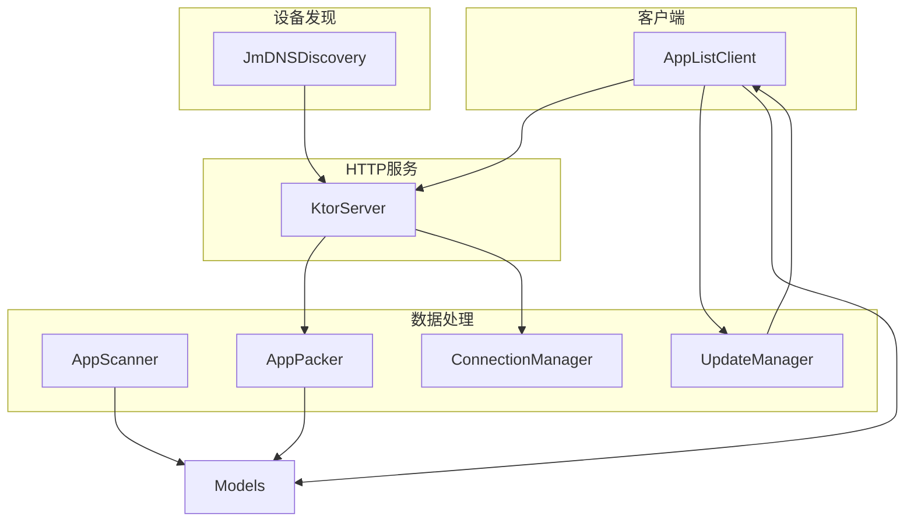
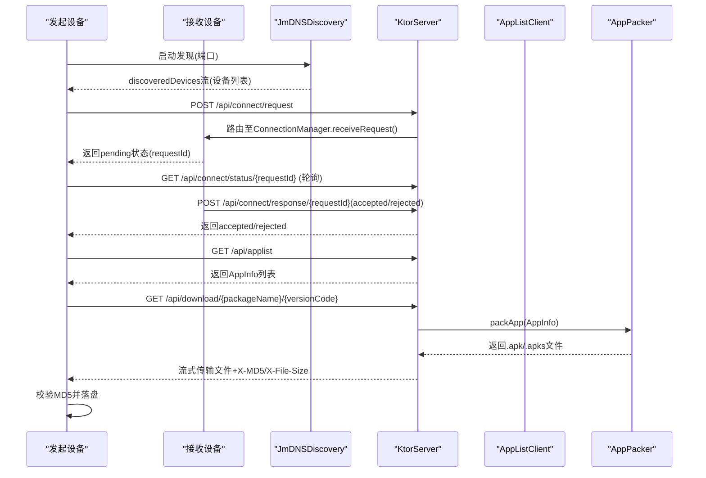
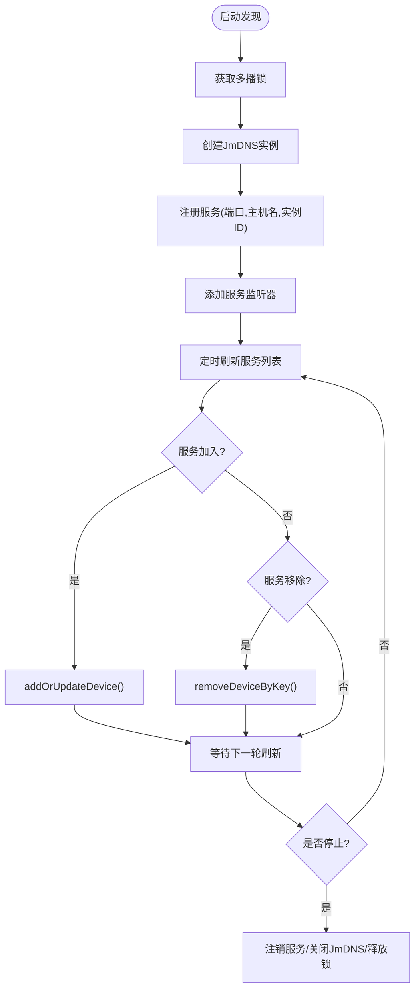
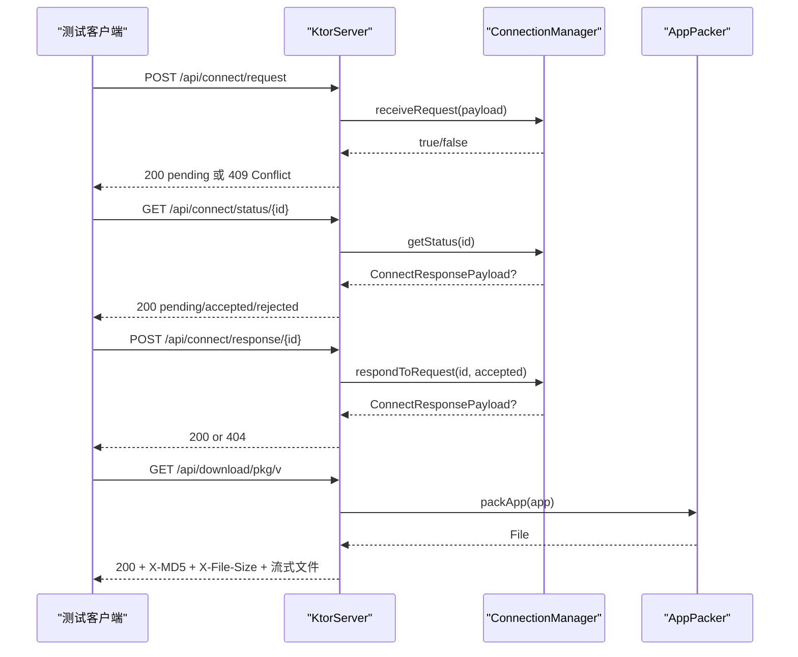
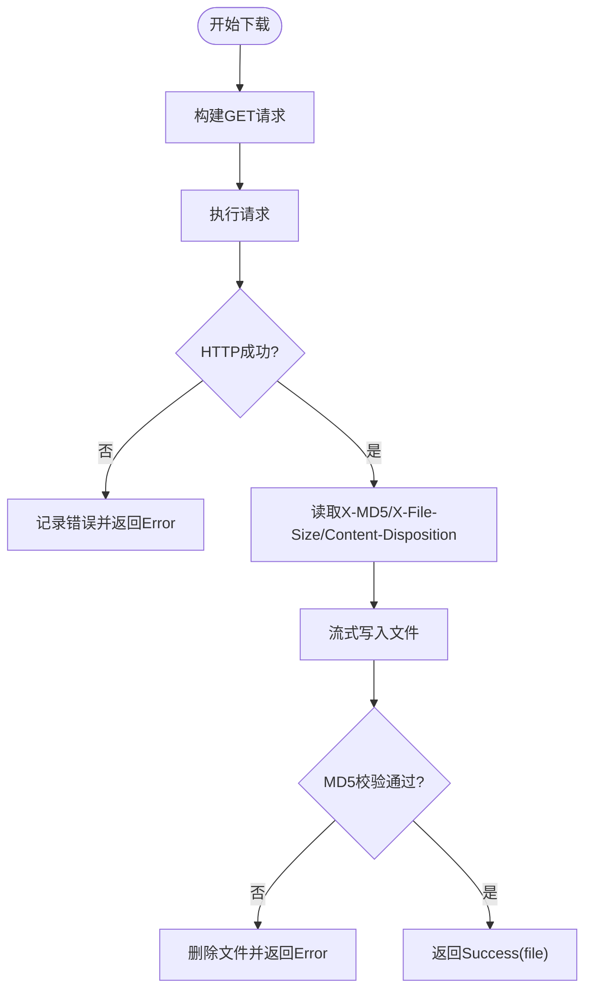
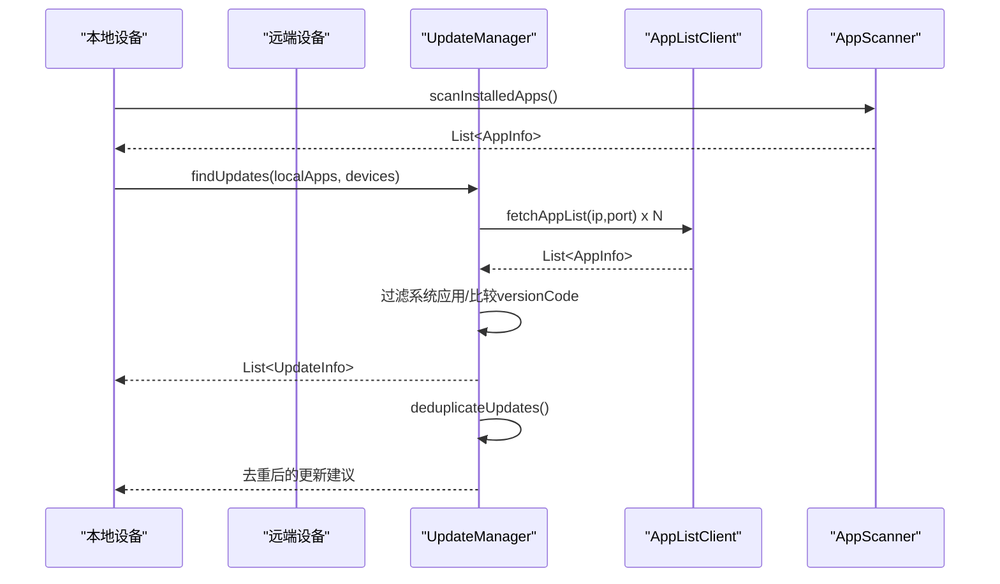
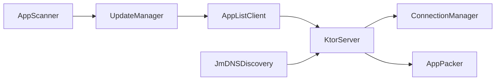

# 集成测试

<cite>
**本文引用的文件**
- [JmDNSDiscovery.kt](file://app/src/main/java/com/lansync/app/data/discovery/JmDNSDiscovery.kt)
- [KtorServer.kt](file://app/src/main/java/com/lansync/app/data/server/KtorServer.kt)
- [AppPacker.kt](file://app/src/main/java/com/lansync/app/data/packer/AppPacker.kt)
- [AppScanner.kt](file://app/src/main/java/com/lansync/app/data/scanner/AppScanner.kt)
- [UpdateManager.kt](file://app/src/main/java/com/lansync/app/data/update/UpdateManager.kt)
- [AppListClient.kt](file://app/src/main/java/com/lansync/app/data/client/AppListClient.kt)
- [ConnectionManager.kt](file://app/src/main/java/com/lansync/app/data/connection/ConnectionManager.kt)
- [Models.kt](file://app/src/main/java/com/lansync/app/data/model/Models.kt)
- [build.gradle.kts](file://app/build.gradle.kts)
- [gradle.properties](file://gradle.properties)
- [UpdateManagerTest.kt](file://app/src/test/java/com/lansync/app/data/update/UpdateManagerTest.kt)
- [ConnectionManagerTest.kt](file://app/src/test/java/com/lansync/app/data/connection/ConnectionManagerTest.kt)
</cite>

## 目录
1. [引言](#引言)
2. [项目结构](#项目结构)
3. [核心组件](#核心组件)
4. [架构总览](#架构总览)
5. [详细组件分析](#详细组件分析)
6. [依赖关系分析](#依赖关系分析)
7. [性能考量](#性能考量)
8. [故障排查指南](#故障排查指南)
9. [结论](#结论)
10. [附录](#附录)

## 引言
本文件面向LanSync应用的集成测试，目标是验证多设备局域网内应用发现、HTTP服务通信、APK打包与传输、版本比较与更新等端到端流程的正确性与稳定性。文档覆盖：
- 测试目标与范围：组件间交互、网络通信、数据持久化
- 测试环境搭建：测试数据库（本地缓存）、模拟网络服务、测试数据准备
- 关键场景：mDNS设备发现、HTTP服务器接口、文件传输
- 复杂业务流程示例：扫描应用、打包APK、版本比较与更新
- 隔离策略与数据管理：用例隔离、清理与可重复性
- 性能基准与回归测试：吞吐、时延、稳定性与回归保障

## 项目结构
LanSync采用分层的数据层设计，核心模块包括：
- 设备发现：基于jmdns的局域网服务广播与发现
- HTTP服务：基于Ktor的REST API，提供应用列表、连接协商、下载等能力
- 客户端：OkHttp封装的远程调用，负责连接状态轮询、应用列表拉取、文件下载
- 应用扫描与打包：扫描已安装应用并生成可传输的APK/APKS包
- 更新管理：对比本地与远端应用版本，去重并输出更新建议
- 连接管理：维护入站连接请求的生命周期与状态流

图表来源
- [JmDNSDiscovery.kt:23-275](file://app/src/main/java/com/lansync/app/data/discovery/JmDNSDiscovery.kt#L23-L275)
- [KtorServer.kt:30-329](file://app/src/main/java/com/lansync/app/data/server/KtorServer.kt#L30-L329)
- [AppListClient.kt:30-571](file://app/src/main/java/com/lansync/app/data/client/AppListClient.kt#L30-L571)
- [AppScanner.kt:15-134](file://app/src/main/java/com/lansync/app/data/scanner/AppScanner.kt#L15-L134)
- [AppPacker.kt:14-114](file://app/src/main/java/com/lansync/app/data/packer/AppPacker.kt#L14-L114)
- [UpdateManager.kt:12-104](file://app/src/main/java/com/lansync/app/data/update/UpdateManager.kt#L12-L104)
- [ConnectionManager.kt:19-156](file://app/src/main/java/com/lansync/app/data/connection/ConnectionManager.kt#L19-L156)
- [Models.kt:5-138](file://app/src/main/java/com/lansync/app/data/model/Models.kt#L5-L138)

章节来源
- [build.gradle.kts:1-115](file://app/build.gradle.kts#L1-L115)
- [gradle.properties:1-8](file://gradle.properties#L1-L8)

## 核心组件
- JmDNSDiscovery：启动/停止mDNS服务注册与监听，维护设备列表流，处理设备加入/离开事件，周期性刷新服务列表。
- KtorServer：提供REST API（ping、applist、connect请求/响应/状态、download、deviceinfo、disconnect、refresh-applist），支持JSON序列化与文件流式传输。
- AppListClient：封装OkHttp客户端，实现连接请求发送、状态轮询、应用列表获取、设备信息获取、断开通知、应用下载（含MD5校验）。
- AppScanner：扫描系统已安装应用，提取可提取应用的源路径、大小、MD5等信息，区分系统应用与Split APK。
- AppPacker：将单APK或Split APK打包为.apk/.apks到缓存目录，支持写入进度与异常清理。
- UpdateManager：并发拉取远端设备应用列表并与本地对比，生成更新建议并进行去重。
- ConnectionManager：维护入站连接请求的状态机（待处理/接受/拒绝/超时），暴露Flow供UI订阅。

章节来源
- [JmDNSDiscovery.kt:23-275](file://app/src/main/java/com/lansync/app/data/discovery/JmDNSDiscovery.kt#L23-L275)
- [KtorServer.kt:30-329](file://app/src/main/java/com/lansync/app/data/server/KtorServer.kt#L30-L329)
- [AppListClient.kt:30-571](file://app/src/main/java/com/lansync/app/data/client/AppListClient.kt#L30-L571)
- [AppScanner.kt:15-134](file://app/src/main/java/com/lansync/app/data/scanner/AppScanner.kt#L15-L134)
- [AppPacker.kt:14-114](file://app/src/main/java/com/lansync/app/data/packer/AppPacker.kt#L14-L114)
- [UpdateManager.kt:12-104](file://app/src/main/java/com/lansync/app/data/update/UpdateManager.kt#L12-L104)
- [ConnectionManager.kt:19-156](file://app/src/main/java/com/lansync/app/data/connection/ConnectionManager.kt#L19-L156)

## 架构总览
下图展示了从设备发现到应用下载的核心交互序列，涵盖mDNS广播、HTTP连接协商、应用列表同步、APK打包与下载校验。

图表来源
- [JmDNSDiscovery.kt:60-117](file://app/src/main/java/com/lansync/app/data/discovery/JmDNSDiscovery.kt#L60-L117)
- [KtorServer.kt:65-329](file://app/src/main/java/com/lansync/app/data/server/KtorServer.kt#L65-L329)
- [AppListClient.kt:62-133](file://app/src/main/java/com/lansync/app/data/client/AppListClient.kt#L62-L133)
- [AppPacker.kt:20-56](file://app/src/main/java/com/lansync/app/data/packer/AppPacker.kt#L20-L56)

## 详细组件分析

### mDNS设备发现测试
- 目标：验证服务注册、服务发现、设备加入/离开事件、实例ID去重、多播锁释放。
- 关键点：
  - startDiscovery(port)会创建JmDNS实例、注册服务、启动监听与定时刷新；stopDiscovery需正确注销服务、关闭JmDNS、释放多播锁。
  - discoveredDevices流应仅包含非本地实例的设备，且设备键由IP+Port唯一标识。
  - 刷新任务按固定间隔轮询服务列表，清理过期设备。
- 测试建议：
  - 使用两个进程或容器模拟两台设备，分别启动JmDNSDiscovery，互相发现对方。
  - 断言discoveredDevices在设备上线/下线时的变化。
  - 验证stopDiscovery后无残留锁与服务。

图表来源
- [JmDNSDiscovery.kt:60-117](file://app/src/main/java/com/lansync/app/data/discovery/JmDNSDiscovery.kt#L60-L117)
- [JmDNSDiscovery.kt:119-182](file://app/src/main/java/com/lansync/app/data/discovery/JmDNSDiscovery.kt#L119-L182)
- [JmDNSDiscovery.kt:200-262](file://app/src/main/java/com/lansync/app/data/discovery/JmDNSDiscovery.kt#L200-L262)

章节来源
- [JmDNSDiscovery.kt:23-275](file://app/src/main/java/com/lansync/app/data/discovery/JmDNSDiscovery.kt#L23-L275)

### HTTP服务器测试
- 目标：验证所有API路由的行为、错误码、请求/响应体结构与边界条件。
- 关键接口：
  - GET /api/ping：健康检查
  - GET /api/applist：返回应用列表（通过注入的appListProvider）
  - POST /api/connect/request：接收连接请求，交由ConnectionManager处理
  - GET /api/connect/status/{requestId}：查询连接状态
  - POST /api/connect/response/{requestId}：响应连接请求
  - GET /api/download/{packageName}[/versionCode]：打包并流式传输APK/APKS，设置X-MD5与X-File-Size
  - POST /api/disconnect：断开通知
  - POST /api/refresh-applist：刷新应用列表通知
  - GET /api/deviceinfo：返回设备名称
- 测试建议：
  - 使用ktor-server-test-host启动嵌入式服务器，注入appListProvider与packer回调。
  - 构造ConnectRequestPayload并验证重复请求冲突（409）。
  - 验证download接口的MD5头与文件大小头，以及系统/受保护应用返回403。
  - 验证disconnect与refresh-applist触发对应处理器。

图表来源
- [KtorServer.kt:65-329](file://app/src/main/java/com/lansync/app/data/server/KtorServer.kt#L65-L329)
- [ConnectionManager.kt:29-112](file://app/src/main/java/com/lansync/app/data/connection/ConnectionManager.kt#L29-L112)
- [AppPacker.kt:20-56](file://app/src/main/java/com/lansync/app/data/packer/AppPacker.kt#L20-L56)

章节来源
- [KtorServer.kt:30-329](file://app/src/main/java/com/lansync/app/data/server/KtorServer.kt#L30-L329)

### 文件传输测试
- 目标：验证下载流程完整性，包括MD5校验、分块流式传输、大文件内存占用与进度回调。
- 关键点：
  - AppListClient.performDownload读取X-MD5或回退expectedMd5进行校验，失败删除临时文件。
  - KtorServer.sendZipFile设置X-MD5与X-File-Size，按64KB缓冲流式写出。
  - AppPacker对Split APK生成.apks，单APK生成.apk，均写入缓存目录。
- 测试建议：
  - 构造不同大小的APK/APKS，验证下载成功与MD5一致。
  - 模拟服务端返回错误码（如403/404/500），验证客户端错误分支。
  - 验证空响应体、缺失头部、非法文件名等边界情况。

图表来源
- [AppListClient.kt:393-462](file://app/src/main/java/com/lansync/app/data/client/AppListClient.kt#L393-L462)
- [KtorServer.kt:293-312](file://app/src/main/java/com/lansync/app/data/server/KtorServer.kt#L293-L312)
- [AppPacker.kt:71-108](file://app/src/main/java/com/lansync/app/data/packer/AppPacker.kt#L71-L108)

章节来源
- [AppListClient.kt:358-462](file://app/src/main/java/com/lansync/app/data/client/AppListClient.kt#L358-L462)
- [KtorServer.kt:293-312](file://app/src/main/java/com/lansync/app/data/server/KtorServer.kt#L293-L312)
- [AppPacker.kt:71-108](file://app/src/main/java/com/lansync/app/data/packer/AppPacker.kt#L71-L108)

### 应用扫描、打包与版本比较（复杂业务流程）
- 目标：验证“扫描本地应用 -> 远端拉取应用列表 -> 版本比较 -> 生成更新建议”的完整链路。
- 关键点：
  - AppScanner.scanInstalledApps遍历PackageInfo，计算文件大小与MD5，标记系统应用与Split APK。
  - UpdateManager.findUpdates并发拉取多个设备的远端应用列表，过滤系统应用，比较versionCode，生成UpdateInfo。
  - UpdateManager.deduplicateUpdates按包名去重，保留更高版本或更优提供者。
- 测试建议：
  - 使用MockK模拟AppListClient.fetchAppList返回不同版本的远端应用。
  - 验证去重逻辑：同一包名多条更新时只保留最高版本；版本相同按设备名排序选择更优提供者。
  - 验证系统应用被忽略，不可提取应用不参与比较。

图表来源
- [AppScanner.kt:21-47](file://app/src/main/java/com/lansync/app/data/scanner/AppScanner.kt#L21-L47)
- [UpdateManager.kt:14-35](file://app/src/main/java/com/lansync/app/data/update/UpdateManager.kt#L14-L35)
- [UpdateManager.kt:37-70](file://app/src/main/java/com/lansync/app/data/update/UpdateManager.kt#L37-L70)
- [UpdateManager.kt:81-102](file://app/src/main/java/com/lansync/app/data/update/UpdateManager.kt#L81-L102)
- [AppListClient.kt:228-254](file://app/src/main/java/com/lansync/app/data/client/AppListClient.kt#L228-L254)

章节来源
- [AppScanner.kt:15-134](file://app/src/main/java/com/lansync/app/data/scanner/AppScanner.kt#L15-L134)
- [UpdateManager.kt:12-104](file://app/src/main/java/com/lansync/app/data/update/UpdateManager.kt#L12-L104)
- [AppListClient.kt:228-254](file://app/src/main/java/com/lansync/app/data/client/AppListClient.kt#L228-L254)

### 连接管理测试
- 目标：验证入站连接请求的接收、去重、响应、状态查询与清理。
- 关键点：
  - receiveRequest将请求加入pendingRequests，设置超时任务，更新incomingRequests流。
  - respondToRequest修改状态并返回ConnectResponsePayload。
  - getStatus根据状态返回相应负载或null（pending）。
  - removeRequest/clearAll清理资源与流。
- 现有单元测试覆盖了基本行为，可作为集成测试的参考。

章节来源
- [ConnectionManager.kt:19-156](file://app/src/main/java/com/lansync/app/data/connection/ConnectionManager.kt#L19-L156)
- [ConnectionManagerTest.kt:1-148](file://app/src/test/java/com/lansync/app/data/connection/ConnectionManagerTest.kt#L1-L148)
- [UpdateManagerTest.kt:1-101](file://app/src/test/java/com/lansync/app/data/update/UpdateManagerTest.kt#L1-L101)

## 依赖关系分析
- 组件耦合：
  - KtorServer依赖ConnectionManager与AppPacker，通过回调注入appListProvider与packer，降低耦合度。
  - AppListClient依赖OkHttp与JSON序列化，与KtorServer形成HTTP契约。
  - UpdateManager依赖AppListClient，与AppScanner产出数据协同完成版本比较。
  - JmDNSDiscovery独立于HTTP栈，但为上层提供设备列表以驱动后续操作。
- 外部依赖：
  - jmdns用于mDNS服务注册与发现
  - ktor-server-netty作为HTTP引擎
  - okhttp作为HTTP客户端
  - kotlinx-serialization用于JSON编解码
- 潜在循环依赖：未发现直接循环引用；通过回调与接口解耦。

图表来源
- [KtorServer.kt:30-63](file://app/src/main/java/com/lansync/app/data/server/KtorServer.kt#L30-L63)
- [AppListClient.kt:30-571](file://app/src/main/java/com/lansync/app/data/client/AppListClient.kt#L30-L571)
- [UpdateManager.kt:12-104](file://app/src/main/java/com/lansync/app/data/update/UpdateManager.kt#L12-L104)
- [JmDNSDiscovery.kt:23-275](file://app/src/main/java/com/lansync/app/data/discovery/JmDNSDiscovery.kt#L23-L275)
- [AppScanner.kt:15-134](file://app/src/main/java/com/lansync/app/data/scanner/AppScanner.kt#L15-L134)

章节来源
- [KtorServer.kt:30-63](file://app/src/main/java/com/lansync/app/data/server/KtorServer.kt#L30-L63)
- [AppListClient.kt:30-571](file://app/src/main/java/com/lansync/app/data/client/AppListClient.kt#L30-L571)
- [UpdateManager.kt:12-104](file://app/src/main/java/com/lansync/app/data/update/UpdateManager.kt#L12-L104)
- [JmDNSDiscovery.kt:23-275](file://app/src/main/java/com/lansync/app/data/discovery/JmDNSDiscovery.kt#L23-L275)
- [AppScanner.kt:15-134](file://app/src/main/java/com/lansync/app/data/scanner/AppScanner.kt#L15-L134)

## 性能考量
- 网络I/O：
  - AppListClient为常规请求与下载分别配置OkHttpClient，下载客户端具有更长超时与无限callTimeout，适合大文件传输。
  - 连接池参数限制空闲连接数与存活时间，避免资源泄漏。
- 文件I/O：
  - KtorServer与AppListClient均采用64KB缓冲流式读写，降低内存峰值。
  - AppPacker按条目逐个写入ZIP，异常时清理中间产物。
- 并发：
  - UpdateManager使用协程async并发拉取多设备应用列表，提升整体吞吐。
- 建议：
  - 对大文件下载增加断点续传与重试机制。
  - 监控连接池命中率与队列长度，调整maxIdleConnections与keepAliveDuration。
  - 对mDNS刷新间隔与轮询间隔进行压测，避免风暴。

[本节为通用指导，不直接分析具体文件]

## 故障排查指南
- mDNS问题：
  - 确认多播锁已获取并在停止时释放；检查设备是否在相同子网且防火墙允许UDP 5353。
  - 日志关注“Multicast lock acquired”、“Refreshing services...”、“Device removed”。
- HTTP问题：
  - 检查KtorServer端口绑定与resolvedConnectors端口；确认路由匹配与JSON解析。
  - 下载失败时查看X-MD5与X-File-Size是否与客户端预期一致；确认Content-Disposition文件名解析。
- 连接协商：
  - 重复请求应返回409；状态轮询应在超时前收到accepted/rejected。
  - 超时自动拒绝逻辑需验证REQUEST_TIMEOUT_MS与POLL_INTERVAL_MS配合。
- 数据一致性：
  - 下载完成后MD5校验失败会删除文件；确保服务端计算的MD5与客户端期望一致。

章节来源
- [JmDNSDiscovery.kt:88-117](file://app/src/main/java/com/lansync/app/data/discovery/JmDNSDiscovery.kt#L88-L117)
- [KtorServer.kt:65-329](file://app/src/main/java/com/lansync/app/data/server/KtorServer.kt#L65-L329)
- [AppListClient.kt:104-193](file://app/src/main/java/com/lansync/app/data/client/AppListClient.kt#L104-L193)
- [AppListClient.kt:393-462](file://app/src/main/java/com/lansync/app/data/client/AppListClient.kt#L393-L462)
- [ConnectionManager.kt:132-147](file://app/src/main/java/com/lansync/app/data/connection/ConnectionManager.kt#L132-L147)

## 结论
本集成测试文档围绕LanSync的核心能力——设备发现、HTTP通信、文件传输与版本比较——提供了端到端的测试目标、环境与步骤说明，并结合源码给出了流程图与时序图以帮助理解。通过合理的隔离策略与数据管理方法，结合性能基准与回归测试方案，可有效保障应用在真实局域网环境下的稳定性与正确性。

[本节为总结，不直接分析具体文件]

## 附录

### 测试环境搭建
- 测试数据库：本项目未引入传统数据库，数据持久化主要依赖Android缓存目录（cacheDir）中的apks与downloads文件夹。集成测试需在具备文件系统访问权限的环境中运行，并在用例前后清理缓存目录以保证可重复性。
- 模拟网络服务：
  - 使用ktor-server-test-host启动嵌入式KtorServer，注入appListProvider与packer回调，模拟远端设备。
  - 使用OkHttp客户端作为测试客户端，调用各API进行交互。
- 测试数据准备：
  - 构造AppInfo列表，包含可提取与不可提取应用、系统与非系统应用、单APK与Split APK。
  - 预先生成.apk/.apks文件放入缓存目录，供下载测试使用。
  - 对于mDNS测试，建议使用两个进程或容器模拟两台设备，或使用mock方式替代底层JmDNS（若需要完全隔离）。

章节来源
- [AppPacker.kt:16-18](file://app/src/main/java/com/lansync/app/data/packer/AppPacker.kt#L16-L18)
- [AppListClient.kt:58-60](file://app/src/main/java/com/lansync/app/data/client/AppListClient.kt#L58-L60)
- [KtorServer.kt:65-329](file://app/src/main/java/com/lansync/app/data/server/KtorServer.kt#L65-L329)

### 测试隔离策略与数据管理
- 隔离策略：
  - 每个集成用例启动独立的KtorServer实例，使用随机端口避免冲突。
  - 使用独立的Context或Mock Context，避免共享状态污染。
  - mDNS测试尽量隔离网络栈，或在CI中禁用mDNS相关用例。
- 数据管理：
  - 用例开始前清空apks与downloads目录；结束后再次清理。
  - 对ConnectionManager使用clearAll重置状态。
  - 对UpdateManager使用MockK隔离AppListClient，保证确定性输入。

章节来源
- [ConnectionManager.kt:125-130](file://app/src/main/java/com/lansync/app/data/connection/ConnectionManager.kt#L125-L130)
- [AppPacker.kt:110-112](file://app/src/main/java/com/lansync/app/data/packer/AppPacker.kt#L110-L112)
- [AppListClient.kt:499-501](file://app/src/main/java/com/lansync/app/data/client/AppListClient.kt#L499-L501)

### 性能基准测试与回归测试方案
- 性能基准：
  - 测量KtorServer在不同并发下的QPS与延迟分布（/api/applist、/api/download）。
  - 测量AppListClient下载大文件的吞吐与内存峰值。
  - 测量UpdateManager并发拉取多设备列表的耗时。
- 回归测试：
  - 每次变更HTTP契约时，重新运行KtorServer集成测试套件。
  - 对版本比较逻辑增加边界用例（同版本、跨设备多提供者、系统应用过滤）。
  - 对mDNS刷新与设备去重逻辑增加回归用例。

[本节为通用指导，不直接分析具体文件]