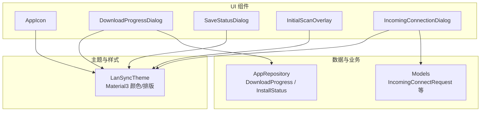
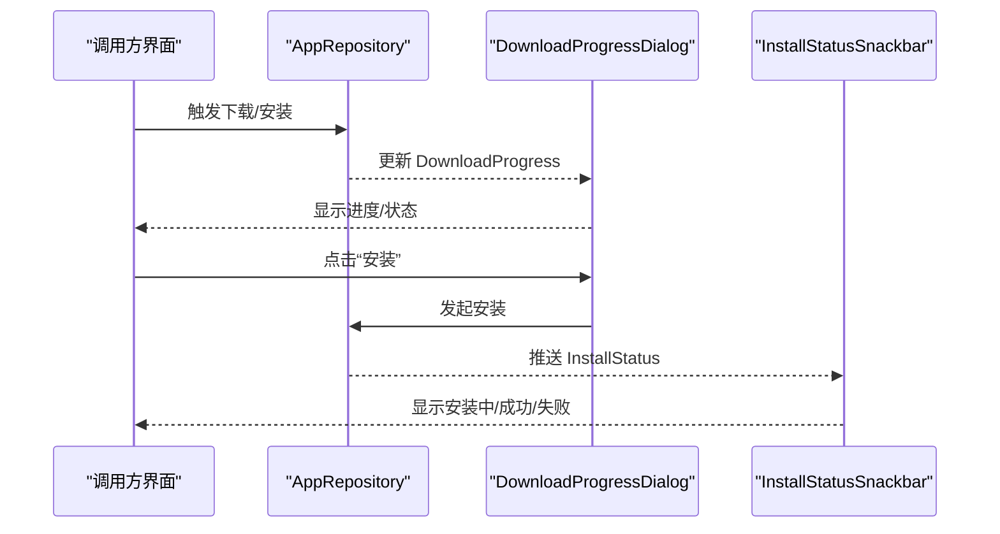
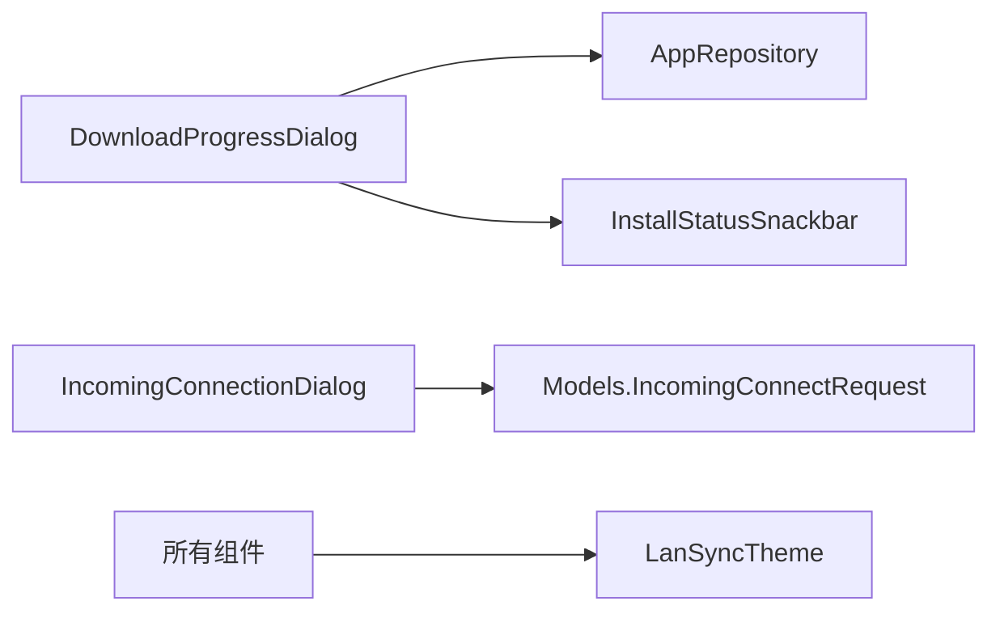

# UI组件库

<cite>
**本文引用的文件**
- [AppIcon.kt](file://app/src/main/java/com/lansync/app/ui/components/AppIcon.kt)
- [DownloadProgressDialog.kt](file://app/src/main/java/com/lansync/app/ui/components/DownloadProgressDialog.kt)
- [SaveStatusDialog.kt](file://app/src/main/java/com/lansync/app/ui/components/SaveStatusDialog.kt)
- [InitialScanOverlay.kt](file://app/src/main/java/com/lansync/app/ui/components/InitialScanOverlay.kt)
- [IncomingConnectionDialog.kt](file://app/src/main/java/com/lansync/app/ui/components/IncomingConnectionDialog.kt)
- [Theme.kt](file://app/src/main/java/com/lansync/app/ui/theme/Theme.kt)
- [Models.kt](file://app/src/main/java/com/lansync/app/data/model/Models.kt)
- [AppRepository.kt](file://app/src/main/java/com/lansync/app/data/repository/AppRepository.kt)
</cite>

## 目录
1. [简介](#简介)
2. [项目结构](#项目结构)
3. [核心组件](#核心组件)
4. [架构总览](#架构总览)
5. [详细组件分析](#详细组件分析)
6. [依赖关系分析](#依赖关系分析)
7. [性能考量](#性能考量)
8. [故障排查指南](#故障排查指南)
9. [结论](#结论)
10. [附录](#附录)

## 简介
本文件为 LanSync 应用的 UI 组件库文档，聚焦以下可复用 Compose 组件：应用图标 AppIcon、下载进度对话框 DownloadProgressDialog、保存状态对话框 SaveStatusDialog、初始扫描遮罩 InitialScanOverlay、传入连接对话框 IncomingConnectionDialog。文档将详细说明各组件的属性配置、事件处理、样式定制、响应式与主题适配、可访问性与国际化考虑，并提供在不同场景下的使用方式（参数传递与回调）的指引。

## 项目结构
UI 组件位于 app/src/main/java/com/lansync/app/ui/components 目录下，主题定义在 ui/theme，数据模型在 data/model，仓库层在 data/repository。组件通过 Material3 主题体系进行样式统一，并通过 Repository 暴露的状态与业务逻辑交互。

图表来源
- [Theme.kt:40-74](file://app/src/main/java/com/lansync/app/ui/theme/Theme.kt#L40-L74)
- [AppRepository.kt:1155-1167](file://app/src/main/java/com/lansync/app/data/repository/AppRepository.kt#L1155-L1167)
- [Models.kt:87-101](file://app/src/main/java/com/lansync/app/data/model/Models.kt#L87-L101)

章节来源
- [Theme.kt:40-74](file://app/src/main/java/com/lansync/app/ui/theme/Theme.kt#L40-L74)
- [AppRepository.kt:1155-1167](file://app/src/main/java/com/lansync/app/data/repository/AppRepository.kt#L1155-L1167)
- [Models.kt:87-101](file://app/src/main/java/com/lansync/app/data/model/Models.kt#L87-L101)

## 核心组件
本节概述各组件的职责与对外能力：
- AppIcon：根据包名加载并缓存应用图标，支持内存与磁盘两级缓存，提供预加载能力。
- DownloadProgressDialog：展示下载/校验/完成/失败状态，支持安装入口与安装状态 Snackbar。
- SaveStatusDialog：封装保存到 SAF 目录的流程，提供保存中/完成/错误三种状态。
- InitialScanOverlay：首次扫描本地应用列表时的全屏遮罩提示。
- IncomingConnectionDialog：展示来自远端的连接请求，带倒计时自动拒绝机制。

章节来源
- [AppIcon.kt:42-93](file://app/src/main/java/com/lansync/app/ui/components/AppIcon.kt#L42-L93)
- [DownloadProgressDialog.kt:30-135](file://app/src/main/java/com/lansync/app/ui/components/DownloadProgressDialog.kt#L30-L135)
- [SaveStatusDialog.kt:84-186](file://app/src/main/java/com/lansync/app/ui/components/SaveStatusDialog.kt#L84-L186)
- [InitialScanOverlay.kt:12-65](file://app/src/main/java/com/lansync/app/ui/components/InitialScanOverlay.kt#L12-L65)
- [IncomingConnectionDialog.kt:17-100](file://app/src/main/java/com/lansync/app/ui/components/IncomingConnectionDialog.kt#L17-L100)

## 架构总览
组件通过 Material3 主题获取颜色与排版；与业务层通过 Repository 或 Model 进行数据交互；网络与 IO 操作在后台线程执行，避免阻塞 UI。

图表来源
- [DownloadProgressDialog.kt:30-135](file://app/src/main/java/com/lansync/app/ui/components/DownloadProgressDialog.kt#L30-L135)
- [AppRepository.kt:1077-1122](file://app/src/main/java/com/lansync/app/data/repository/AppRepository.kt#L1077-L1122)

## 详细组件分析

### AppIcon 应用图标组件
职责与特性
- 根据 packageName 异步加载应用图标，优先从内存 LruCache 读取，其次从磁盘缓存读取，最后从系统 PackageManager 加载并写入缓存。
- 支持自定义尺寸，默认 48dp，内部按 2x 目标尺寸渲染以提升清晰度。
- 提供预加载方法，便于提前预热常用图标。

属性与行为
- 输入参数：packageName、modifier、size。
- 内部状态：bitmap、loadFailed。
- 生命周期：LaunchedEffect(packageName) 触发加载；异常时置 loadFailed 以回退到占位图标。
- 缓存策略：内存 LruCache + 磁盘缓存；OOM 友好（按字节计数）。

事件与回调
- 无外部回调；可通过 preloadIcon(context, packageName, targetSize) 主动预热。

样式与主题
- 背景色与前景色均取自 MaterialTheme.colorScheme.surfaceVariant/onSurfaceVariant。
- 圆角裁剪提升视觉一致性。

可访问性
- 图片 contentDescription 为空，作为装饰图；如需语义化，可在上层包装并提供描述。

国际化
- 组件内无硬编码文案。

响应式
- 基于 Compose 状态驱动，随 size 变化自适应布局。

使用示例（说明）
- 在列表中展示应用图标：传入 packageName 与期望 size，其余由组件管理。
- 预加载：在页面进入前调用 preloadIcon 减少首帧延迟。

章节来源
- [AppIcon.kt:32-40](file://app/src/main/java/com/lansync/app/ui/components/AppIcon.kt#L32-L40)
- [AppIcon.kt:42-93](file://app/src/main/java/com/lansync/app/ui/components/AppIcon.kt#L42-L93)
- [AppIcon.kt:95-124](file://app/src/main/java/com/lansync/app/ui/components/AppIcon.kt#L95-L124)
- [AppIcon.kt:126-150](file://app/src/main/java/com/lansync/app/ui/components/AppIcon.kt#L126-L150)

### DownloadProgressDialog 下载进度对话框
职责与特性
- 展示下载/校验/完成/失败四种状态，包含进度条与百分比文本。
- 完成态提供“安装”按钮，点击后进入安装流程，并在 5 秒内防止重复点击。
- 提供 InstallStatusSnackbar 用于全局安装状态反馈，支持水平滑动关闭。

属性与行为
- 输入参数：progress（DownloadProgress）、onDismiss、onInstall（可选）、modifier。
- 状态机：DOWNLOADING -> VERIFYING -> COMPLETED/FAILED。
- 动画：Snackbar 入场/出场动画，支持手势拖拽滑出。

事件与回调
- onDismiss：在非 DOWNLOADING 状态下允许关闭。
- onInstall：完成态触发安装流程。

样式与主题
- 图标与文字颜色随状态切换，使用 primary/error 等语义色。
- 进度条 trackColor 使用 surfaceVariant 增强对比。

可访问性
- 图标 contentDescription 为空（装饰），标题与正文具备可读性。

国际化
- 组件内包含中文文案，建议抽取至字符串资源以便多语言。

响应式
- 宽度 fillMaxWidth，高度自适应内容。

使用示例（说明）
- 监听 Repository 的 DownloadProgress 流，将最新值传入组件。
- 完成时设置 onInstall 回调，调用仓库的安装接口。
- 监听 InstallStatus 流，将结果传递给 InstallStatusSnackbar。

章节来源
- [DownloadProgressDialog.kt:30-135](file://app/src/main/java/com/lansync/app/ui/components/DownloadProgressDialog.kt#L30-L135)
- [DownloadProgressDialog.kt:137-278](file://app/src/main/java/com/lansync/app/ui/components/DownloadProgressDialog.kt#L137-L278)
- [AppRepository.kt:1155-1167](file://app/src/main/java/com/lansync/app/data/repository/AppRepository.kt#L1155-L1167)

### SaveStatusDialog 保存状态对话框
职责与特性
- 封装将文件保存到用户选择的 SAF 目录的过程，提供 Saving/Completed/Error 三种状态。
- 提供 copyFileToSafDirectory 挂起函数，负责权限检查、冲突命名、流式拷贝与异常分类。

属性与行为
- 输入参数：state（SaveDialogState）、onDismiss。
- 状态转换：Saving -> Completed/Error。
- 错误分类：权限不足、空间不足、IO 异常等，返回友好消息。

事件与回调
- onDismiss：非 Saving 状态可关闭。

样式与主题
- 错误信息以 errorContainer 高亮显示。
- 进度条使用 primary/surfaceVariant 配色。

可访问性
- 图标与标题表达当前状态，错误区域具备可读文本。

国际化
- 组件内包含中文文案，建议抽取至字符串资源。

响应式
- 对话框宽度自适应，错误区域 fillMaxWidth。

使用示例（说明）
- 选择目录后调用 copyFileToSafDirectory，根据返回状态更新 state。
- 在 Completed/Error 时允许关闭对话框。

章节来源
- [SaveStatusDialog.kt:20-82](file://app/src/main/java/com/lansync/app/ui/components/SaveStatusDialog.kt#L20-L82)
- [SaveStatusDialog.kt:84-186](file://app/src/main/java/com/lansync/app/ui/components/SaveStatusDialog.kt#L84-L186)

### InitialScanOverlay 初始扫描遮罩
职责与特性
- 首次启动时覆盖全屏，提示正在扫描本地应用列表，并显示进度指示器。

属性与行为
- 无输入参数，纯展示型组件。
- 使用半透明背景与居中对齐布局。

样式与主题
- 背景色使用 background 并降低透明度，文字使用 onBackground/onSurfaceVariant。

可访问性
- 图标与文本组合传达状态，适合读屏朗读。

国际化
- 组件内包含中文文案，建议抽取至字符串资源。

响应式
- 填充全屏，内部元素居中排列。

使用示例（说明）
- 在应用初始化阶段显示，扫描完成后移除该遮罩。

章节来源
- [InitialScanOverlay.kt:12-65](file://app/src/main/java/com/lansync/app/ui/components/InitialScanOverlay.kt#L12-L65)

### IncomingConnectionDialog 传入连接对话框
职责与特性
- 展示远端设备的连接请求，包括设备名称、IP、端口，以及剩余时间倒计时。
- 超过超时时间自动拒绝，并提供接受/拒绝按钮。

属性与行为
- 输入参数：request（IncomingConnectRequest）、onAccept、onReject、onDismiss。
- 倒计时：基于 REQUEST_TIMEOUT_MS 计算剩余秒数，每秒递减，归零时调用 onReject。

事件与回调
- onAccept：接受连接。
- onReject：拒绝连接或超时自动拒绝。
- onDismiss：手动关闭。

样式与主题
- 使用 primaryContainer/surfaceVariant/errorContainer 区分不同时段与状态。
- 最后 5 秒高亮警告样式。

可访问性
- 标题与正文清晰表达请求信息与倒计时。

国际化
- 组件内包含中文文案，建议抽取至字符串资源。

响应式
- 内容区域自适应宽度，信息块采用 Surface 包裹。

使用示例（说明）
- 当收到 IncomingConnectRequest 时弹出对话框，绑定三个回调处理连接决策。

章节来源
- [IncomingConnectionDialog.kt:17-100](file://app/src/main/java/com/lansync/app/ui/components/IncomingConnectionDialog.kt#L17-L100)
- [Models.kt:87-101](file://app/src/main/java/com/lansync/app/data/model/Models.kt#L87-L101)

## 依赖关系分析
组件之间的耦合与协作如下：
- DownloadProgressDialog 依赖 AppRepository 的 DownloadProgress 与 InstallStatus 状态。
- IncomingConnectionDialog 依赖 Models.IncomingConnectRequest 及 ConnectionManager 的超时常量。
- 所有组件共享 LanSyncTheme 提供的 Material3 颜色与排版。

图表来源
- [DownloadProgressDialog.kt:30-135](file://app/src/main/java/com/lansync/app/ui/components/DownloadProgressDialog.kt#L30-L135)
- [Models.kt:87-101](file://app/src/main/java/com/lansync/app/data/model/Models.kt#L87-L101)
- [Theme.kt:40-74](file://app/src/main/java/com/lansync/app/ui/theme/Theme.kt#L40-L74)

章节来源
- [DownloadProgressDialog.kt:30-135](file://app/src/main/java/com/lansync/app/ui/components/DownloadProgressDialog.kt#L30-L135)
- [Models.kt:87-101](file://app/src/main/java/com/lansync/app/data/model/Models.kt#L87-L101)
- [Theme.kt:40-74](file://app/src/main/java/com/lansync/app/ui/theme/Theme.kt#L40-L74)

## 性能考量
- 图标加载：AppIcon 使用内存 LruCache 与磁盘缓存，目标尺寸放大至 2x 保证清晰度，避免频繁解码与绘制开销。
- 后台 IO：图标加载与文件复制均在 Dispatchers.IO 执行，不阻塞主线程。
- 动画与手势：InstallStatusSnackbar 使用 Animatable 实现平滑滑出，拖拽阈值控制误触。
- 状态最小化：组件仅持有必要状态，减少重组范围。

[本节为通用性能建议，无需特定文件引用]

## 故障排查指南
常见问题与定位要点
- 图标加载失败：检查 packageName 是否有效、磁盘缓存是否存在、异常分支是否置 loadFailed。参考路径：[AppIcon.kt:95-124](file://app/src/main/java/com/lansync/app/ui/components/AppIcon.kt#L95-L124)。
- 下载失败：查看 DownloadProgress.Status 是否为 FAILED，确认网络与源服务器可用性。参考路径：[AppRepository.kt:1054-1073](file://app/src/main/java/com/lansync/app/data/repository/AppRepository.kt#L1054-L1073)。
- 安装失败：关注 InstallStatus.Failed 的消息字段，检查 APK 文件是否存在与安装权限。参考路径：[AppRepository.kt:1094-1111](file://app/src/main/java/com/lansync/app/data/repository/AppRepository.kt#L1094-L1111)。
- 保存失败：copyFileToSafDirectory 会分类抛出权限不足、空间不足、IO 异常等错误，结合错误消息定位问题。参考路径：[SaveStatusDialog.kt:26-82](file://app/src/main/java/com/lansync/app/ui/components/SaveStatusDialog.kt#L26-L82)。
- 连接请求超时：IncomingConnectionDialog 会在倒计时结束后自动拒绝，确认 REQUEST_TIMEOUT_MS 是否符合预期。参考路径：[IncomingConnectionDialog.kt:24-34](file://app/src/main/java/com/lansync/app/ui/components/IncomingConnectionDialog.kt#L24-L34)。

章节来源
- [AppIcon.kt:95-124](file://app/src/main/java/com/lansync/app/ui/components/AppIcon.kt#L95-L124)
- [AppRepository.kt:1054-1073](file://app/src/main/java/com/lansync/app/data/repository/AppRepository.kt#L1054-L1073)
- [AppRepository.kt:1094-1111](file://app/src/main/java/com/lansync/app/data/repository/AppRepository.kt#L1094-L1111)
- [SaveStatusDialog.kt:26-82](file://app/src/main/java/com/lansync/app/ui/components/SaveStatusDialog.kt#L26-L82)
- [IncomingConnectionDialog.kt:24-34](file://app/src/main/java/com/lansync/app/ui/components/IncomingConnectionDialog.kt#L24-L34)

## 结论
本组件库围绕 Material3 主题构建，提供了图标展示、下载与安装反馈、文件保存、初始扫描提示与连接请求处理等关键 UI 能力。组件设计遵循状态驱动、异步 IO、缓存优化与可访问性原则，具备良好的可维护性与扩展性。建议在后续迭代中将硬编码文案迁移至字符串资源以实现完整国际化，并根据业务需求进一步抽象状态管理与错误处理。

[本节为总结性内容，无需特定文件引用]

## 附录

### 组件属性与事件速查
- AppIcon
  - 属性：packageName、modifier、size
  - 事件：无外部回调；可用 preloadIcon 预热
- DownloadProgressDialog
  - 属性：progress、onDismiss、onInstall、modifier
  - 事件：完成态触发安装；Snackbar 支持滑出关闭
- SaveStatusDialog
  - 属性：state、onDismiss
  - 事件：非 Saving 状态可关闭
- InitialScanOverlay
  - 属性：无
  - 事件：无
- IncomingConnectionDialog
  - 属性：request、onAccept、onReject、onDismiss
  - 事件：超时自动拒绝

章节来源
- [AppIcon.kt:42-93](file://app/src/main/java/com/lansync/app/ui/components/AppIcon.kt#L42-L93)
- [DownloadProgressDialog.kt:30-135](file://app/src/main/java/com/lansync/app/ui/components/DownloadProgressDialog.kt#L30-L135)
- [SaveStatusDialog.kt:84-186](file://app/src/main/java/com/lansync/app/ui/components/SaveStatusDialog.kt#L84-L186)
- [InitialScanOverlay.kt:12-65](file://app/src/main/java/com/lansync/app/ui/components/InitialScanOverlay.kt#L12-L65)
- [IncomingConnectionDialog.kt:17-100](file://app/src/main/java/com/lansync/app/ui/components/IncomingConnectionDialog.kt#L17-L100)

### 主题与样式适配
- 颜色：primary、error、surfaceVariant、background 等语义色统一来自 MaterialTheme.colorScheme。
- 排版：使用 MaterialTheme.typography 保持一致的字体层级。
- 深色模式：LanSyncTheme 根据系统设置动态切换颜色方案，并调整状态栏/导航栏外观。

章节来源
- [Theme.kt:40-74](file://app/src/main/java/com/lansync/app/ui/theme/Theme.kt#L40-L74)

### 可访问性与国际化建议
- 可访问性
  - 装饰性图标 contentDescription 为空；关键信息通过标题与正文表达。
  - 错误区域使用高对比度容器色，便于识别。
- 国际化
  - 当前组件内存在中文文案，建议抽取至 strings.xml，并通过字符串资源替换硬编码文本，以支持多语言。

章节来源
- [DownloadProgressDialog.kt:65-133](file://app/src/main/java/com/lansync/app/ui/components/DownloadProgressDialog.kt#L65-L133)
- [SaveStatusDialog.kt:108-183](file://app/src/main/java/com/lansync/app/ui/components/SaveStatusDialog.kt#L108-L183)
- [InitialScanOverlay.kt:31-61](file://app/src/main/java/com/lansync/app/ui/components/InitialScanOverlay.kt#L31-L61)
- [IncomingConnectionDialog.kt:36-99](file://app/src/main/java/com/lansync/app/ui/components/IncomingConnectionDialog.kt#L36-L99)