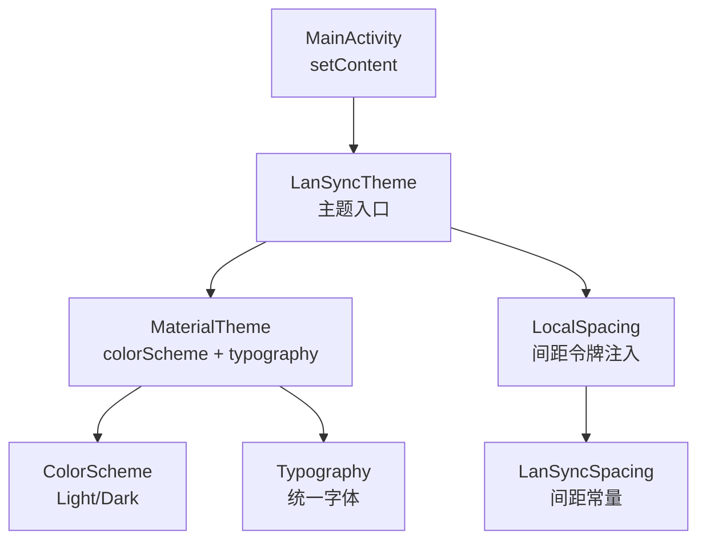
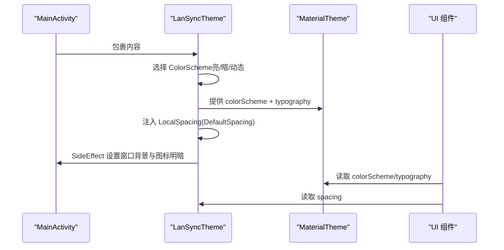
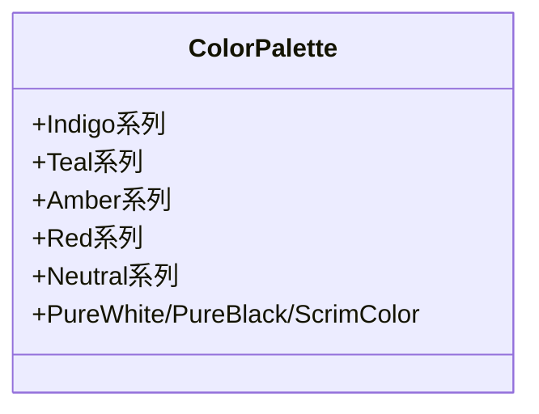
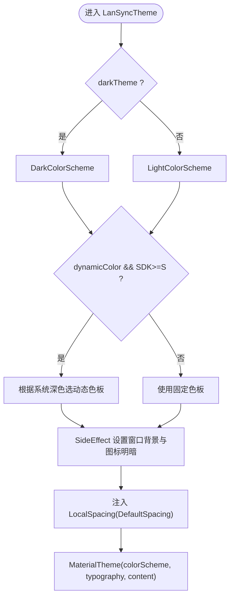
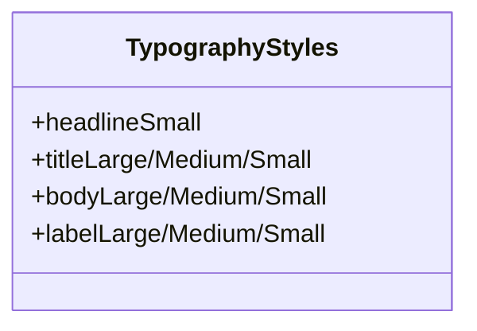
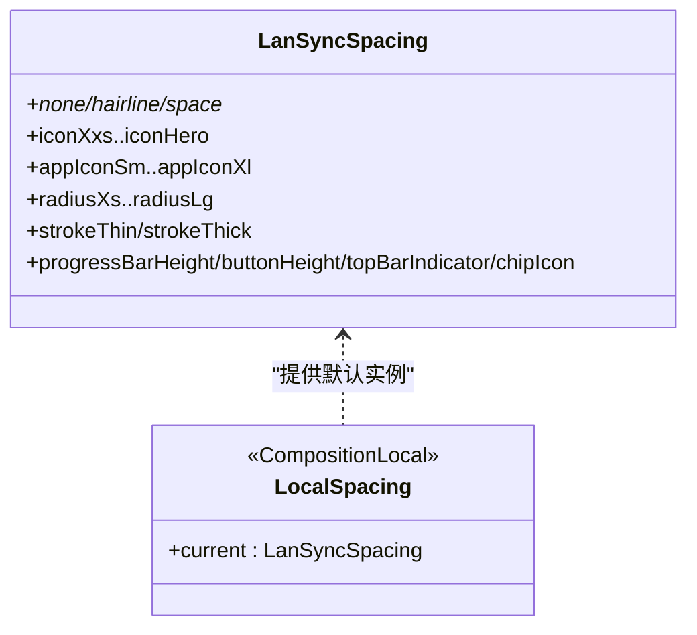
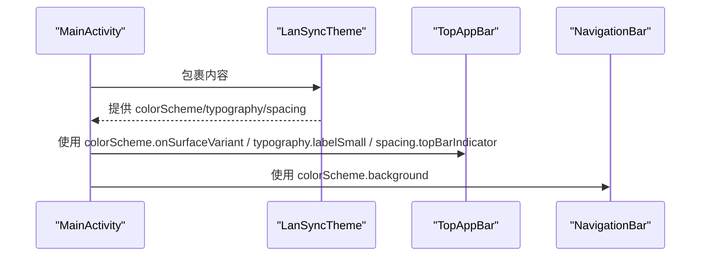
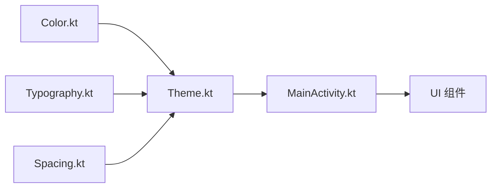

# Material3主题系统

<cite>
**本文引用的文件**
- [Theme.kt](file://app/src/main/java/com/lansync/app/ui/theme/Theme.kt)
- [Color.kt](file://app/src/main/java/com/lansync/app/ui/theme/Color.kt)
- [Typography.kt](file://app/src/main/java/com/lansync/app/ui/theme/Typography.kt)
- [Spacing.kt](file://app/src/main/java/com/lansync/app/ui/theme/Spacing.kt)
- [MainActivity.kt](file://app/src/main/java/com/lansync/app/MainActivity.kt)
- [MainViewModel.kt](file://app/src/main/java/com/lansync/app/ui/viewmodel/MainViewModel.kt)
</cite>

## 目录
1. [简介](#简介)
2. [项目结构](#项目结构)
3. [核心组件](#核心组件)
4. [架构总览](#架构总览)
5. [详细组件分析](#详细组件分析)
6. [依赖关系分析](#依赖关系分析)
7. [性能与可维护性](#性能与可维护性)
8. [故障排查指南](#故障排查指南)
9. [结论](#结论)

## 简介
本仓库实现了一套基于 Android Compose Material3 的统一主题系统，覆盖颜色、字体、间距与窗口状态同步。主题入口为 LanSyncTheme，集中提供：
- 亮/暗两套 ColorScheme（默认固定品牌色，可选动态取色）
- 统一 Typography
- 统一的间距令牌（通过 CompositionLocal 注入）
- 状态栏/导航栏颜色与图标明暗自动适配

该主题系统被 MainActivity 作为根主题包裹，所有 UI 组件通过 MaterialTheme 与 LanSyncTheme.spacing 访问设计令牌，避免硬编码颜色与尺寸。

## 项目结构
主题相关代码集中在 ui/theme 包下，按职责拆分：
- Color.kt：唯一色值来源（品牌色板）
- Theme.kt：主题入口、ColorScheme 选择、CompositionLocal 注入、窗口状态同步
- Typography.kt：统一字体排印样式
- Spacing.kt：统一间距/尺寸令牌与 LocalSpacing

应用入口 MainActivity 在 setContent 中包裹 LanSyncTheme，确保全局生效。

图表来源
- [Theme.kt:21-148](file://app/src/main/java/com/lansync/app/ui/theme/Theme.kt#L21-L148)
- [Color.kt:5-70](file://app/src/main/java/com/lansync/app/ui/theme/Color.kt#L5-L70)
- [Typography.kt:9-88](file://app/src/main/java/com/lansync/app/ui/theme/Typography.kt#L9-L88)
- [Spacing.kt:8-77](file://app/src/main/java/com/lansync/app/ui/theme/Spacing.kt#L8-L77)
- [MainActivity.kt:26-35](file://app/src/main/java/com/lansync/app/MainActivity.kt#L26-L35)

章节来源
- [Theme.kt:21-148](file://app/src/main/java/com/lansync/app/ui/theme/Theme.kt#L21-L148)
- [MainActivity.kt:26-35](file://app/src/main/java/com/lansync/app/MainActivity.kt#L26-L35)

## 核心组件
- 颜色体系（Color.kt）
  - 定义品牌主色（靛蓝）、辅助色（青绿）、强调色（琥珀）、错误色（红）及中性色系列
  - 提供语义常量（纯白/纯黑/遮罩色），作为 ColorScheme 的原子来源
- 主题入口（Theme.kt）
  - 构建 LightColorScheme / DarkColorScheme
  - 支持动态取色（Android S+）
  - 将 LocalSpacing 注入默认间距令牌
  - 使用 SideEffect 同步窗口背景色与状态栏/导航栏图标明暗
  - 暴露 LanSyncTheme.spacing 供组件读取间距
- 字体排印（Typography.kt）
  - 定义 headline/title/body/label 等样式，统一字号、字重、行高、字距
- 间距令牌（Spacing.kt）
  - 以 4dp 基栅格为基础，提供布局间距、图标尺寸、圆角、描边、控件高度等统一常量
  - 通过 LocalSpacing 提供 CompositionLocal 访问

章节来源
- [Color.kt:5-70](file://app/src/main/java/com/lansync/app/ui/theme/Color.kt#L5-L70)
- [Theme.kt:21-148](file://app/src/main/java/com/lansync/app/ui/theme/Theme.kt#L21-L148)
- [Typography.kt:9-88](file://app/src/main/java/com/lansync/app/ui/theme/Typography.kt#L9-L88)
- [Spacing.kt:8-77](file://app/src/main/java/com/lansync/app/ui/theme/Spacing.kt#L8-L77)

## 架构总览
主题系统采用“单一设计系统”模式：
- 颜色：仅从 Color.kt 取值，经 MaterialTheme.colorScheme 暴露
- 字体：仅从 Typography.kt 取值，经 MaterialTheme.typography 暴露
- 间距：通过自定义 LocalSpacing 暴露，组件通过 LanSyncTheme.spacing 访问
- 窗口：在主题层统一设置状态栏/导航栏颜色与图标明暗

图表来源
- [Theme.kt:100-148](file://app/src/main/java/com/lansync/app/ui/theme/Theme.kt#L100-L148)
- [MainActivity.kt:26-35](file://app/src/main/java/com/lansync/app/MainActivity.kt#L26-L35)

## 详细组件分析

### 颜色与色板（Color.kt）
- 角色化命名：Primary/Secondary/Tertiary/Error/Neutral 及其变体
- 色调号后缀遵循 M3 约定（如 10 最深 → 95 最浅）
- 语义常量用于通用场景（纯白/纯黑/遮罩）

图表来源
- [Color.kt:16-70](file://app/src/main/java/com/lansync/app/ui/theme/Color.kt#L16-L70)

章节来源
- [Color.kt:5-70](file://app/src/main/java/com/lansync/app/ui/theme/Color.kt#L5-L70)

### 主题入口（Theme.kt）
- 亮/暗 ColorScheme：分别映射到 Indigo/Teal/Amber/Red/Neutral 等色板
- 动态取色：在 Android S+ 且开启 dynamicColor 时，根据系统深色模式选择动态色板
- 窗口同步：
  - 设置 window.statusBarColor/window.navigationBarColor 为 background
  - 依据背景亮度决定状态栏/导航栏图标明暗
- 间距注入：通过 CompositionLocalProvider 注入 DefaultSpacing
- 暴露访问器：LanSyncTheme.spacing 提供 @Composable 只读访问

图表来源
- [Theme.kt:21-148](file://app/src/main/java/com/lansync/app/ui/theme/Theme.kt#L21-L148)

章节来源
- [Theme.kt:21-148](file://app/src/main/java/com/lansync/app/ui/theme/Theme.kt#L21-L148)

### 字体排印（Typography.kt）
- 统一 headline/title/body/label 各层级样式
- 统一字号、字重、行高、字距，保证跨屏幕一致性
- 未显式定义的样式沿用 Material3 默认值

图表来源
- [Typography.kt:16-88](file://app/src/main/java/com/lansync/app/ui/theme/Typography.kt#L16-L88)

章节来源
- [Typography.kt:9-88](file://app/src/main/java/com/lansync/app/ui/theme/Typography.kt#L9-L88)

### 间距令牌（Spacing.kt）
- 布局间距：2/4/6/8/10/12/16/20/24/28/32/40/48/56/64 dp
- 图标尺寸：xxs→hero 多档
- 应用图标尺寸：sm/md/lg/xl
- 圆角：xs/sm/md/lg
- 描边/进度条/按钮高度等控件尺寸
- 通过 LocalSpacing 注入，组件通过 LanSyncTheme.spacing 访问

图表来源
- [Spacing.kt:17-77](file://app/src/main/java/com/lansync/app/ui/theme/Spacing.kt#L17-L77)

章节来源
- [Spacing.kt:8-77](file://app/src/main/java/com/lansync/app/ui/theme/Spacing.kt#L8-L77)

### 主题在应用中的使用（MainActivity.kt）
- 在 Activity 的 setContent 中包裹 LanSyncTheme，使整个应用使用统一主题
- 子组件通过 MaterialTheme.colorScheme/typography 与 LanSyncTheme.spacing 获取设计令牌
- 示例：顶部栏加载 spinner 时使用 topBarIndicator、strokeThin；文本使用 labelSmall；底部导航容器使用 background

图表来源
- [MainActivity.kt:26-35](file://app/src/main/java/com/lansync/app/MainActivity.kt#L26-L35)
- [MainActivity.kt:110-191](file://app/src/main/java/com/lansync/app/MainActivity.kt#L110-L191)

章节来源
- [MainActivity.kt:26-35](file://app/src/main/java/com/lansync/app/MainActivity.kt#L26-L35)
- [MainActivity.kt:110-191](file://app/src/main/java/com/lansync/app/MainActivity.kt#L110-L191)

## 依赖关系分析
- 颜色依赖：ColorScheme 完全来自 Color.kt 的色板常量
- 主题依赖：Theme.kt 组合 ColorScheme、Typography、LocalSpacing，并负责窗口状态同步
- 组件依赖：UI 组件通过 MaterialTheme 与 LanSyncTheme.spacing 消费主题资源
- ViewModel 不直接依赖主题细节，但通过 UI 组件间接使用主题

图表来源
- [Theme.kt:21-148](file://app/src/main/java/com/lansync/app/ui/theme/Theme.kt#L21-L148)
- [MainActivity.kt:26-35](file://app/src/main/java/com/lansync/app/MainActivity.kt#L26-L35)

章节来源
- [Theme.kt:21-148](file://app/src/main/java/com/lansync/app/ui/theme/Theme.kt#L21-L148)
- [MainActivity.kt:26-35](file://app/src/main/java/com/lansync/app/MainActivity.kt#L26-L35)

## 性能与可维护性
- 性能
  - 窗口背景与图标明暗仅在非编辑模式下通过 SideEffect 设置，避免重复计算
  - 动态取色仅在满足条件时启用，减少不必要的上下文获取
- 可维护性
  - 颜色、字体、间距三处集中管理，禁止在组件内硬编码
  - 通过 LanSyncTheme.spacing 统一访问间距，便于后续调整栅格或品牌规范
  - 主题入口清晰，易于扩展（如新增 token、切换策略）

[本节为通用指导，无需特定文件引用]

## 故障排查指南
- 主题未生效
  - 确认 MainActivity 的 setContent 已包裹 LanSyncTheme
  - 检查是否误用硬编码颜色或尺寸，应改为 MaterialTheme.colorScheme/typography 与 LanSyncTheme.spacing
- 动态取色无效
  - 确认 dynamicColor 参数为 true 且设备版本 >= Android S
  - 若需固定品牌色，保持 dynamicColor=false
- 状态栏/导航栏颜色异常
  - 检查是否在主题层设置了 window.statusBarColor/window.navigationBarColor
  - 确认背景亮度判断逻辑正确（浅色背景→深色图标，反之亦然）
- 间距不一致
  - 检查组件是否使用了 .dp 字面量，应替换为 LanSyncTheme.spacing.xxx
  - 确认 LocalSpacing 已被注入（由 LanSyncTheme 提供）

章节来源
- [Theme.kt:100-148](file://app/src/main/java/com/lansync/app/ui/theme/Theme.kt#L100-L148)
- [MainActivity.kt:110-191](file://app/src/main/java/com/lansync/app/MainActivity.kt#L110-L191)

## 结论
本主题系统以 Material3 为基础，通过集中化的颜色、字体与间距令牌，结合窗口状态同步，实现了跨设备一致的视觉体验。主题入口简洁明确，组件消费方式统一，便于长期维护与扩展。建议在后续迭代中继续坚持“禁止硬编码”的原则，并通过测试保障主题行为稳定。