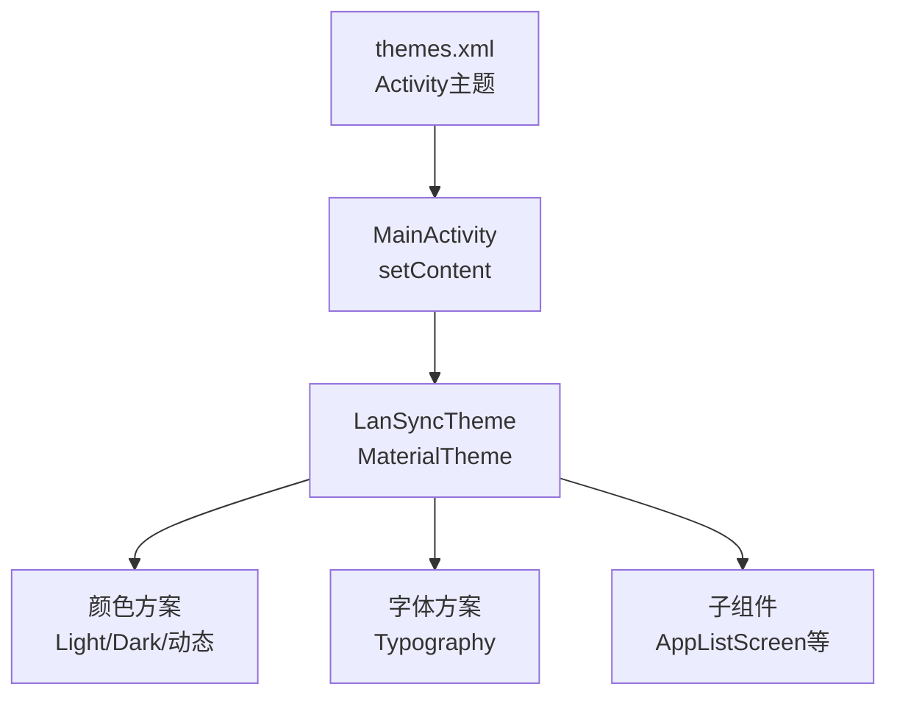
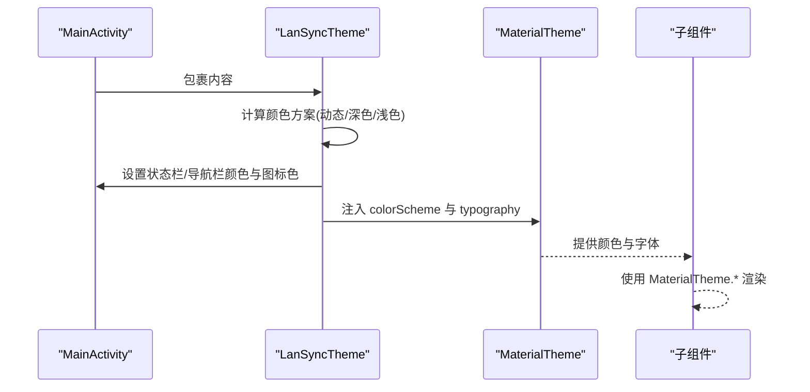
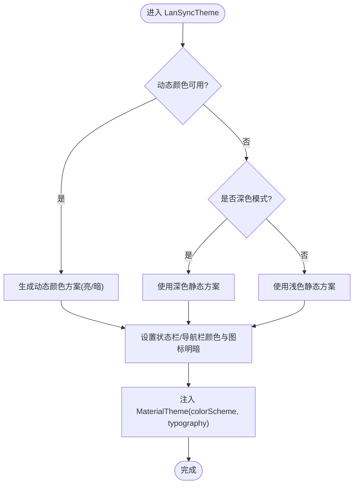
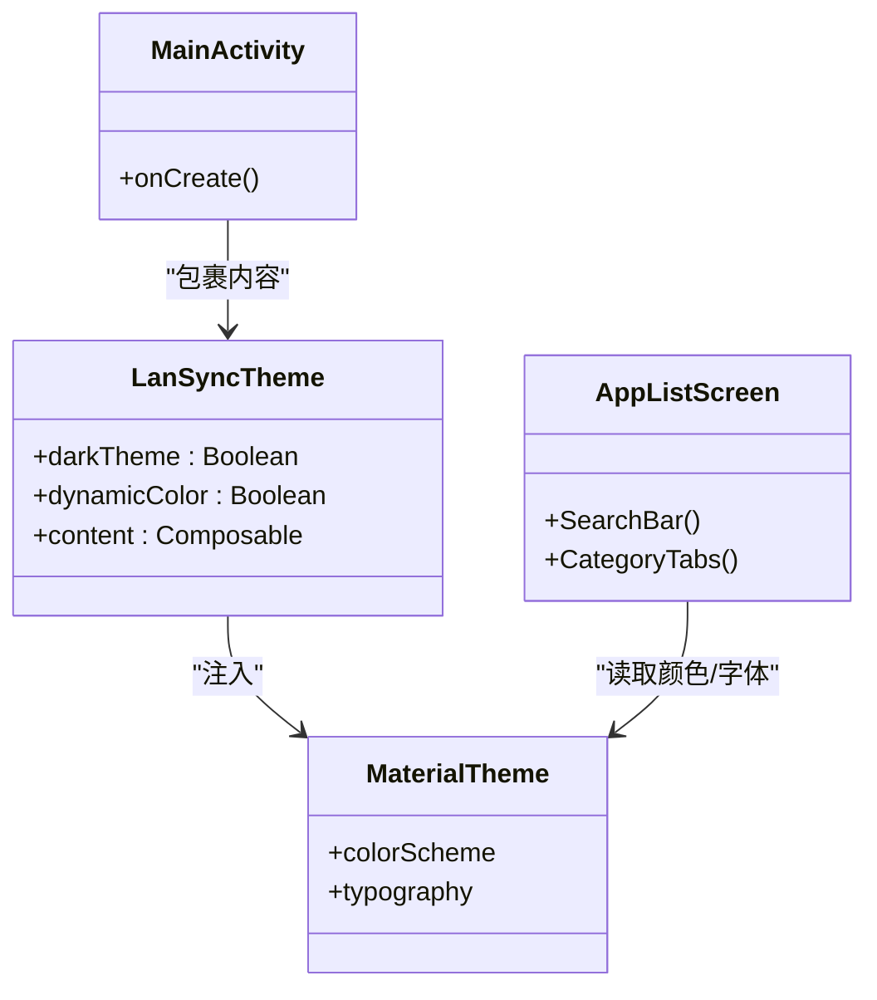
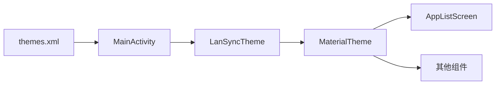

# 主题系统

<cite>
**本文引用的文件**
- [Theme.kt](file://app/src/main/java/com/lansync/app/ui/theme/Theme.kt)
- [Typography.kt](file://app/src/main/java/com/lansync/app/ui/theme/Typography.kt)
- [MainActivity.kt](file://app/src/main/java/com/lansync/app/MainActivity.kt)
- [AppListScreen.kt](file://app/src/main/java/com/lansync/app/ui/components/AppListScreen.kt)
- [themes.xml](file://app/src/main/res/values/themes.xml)
- [colors.xml](file://app/src/main/res/values/colors.xml)
</cite>

## 目录
1. [简介](#简介)
2. [项目结构](#项目结构)
3. [核心组件](#核心组件)
4. [架构总览](#架构总览)
5. [详细组件分析](#详细组件分析)
6. [依赖关系分析](#依赖关系分析)
7. [性能考量](#性能考量)
8. [故障排查指南](#故障排查指南)
9. [结论](#结论)
10. [附录](#附录)

## 简介
本文件系统性梳理 LanSync 应用的 Material Design 3 主题体系，涵盖颜色方案、字体规范与形状定义；详解 Theme.kt 的主题配置（动态颜色、深色模式适配、自定义颜色变量）；说明 Typography.kt 的字体家族、字号与字重规范；阐述主题在应用中的使用方式（组件样式继承与主题切换机制）；并提供扩展主题系统的实践建议与测试调试要点。

## 项目结构
LanSync 的主题相关代码集中在 ui/theme 目录，并在 MainActivity 中作为根 Composable 包裹应用内容，确保全局生效。Android 原生主题通过 values/themes.xml 声明，用于 Activity 启动时的窗口主题。

图表来源
- [MainActivity.kt:27-34](file://app/src/main/java/com/lansync/app/MainActivity.kt#L27-L34)
- [Theme.kt:40-74](file://app/src/main/java/com/lansync/app/ui/theme/Theme.kt#L40-L74)
- [themes.xml:1-5](file://app/src/main/res/values/themes.xml#L1-L5)

章节来源
- [MainActivity.kt:27-34](file://app/src/main/java/com/lansync/app/MainActivity.kt#L27-L34)
- [Theme.kt:40-74](file://app/src/main/java/com/lansync/app/ui/theme/Theme.kt#L40-L74)
- [themes.xml:1-5](file://app/src/main/res/values/themes.xml#L1-L5)

## 核心组件
- 主题入口：LanSyncTheme（Theme.kt），负责选择颜色方案、设置状态栏/导航栏外观、注入 MaterialTheme。
- 字体规范：Typography（Typography.kt），定义 bodyLarge/titleLarge/labelSmall 等文本样式。
- 应用集成：MainActivity 将 LanSyncTheme 作为根 Composable 包裹整个界面。
- 组件使用：UI 组件通过 MaterialTheme.colorScheme 和 MaterialTheme.typography 获取主题资源。

章节来源
- [Theme.kt:20-74](file://app/src/main/java/com/lansync/app/ui/theme/Theme.kt#L20-L74)
- [Typography.kt:9-31](file://app/src/main/java/com/lansync/app/ui/theme/Typography.kt#L9-L31)
- [MainActivity.kt:27-34](file://app/src/main/java/com/lansync/app/MainActivity.kt#L27-L34)
- [AppListScreen.kt:86-102](file://app/src/main/java/com/lansync/app/ui/components/AppListScreen.kt#L86-L102)

## 架构总览
主题在应用中的调用链如下：
- MainActivity 在 setContent 中包裹 LanSyncTheme。
- LanSyncTheme 根据系统深色模式和动态颜色能力选择颜色方案，并同步窗口状态栏/导航栏外观。
- MaterialTheme 将颜色与字体注入到所有子组件。
- 子组件通过 MaterialTheme.colorScheme 与 MaterialTheme.typography 消费主题。

图表来源
- [MainActivity.kt:27-34](file://app/src/main/java/com/lansync/app/MainActivity.kt#L27-L34)
- [Theme.kt:40-74](file://app/src/main/java/com/lansync/app/ui/theme/Theme.kt#L40-L74)

## 详细组件分析

### 主题配置（Theme.kt）
- 颜色方案
  - 定义了浅色与深色两套静态颜色方案（primary/secondary/tertiary）。
  - 动态颜色：当设备支持且启用时，优先使用系统动态生成的颜色方案（亮/暗）。
- 深色模式适配
  - 默认跟随系统深色模式；可通过参数 darkTheme 覆盖。
  - 根据背景亮度自动调整状态栏/导航栏图标明暗，提升可读性。
- 窗口外观
  - 将状态栏与导航栏背景设置为当前颜色方案的背景色，保证整体一致性。
- 主题注入
  - 将颜色方案与自定义 Typography 注入 MaterialTheme，供全应用使用。

图表来源
- [Theme.kt:40-74](file://app/src/main/java/com/lansync/app/ui/theme/Theme.kt#L40-L74)

章节来源
- [Theme.kt:20-74](file://app/src/main/java/com/lansync/app/ui/theme/Theme.kt#L20-L74)

### 字体规范（Typography.kt）
- 字体家族：使用默认字体族。
- 字号体系与字重
  - bodyLarge：正文大段文本，常规字重，行高与字间距适中。
  - titleLarge：标题文本，常规字重，较大字号与行高。
  - labelSmall：标签/辅助信息，中等字重，较小字号与行高。
- 使用方式：通过 MaterialTheme.typography 在各组件中引用对应样式。

章节来源
- [Typography.kt:9-31](file://app/src/main/java/com/lansync/app/ui/theme/Typography.kt#L9-L31)

### 主题在应用中的使用
- 根包裹：MainActivity 在 setContent 中使用 LanSyncTheme 包裹应用内容，使主题全局生效。
- 组件继承：各 UI 组件通过 MaterialTheme.colorScheme 与 MaterialTheme.typography 获取颜色与字体，无需硬编码。
- 示例用法：搜索框边框色、占位符与图标颜色均取自主题；列表空态文案使用 bodyMedium 与 onSurfaceVariant 等语义化颜色。

图表来源
- [MainActivity.kt:27-34](file://app/src/main/java/com/lansync/app/MainActivity.kt#L27-L34)
- [Theme.kt:40-74](file://app/src/main/java/com/lansync/app/ui/theme/Theme.kt#L40-L74)
- [AppListScreen.kt:86-102](file://app/src/main/java/com/lansync/app/ui/components/AppListScreen.kt#L86-L102)

章节来源
- [MainActivity.kt:27-34](file://app/src/main/java/com/lansync/app/MainActivity.kt#L27-L34)
- [AppListScreen.kt:86-102](file://app/src/main/java/com/lansync/app/ui/components/AppListScreen.kt#L86-L102)

### 扩展主题系统（新增颜色变量/字体样式）
- 新增颜色变量
  - 在 Theme.kt 中新增语义化颜色常量（如 success/error/warning），并将其加入 lightColorScheme/darkColorScheme。
  - 在需要的位置通过 MaterialTheme.colorScheme.<yourColor> 引用。
- 新增字体样式
  - 在 Typography.kt 中新增 TextStyle（如 headlineMedium/bodySmall），指定字体族、字号、行高与字重。
  - 在组件中通过 MaterialTheme.typography.<yourStyle> 引用。
- 动态颜色与深色模式
  - 若需为动态颜色保留语义映射，可在 Theme.kt 中基于动态颜色派生新的语义色（例如从 primary 派生 success）。
  - 保持深色模式下对比度与可访问性要求。

章节来源
- [Theme.kt:20-74](file://app/src/main/java/com/lansync/app/ui/theme/Theme.kt#L20-L74)
- [Typography.kt:9-31](file://app/src/main/java/com/lansync/app/ui/theme/Typography.kt#L9-L31)

## 依赖关系分析
- MainActivity 依赖 LanSyncTheme 以提供全局主题上下文。
- LanSyncTheme 依赖 Android 系统 API（动态颜色、窗口 Insets）与 Material3。
- 组件层仅依赖 MaterialTheme 暴露的颜色与字体，避免直接耦合具体实现。
- 原生 themes.xml 为 Activity 提供基础主题（无 ActionBar），与 Compose 主题解耦但协同工作。

图表来源
- [MainActivity.kt:27-34](file://app/src/main/java/com/lansync/app/MainActivity.kt#L27-L34)
- [Theme.kt:40-74](file://app/src/main/java/com/lansync/app/ui/theme/Theme.kt#L40-L74)
- [themes.xml:1-5](file://app/src/main/res/values/themes.xml#L1-L5)

章节来源
- [MainActivity.kt:27-34](file://app/src/main/java/com/lansync/app/MainActivity.kt#L27-L34)
- [Theme.kt:40-74](file://app/src/main/java/com/lansync/app/ui/theme/Theme.kt#L40-L74)
- [themes.xml:1-5](file://app/src/main/res/values/themes.xml#L1-L5)

## 性能考量
- 动态颜色仅在支持设备上启用，避免不必要的计算。
- 窗口外观更新使用 SideEffect，减少重复绘制。
- 组件仅消费 MaterialTheme 提供的语义化资源，避免频繁重建导致的性能损耗。

[本节为通用指导，不直接分析具体文件]

## 故障排查指南
- 动态颜色未生效
  - 检查设备系统版本与动态颜色支持；确认 dynamicColor 参数为 true。
  - 验证是否在深色模式下正确选择了动态暗色方案。
- 状态栏/导航栏颜色异常
  - 确认在 LanSyncTheme 中已设置 window.statusBarColor 与 navigationBarColor。
  - 检查背景亮度判断逻辑是否正确切换图标明暗。
- 字体样式未生效
  - 确认已在 MaterialTheme 中注入自定义 Typography。
  - 组件中是否使用了正确的 MaterialTheme.typography 样式键名。
- 颜色对比度不足
  - 在深色模式下检查 onSurfaceVariant 与背景色的对比度，必要时调整自定义颜色。

章节来源
- [Theme.kt:40-74](file://app/src/main/java/com/lansync/app/ui/theme/Theme.kt#L40-L74)

## 结论
LanSync 的主题系统基于 Material Design 3，采用动态颜色与深色模式自适应策略，并通过统一的 Typography 规范保障一致的视觉体验。主题在 MainActivity 中作为根 Composable 注入，组件通过 MaterialTheme 消费主题资源，具备良好的可维护性与可扩展性。未来可按需扩展语义化颜色与字体样式，并持续优化可访问性与性能。

## 附录
- 原生主题与 Compose 主题的关系
  - themes.xml 定义 Activity 的基础主题（如 NoActionBar），Compose 主题负责界面层的颜色与字体。
- 颜色资源
  - colors.xml 目前仅包含启动图标背景色，不影响 Compose 主题。

章节来源
- [themes.xml:1-5](file://app/src/main/res/values/themes.xml#L1-L5)
- [colors.xml:1-5](file://app/src/main/res/values/colors.xml#L1-L5)