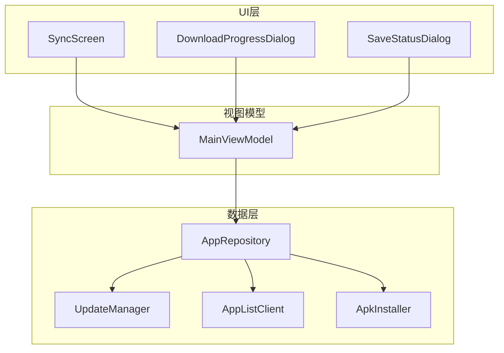
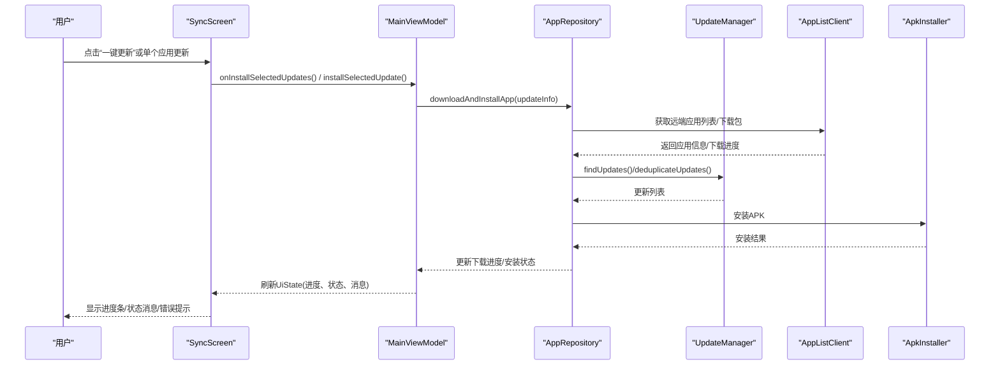
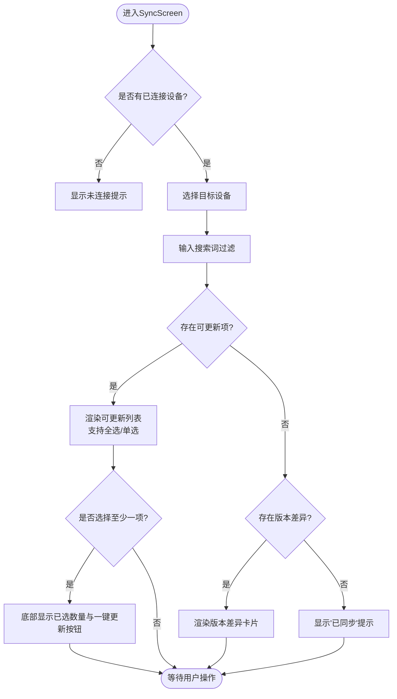
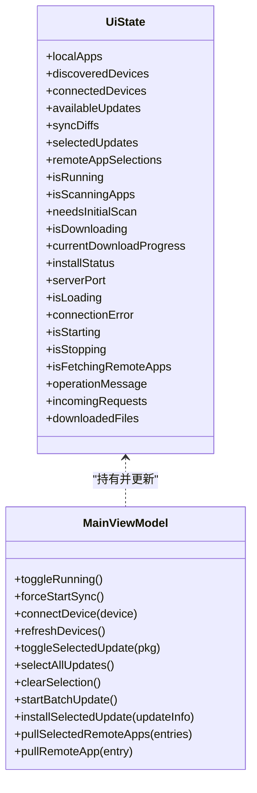
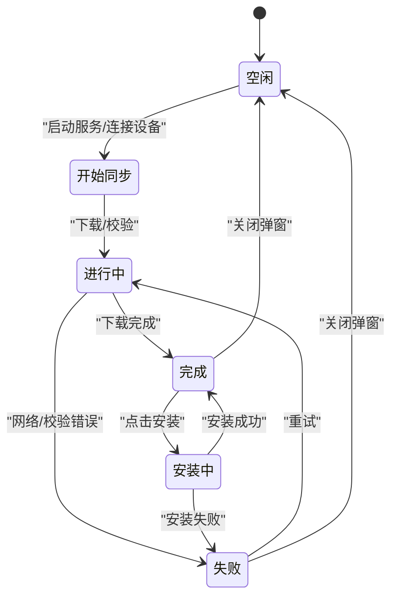
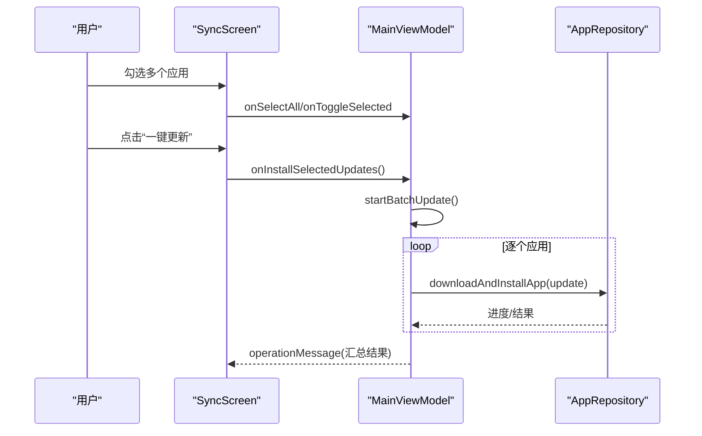
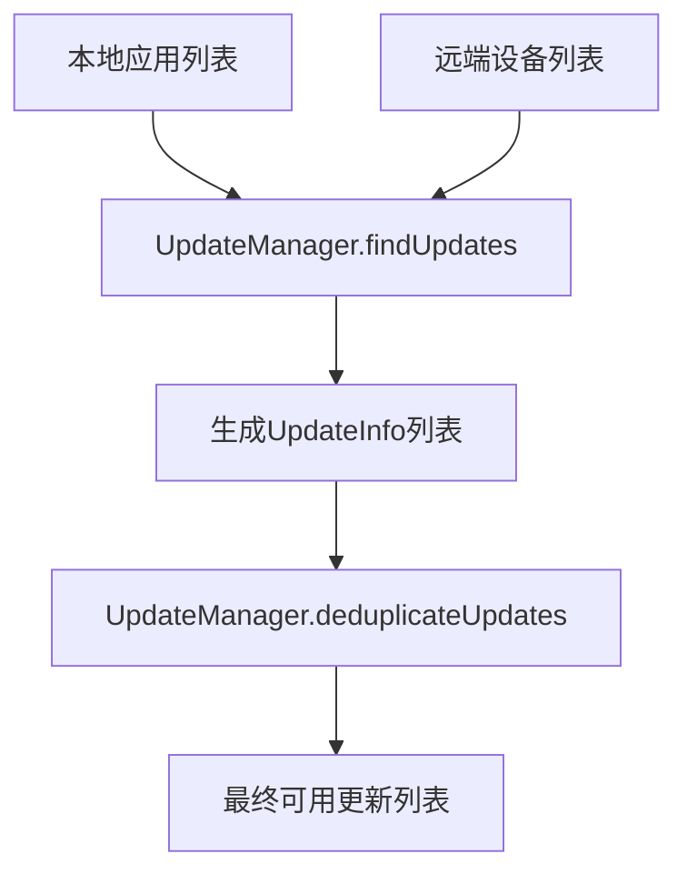
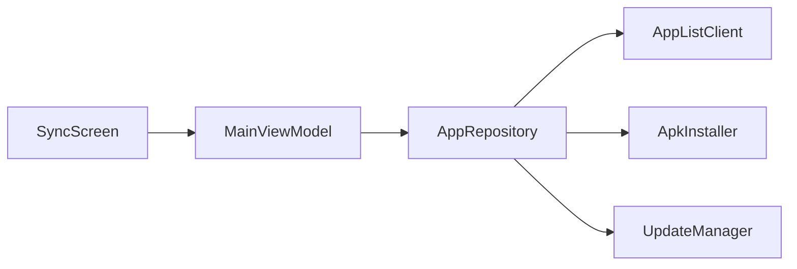

# 同步界面

<cite>
**本文引用的文件**
- [SyncScreen.kt](file://app/src/main/java/com/lansync/app/ui/components/SyncScreen.kt)
- [MainViewModel.kt](file://app/src/main/java/com/lansync/app/ui/viewmodel/MainViewModel.kt)
- [Models.kt](file://app/src/main/java/com/lansync/app/data/model/Models.kt)
- [AppRepository.kt](file://app/src/main/java/com/lansync/app/data/repository/AppRepository.kt)
- [UpdateManager.kt](file://app/src/main/java/com/lansync/app/data/update/UpdateManager.kt)
- [DownloadProgressDialog.kt](file://app/src/main/java/com/lansync/app/ui/components/DownloadProgressDialog.kt)
- [SaveStatusDialog.kt](file://app/src/main/java/com/lansync/app/ui/components/SaveStatusDialog.kt)
</cite>

## 目录
1. [简介](#简介)
2. [项目结构](#项目结构)
3. [核心组件](#核心组件)
4. [架构总览](#架构总览)
5. [详细组件分析](#详细组件分析)
6. [依赖关系分析](#依赖关系分析)
7. [性能考虑](#性能考虑)
8. [故障排查指南](#故障排查指南)
9. [结论](#结论)
10. [附录](#附录)

## 简介
本文件聚焦于LanSync的“同步界面”，围绕SyncScreen组件展开，系统阐述其同步流程控制、进度跟踪与结果展示；说明同步状态管理（开始、进行中、完成、失败）的UI反馈；描述批量同步与选择性同步的实现方式及用户交互逻辑；提供将同步业务逻辑集成到UI层的实践要点（异步操作处理与状态更新）；并给出用户体验优化建议（取消操作、错误重试等）。

## 项目结构
- UI层：Compose界面组件，包括同步主界面与下载/安装进度弹窗。
- ViewModel层：聚合UI状态、协调仓库调用、维护选择集与操作消息。
- 数据层：设备发现、连接管理、应用列表获取、差异计算、更新检测、APK安装等。

图表来源
- [SyncScreen.kt:22-209](file://app/src/main/java/com/lansync/app/ui/components/SyncScreen.kt#L22-L209)
- [MainViewModel.kt:22-45](file://app/src/main/java/com/lansync/app/ui/viewmodel/MainViewModel.kt#L22-L45)
- [AppRepository.kt:40-79](file://app/src/main/java/com/lansync/app/data/repository/AppRepository.kt#L40-L79)
- [UpdateManager.kt:12-35](file://app/src/main/java/com/lansync/app/data/update/UpdateManager.kt#L12-L35)

章节来源
- [SyncScreen.kt:22-209](file://app/src/main/java/com/lansync/app/ui/components/SyncScreen.kt#L22-L209)
- [MainViewModel.kt:22-45](file://app/src/main/java/com/lansync/app/ui/viewmodel/MainViewModel.kt#L22-L45)
- [AppRepository.kt:40-79](file://app/src/main/java/com/lansync/app/data/repository/AppRepository.kt#L40-L79)

## 核心组件
- SyncScreen：负责设备选择、搜索过滤、可更新应用列表与版本差异展示、批量选择与一键更新入口。
- MainViewModel：维护UiState（本地应用、设备列表、可用更新、差异、选择集、下载/安装状态、操作消息等），封装批量更新、单应用更新、拉取远程应用等操作。
- AppRepository：实现设备连接、心跳保活、定时刷新、更新检测与去重、下载与安装流程、状态流对外暴露。
- UpdateManager：对比本地与远端应用版本，生成可更新列表并进行去重。
- DownloadProgressDialog / SaveStatusDialog：下载/校验/安装/保存过程的可视化反馈。

章节来源
- [SyncScreen.kt:22-209](file://app/src/main/java/com/lansync/app/ui/components/SyncScreen.kt#L22-L209)
- [MainViewModel.kt:22-45](file://app/src/main/java/com/lansync/app/ui/viewmodel/MainViewModel.kt#L22-L45)
- [AppRepository.kt:40-79](file://app/src/main/java/com/lansync/app/data/repository/AppRepository.kt#L40-L79)
- [UpdateManager.kt:12-35](file://app/src/main/java/com/lansync/app/data/update/UpdateManager.kt#L12-L35)
- [DownloadProgressDialog.kt:30-135](file://app/src/main/java/com/lansync/app/ui/components/DownloadProgressDialog.kt#L30-L135)
- [SaveStatusDialog.kt:84-186](file://app/src/main/java/com/lansync/app/ui/components/SaveStatusDialog.kt#L84-L186)

## 架构总览
同步界面的数据流与控制流如下：
- UI通过事件回调触发ViewModel方法。
- ViewModel调用Repository执行网络请求、下载与安装，并通过StateFlow推送状态。
- Repository内部使用UpdateManager进行更新检测，结合心跳与定时任务保持数据新鲜。
- UI根据状态渲染进度条、状态消息与错误提示。

图表来源
- [MainViewModel.kt:245-282](file://app/src/main/java/com/lansync/app/ui/viewmodel/MainViewModel.kt#L245-L282)
- [AppRepository.kt:779-795](file://app/src/main/java/com/lansync/app/data/repository/AppRepository.kt#L779-L795)
- [UpdateManager.kt:14-35](file://app/src/main/java/com/lansync/app/data/update/UpdateManager.kt#L14-L35)
- [DownloadProgressDialog.kt:30-135](file://app/src/main/java/com/lansync/app/ui/components/DownloadProgressDialog.kt#L30-L135)

## 详细组件分析

### SyncScreen组件分析
- 设备选择：顶部Chip滚动条展示已连接设备，支持切换当前设备上下文。
- 搜索过滤：输入框按应用名过滤“可更新”和“版本差异”两类条目。
- 可更新列表：展示来自不同设备的可用更新，支持全选/清空选择，底部悬浮栏显示已选数量与“一键更新”。
- 版本差异：展示本地与远端版本不一致的应用，标注“远程版本号更高”。
- 空状态：无连接设备或无差异时给出友好提示。

图表来源
- [SyncScreen.kt:22-209](file://app/src/main/java/com/lansync/app/ui/components/SyncScreen.kt#L22-L209)

章节来源
- [SyncScreen.kt:22-209](file://app/src/main/java/com/lansync/app/ui/components/SyncScreen.kt#L22-L209)

### MainViewModel状态管理与操作
- UiState字段涵盖：本地应用、设备列表、可用更新、差异、选择集、下载进度、安装状态、操作消息、服务器端口、加载标志等。
- 自动启动：首次运行扫描本地应用后启动服务；否则直接启动服务并扫描本地应用。
- 观察仓库状态：组合多个StateFlow，统一映射到UiState，保证UI一致性。
- 批量更新：遍历选中更新，逐个下载并安装，收集失败项并在完成后以operationMessage提示。
- 单应用更新：记录最近一次下载的UpdateInfo，便于后续安装或重试。
- 远程应用拉取：构造UpdateInfo并走同一下载/安装流程。

图表来源
- [MainViewModel.kt:22-45](file://app/src/main/java/com/lansync/app/ui/viewmodel/MainViewModel.kt#L22-L45)
- [MainViewModel.kt:126-156](file://app/src/main/java/com/lansync/app/ui/viewmodel/MainViewModel.kt#L126-L156)
- [MainViewModel.kt:225-282](file://app/src/main/java/com/lansync/app/ui/viewmodel/MainViewModel.kt#L225-L282)
- [MainViewModel.kt:363-411](file://app/src/main/java/com/lansync/app/ui/viewmodel/MainViewModel.kt#L363-L411)

章节来源
- [MainViewModel.kt:22-45](file://app/src/main/java/com/lansync/app/ui/viewmodel/MainViewModel.kt#L22-L45)
- [MainViewModel.kt:126-156](file://app/src/main/java/com/lansync/app/ui/viewmodel/MainViewModel.kt#L126-L156)
- [MainViewModel.kt:225-282](file://app/src/main/java/com/lansync/app/ui/viewmodel/MainViewModel.kt#L225-L282)
- [MainViewModel.kt:363-411](file://app/src/main/java/com/lansync/app/ui/viewmodel/MainViewModel.kt#L363-L411)

### 同步状态管理与UI反馈
- 开始同步：ViewModel设置isStarting/isStopping与operationMessage，Repository启动服务与发现。
- 进行中：下载进度通过DownloadProgressDialog的LinearProgressIndicator与百分比展示；安装中通过InstallStatusSnackbar提示。
- 完成：下载完成弹窗提供“安装”按钮；安装成功后提示“安装已发起”。
- 失败：下载失败弹窗显示错误；安装失败Snackbar显示错误信息并可关闭。

图表来源
- [DownloadProgressDialog.kt:30-135](file://app/src/main/java/com/lansync/app/ui/components/DownloadProgressDialog.kt#L30-L135)
- [DownloadProgressDialog.kt:138-278](file://app/src/main/java/com/lansync/app/ui/components/DownloadProgressDialog.kt#L138-L278)
- [MainViewModel.kt:126-156](file://app/src/main/java/com/lansync/app/ui/viewmodel/MainViewModel.kt#L126-L156)

章节来源
- [DownloadProgressDialog.kt:30-135](file://app/src/main/java/com/lansync/app/ui/components/DownloadProgressDialog.kt#L30-L135)
- [DownloadProgressDialog.kt:138-278](file://app/src/main/java/com/lansync/app/ui/components/DownloadProgressDialog.kt#L138-L278)
- [MainViewModel.kt:126-156](file://app/src/main/java/com/lansync/app/ui/viewmodel/MainViewModel.kt#L126-L156)

### 批量同步与选择性同步
- 选择性同步：SyncScreen支持对每个可更新项勾选，底部悬浮栏统计已选数量并提供“一键更新”。
- 批量同步：ViewModel的startBatchUpdate遍历选中更新，逐个调用下载与安装，收集失败项并以operationMessage汇总提示。
- 远程应用拉取：支持多选远程应用并批量拉取安装，完成后清理选择集。

图表来源
- [SyncScreen.kt:121-167](file://app/src/main/java/com/lansync/app/ui/components/SyncScreen.kt#L121-L167)
- [MainViewModel.kt:245-274](file://app/src/main/java/com/lansync/app/ui/viewmodel/MainViewModel.kt#L245-L274)

章节来源
- [SyncScreen.kt:121-167](file://app/src/main/java/com/lansync/app/ui/components/SyncScreen.kt#L121-L167)
- [MainViewModel.kt:245-274](file://app/src/main/java/com/lansync/app/ui/viewmodel/MainViewModel.kt#L245-L274)

### 数据模型与差异计算
- AppInfo/DeviceInfo/UpdateInfo/SyncDiff：用于表示应用、设备、更新与差异。
- UpdateManager.findUpdates：并行获取各设备应用列表并与本地对比，生成可更新列表。
- UpdateManager.deduplicateUpdates：按包名去重，优先选择更高版本或更优设备源。

图表来源
- [Models.kt:6-67](file://app/src/main/java/com/lansync/app/data/model/Models.kt#L6-L67)
- [UpdateManager.kt:14-35](file://app/src/main/java/com/lansync/app/data/update/UpdateManager.kt#L14-L35)
- [UpdateManager.kt:81-102](file://app/src/main/java/com/lansync/app/data/update/UpdateManager.kt#L81-L102)

章节来源
- [Models.kt:6-67](file://app/src/main/java/com/lansync/app/data/model/Models.kt#L6-L67)
- [UpdateManager.kt:14-35](file://app/src/main/java/com/lansync/app/data/update/UpdateManager.kt#L14-L35)
- [UpdateManager.kt:81-102](file://app/src/main/java/com/lansync/app/data/update/UpdateManager.kt#L81-L102)

## 依赖关系分析
- UI与ViewModel解耦：SyncScreen仅持有状态与回调，不直接访问网络或存储。
- ViewModel聚合仓库能力：所有异步操作在ViewModel中编排，保证单一职责。
- Repository内聚业务：连接管理、心跳、更新检测、下载与安装集中在Repository，便于复用与测试。
- 外部依赖：AppListClient负责HTTP通信，ApkInstaller负责安装，UpdateManager专注版本对比。

图表来源
- [SyncScreen.kt:22-209](file://app/src/main/java/com/lansync/app/ui/components/SyncScreen.kt#L22-L209)
- [MainViewModel.kt:22-45](file://app/src/main/java/com/lansync/app/ui/viewmodel/MainViewModel.kt#L22-L45)
- [AppRepository.kt:40-79](file://app/src/main/java/com/lansync/app/data/repository/AppRepository.kt#L40-L79)

章节来源
- [SyncScreen.kt:22-209](file://app/src/main/java/com/lansync/app/ui/components/SyncScreen.kt#L22-L209)
- [MainViewModel.kt:22-45](file://app/src/main/java/com/lansync/app/ui/viewmodel/MainViewModel.kt#L22-L45)
- [AppRepository.kt:40-79](file://app/src/main/java/com/lansync/app/data/repository/AppRepository.kt#L40-L79)

## 性能考虑
- 并发更新检测：UpdateManager使用协程并发获取多设备应用列表，提升对比效率。
- 节流更新：Repository对更新重算进行时间节流，避免频繁计算。
- 心跳与定时刷新：后台保活与周期性刷新确保数据新鲜，同时避免过度网络请求。
- 去重策略：按包名去重，选择更高版本或更优设备源，减少重复下载与安装。

[本节为通用指导，不直接分析具体文件]

## 故障排查指南
- 连接失败：检查connectionError与连接状态，确认设备可达与服务端口正确。
- 下载失败：查看DownloadProgressDialog的错误提示，确认网络与存储空间。
- 安装失败：关注InstallStatusSnackbar的错误信息，必要时重试或手动安装。
- 批量更新部分失败：operationMessage会汇总失败项，逐项排查错误原因。

章节来源
- [DownloadProgressDialog.kt:30-135](file://app/src/main/java/com/lansync/app/ui/components/DownloadProgressDialog.kt#L30-L135)
- [DownloadProgressDialog.kt:138-278](file://app/src/main/java/com/lansync/app/ui/components/DownloadProgressDialog.kt#L138-L278)
- [MainViewModel.kt:245-274](file://app/src/main/java/com/lansync/app/ui/viewmodel/MainViewModel.kt#L245-L274)

## 结论
SyncScreen通过清晰的设备选择、搜索过滤与列表展示，配合MainViewModel的状态管理与批量操作，实现了完整的同步界面体验。AppRepository与UpdateManager提供了稳定的数据与更新检测能力，DownloadProgressDialog与SaveStatusDialog则完善了进度与结果的可视化反馈。整体架构分层清晰、职责明确，便于扩展与维护。

## 附录
- 关键状态字段参考：UiState中的downloadProgress、installStatus、operationMessage等用于驱动UI反馈。
- 典型交互路径：选择设备→筛选应用→勾选更新→一键更新→进度弹窗→安装提示→结果汇总。
- 扩展点：可增加取消批量操作、断点续传、更细粒度的错误分类与重试策略。