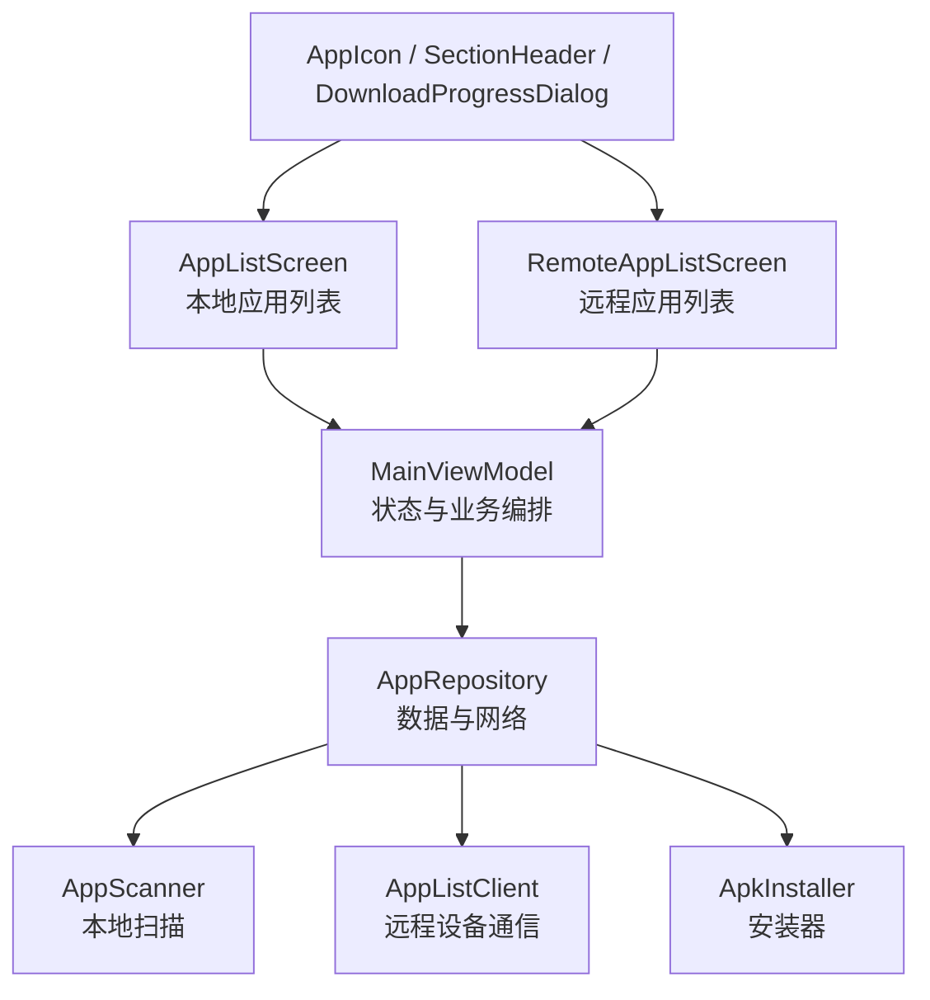
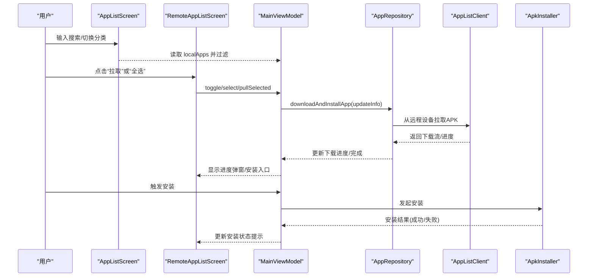
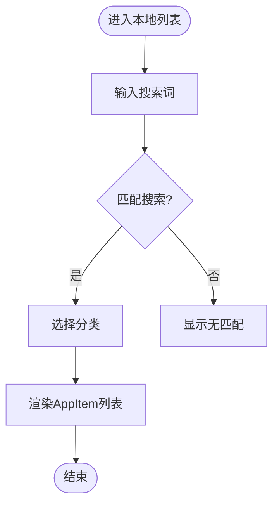
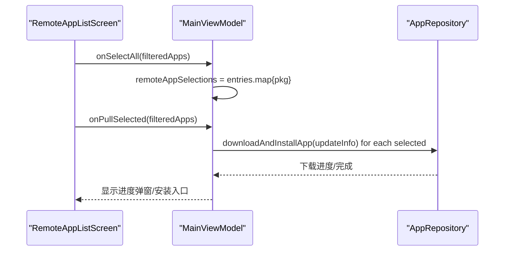
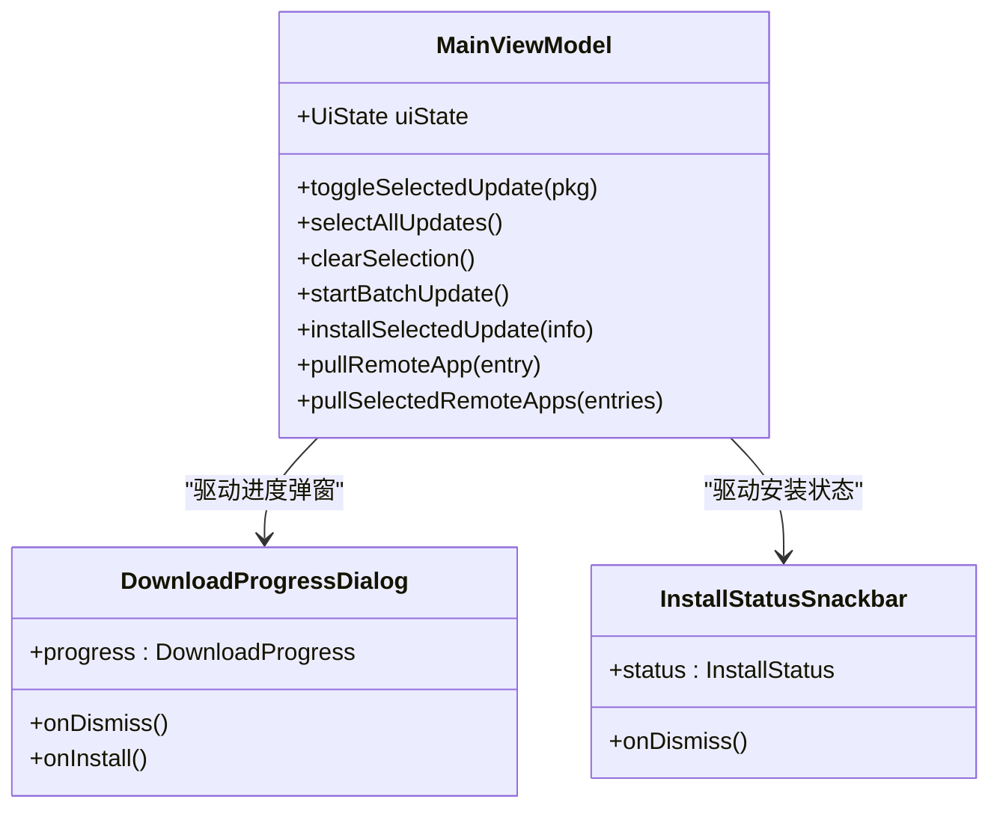
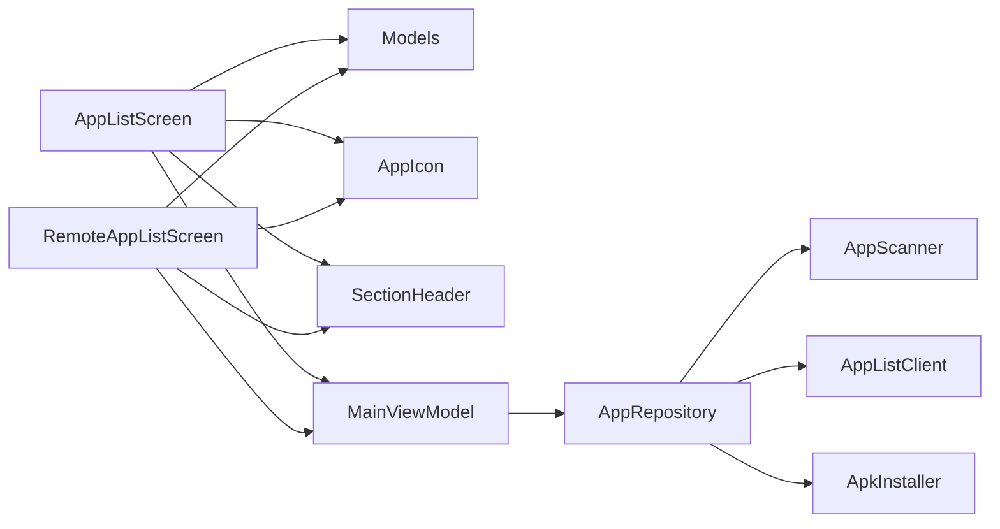

# 应用浏览界面

<cite>
**本文引用的文件**
- [AppListScreen.kt](file://app/src/main/java/com/lansync/app/ui/components/AppListScreen.kt)
- [RemoteAppListScreen.kt](file://app/src/main/java/com/lansync/app/ui/components/RemoteAppListScreen.kt)
- [MainViewModel.kt](file://app/src/main/java/com/lansync/app/ui/viewmodel/MainViewModel.kt)
- [Models.kt](file://app/src/main/java/com/lansync/app/data/model/Models.kt)
- [AppIcon.kt](file://app/src/main/java/com/lansync/app/ui/components/AppIcon.kt)
- [DownloadProgressDialog.kt](file://app/src/main/java/com/lansync/app/ui/components/DownloadProgressDialog.kt)
- [AppRepository.kt](file://app/src/main/java/com/lansync/app/data/repository/AppRepository.kt)
</cite>

## 目录
1. [简介](#简介)
2. [项目结构](#项目结构)
3. [核心组件](#核心组件)
4. [架构总览](#架构总览)
5. [详细组件分析](#详细组件分析)
6. [依赖关系分析](#依赖关系分析)
7. [性能考虑](#性能考虑)
8. [故障排查指南](#故障排查指南)
9. [结论](#结论)

## 简介
本文件聚焦于 LanSync 应用的“应用浏览界面”，涵盖本地应用列表与远程应用列表的 UI 实现、应用信息展示、版本比较显示、同步状态指示、应用卡片布局（图标、名称、版本、操作按钮）、筛选与搜索、批量操作支持，以及远程与本地差异对比（更新提示、同步状态）。同时提供选择应用、下载进度与安装状态的交互流程说明，并给出懒加载与缓存等性能优化策略。

## 项目结构
应用浏览界面由 Compose UI 组件构成，数据通过 ViewModel 聚合仓库层提供的 StateFlow，UI 仅负责展示与用户交互：
- 本地应用列表：AppListScreen
- 远程应用列表：RemoteAppListScreen
- 视图模型：MainViewModel（管理状态、批量操作、下载与安装）
- 数据模型：Models（AppInfo、DeviceInfo、UpdateInfo、RemoteAppEntry、SyncDiff 等）
- 通用 UI 组件：AppIcon（带内存+磁盘缓存）、DownloadProgressDialog（下载进度与安装入口）、SectionHeader（标题与计数、全选/清除）
- 数据仓库：AppRepository（扫描本地应用、设备发现与连接、远程应用拉取、更新计算、下载与安装）

图表来源
- [AppListScreen.kt:27-121](file://app/src/main/java/com/lansync/app/ui/components/AppListScreen.kt#L27-L121)
- [RemoteAppListScreen.kt:24-283](file://app/src/main/java/com/lansync/app/ui/components/RemoteAppListScreen.kt#L24-L283)
- [MainViewModel.kt:47-124](file://app/src/main/java/com/lansync/app/ui/viewmodel/MainViewModel.kt#L47-L124)
- [AppRepository.kt:40-79](file://app/src/main/java/com/lansync/app/data/repository/AppRepository.kt#L40-L79)

章节来源
- [AppListScreen.kt:27-121](file://app/src/main/java/com/lansync/app/ui/components/AppListScreen.kt#L27-L121)
- [RemoteAppListScreen.kt:24-283](file://app/src/main/java/com/lansync/app/ui/components/RemoteAppListScreen.kt#L24-L283)
- [MainViewModel.kt:47-124](file://app/src/main/java/com/lansync/app/ui/viewmodel/MainViewModel.kt#L47-L124)
- [AppRepository.kt:40-79](file://app/src/main/java/com/lansync/app/data/repository/AppRepository.kt#L40-L79)

## 核心组件
- 本地应用列表（AppListScreen）
  - 搜索栏：按应用名或包名模糊匹配
  - 分类标签：全部/用户应用/系统应用，实时统计数量
  - 列表项（AppItem）：应用图标、名称、版本、文件大小、是否可提取、是否分包标记
- 远程应用列表（RemoteAppListScreen）
  - 搜索与分类：同本地列表
  - 多设备摘要：已连接设备数、总远程应用数、刷新状态
  - 列表项（RemoteAppItem）：复选框、图标、名称、版本、大小、来源设备、拉取按钮
  - 批量操作：全选/清除选择，底部悬浮条“拉取安装”
- 视图模型（MainViewModel）
  - 聚合仓库的多个 StateFlow，映射为 UiState
  - 批量更新与批量拉取：遍历选中项，逐个调用下载与安装
  - 下载与安装：记录最近一次下载项，支持后续安装；清理进度与安装状态
- 数据模型（Models）
  - AppInfo：包名、名称、版本、源路径、MD5、是否可提取、大小、是否系统应用、是否分包
  - DeviceInfo：设备标识、连接状态、应用列表等
  - UpdateInfo：本地/远程应用对比、提供者设备、是否可更新
  - RemoteAppEntry：远程应用与其来源设备
  - SyncDiff：差异类型（远端更新、仅远端存在、版本相同、仅本地存在）

章节来源
- [AppListScreen.kt:27-121](file://app/src/main/java/com/lansync/app/ui/components/AppListScreen.kt#L27-L121)
- [AppListScreen.kt:202-288](file://app/src/main/java/com/lansync/app/ui/components/AppListScreen.kt#L202-L288)
- [RemoteAppListScreen.kt:24-283](file://app/src/main/java/com/lansync/app/ui/components/RemoteAppListScreen.kt#L24-L283)
- [RemoteAppListScreen.kt:358-482](file://app/src/main/java/com/lansync/app/ui/components/RemoteAppListScreen.kt#L358-L482)
- [MainViewModel.kt:22-45](file://app/src/main/java/com/lansync/app/ui/viewmodel/MainViewModel.kt#L22-L45)
- [MainViewModel.kt:225-281](file://app/src/main/java/com/lansync/app/ui/viewmodel/MainViewModel.kt#L225-L281)
- [MainViewModel.kt:343-410](file://app/src/main/java/com/lansync/app/ui/viewmodel/MainViewModel.kt#L343-L410)
- [Models.kt:5-67](file://app/src/main/java/com/lansync/app/data/model/Models.kt#L5-L67)

## 架构总览
UI 层通过 Compose 组件渲染，使用 derivedStateOf 对搜索与分类进行高效过滤；ViewModel 组合仓库的多路 StateFlow，将状态集中到 UiState；仓库负责设备发现、连接、心跳、定时同步、下载与安装。

图表来源
- [AppListScreen.kt:27-121](file://app/src/main/java/com/lansync/app/ui/components/AppListScreen.kt#L27-L121)
- [RemoteAppListScreen.kt:24-283](file://app/src/main/java/com/lansync/app/ui/components/RemoteAppListScreen.kt#L24-L283)
- [MainViewModel.kt:225-281](file://app/src/main/java/com/lansync/app/ui/viewmodel/MainViewModel.kt#L225-L281)
- [MainViewModel.kt:343-410](file://app/src/main/java/com/lansync/app/ui/viewmodel/MainViewModel.kt#L343-L410)
- [AppRepository.kt:40-79](file://app/src/main/java/com/lansync/app/data/repository/AppRepository.kt#L40-L79)

## 详细组件分析

### 本地应用列表（AppListScreen）
- 搜索与分类
  - 搜索：基于应用名与包名的不区分大小写包含匹配
  - 分类：全部/用户应用/系统应用，配合 derivedStateOf 避免重复计算
- 列表项（AppItem）
  - 应用图标：使用 AppIcon 组件，支持内存与磁盘缓存
  - 名称与版本：名称单行省略，版本与大小同行展示
  - 标记：不可提取、分包标记以标签形式呈现
- 空态与计数
  - 根据搜索与分类结果动态显示空态文案
  - SectionHeader 显示“已安装应用”及计数

图表来源
- [AppListScreen.kt:27-121](file://app/src/main/java/com/lansync/app/ui/components/AppListScreen.kt#L27-L121)
- [AppListScreen.kt:202-288](file://app/src/main/java/com/lansync/app/ui/components/AppListScreen.kt#L202-L288)

章节来源
- [AppListScreen.kt:27-121](file://app/src/main/java/com/lansync/app/ui/components/AppListScreen.kt#L27-L121)
- [AppListScreen.kt:202-288](file://app/src/main/java/com/lansync/app/ui/components/AppListScreen.kt#L202-L288)

### 远程应用列表（RemoteAppListScreen）
- 多设备聚合
  - 按包名去重，保留版本号最高的应用条目
  - 自动初始刷新：当有设备已连接但应用列表为空时触发刷新
- 搜索与分类
  - 同本地列表，支持用户/系统应用筛选
- 列表项（RemoteAppItem）
  - 复选框用于多选
  - 展示应用图标、名称、版本、大小、来源设备
  - “拉取”按钮触发下载与安装
- 批量操作
  - 全选/清除选择
  - 底部悬浮条显示已选数量与“拉取安装”按钮

图表来源
- [RemoteAppListScreen.kt:24-283](file://app/src/main/java/com/lansync/app/ui/components/RemoteAppListScreen.kt#L24-L283)
- [RemoteAppListScreen.kt:358-482](file://app/src/main/java/com/lansync/app/ui/components/RemoteAppListScreen.kt#L358-L482)
- [MainViewModel.kt:343-410](file://app/src/main/java/com/lansync/app/ui/viewmodel/MainViewModel.kt#L343-L410)

章节来源
- [RemoteAppListScreen.kt:24-283](file://app/src/main/java/com/lansync/app/ui/components/RemoteAppListScreen.kt#L24-L283)
- [RemoteAppListScreen.kt:358-482](file://app/src/main/java/com/lansync/app/ui/components/RemoteAppListScreen.kt#L358-L482)
- [MainViewModel.kt:343-410](file://app/src/main/java/com/lansync/app/ui/viewmodel/MainViewModel.kt#L343-L410)

### 应用卡片布局设计
- 应用图标：统一使用 AppIcon，尺寸与圆角一致，支持占位图标
- 名称与版本：名称加粗或中等字重，版本小号字体，颜色次级
- 大小与标记：大小以 MB 为单位显示；不可提取、分包以标签呈现
- 操作按钮：远程列表项右侧“拉取”按钮；更新项“安装”按钮

章节来源
- [AppListScreen.kt:202-288](file://app/src/main/java/com/lansync/app/ui/components/AppListScreen.kt#L202-L288)
- [RemoteAppListScreen.kt:358-482](file://app/src/main/java/com/lansync/app/ui/components/RemoteAppListScreen.kt#L358-L482)
- [AppIcon.kt:42-93](file://app/src/main/java/com/lansync/app/ui/components/AppIcon.kt#L42-L93)

### 版本比较与同步状态
- 更新提示
  - 更新项（UpdateItem）显示“可更新”标签，并以“本地版本 → 远程版本”的形式展示升级路径
  - 提供“安装”按钮直接触发下载与安装
- 同步状态
  - 远程列表顶部“多设备摘要”显示连接设备数、总应用数、刷新中状态
  - 连接状态枚举（CONNECTED、RECONNECTING、ERROR 等）影响摘要与空态展示

章节来源
- [AppListScreen.kt:291-426](file://app/src/main/java/com/lansync/app/ui/components/AppListScreen.kt#L291-L426)
- [RemoteAppListScreen.kt:286-355](file://app/src/main/java/com/lansync/app/ui/components/RemoteAppListScreen.kt#L286-L355)
- [Models.kt:19-27](file://app/src/main/java/com/lansync/app/data/model/Models.kt#L19-L27)

### 应用选择、下载进度与安装状态
- 应用选择
  - 本地更新列表：toggleSelectedUpdate、selectAllUpdates、clearSelection
  - 远程应用列表：toggleRemoteAppSelection、selectAllRemoteApps、clearRemoteAppSelection
- 下载进度
  - MainViewModel 维护 currentDownloadProgress，UI 通过 DownloadProgressDialog 展示
  - 进度状态包括下载中、校验中、完成、失败
- 安装状态
  - InstallStatusSnackbar 展示安装中、成功、失败三种状态，支持滑动关闭
  - 支持“安装”按钮二次确认，防止误触

图表来源
- [MainViewModel.kt:225-281](file://app/src/main/java/com/lansync/app/ui/viewmodel/MainViewModel.kt#L225-L281)
- [MainViewModel.kt:343-410](file://app/src/main/java/com/lansync/app/ui/viewmodel/MainViewModel.kt#L343-L410)
- [DownloadProgressDialog.kt:30-135](file://app/src/main/java/com/lansync/app/ui/components/DownloadProgressDialog.kt#L30-L135)
- [DownloadProgressDialog.kt:137-278](file://app/src/main/java/com/lansync/app/ui/components/DownloadProgressDialog.kt#L137-L278)

章节来源
- [MainViewModel.kt:225-281](file://app/src/main/java/com/lansync/app/ui/viewmodel/MainViewModel.kt#L225-L281)
- [MainViewModel.kt:343-410](file://app/src/main/java/com/lansync/app/ui/viewmodel/MainViewModel.kt#L343-L410)
- [DownloadProgressDialog.kt:30-135](file://app/src/main/java/com/lansync/app/ui/components/DownloadProgressDialog.kt#L30-L135)
- [DownloadProgressDialog.kt:137-278](file://app/src/main/java/com/lansync/app/ui/components/DownloadProgressDialog.kt#L137-L278)

## 依赖关系分析
- UI 组件依赖
  - AppListScreen 与 RemoteAppListScreen 均依赖 Models 中的 AppInfo、DeviceInfo、UpdateInfo、RemoteAppEntry
  - 两者共用 AppIcon、SectionHeader、SearchBar、CategoryTabs 等基础组件
- ViewModel 依赖
  - MainViewModel 依赖 AppRepository 暴露的 StateFlow 集合，组合为 UiState
  - 批量操作与拉取逻辑在 ViewModel 中编排，调用 Repository 的下载与安装方法
- 仓库依赖
  - AppRepository 整合 AppScanner、AppListClient、ApkInstaller、UpdateManager 等模块，负责数据获取、网络通信与安装

图表来源
- [AppListScreen.kt:27-121](file://app/src/main/java/com/lansync/app/ui/components/AppListScreen.kt#L27-L121)
- [RemoteAppListScreen.kt:24-283](file://app/src/main/java/com/lansync/app/ui/components/RemoteAppListScreen.kt#L24-L283)
- [MainViewModel.kt:47-124](file://app/src/main/java/com/lansync/app/ui/viewmodel/MainViewModel.kt#L47-L124)
- [AppRepository.kt:40-79](file://app/src/main/java/com/lansync/app/data/repository/AppRepository.kt#L40-L79)

章节来源
- [AppListScreen.kt:27-121](file://app/src/main/java/com/lansync/app/ui/components/AppListScreen.kt#L27-L121)
- [RemoteAppListScreen.kt:24-283](file://app/src/main/java/com/lansync/app/ui/components/RemoteAppListScreen.kt#L24-L283)
- [MainViewModel.kt:47-124](file://app/src/main/java/com/lansync/app/ui/viewmodel/MainViewModel.kt#L47-L124)
- [AppRepository.kt:40-79](file://app/src/main/java/com/lansync/app/data/repository/AppRepository.kt#L40-L79)

## 性能考虑
- 懒加载与虚拟滚动
  - 使用 LazyColumn 渲染长列表，仅可见项参与测量与绘制，降低内存与CPU开销
- 高效过滤
  - 使用 derivedStateOf 对搜索与分类结果进行缓存，避免每次重组重新计算
- 图标缓存
  - AppIcon 采用两级缓存：内存 LruCache（按 Bitmap 字节数估算容量）与磁盘缓存（AppIconDiskCache），减少重复加载与 IO
- 预加载
  - 提供 preloadIcon 接口，可在列表前预取常用图标，提升首屏体验
- 批量操作
  - 批量更新/拉取顺序执行，错误收集并在完成后统一提示，避免并发导致的资源竞争

章节来源
- [AppListScreen.kt:35-49](file://app/src/main/java/com/lansync/app/ui/components/AppListScreen.kt#L35-L49)
- [RemoteAppListScreen.kt:77-91](file://app/src/main/java/com/lansync/app/ui/components/RemoteAppListScreen.kt#L77-L91)
- [AppIcon.kt:32-40](file://app/src/main/java/com/lansync/app/ui/components/AppIcon.kt#L32-L40)
- [AppIcon.kt:95-124](file://app/src/main/java/com/lansync/app/ui/components/AppIcon.kt#L95-L124)
- [AppIcon.kt:126-151](file://app/src/main/java/com/lansync/app/ui/components/AppIcon.kt#L126-L151)
- [MainViewModel.kt:245-274](file://app/src/main/java/com/lansync/app/ui/viewmodel/MainViewModel.kt#L245-L274)
- [MainViewModel.kt:363-397](file://app/src/main/java/com/lansync/app/ui/viewmodel/MainViewModel.kt#L363-L397)

## 故障排查指南
- 远程设备未连接
  - 现象：远程列表显示“暂无连接的远程设备”
  - 处理：引导至设备页面进行发现与连接
- 远程应用列表为空
  - 现象：显示“应用列表为空”并提供“刷新应用列表”按钮
  - 处理：手动刷新或等待自动初始刷新触发
- 下载失败
  - 现象：DownloadProgressDialog 显示“下载失败”
  - 处理：检查网络连接与目标设备状态，重试或取消
- 安装失败
  - 现象：InstallStatusSnackbar 显示错误消息
  - 处理：查看错误原因（权限、签名冲突等），修正后重试
- 批量操作部分失败
  - 现象：批量更新/拉取完成后提示失败数量与明细
  - 处理：根据错误信息逐项修复并重试

章节来源
- [RemoteAppListScreen.kt:130-198](file://app/src/main/java/com/lansync/app/ui/components/RemoteAppListScreen.kt#L130-L198)
- [DownloadProgressDialog.kt:30-135](file://app/src/main/java/com/lansync/app/ui/components/DownloadProgressDialog.kt#L30-L135)
- [DownloadProgressDialog.kt:137-278](file://app/src/main/java/com/lansync/app/ui/components/DownloadProgressDialog.kt#L137-L278)
- [MainViewModel.kt:245-274](file://app/src/main/java/com/lansync/app/ui/viewmodel/MainViewModel.kt#L245-L274)
- [MainViewModel.kt:363-397](file://app/src/main/java/com/lansync/app/ui/viewmodel/MainViewModel.kt#L363-L397)

## 结论
LanSync 的应用浏览界面通过清晰的分层与模块化设计，实现了本地与远程应用的高效浏览、筛选与批量操作。UI 层使用 Compose 的最佳实践（LazyColumn、derivedStateOf）保障流畅体验；ViewModel 集中管理状态与业务流程；仓库层封装设备通信、下载与安装。图标缓存与懒加载进一步优化了性能。整体架构易于扩展与维护，适合在多设备局域网场景下快速同步与管理应用。