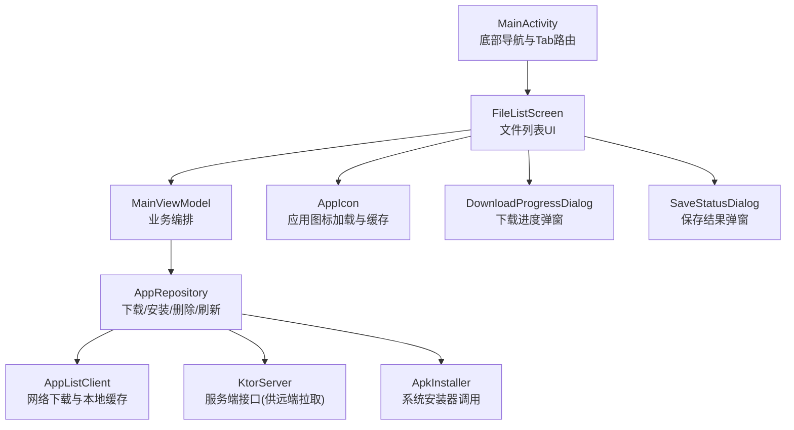
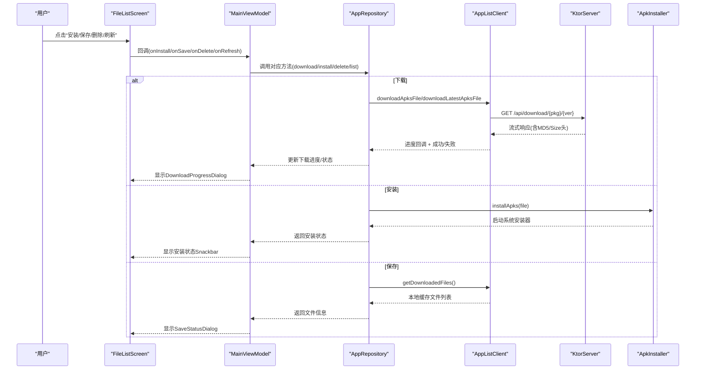
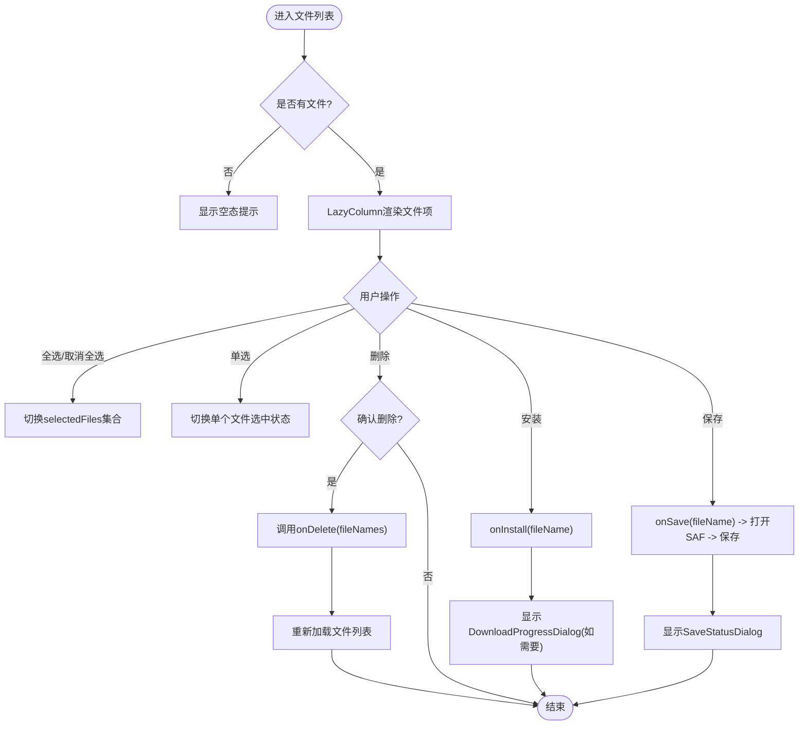
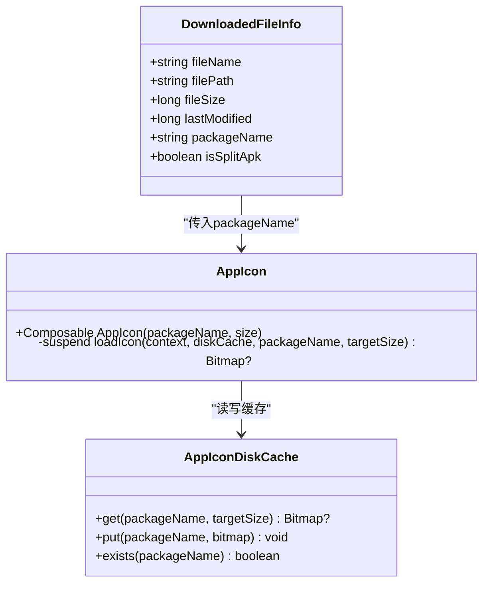
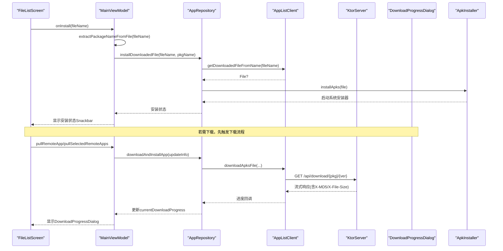
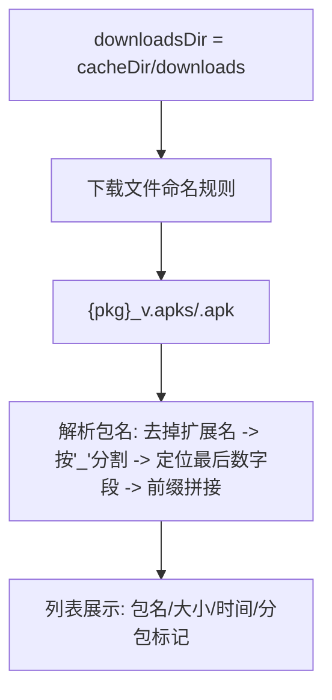
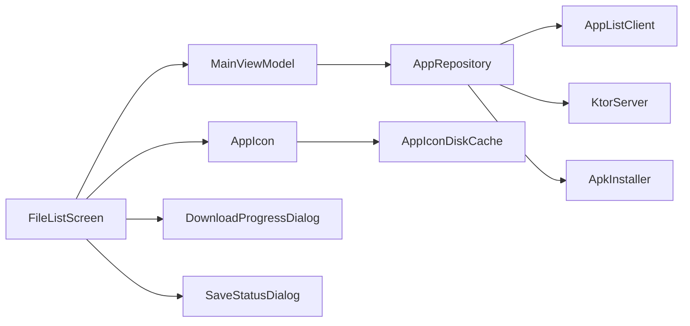

# 文件管理界面

<cite>
**本文引用的文件**
- [FileListScreen.kt](file://app/src/main/java/com/lansync/app/ui/components/FileListScreen.kt)
- [AppIcon.kt](file://app/src/main/java/com/lansync/app/ui/components/AppIcon.kt)
- [DownloadProgressDialog.kt](file://app/src/main/java/com/lansync/app/ui/components/DownloadProgressDialog.kt)
- [SaveStatusDialog.kt](file://app/src/main/java/com/lansync/app/ui/components/SaveStatusDialog.kt)
- [MainViewModel.kt](file://app/src/main/java/com/lansync/app/ui/viewmodel/MainViewModel.kt)
- [MainActivity.kt](file://app/src/main/java/com/lansync/app/MainActivity.kt)
- [AppRepository.kt](file://app/src/main/java/com/lansync/app/data/repository/AppRepository.kt)
- [AppListClient.kt](file://app/src/main/java/com/lansync/app/data/client/AppListClient.kt)
- [KtorServer.kt](file://app/src/main/java/com/lansync/app/data/server/KtorServer.kt)
- [Models.kt](file://app/src/main/java/com/lansync/app/data/model/Models.kt)
- [ApkInstaller.kt](file://app/src/main/java/com/lansync/app/data/installer/ApkInstaller.kt)
</cite>

## 目录
1. [简介](#简介)
2. [项目结构](#项目结构)
3. [核心组件](#核心组件)
4. [架构总览](#架构总览)
5. [详细组件分析](#详细组件分析)
6. [依赖关系分析](#依赖关系分析)
7. [性能考虑](#性能考虑)
8. [故障排查指南](#故障排查指南)
9. [结论](#结论)
10. [附录](#附录)

## 简介
本文件围绕 LanSync 应用的“文件”标签页，深入解析 FileListScreen 组件的实现与交互逻辑。重点包括：
- 已下载文件的列表展示、批量选择与删除
- 安装（APK/.apks）与保存到外部存储（SAF）流程
- 文件类型识别与图标显示（应用包名、分包标记等）
- 下载进度与安装状态提示
- 文件路径管理与目录可视化（通过文件名与包名映射）
- 权限处理与存储管理的最佳实践

## 项目结构
文件管理相关代码主要分布在 UI 层、ViewModel 层和数据/服务层：
- UI 层：FileListScreen、AppIcon、DownloadProgressDialog、SaveStatusDialog
- ViewModel 层：MainViewModel（协调下载、安装、删除、刷新）
- 数据/服务层：AppRepository、AppListClient、KtorServer、ApkInstaller、Models

图表来源
- [MainActivity.kt:310-329](file://app/src/main/java/com/lansync/app/MainActivity.kt#L310-L329)
- [FileListScreen.kt:24-160](file://app/src/main/java/com/lansync/app/ui/components/FileListScreen.kt#L24-L160)
- [MainViewModel.kt:291-333](file://app/src/main/java/com/lansync/app/ui/viewmodel/MainViewModel.kt#L291-L333)
- [AppRepository.kt:40-79](file://app/src/main/java/com/lansync/app/data/repository/AppRepository.kt#L40-L79)
- [AppListClient.kt:358-461](file://app/src/main/java/com/lansync/app/data/client/AppListClient.kt#L358-L461)
- [KtorServer.kt:177-250](file://app/src/main/java/com/lansync/app/data/server/KtorServer.kt#L177-L250)
- [ApkInstaller.kt:12-54](file://app/src/main/java/com/lansync/app/data/installer/ApkInstaller.kt#L12-L54)

章节来源
- [MainActivity.kt:310-329](file://app/src/main/java/com/lansync/app/MainActivity.kt#L310-L329)
- [FileListScreen.kt:24-160](file://app/src/main/java/com/lansync/app/ui/components/FileListScreen.kt#L24-L160)

## 核心组件
- FileListScreen：渲染已下载文件列表，支持全选/取消全选、批量删除、单文件安装与保存；空态提示；分包标识显示。
- AppIcon：按包名加载并缓存应用图标，支持内存+磁盘两级缓存，失败回退到默认图标。
- DownloadProgressDialog：展示下载/校验/完成/失败状态及进度条，完成后提供一键安装入口。
- SaveStatusDialog：基于 SAF 的保存流程，包含保存中、成功、错误三种状态。
- MainViewModel：统一编排下载、安装、删除、刷新等操作，维护 UiState。
- AppRepository：封装下载、安装、删除、设备连接与同步等核心能力。
- AppListClient：负责从远端服务器下载 APK/.apks，写入本地缓存目录，进行 MD5 校验与进度回调。
- KtorServer：提供 /api/download 等接口，用于远端拉取应用包。
- ApkInstaller：调用系统安装器安装 APK/.apks。
- Models：定义 AppInfo、DeviceInfo、UpdateInfo 等数据结构。

章节来源
- [FileListScreen.kt:24-296](file://app/src/main/java/com/lansync/app/ui/components/FileListScreen.kt#L24-L296)
- [AppIcon.kt:42-151](file://app/src/main/java/com/lansync/app/ui/components/AppIcon.kt#L42-L151)
- [DownloadProgressDialog.kt:30-135](file://app/src/main/java/com/lansync/app/ui/components/DownloadProgressDialog.kt#L30-L135)
- [SaveStatusDialog.kt:20-82](file://app/src/main/java/com/lansync/app/ui/components/SaveStatusDialog.kt#L20-L82)
- [MainViewModel.kt:22-45](file://app/src/main/java/com/lansync/app/ui/viewmodel/MainViewModel.kt#L22-L45)
- [AppRepository.kt:40-79](file://app/src/main/java/com/lansync/app/data/repository/AppRepository.kt#L40-L79)
- [AppListClient.kt:358-571](file://app/src/main/java/com/lansync/app/data/client/AppListClient.kt#L358-L571)
- [KtorServer.kt:177-250](file://app/src/main/java/com/lansync/app/data/server/KtorServer.kt#L177-L250)
- [ApkInstaller.kt:12-54](file://app/src/main/java/com/lansync/app/data/installer/ApkInstaller.kt#L12-L54)
- [Models.kt:5-17](file://app/src/main/java/com/lansync/app/data/model/Models.kt#L5-L17)

## 架构总览
文件管理界面的数据流与控制流如下：
- 用户操作（安装/保存/删除/刷新）由 FileListScreen 触发回调
- MainViewModel 将操作转发至 AppRepository
- AppRepository 调用 AppListClient 执行下载/读取本地缓存，调用 ApkInstaller 执行安装
- 下载过程通过 DownloadProgressDialog 反馈进度
- 保存过程通过 SaveStatusDialog 反馈结果
- 服务端 KtorServer 暴露下载接口，供远端设备拉取应用包

图表来源
- [FileListScreen.kt:114-128](file://app/src/main/java/com/lansync/app/ui/components/FileListScreen.kt#L114-L128)
- [MainViewModel.kt:291-333](file://app/src/main/java/com/lansync/app/ui/viewmodel/MainViewModel.kt#L291-L333)
- [AppListClient.kt:358-461](file://app/src/main/java/com/lansync/app/data/client/AppListClient.kt#L358-L461)
- [KtorServer.kt:177-250](file://app/src/main/java/com/lansync/app/data/server/KtorServer.kt#L177-L250)
- [ApkInstaller.kt:12-54](file://app/src/main/java/com/lansync/app/data/installer/ApkInstaller.kt#L12-L54)

## 详细组件分析

### FileListScreen 组件分析
- 列表展示：使用 LazyColumn 渲染 DownloadedFileItem，每项显示包名、文件大小、修改时间、是否分包标记，以及应用图标。
- 批量操作：顶部工具栏支持全选/取消全选、删除选中项；选中数量实时显示。
- 文件操作：
  - 安装：调用 onInstall(fileName)，由 ViewModel 解析包名并触发安装流程。
  - 保存：调用 onSave(fileName)，打开 SAF 目录选择器，保存成功后显示 SaveStatusDialog。
  - 删除：弹出确认对话框，确认后调用 onDelete(fileNames) 批量删除。
- 空态提示：无文件时显示引导文案。

图表来源
- [FileListScreen.kt:32-160](file://app/src/main/java/com/lansync/app/ui/components/FileListScreen.kt#L32-L160)
- [FileListScreen.kt:162-296](file://app/src/main/java/com/lansync/app/ui/components/FileListScreen.kt#L162-L296)

章节来源
- [FileListScreen.kt:24-296](file://app/src/main/java/com/lansync/app/ui/components/FileListScreen.kt#L24-L296)

### 文件类型识别与图标显示
- 文件类型识别：
  - 仅列出 .apk 和 .apks 文件，区分是否为分包（isSplitApk）。
  - 包名从文件名解析：去除扩展名后，按下划线分割，定位最后一个数字段作为版本号，前面部分拼接为包名。
- 图标显示：
  - 使用 AppIcon 根据 packageName 加载应用图标，优先内存缓存，其次磁盘缓存，失败回退默认图标。
  - 分包文件在列表中显示“分包”标签，便于用户识别。

图表来源
- [AppListClient.kt:503-544](file://app/src/main/java/com/lansync/app/data/client/AppListClient.kt#L503-L544)
- [AppIcon.kt:42-151](file://app/src/main/java/com/lansync/app/ui/components/AppIcon.kt#L42-L151)
- [AppIcon.kt:9-95](file://app/src/main/java/com/lansync/app/data/cache/AppIconDiskCache.kt#L9-L95)

章节来源
- [AppListClient.kt:503-544](file://app/src/main/java/com/lansync/app/data/client/AppListClient.kt#L503-L544)
- [AppIcon.kt:42-151](file://app/src/main/java/com/lansync/app/ui/components/AppIcon.kt#L42-L151)

### 文件操作的交互逻辑（下载、删除、预览/安装）
- 下载：
  - 通过 AppListClient.downloadApksFile 或 downloadLatestApksFile 发起下载，支持进度回调。
  - 服务端 KtorServer 提供 /api/download/{packageName}/{versionCode} 或 /api/download/{packageName}，返回流式数据与 MD5/Size 头。
  - 下载完成后进行 MD5 校验，失败则删除临时文件并返回错误。
- 删除：
  - FileListScreen 弹出确认对话框，确认后调用 MainViewModel.deleteDownloadedFiles，最终由 AppListClient.deleteDownloadedFiles 删除本地缓存文件。
- 安装（预览）：
  - 安装通过 ApkInstaller.installApks 调用系统安装器，支持 .apk 与 .apks（以 zip 形式）。
  - 下载完成后，DownloadProgressDialog 提供“安装”按钮，直接触发安装流程。

图表来源
- [MainViewModel.kt:291-333](file://app/src/main/java/com/lansync/app/ui/viewmodel/MainViewModel.kt#L291-L333)
- [AppListClient.kt:358-461](file://app/src/main/java/com/lansync/app/data/client/AppListClient.kt#L358-L461)
- [KtorServer.kt:177-250](file://app/src/main/java/com/lansync/app/data/server/KtorServer.kt#L177-L250)
- [ApkInstaller.kt:12-54](file://app/src/main/java/com/lansync/app/data/installer/ApkInstaller.kt#L12-L54)
- [DownloadProgressDialog.kt:30-135](file://app/src/main/java/com/lansync/app/ui/components/DownloadProgressDialog.kt#L30-L135)

章节来源
- [MainViewModel.kt:291-333](file://app/src/main/java/com/lansync/app/ui/viewmodel/MainViewModel.kt#L291-L333)
- [AppListClient.kt:358-461](file://app/src/main/java/com/lansync/app/data/client/AppListClient.kt#L358-L461)
- [KtorServer.kt:177-250](file://app/src/main/java/com/lansync/app/data/server/KtorServer.kt#L177-L250)
- [ApkInstaller.kt:12-54](file://app/src/main/java/com/lansync/app/data/installer/ApkInstaller.kt#L12-L54)
- [DownloadProgressDialog.kt:30-135](file://app/src/main/java/com/lansync/app/ui/components/DownloadProgressDialog.kt#L30-L135)

### 文件路径管理与目录结构的可视化表示
- 本地缓存目录：AppListClient 使用 context.cacheDir/downloads 作为下载目录，确保应用卸载时自动清理。
- 文件名规范：{packageName.replace(".", "_")}_{versionCode}.apks 或 .apk，便于解析包名与版本。
- 包名解析：从文件名去除扩展名后，按“_”分割，定位最后一个纯数字段作为 versionCode，其前缀拼接为包名。
- 目录可视化：FileListScreen 通过 DownloadedFileItem 展示包名、大小、时间、分包标记，帮助用户理解文件归属与类型。

图表来源
- [AppListClient.kt:58-60](file://app/src/main/java/com/lansync/app/data/client/AppListClient.kt#L58-L60)
- [AppListClient.kt:358-391](file://app/src/main/java/com/lansync/app/data/client/AppListClient.kt#L358-L391)
- [AppListClient.kt:531-544](file://app/src/main/java/com/lansync/app/data/client/AppListClient.kt#L531-L544)
- [FileListScreen.kt:204-230](file://app/src/main/java/com/lansync/app/ui/components/FileListScreen.kt#L204-L230)

章节来源
- [AppListClient.kt:58-60](file://app/src/main/java/com/lansync/app/data/client/AppListClient.kt#L58-L60)
- [AppListClient.kt:358-391](file://app/src/main/java/com/lansync/app/data/client/AppListClient.kt#L358-L391)
- [AppListClient.kt:531-544](file://app/src/main/java/com/lansync/app/data/client/AppListClient.kt#L531-L544)
- [FileListScreen.kt:204-230](file://app/src/main/java/com/lansync/app/ui/components/FileListScreen.kt#L204-L230)

### 具体代码示例（以引用路径代替代码内容）
- 文件选择与批量操作：
  - 全选/取消全选：[FileListScreen.kt:71-85](file://app/src/main/java/com/lansync/app/ui/components/FileListScreen.kt#L71-L85)
  - 单选切换：[FileListScreen.kt:118-124](file://app/src/main/java/com/lansync/app/ui/components/FileListScreen.kt#L118-L124)
  - 批量删除：[FileListScreen.kt:133-159](file://app/src/main/java/com/lansync/app/ui/components/FileListScreen.kt#L133-L159)
- 下载进度：
  - 下载方法与进度回调：[AppListClient.kt:358-461](file://app/src/main/java/com/lansync/app/data/client/AppListClient.kt#L358-L461)
  - 进度弹窗：[DownloadProgressDialog.kt:30-135](file://app/src/main/java/com/lansync/app/ui/components/DownloadProgressDialog.kt#L30-L135)
- 安装流程：
  - 包名解析与安装调用：[MainViewModel.kt:306-333](file://app/src/main/java/com/lansync/app/ui/viewmodel/MainViewModel.kt#L306-L333)
  - 系统安装器调用：[ApkInstaller.kt:12-54](file://app/src/main/java/com/lansync/app/data/installer/ApkInstaller.kt#L12-L54)
- 保存到外部存储（SAF）：
  - 打开目录选择与保存：[MainActivity.kt:48-64](file://app/src/main/java/com/lansync/app/MainActivity.kt#L48-L64)
  - 保存状态对话框：[SaveStatusDialog.kt:20-82](file://app/src/main/java/com/lansync/app/ui/components/SaveStatusDialog.kt#L20-L82)

章节来源
- [FileListScreen.kt:71-159](file://app/src/main/java/com/lansync/app/ui/components/FileListScreen.kt#L71-L159)
- [AppListClient.kt:358-461](file://app/src/main/java/com/lansync/app/data/client/AppListClient.kt#L358-L461)
- [DownloadProgressDialog.kt:30-135](file://app/src/main/java/com/lansync/app/ui/components/DownloadProgressDialog.kt#L30-L135)
- [MainViewModel.kt:306-333](file://app/src/main/java/com/lansync/app/ui/viewmodel/MainViewModel.kt#L306-L333)
- [ApkInstaller.kt:12-54](file://app/src/main/java/com/lansync/app/data/installer/ApkInstaller.kt#L12-L54)
- [MainActivity.kt:48-64](file://app/src/main/java/com/lansync/app/MainActivity.kt#L48-L64)
- [SaveStatusDialog.kt:20-82](file://app/src/main/java/com/lansync/app/ui/components/SaveStatusDialog.kt#L20-L82)

## 依赖关系分析
- FileListScreen 依赖 MainViewModel 提供的回调与状态
- MainViewModel 依赖 AppRepository 进行业务编排
- AppRepository 依赖 AppListClient（网络与本地缓存）、KtorServer（服务端接口）、ApkInstaller（安装）
- AppIcon 依赖 AppIconDiskCache 进行图标缓存
- DownloadProgressDialog 与 SaveStatusDialog 分别依赖下载与保存的状态流转

图表来源
- [FileListScreen.kt:24-160](file://app/src/main/java/com/lansync/app/ui/components/FileListScreen.kt#L24-L160)
- [MainViewModel.kt:22-45](file://app/src/main/java/com/lansync/app/ui/viewmodel/MainViewModel.kt#L22-L45)
- [AppRepository.kt:40-79](file://app/src/main/java/com/lansync/app/data/repository/AppRepository.kt#L40-L79)
- [AppListClient.kt:358-571](file://app/src/main/java/com/lansync/app/data/client/AppListClient.kt#L358-L571)
- [KtorServer.kt:177-250](file://app/src/main/java/com/lansync/app/data/server/KtorServer.kt#L177-L250)
- [ApkInstaller.kt:12-54](file://app/src/main/java/com/lansync/app/data/installer/ApkInstaller.kt#L12-L54)
- [AppIcon.kt:42-151](file://app/src/main/java/com/lansync/app/ui/components/AppIcon.kt#L42-L151)

章节来源
- [FileListScreen.kt:24-160](file://app/src/main/java/com/lansync/app/ui/components/FileListScreen.kt#L24-L160)
- [MainViewModel.kt:22-45](file://app/src/main/java/com/lansync/app/ui/viewmodel/MainViewModel.kt#L22-L45)
- [AppRepository.kt:40-79](file://app/src/main/java/com/lansync/app/data/repository/AppRepository.kt#L40-L79)

## 性能考虑
- 图标缓存：AppIcon 使用 LruCache 内存缓存与磁盘缓存，减少重复加载开销。
- 下载缓冲：AppListClient 使用 64KB 缓冲区流式写入，降低内存占用。
- 进度计算：基于 contentLength 或 X-File-Size 头计算百分比，避免频繁重算。
- 列表渲染：LazyColumn 按需渲染，提升大列表性能。
- 并发控制：AppRepository 使用协程与 SupervisorJob 管理任务生命周期，避免资源泄漏。

[本节为通用性能讨论，不直接分析具体文件]

## 故障排查指南
- 下载失败：
  - 检查 HTTP 状态码与错误体：[AppListClient.kt:410-415](file://app/src/main/java/com/lansync/app/data/client/AppListClient.kt#L410-L415)
  - 检查 MD5 校验失败：[AppListClient.kt:445-453](file://app/src/main/java/com/lansync/app/data/client/AppListClient.kt#L445-L453)
- 安装失败：
  - 检查系统安装器可用性：[ApkInstaller.kt:32-40](file://app/src/main/java/com/lansync/app/data/installer/ApkInstaller.kt#L32-L40)
  - 查看安装状态 Snackbar 提示信息：[DownloadProgressDialog.kt:138-278](file://app/src/main/java/com/lansync/app/ui/components/DownloadProgressDialog.kt#L138-L278)
- 保存失败：
  - 权限不足或存储空间不足：[SaveStatusDialog.kt:71-81](file://app/src/main/java/com/lansync/app/ui/components/SaveStatusDialog.kt#L71-L81)
  - 目标目录不可写或创建失败：[SaveStatusDialog.kt:48-68](file://app/src/main/java/com/lansync/app/ui/components/SaveStatusDialog.kt#L48-L68)
- 连接与服务端问题：
  - 检查 KtorServer 端口与路由：[KtorServer.kt:65-290](file://app/src/main/java/com/lansync/app/data/server/KtorServer.kt#L65-L290)
  - 检查远端应用可提取性：[KtorServer.kt:182-211](file://app/src/main/java/com/lansync/app/data/server/KtorServer.kt#L182-L211)

章节来源
- [AppListClient.kt:410-453](file://app/src/main/java/com/lansync/app/data/client/AppListClient.kt#L410-L453)
- [ApkInstaller.kt:32-40](file://app/src/main/java/com/lansync/app/data/installer/ApkInstaller.kt#L32-L40)
- [DownloadProgressDialog.kt:138-278](file://app/src/main/java/com/lansync/app/ui/components/DownloadProgressDialog.kt#L138-L278)
- [SaveStatusDialog.kt:48-81](file://app/src/main/java/com/lansync/app/ui/components/SaveStatusDialog.kt#L48-L81)
- [KtorServer.kt:65-211](file://app/src/main/java/com/lansync/app/data/server/KtorServer.kt#L65-L211)

## 结论
FileListScreen 提供了直观的文件管理能力，结合 MainViewModel 与 AppRepository 实现了下载、安装、保存与删除的完整闭环。通过 AppIcon 的缓存机制与懒加载列表，保证了良好的用户体验。下载与保存流程均具备完善的进度与错误反馈，便于用户及时感知与处理异常。建议在实际使用中关注权限与存储管理，确保稳定运行。

[本节为总结性内容，不直接分析具体文件]

## 附录
- 关键数据模型：
  - AppInfo：应用基本信息与可提取性标志
  - DeviceInfo：设备信息与连接状态
  - UpdateInfo/SyncDiff：更新与差异对比
- 参考路径：
  - [Models.kt:5-17](file://app/src/main/java/com/lansync/app/data/model/Models.kt#L5-L17)
  - [Models.kt:29-45](file://app/src/main/java/com/lansync/app/data/model/Models.kt#L29-L45)
  - [Models.kt:47-67](file://app/src/main/java/com/lansync/app/data/model/Models.kt#L47-L67)

章节来源
- [Models.kt:5-67](file://app/src/main/java/com/lansync/app/data/model/Models.kt#L5-L67)