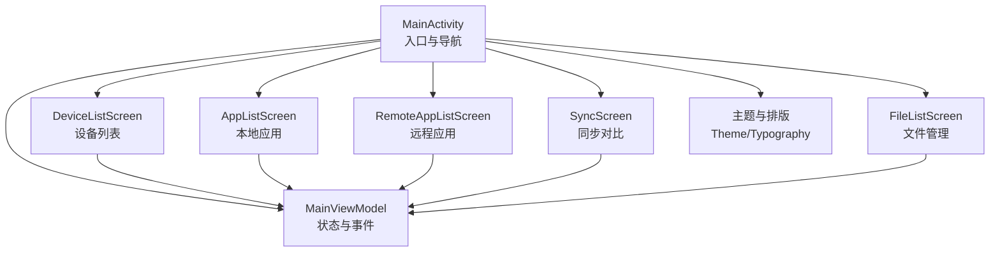
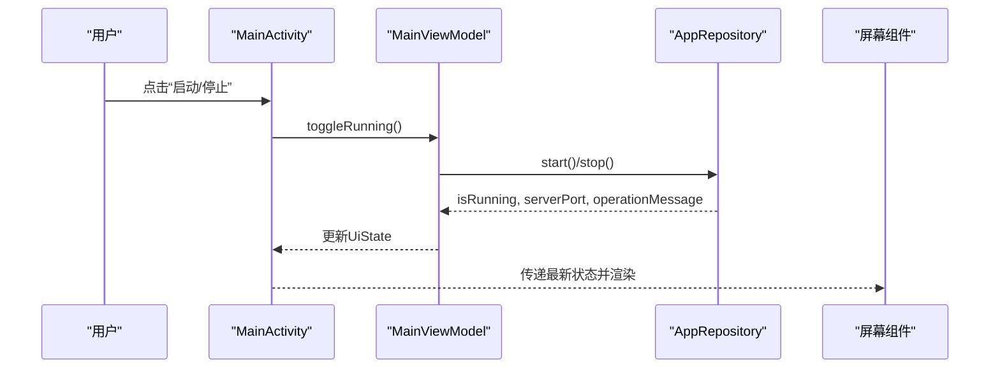
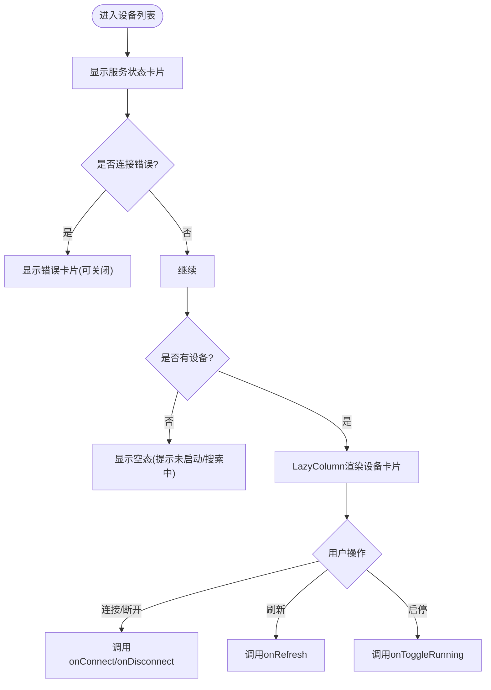
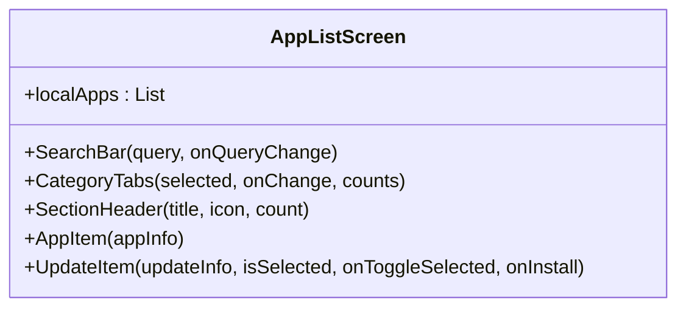
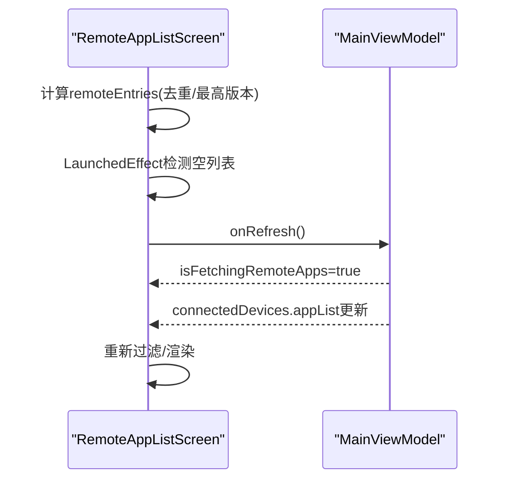
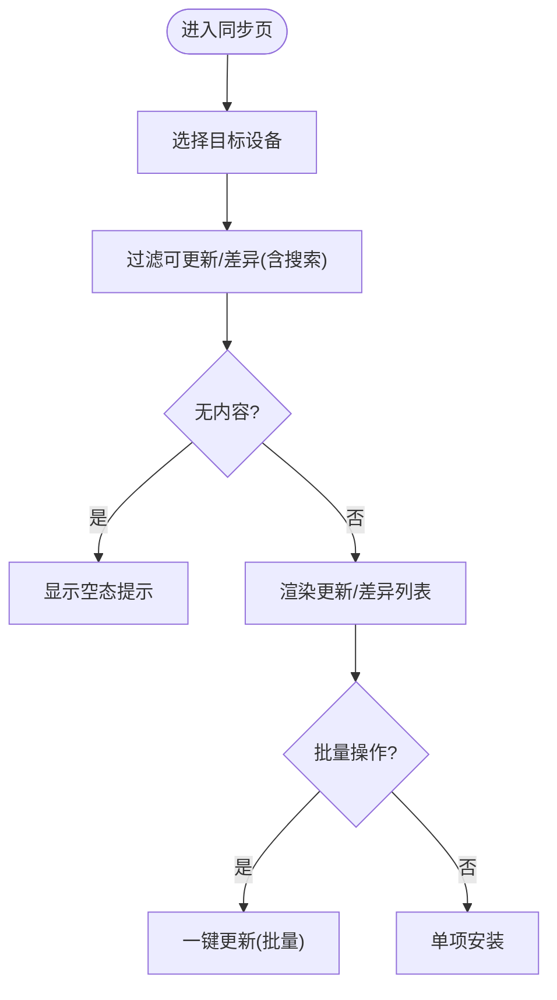
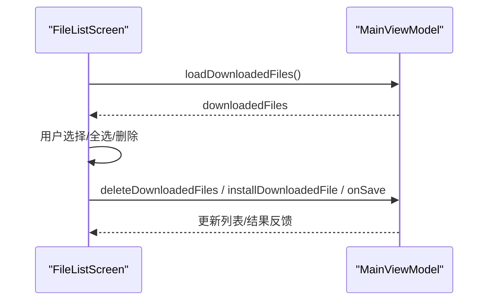
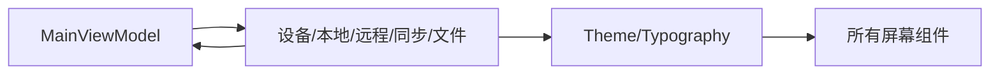

# 用户界面组件

<cite>
**本文引用的文件**
- [MainActivity.kt](file://app/src/main/java/com/lansync/app/MainActivity.kt)
- [MainViewModel.kt](file://app/src/main/java/com/lansync/app/ui/viewmodel/MainViewModel.kt)
- [DeviceListScreen.kt](file://app/src/main/java/com/lansync/app/ui/components/DeviceListScreen.kt)
- [AppListScreen.kt](file://app/src/main/java/com/lansync/app/ui/components/AppListScreen.kt)
- [RemoteAppListScreen.kt](file://app/src/main/java/com/lansync/app/ui/components/RemoteAppListScreen.kt)
- [SyncScreen.kt](file://app/src/main/java/com/lansync/app/ui/components/SyncScreen.kt)
- [FileListScreen.kt](file://app/src/main/java/com/lansync/app/ui/components/FileListScreen.kt)
- [AppIcon.kt](file://app/src/main/java/com/lansync/app/ui/components/AppIcon.kt)
- [DownloadProgressDialog.kt](file://app/src/main/java/com/lansync/app/ui/components/DownloadProgressDialog.kt)
- [IncomingConnectionDialog.kt](file://app/src/main/java/com/lansync/app/ui/components/IncomingConnectionDialog.kt)
- [SaveStatusDialog.kt](file://app/src/main/java/com/lansync/app/ui/components/SaveStatusDialog.kt)
- [InitialScanOverlay.kt](file://app/src/main/java/com/lansync/app/ui/components/InitialScanOverlay.kt)
- [Theme.kt](file://app/src/main/java/com/lansync/app/ui/theme/Theme.kt)
- [Typography.kt](file://app/src/main/java/com/lansync/app/ui/theme/Typography.kt)
</cite>

## 目录
1. [简介](#简介)
2. [项目结构](#项目结构)
3. [核心组件](#核心组件)
4. [架构总览](#架构总览)
5. [详细组件分析](#详细组件分析)
6. [依赖关系分析](#依赖关系分析)
7. [性能与可维护性](#性能与可维护性)
8. [故障排查指南](#故障排查指南)
9. [结论](#结论)
10. [附录：主题与样式规范](#附录：主题与样式规范)

## 简介
本文件面向LanSync基于Jetpack Compose的用户界面，系统性地说明各屏幕组件的职责、层次结构、状态管理策略与事件处理机制；阐述主题系统（颜色方案、字体规范、Material Design 3集成）；并提供属性配置、样式定制与响应式设计的最佳实践。文档包含具体代码路径引用，便于快速定位实现细节。

## 项目结构
- 入口与导航
  - MainActivity负责应用主题注入、底部导航与页面路由，将UI状态与业务逻辑解耦到MainViewModel。
- 屏幕组件
  - 设备列表、本地应用、远程应用、同步、文件管理五大页面，均位于ui/components下，各自封装搜索、筛选、选择、空态等交互。
- 主题与排版
  - ui/theme提供Material 3颜色方案与自定义Typography，支持动态色与深色模式。
- 视图模型
  - MainViewModel集中管理UI状态、网络/安装/下载流程的状态流转，并通过StateFlow向Compose层暴露数据。

图表来源
- [MainActivity.kt:26-106](file://app/src/main/java/com/lansync/app/MainActivity.kt#L26-L106)
- [MainViewModel.kt:22-56](file://app/src/main/java/com/lansync/app/ui/viewmodel/MainViewModel.kt#L22-L56)

章节来源
- [MainActivity.kt:26-106](file://app/src/main/java/com/lansync/app/MainActivity.kt#L26-L106)
- [MainViewModel.kt:22-56](file://app/src/main/java/com/lansync/app/ui/viewmodel/MainViewModel.kt#L22-L56)

## 核心组件
- 设备列表界面（DeviceListScreen）
  - 功能：展示已发现设备、连接状态、服务启停控制、错误提示。
  - 关键子组件：StatusCard（服务状态卡片）、DeviceCard（单设备卡片）。
  - 状态来源：通过回调交由MainViewModel处理连接/断开/启动停止等操作。
- 本地应用界面（AppListScreen）
  - 功能：搜索、分类（全部/用户/系统）、应用条目展示、更新项展示。
  - 状态：本地应用列表由ViewModel提供，界面内部维护搜索词与分类。
- 远程应用界面（RemoteAppListScreen）
  - 功能：聚合多设备应用、去重取最高版本、搜索与分类、批量拉取安装。
  - 自动刷新：当存在已连接且应用列表为空时触发初始刷新。
- 同步界面（SyncScreen）
  - 功能：按设备切换、显示可更新与版本差异、批量一键更新。
  - 状态：依赖availableUpdates与syncDiffs，结合selectedUpdates进行批量操作。
- 文件管理界面（FileListScreen）
  - 功能：列出已下载APK/APKS，支持全选/删除、保存至外部存储、安装。
  - 状态：本地维护选中集合，调用ViewModel执行删除/安装/保存。

章节来源
- [DeviceListScreen.kt:20-152](file://app/src/main/java/com/lansync/app/ui/components/DeviceListScreen.kt#L20-L152)
- [AppListScreen.kt:26-121](file://app/src/main/java/com/lansync/app/ui/components/AppListScreen.kt#L26-L121)
- [RemoteAppListScreen.kt:24-283](file://app/src/main/java/com/lansync/app/ui/components/RemoteAppListScreen.kt#L24-L283)
- [SyncScreen.kt:22-209](file://app/src/main/java/com/lansync/app/ui/components/SyncScreen.kt#L22-L209)
- [FileListScreen.kt:22-160](file://app/src/main/java/com/lansync/app/ui/components/FileListScreen.kt#L22-L160)

## 架构总览
- 状态管理
  - MainViewModel使用MutableStateFlow暴露UiState，多个Repository的StateFlow通过combine合并为统一状态，避免状态分散。
  - UI侧通过collectAsState订阅状态变化，驱动Compose重组。
- 事件处理
  - 屏幕组件仅声明回调（如onToggleRunning、onConnect等），由MainActivity桥接到ViewModel方法，保证单向数据流。
- 覆盖层与反馈
  - 下载进度、安装状态、保存状态、传入连接请求、初始扫描覆盖层等以对话框或Snackbar形式呈现，提升用户体验。

图表来源
- [MainViewModel.kt:126-156](file://app/src/main/java/com/lansync/app/ui/viewmodel/MainViewModel.kt#L126-L156)
- [MainActivity.kt:197-221](file://app/src/main/java/com/lansync/app/MainActivity.kt#L197-L221)

章节来源
- [MainViewModel.kt:84-124](file://app/src/main/java/com/lansync/app/ui/viewmodel/MainViewModel.kt#L84-L124)
- [MainActivity.kt:197-221](file://app/src/main/java/com/lansync/app/MainActivity.kt#L197-L221)

## 详细组件分析

### 设备列表界面（DeviceListScreen）
- 职责
  - 展示设备列表与服务运行状态，支持连接/断开、错误提示、强制启动同步。
- 状态与交互
  - 通过参数devices、isRunning、serverPort、connectionError等驱动UI。
  - 事件回调：onToggleRunning、onForceStartSync、onRefresh、onConnect、onDisconnect、onDismissError。
- 视觉与反馈
  - StatusCard根据运行状态与端口信息展示；DeviceCard依据连接状态动态着色与按钮行为。

图表来源
- [DeviceListScreen.kt:20-152](file://app/src/main/java/com/lansync/app/ui/components/DeviceListScreen.kt#L20-L152)
- [DeviceListScreen.kt:154-240](file://app/src/main/java/com/lansync/app/ui/components/DeviceListScreen.kt#L154-L240)
- [DeviceListScreen.kt:242-423](file://app/src/main/java/com/lansync/app/ui/components/DeviceListScreen.kt#L242-L423)

章节来源
- [DeviceListScreen.kt:20-423](file://app/src/main/java/com/lansync/app/ui/components/DeviceListScreen.kt#L20-L423)

### 本地应用界面（AppListScreen）
- 职责
  - 搜索与分类过滤本地应用，展示应用图标、名称、版本、大小及标签（不可提取/分包）。
- 状态与交互
  - 内部维护searchQuery与category，使用derivedStateOf计算filteredApps。
  - 提供UpdateItem用于后续更新场景（在同步页复用）。
- 性能
  - LazyColumn + items(key=packageName)优化列表渲染。

图表来源
- [AppListScreen.kt:26-121](file://app/src/main/java/com/lansync/app/ui/components/AppListScreen.kt#L26-L121)
- [AppListScreen.kt:202-288](file://app/src/main/java/com/lansync/app/ui/components/AppListScreen.kt#L202-L288)
- [AppListScreen.kt:291-426](file://app/src/main/java/com/lansync/app/ui/components/AppListScreen.kt#L291-L426)

章节来源
- [AppListScreen.kt:26-514](file://app/src/main/java/com/lansync/app/ui/components/AppListScreen.kt#L26-L514)

### 远程应用界面（RemoteAppListScreen）
- 职责
  - 聚合多设备应用，按包名去重保留最高版本；支持搜索、分类、批量选择与拉取安装。
- 状态与交互
  - derivedStateOf构建remoteEntries；LaunchedEffect检测空列表并触发初始刷新。
  - MultiDeviceSummary展示连接设备数与应用总数；底部悬浮条显示已选数量与批量操作。
- 性能
  - LazyColumn + key="remote_${packageName}"稳定列表项。

图表来源
- [RemoteAppListScreen.kt:24-91](file://app/src/main/java/com/lansync/app/ui/components/RemoteAppListScreen.kt#L24-L91)
- [RemoteAppListScreen.kt:65-75](file://app/src/main/java/com/lansync/app/ui/components/RemoteAppListScreen.kt#L65-L75)
- [RemoteAppListScreen.kt:103-283](file://app/src/main/java/com/lansync/app/ui/components/RemoteAppListScreen.kt#L103-L283)

章节来源
- [RemoteAppListScreen.kt:24-482](file://app/src/main/java/com/lansync/app/ui/components/RemoteAppListScreen.kt#L24-L482)

### 同步界面（SyncScreen）
- 职责
  - 按设备切换查看可更新与版本差异，支持全选/清除选择与一键更新。
- 状态与交互
  - selectedDevice、searchQuery驱动当前设备视图；derivedStateOf过滤availableUpdates与syncDiffs。
  - SectionHeader支持全选/清除；底部悬浮条显示已选数量与一键更新。
- 可视化
  - DiffItem展示本地→远程版本差异。

图表来源
- [SyncScreen.kt:22-209](file://app/src/main/java/com/lansync/app/ui/components/SyncScreen.kt#L22-L209)
- [SyncScreen.kt:267-329](file://app/src/main/java/com/lansync/app/ui/components/SyncScreen.kt#L267-L329)

章节来源
- [SyncScreen.kt:22-329](file://app/src/main/java/com/lansync/app/ui/components/SyncScreen.kt#L22-L329)

### 文件管理界面（FileListScreen）
- 职责
  - 展示已下载文件，支持全选/取消全选/批量删除、保存至外部存储、安装。
- 状态与交互
  - 本地维护selectedFiles；顶部工具栏显示选择计数与操作按钮。
  - 删除前弹出确认对话框；保存通过SAF选择目录并异步写入。
- 辅助
  - formatFileSize/formatTime格式化显示。

图表来源
- [FileListScreen.kt:22-160](file://app/src/main/java/com/lansync/app/ui/components/FileListScreen.kt#L22-L160)
- [FileListScreen.kt:162-296](file://app/src/main/java/com/lansync/app/ui/components/FileListScreen.kt#L162-L296)

章节来源
- [FileListScreen.kt:22-296](file://app/src/main/java/com/lansync/app/ui/components/FileListScreen.kt#L22-L296)

### 通用与辅助组件
- AppIcon：带内存+磁盘缓存的应用图标加载，失败回退默认图标。
- DownloadProgressDialog：下载/校验/完成/失败状态展示，支持完成后直接安装。
- IncomingConnectionDialog：接收连接请求，倒计时自动拒绝。
- SaveStatusDialog：保存文件到SAF目录的状态反馈。
- InitialScanOverlay：首次扫描本地应用的引导覆盖层。

章节来源
- [AppIcon.kt:42-151](file://app/src/main/java/com/lansync/app/ui/components/AppIcon.kt#L42-L151)
- [DownloadProgressDialog.kt:30-135](file://app/src/main/java/com/lansync/app/ui/components/DownloadProgressDialog.kt#L30-L135)
- [IncomingConnectionDialog.kt:17-100](file://app/src/main/java/com/lansync/app/ui/components/IncomingConnectionDialog.kt#L17-L100)
- [SaveStatusDialog.kt:20-186](file://app/src/main/java/com/lansync/app/ui/components/SaveStatusDialog.kt#L20-L186)
- [InitialScanOverlay.kt:12-65](file://app/src/main/java/com/lansync/app/ui/components/InitialScanOverlay.kt#L12-L65)

## 依赖关系分析
- 组件耦合
  - 屏幕组件仅依赖MainViewModel提供的状态与回调，保持低耦合。
  - 主题与排版被所有屏幕共享，确保一致性。
- 外部依赖
  - Material 3组件库（TopAppBar、NavigationBar、Card、Button等）。
  - Android SAF用于文件保存；PackageManager用于应用图标加载。
- 潜在循环依赖
  - 未发现循环导入；ViewModel不反向依赖UI组件。

图表来源
- [Theme.kt:40-75](file://app/src/main/java/com/lansync/app/ui/theme/Theme.kt#L40-L75)
- [MainActivity.kt:26-106](file://app/src/main/java/com/lansync/app/MainActivity.kt#L26-L106)

章节来源
- [Theme.kt:40-75](file://app/src/main/java/com/lansync/app/ui/theme/Theme.kt#L40-L75)
- [MainActivity.kt:26-106](file://app/src/main/java/com/lansync/app/MainActivity.kt#L26-L106)

## 性能与可维护性
- 列表性能
  - 使用LazyColumn与稳定的key（packageName/displayKey）减少重组开销。
  - 派生状态（derivedStateOf）避免不必要的过滤计算。
- 图片缓存
  - AppIcon采用内存LruCache与磁盘缓存，降低重复IO与绘制成本。
- 状态合并
  - ViewModel通过combine分组合并多个StateFlow，避免超过参数限制并保持可读性。
- 可维护性
  - 单一职责：每个屏幕组件聚焦自身业务；ViewModel集中管理跨屏状态。
  - 主题与排版集中管理，便于全局调整。

[本节为通用指导，不直接分析具体文件]

## 故障排查指南
- 连接错误提示
  - 设备列表界面会显示connectionError并可关闭；对应ViewModel在连接失败时设置错误消息。
- 下载/安装反馈
  - DownloadProgressDialog显示下载/校验/完成/失败；InstallStatusSnackbar提示安装状态，支持滑动关闭。
- 保存失败
  - SaveStatusDialog捕获权限不足、空间不足、IO异常等，给出明确错误信息。
- 初始扫描
  - InitialScanOverlay在首次使用时提示扫描过程，完成后自动启动服务。

章节来源
- [DeviceListScreen.kt:56-90](file://app/src/main/java/com/lansync/app/ui/components/DeviceListScreen.kt#L56-L90)
- [MainViewModel.kt:162-184](file://app/src/main/java/com/lansync/app/ui/viewmodel/MainViewModel.kt#L162-L184)
- [DownloadProgressDialog.kt:30-135](file://app/src/main/java/com/lansync/app/ui/components/DownloadProgressDialog.kt#L30-L135)
- [SaveStatusDialog.kt:26-82](file://app/src/main/java/com/lansync/app/ui/components/SaveStatusDialog.kt#L26-L82)
- [InitialScanOverlay.kt:12-65](file://app/src/main/java/com/lansync/app/ui/components/InitialScanOverlay.kt#L12-L65)

## 结论
LanSync的UI采用清晰的MVVM分层：屏幕组件负责展示与交互，MainViewModel集中管理状态与业务流程，主题系统统一视觉风格。通过LazyColumn、派生状态与缓存策略保障性能；通过覆盖层与Snackbar提升反馈体验。该设计易于扩展与维护，适合持续迭代。

[本节为总结，不直接分析具体文件]

## 附录：主题与样式规范
- 颜色方案
  - 支持动态色（Android 12+）与深色模式；Light/Dark两套预设色板。
  - 状态色遵循Material 3语义（primary/secondary/tertiary/error/surface等）。
- 字体规范
  - 自定义Typography定义bodyLarge、titleLarge、labelSmall等常用样式，统一字号、行高与字重。
- 集成方式
  - 在MainActivity中通过LanSyncTheme包裹整个应用，确保全局一致的主题与排版。

章节来源
- [Theme.kt:40-75](file://app/src/main/java/com/lansync/app/ui/theme/Theme.kt#L40-L75)
- [Typography.kt:9-31](file://app/src/main/java/com/lansync/app/ui/theme/Typography.kt#L9-L31)
- [MainActivity.kt:26-35](file://app/src/main/java/com/lansync/app/MainActivity.kt#L26-L35)