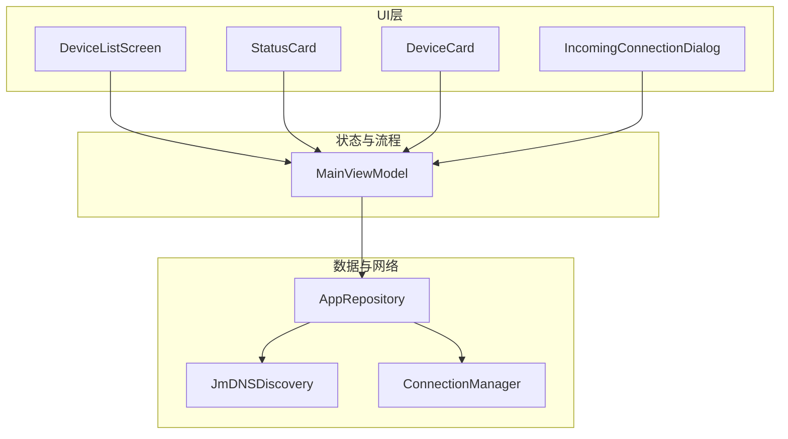
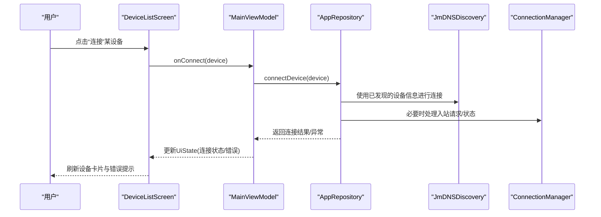
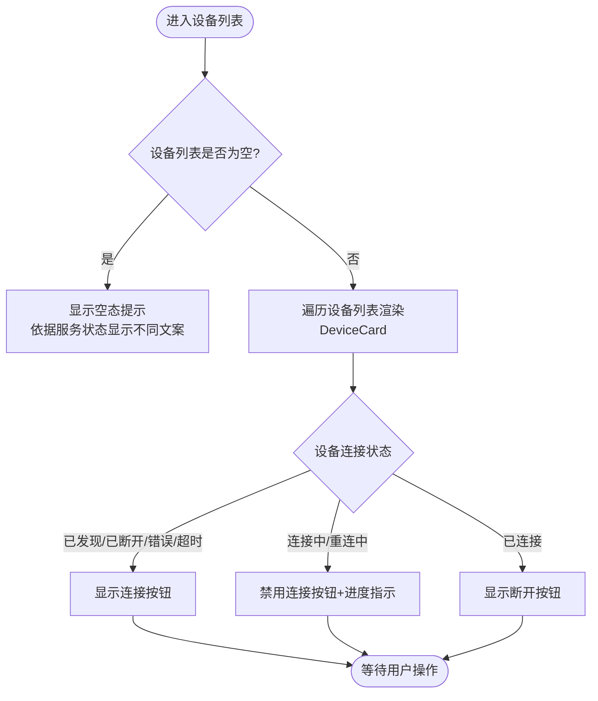
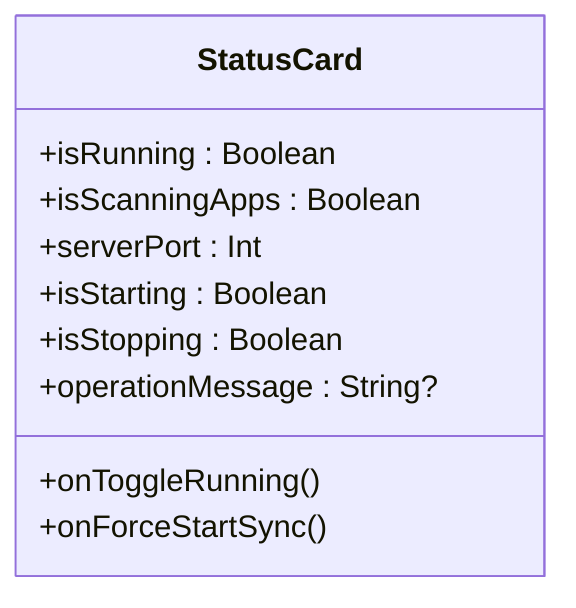
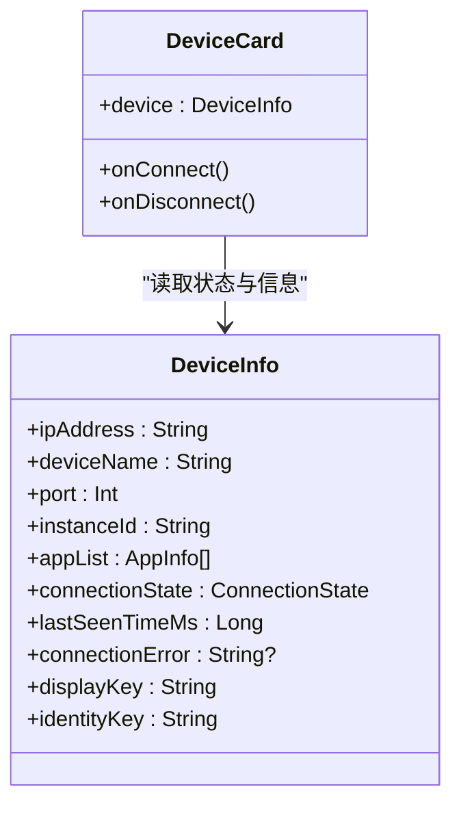
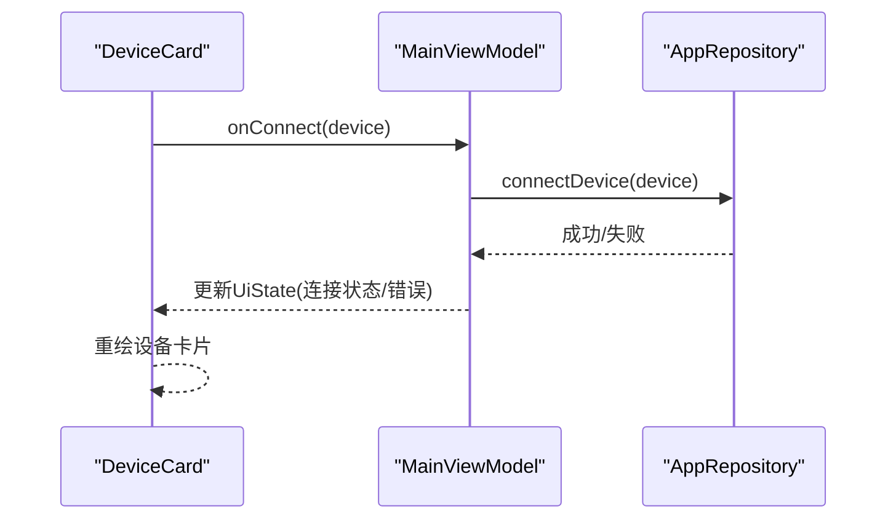
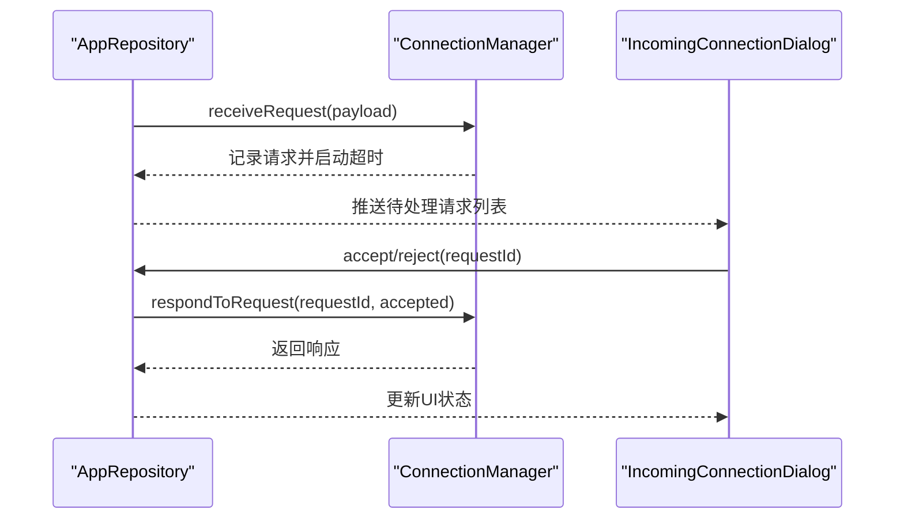
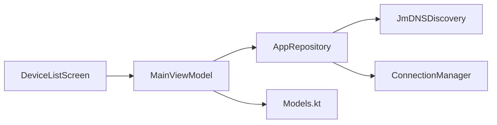

# 设备管理界面

<cite>
**本文引用的文件**
- [DeviceListScreen.kt](file://app/src/main/java/com/lansync/app/ui/components/DeviceListScreen.kt)
- [Models.kt](file://app/src/main/java/com/lansync/app/data/model/Models.kt)
- [ConnectionManager.kt](file://app/src/main/java/com/lansync/app/data/connection/ConnectionManager.kt)
- [MainViewModel.kt](file://app/src/main/java/com/lansync/app/ui/viewmodel/MainViewModel.kt)
- [AppRepository.kt](file://app/src/main/java/com/lansync/app/data/repository/AppRepository.kt)
- [JmDNSDiscovery.kt](file://app/src/main/java/com/lansync/app/data/discovery/JmDNSDiscovery.kt)
- [IncomingConnectionDialog.kt](file://app/src/main/java/com/lansync/app/ui/components/IncomingConnectionDialog.kt)
- [Theme.kt](file://app/src/main/java/com/lansync/app/ui/theme/Theme.kt)
</cite>

## 目录
1. [简介](#简介)
2. [项目结构](#项目结构)
3. [核心组件](#核心组件)
4. [架构总览](#架构总览)
5. [详细组件分析](#详细组件分析)
6. [依赖关系分析](#依赖关系分析)
7. [性能考量](#性能考量)
8. [故障排查指南](#故障排查指南)
9. [结论](#结论)
10. [附录：自定义与最佳实践](#附录自定义与最佳实践)

## 简介
本文件聚焦于LanSync设备的“设备管理界面”，围绕DeviceListScreen组件展开，系统阐述设备列表展示、连接状态管理、设备卡片渲染与状态卡片功能。文档同时覆盖设备发现状态的可视化反馈（已发现、连接中、已连接、错误等）、设备卡片的交互逻辑（连接/断开、刷新、错误处理），以及StatusCard如何显示服务运行状态、端口信息与操作进度。文末提供响应式设计与Material Design 3的最佳实践建议，并给出可操作的自定义指引路径。

## 项目结构
设备管理界面由UI层（Compose组件）与数据/业务层（ViewModel、Repository、Discovery、ConnectionManager）协作完成。整体组织方式采用分层架构：
- UI层：DeviceListScreen、StatusCard、DeviceCard、IncomingConnectionDialog
- 状态与流程：MainViewModel聚合UI状态与用户操作
- 数据与网络：AppRepository协调发现、连接、心跳、同步；JmDNSDiscovery负责局域网设备发现；ConnectionManager处理入站连接请求与超时

图表来源
- [DeviceListScreen.kt:20-152](file://app/src/main/java/com/lansync/app/ui/components/DeviceListScreen.kt#L20-L152)
- [MainViewModel.kt:22-45](file://app/src/main/java/com/lansync/app/ui/viewmodel/MainViewModel.kt#L22-L45)
- [AppRepository.kt:40-79](file://app/src/main/java/com/lansync/app/data/repository/AppRepository.kt#L40-L79)
- [JmDNSDiscovery.kt:23-34](file://app/src/main/java/com/lansync/app/data/discovery/JmDNSDiscovery.kt#L23-L34)
- [ConnectionManager.kt:19-27](file://app/src/main/java/com/lansync/app/data/connection/ConnectionManager.kt#L19-L27)

章节来源
- [DeviceListScreen.kt:20-152](file://app/src/main/java/com/lansync/app/ui/components/DeviceListScreen.kt#L20-L152)
- [MainViewModel.kt:22-45](file://app/src/main/java/com/lansync/app/ui/viewmodel/MainViewModel.kt#L22-L45)

## 核心组件
- DeviceListScreen：组合状态卡片与设备列表，统一处理错误提示、刷新按钮、空态提示与设备卡片渲染。
- StatusCard：展示服务运行状态、端口信息、启动/停止进度与强制启动入口。
- DeviceCard：按设备连接状态差异化渲染图标、标签、状态文本与操作按钮。
- IncomingConnectionDialog：处理入站连接请求的倒计时与接受/拒绝交互。
- MainViewModel：维护UiState，桥接UI事件到Repository，管理连接、刷新、批量更新等流程。
- AppRepository：封装设备发现、连接、心跳、同步、下载与安装等核心能力，暴露StateFlow供UI消费。
- JmDNSDiscovery：基于JmDNS进行局域网服务广播与监听，产出设备发现流。
- ConnectionManager：集中管理入站连接请求、超时、状态查询与清理。

章节来源
- [DeviceListScreen.kt:20-423](file://app/src/main/java/com/lansync/app/ui/components/DeviceListScreen.kt#L20-L423)
- [MainViewModel.kt:47-124](file://app/src/main/java/com/lansync/app/ui/viewmodel/MainViewModel.kt#L47-L124)
- [AppRepository.kt:40-79](file://app/src/main/java/com/lansync/app/data/repository/AppRepository.kt#L40-L79)
- [JmDNSDiscovery.kt:23-34](file://app/src/main/java/com/lansync/app/data/discovery/JmDNSDiscovery.kt#L23-L34)
- [ConnectionManager.kt:19-27](file://app/src/main/java/com/lansync/app/data/connection/ConnectionManager.kt#L19-L27)

## 架构总览
设备管理界面的数据流遵循单向数据流：
- UI通过回调将用户操作传递给MainViewModel
- ViewModel调用AppRepository执行具体业务（连接、刷新、扫描、下载等）
- Repository通过JmDNSDiscovery发现设备，通过ConnectionManager处理入站请求，并通过StateFlow将状态推回UI
- UI根据StateFlow变化重绘，呈现设备列表、状态卡片与对话框

图表来源
- [DeviceListScreen.kt:141-148](file://app/src/main/java/com/lansync/app/ui/components/DeviceListScreen.kt#L141-L148)
- [MainViewModel.kt:162-180](file://app/src/main/java/com/lansync/app/ui/viewmodel/MainViewModel.kt#L162-L180)
- [AppRepository.kt:386-420](file://app/src/main/java/com/lansync/app/data/repository/AppRepository.kt#L386-L420)
- [JmDNSDiscovery.kt:60-86](file://app/src/main/java/com/lansync/app/data/discovery/JmDNSDiscovery.kt#L60-L86)
- [ConnectionManager.kt:29-56](file://app/src/main/java/com/lansync/app/data/connection/ConnectionManager.kt#L29-L56)

## 详细组件分析

### DeviceListScreen：设备列表与状态卡片
- 设备列表展示：当设备列表为空时，根据服务是否运行显示“正在搜索设备...”或“服务未启动”的空态提示；非空时使用LazyColumn渲染设备卡片。
- 连接状态管理：顶部StatusCard展示服务运行状态、端口、启动/停止进度；中部可能显示连接错误提示卡片，支持关闭。
- 设备卡片渲染：每个设备对应一个DeviceCard，根据连接状态动态改变容器颜色、图标、状态文本与按钮行为。
- 刷新机制：提供刷新按钮触发onRefresh，通常用于拉取远程应用列表或重新扫描。

图表来源
- [DeviceListScreen.kt:112-150](file://app/src/main/java/com/lansync/app/ui/components/DeviceListScreen.kt#L112-L150)
- [DeviceListScreen.kt:243-422](file://app/src/main/java/com/lansync/app/ui/components/DeviceListScreen.kt#L243-L422)

章节来源
- [DeviceListScreen.kt:20-152](file://app/src/main/java/com/lansync/app/ui/components/DeviceListScreen.kt#L20-L152)
- [DeviceListScreen.kt:243-422](file://app/src/main/java/com/lansync/app/ui/components/DeviceListScreen.kt#L243-L422)

### StatusCard：服务运行状态、端口与操作进度
- 运行状态：以开关切换服务启停，并在启停过程中显示进度条与操作消息。
- 端口信息：服务运行时显示当前端口号。
- 强制启动：当处于扫描应用阶段且服务未运行时，提供“强制启动同步”按钮。
- 视觉反馈：使用主题色容器与图标区分运行/停止状态，提升可读性。

图表来源
- [DeviceListScreen.kt:155-240](file://app/src/main/java/com/lansync/app/ui/components/DeviceListScreen.kt#L155-L240)

章节来源
- [DeviceListScreen.kt:155-240](file://app/src/main/java/com/lansync/app/ui/components/DeviceListScreen.kt#L155-L240)

### DeviceCard：设备卡片交互与状态可视化
- 状态映射：根据ConnectionState决定容器颜色、状态文本、状态颜色与图标。
- 交互逻辑：
  - 已发现/已断开/错误/超时：显示“连接”按钮
  - 连接中/重连中：禁用连接按钮并显示进度
  - 已连接：显示“断开”按钮
- 在线标识：已连接时显示“在线”标签。
- 错误提示：错误与超时状态使用错误色与警告图标。

图表来源
- [DeviceListScreen.kt:243-422](file://app/src/main/java/com/lansync/app/ui/components/DeviceListScreen.kt#L243-L422)
- [Models.kt:19-45](file://app/src/main/java/com/lansync/app/data/model/Models.kt#L19-L45)

章节来源
- [DeviceListScreen.kt:243-422](file://app/src/main/java/com/lansync/app/ui/components/DeviceListScreen.kt#L243-L422)
- [Models.kt:19-45](file://app/src/main/java/com/lansync/app/data/model/Models.kt#L19-L45)

### 设备发现状态可视化
- 已发现：卡片背景为surface，状态文本提示“已发现 - 点击连接”。
- 连接中/重连中：卡片背景为tertiaryContainer，显示进度指示器与“正在连接.../正在尝试重新连接...”。
- 已连接：卡片背景为primaryContainer，显示“已连接 (N个应用)”与“在线”标签。
- 错误/超时：卡片背景为errorContainer，显示错误图标与错误信息。

章节来源
- [DeviceListScreen.kt:251-279](file://app/src/main/java/com/lansync/app/ui/components/DeviceListScreen.kt#L251-L279)

### 设备连接/断开与刷新机制
- 连接：点击“连接”后，UI回调至ViewModel的connectDevice，ViewModel调用Repository执行连接，成功后设备状态变为CONNECTED并启动心跳与定时同步。
- 断开：点击“断开”后，ViewModel调用disconnectDevice，Repository停止心跳与同步，并将设备状态置为DISCONNECTED。
- 刷新：点击刷新按钮触发refreshDevices或refreshConnectedDevice，拉取远程应用列表或更新设备信息。

图表来源
- [DeviceListScreen.kt:141-148](file://app/src/main/java/com/lansync/app/ui/components/DeviceListScreen.kt#L141-L148)
- [MainViewModel.kt:162-180](file://app/src/main/java/com/lansync/app/ui/viewmodel/MainViewModel.kt#L162-L180)
- [AppRepository.kt:386-420](file://app/src/main/java/com/lansync/app/data/repository/AppRepository.kt#L386-L420)

章节来源
- [MainViewModel.kt:162-180](file://app/src/main/java/com/lansync/app/ui/viewmodel/MainViewModel.kt#L162-L180)
- [AppRepository.kt:386-420](file://app/src/main/java/com/lansync/app/data/repository/AppRepository.kt#L386-L420)

### 入站连接请求与倒计时
- 收到请求：ConnectionManager接收入站请求并设置超时任务，UI通过IncomingConnectionDialog展示请求详情与剩余时间。
- 自动拒绝：倒计时结束后自动拒绝请求，并更新状态。
- 接受/拒绝：用户选择后，ViewModel调用Repository处理请求，若接受则建立连接并启动心跳与同步。

图表来源
- [ConnectionManager.kt:29-56](file://app/src/main/java/com/lansync/app/data/connection/ConnectionManager.kt#L29-L56)
- [IncomingConnectionDialog.kt:17-100](file://app/src/main/java/com/lansync/app/ui/components/IncomingConnectionDialog.kt#L17-L100)
- [AppRepository.kt:508-554](file://app/src/main/java/com/lansync/app/data/repository/AppRepository.kt#L508-L554)

章节来源
- [IncomingConnectionDialog.kt:17-100](file://app/src/main/java/com/lansync/app/ui/components/IncomingConnectionDialog.kt#L17-L100)
- [ConnectionManager.kt:29-56](file://app/src/main/java/com/lansync/app/data/connection/ConnectionManager.kt#L29-L56)
- [AppRepository.kt:508-554](file://app/src/main/java/com/lansync/app/data/repository/AppRepository.kt#L508-L554)

## 依赖关系分析
- UI与状态：DeviceListScreen依赖MainViewModel提供的UiState；StatusCard与DeviceCard通过回调与ViewModel交互。
- 状态与数据：MainViewModel订阅AppRepository的多路StateFlow，合并为UiState。
- 数据与网络：AppRepository组合JmDNSDiscovery（设备发现）、ConnectionManager（入站请求）、KtorServer（服务端通信）等。
- 设备模型：DeviceInfo与ConnectionState贯穿UI与数据层，作为状态与信息的载体。

图表来源
- [DeviceListScreen.kt:20-152](file://app/src/main/java/com/lansync/app/ui/components/DeviceListScreen.kt#L20-L152)
- [MainViewModel.kt:22-45](file://app/src/main/java/com/lansync/app/ui/viewmodel/MainViewModel.kt#L22-L45)
- [AppRepository.kt:40-79](file://app/src/main/java/com/lansync/app/data/repository/AppRepository.kt#L40-L79)
- [Models.kt:19-45](file://app/src/main/java/com/lansync/app/data/model/Models.kt#L19-L45)

章节来源
- [MainViewModel.kt:22-45](file://app/src/main/java/com/lansync/app/ui/viewmodel/MainViewModel.kt#L22-L45)
- [AppRepository.kt:40-79](file://app/src/main/java/com/lansync/app/data/repository/AppRepository.kt#L40-L79)

## 性能考量
- 列表渲染：使用LazyColumn避免全量渲染，提高长列表性能。
- 状态更新：通过StateFlow与combine减少不必要的重组，仅在必要字段变化时更新UI。
- 心跳与同步：为每个连接设备启动独立Job，避免阻塞主流程；失败计数与恢复逻辑降低频繁重试带来的开销。
- 发现优化：JmDNSDiscovery使用实例ID去重本地设备，避免重复添加；多播锁确保组播包收发。
- 内存管理：及时取消Job与释放资源（如MulticastLock），防止内存泄漏。

[本节为通用性能指导，不直接分析具体代码行]

## 故障排查指南
- 连接失败：检查UiState中的connectionError，确认设备可达性与端口配置；查看日志输出定位异常原因。
- 连接超时：确认设备是否在局域网内、防火墙是否放行；检查心跳失败计数与恢复逻辑。
- 设备未出现：确认服务已启动且JmDNSDiscovery已注册服务；检查多播锁获取与服务广播是否正常。
- 入站请求无响应：检查ConnectionManager超时任务是否被正确取消；确认请求状态是否被更新。
- 服务启停卡顿：观察isStarting/isStopping与operationMessage，确认后台任务是否完成。

章节来源
- [MainViewModel.kt:126-156](file://app/src/main/java/com/lansync/app/ui/viewmodel/MainViewModel.kt#L126-L156)
- [ConnectionManager.kt:132-147](file://app/src/main/java/com/lansync/app/data/connection/ConnectionManager.kt#L132-L147)
- [JmDNSDiscovery.kt:60-86](file://app/src/main/java/com/lansync/app/data/discovery/JmDNSDiscovery.kt#L60-L86)

## 结论
DeviceListScreen通过清晰的组件拆分与状态驱动渲染，实现了设备列表的直观展示与交互。StatusCard与DeviceCard分别承担服务状态与设备状态的双重职责，配合MainViewModel与AppRepository形成稳定的数据流。结合JmDNSDiscovery与ConnectionManager，系统在局域网环境下具备可靠的设备发现与连接管理能力。遵循Material Design 3与响应式设计原则，界面在不同屏幕尺寸下具备良好的可读性与可用性。

[本节为总结性内容，不直接分析具体代码行]

## 附录：自定义与最佳实践

### 自定义设备卡片样式
- 容器颜色与阴影：根据ConnectionState调整cardColors与elevation，突出已连接设备。
- 图标与标签：为不同状态配置专属图标与“在线”标签，提升状态辨识度。
- 文本溢出：对设备名与IP:Port使用TextOverflow.Ellipsis，保证在小屏上的可读性。

参考路径
- [DeviceListScreen.kt:251-284](file://app/src/main/java/com/lansync/app/ui/components/DeviceListScreen.kt#L251-L284)
- [DeviceListScreen.kt:322-371](file://app/src/main/java/com/lansync/app/ui/components/DeviceListScreen.kt#L322-L371)

### 处理设备连接事件
- 在DeviceListScreen中绑定onConnect/onDisconnect回调至ViewModel方法。
- ViewModel中捕获异常并设置connectionError，UI层展示错误卡片并提供关闭入口。
- 连接成功后，Repository启动心跳与定时同步，保持设备状态最新。

参考路径
- [DeviceListScreen.kt:141-148](file://app/src/main/java/com/lansync/app/ui/components/DeviceListScreen.kt#L141-L148)
- [MainViewModel.kt:162-180](file://app/src/main/java/com/lansync/app/ui/viewmodel/MainViewModel.kt#L162-L180)
- [AppRepository.kt:134-172](file://app/src/main/java/com/lansync/app/data/repository/AppRepository.kt#L134-L172)

### 响应式设计与Material Design 3最佳实践
- 主题与色彩：使用MaterialTheme.colorScheme统一管理颜色，适配深色模式与动态色彩。
- 排版与间距：使用Typography与dp单位保持一致的视觉节奏。
- 布局策略：使用Column/Row与Spacer控制垂直与水平间距，确保在不同屏幕尺寸下的良好表现。
- 可访问性：为Icon与按钮提供contentDescription，便于读屏器识别。

参考路径
- [Theme.kt:40-75](file://app/src/main/java/com/lansync/app/ui/theme/Theme.kt#L40-L75)
- [DeviceListScreen.kt:38-54](file://app/src/main/java/com/lansync/app/ui/components/DeviceListScreen.kt#L38-L54)