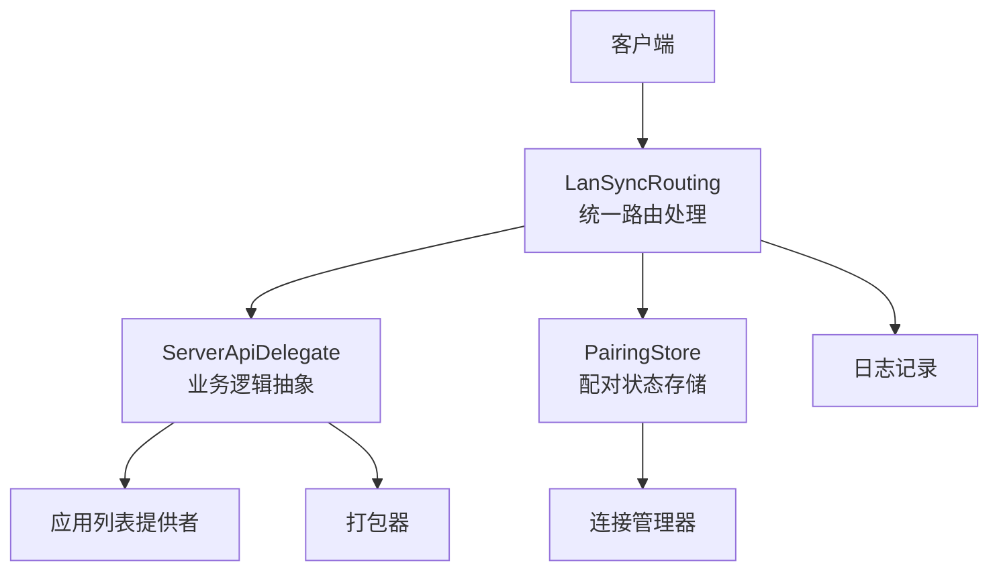
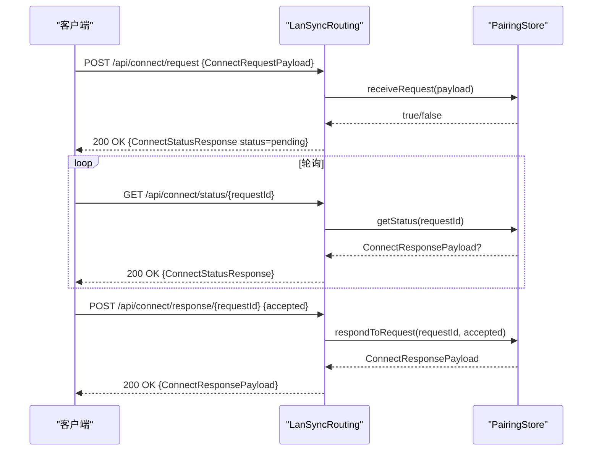
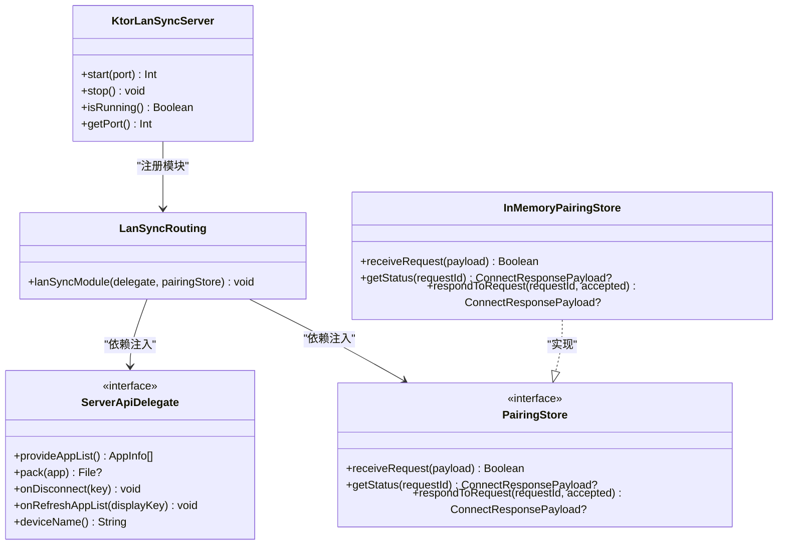

# HTTP RESTful API

<cite>
**本文引用的文件**
- [LanSyncRouting.kt](file://app/src/main/java/com/lansync/app/data/server/LanSyncRouting.kt)
- [KtorServer.kt](file://app/src/main/java/com/lansync/app/data/server/KtorServer.kt)
- [Models.kt](file://app/src/main/java/com/lansync/app/data/model/Models.kt)
- [ConnectionManager.kt](file://app/src/main/java/com/lansync/app/data/connection/ConnectionManager.kt)
- [InMemoryPairingStore.kt](file://app/src/main/java/com/lansync/app/data/server/InMemoryPairingStore.kt)
- [ServerContracts.kt](file://app/src/main/java/com/lansync/app/data/server/ServerContracts.kt)
- [LanSyncError.kt](file://app/src/main/java/com/lansync/app/data/model/LanSyncError.kt)
- [KtorLanSyncServer.kt](file://app/src/main/java/com/lansync/app/data/server/KtorLanSyncServer.kt)
</cite>

## 更新摘要
**所做更改**
- 更新了所有API端点的实现细节，基于新的LanSyncRouting.kt实现
- 增强了错误处理机制，使用结构化的LanSyncErrorDto响应
- 改进了下载端点的错误优先级处理逻辑
- 更新了连接管理器的状态机实现
- 添加了新的服务器架构组件说明

## 目录
1. [简介](#简介)
2. [项目结构](#项目结构)
3. [核心组件](#核心组件)
4. [架构总览](#架构总览)
5. [详细端点说明](#详细端点说明)
6. [依赖关系分析](#依赖关系分析)
7. [性能与可靠性](#性能与可靠性)
8. [故障排查指南](#故障排查指南)
9. [结论](#结论)
10. [附录：数据模型与版本策略](#附录数据模型与版本策略)

## 简介
本文件为 LanSync 的 HTTP RESTful API 文档，覆盖所有已实现的端点：GET /api/ping、GET /api/applist、POST /api/connect/request、GET /api/connect/status/{requestId}、POST /api/connect/response/{requestId}、GET /api/download/{packageName}、GET /api/download/{packageName}/{versionCode}、POST /api/disconnect、POST /api/refresh-applist、GET /api/deviceinfo。文档包含每个端点的用途、URL模式、HTTP方法、请求参数、响应格式、状态码、错误处理、认证方式、示例以及调试建议。

**更新** 基于最新的LanSyncRouting.kt实现，所有端点现在都遵循统一的错误处理规范和JSON序列化配置。

## 项目结构
LanSync 使用 Ktor 在 Android 上提供本地 HTTP 服务。新的架构采用模块化设计，将路由定义集中在独立的模块中，通过依赖注入解耦业务逻辑。

**图表来源**
- [LanSyncRouting.kt:49-253](file://app/src/main/java/com/lansync/app/data/server/LanSyncRouting.kt#L49-L253)
- [ServerContracts.kt:31-46](file://app/src/main/java/com/lansync/app/data/server/ServerContracts.kt#L31-L46)
- [ServerContracts.kt:58-67](file://app/src/main/java/com/lansync/app/data/server/ServerContracts.kt#L58-L67)

**章节来源**
- [LanSyncRouting.kt:49-253](file://app/src/main/java/com/lansync/app/data/server/LanSyncRouting.kt#L49-L253)
- [KtorLanSyncServer.kt:16-44](file://app/src/main/java/com/lansync/app/data/server/KtorLanSyncServer.kt#L16-L44)

## 核心组件
- **LanSyncRouting**: 统一的路由处理器，提供标准化的JSON配置和错误处理
- **ServerApiDelegate**: 业务逻辑抽象接口，解耦路由与具体实现
- **PairingStore**: 配对协议状态存储接口，支持内存和连接管理器两种实现
- **KtorLanSyncServer**: 现代化的服务器实现，支持依赖注入和测试友好性
- **InMemoryPairingStore**: 内存实现的配对状态存储，用于测试和简单场景

**章节来源**
- [LanSyncRouting.kt:28-48](file://app/src/main/java/com/lansync/app/data/server/LanSyncRouting.kt#L28-L48)
- [ServerContracts.kt:31-46](file://app/src/main/java/com/lansync/app/data/server/ServerContracts.kt#L31-L46)
- [ServerContracts.kt:58-67](file://app/src/main/java/com/lansync/app/data/server/ServerContracts.kt#L58-L67)
- [InMemoryPairingStore.kt:24-27](file://app/src/main/java/com/lansync/app/data/server/InMemoryPairingStore.kt#L24-L27)

## 架构总览
下图展示了典型"发起连接"流程，基于新的模块化架构：

**图表来源**
- [LanSyncRouting.kt:70-160](file://app/src/main/java/com/lansync/app/data/server/LanSyncRouting.kt#L70-L160)
- [InMemoryPairingStore.kt:32-93](file://app/src/main/java/com/lansync/app/data/server/InMemoryPairingStore.kt#L32-L93)

## 详细端点说明

### GET /api/ping
- **功能**: 健康检查
- **URL**: /api/ping
- **方法**: GET
- **请求体**: 无
- **响应体**: GenericStatusResponse
- **状态码**: 200
- **错误**: 无
- **认证**: 无

**章节来源**
- [LanSyncRouting.kt:53-56](file://app/src/main/java/com/lansync/app/data/server/LanSyncRouting.kt#L53-L56)
- [Models.kt:124-127](file://app/src/main/java/com/lansync/app/data/model/Models.kt#L124-L127)

### GET /api/applist
- **功能**: 获取本机已安装应用的列表
- **URL**: /api/applist
- **方法**: GET
- **请求体**: 无
- **响应体**: List<AppInfo>
- **状态码**: 200
- **错误**: 无
- **认证**: 无

**更新** 现在通过ServerApiDelegate抽象层获取应用列表，提供更好的可测试性。

**章节来源**
- [LanSyncRouting.kt:58-63](file://app/src/main/java/com/lansync/app/data/server/LanSyncRouting.kt#L58-L63)
- [Models.kt:5-17](file://app/src/main/java/com/lansync/app/data/model/Models.kt#L5-L17)

### POST /api/connect/request
- **功能**: 发起连接请求
- **URL**: /api/connect/request
- **方法**: POST
- **请求体**: ConnectRequestPayload
- **响应体**: ConnectStatusResponse（status=pending）或 LanSyncErrorDto
- **状态码**:
  - 200：请求已接收
  - 409：重复请求（同一 requestId）
  - 400：请求无效或解析失败
- **错误处理**: 异常时返回结构化错误响应
- **认证**: 无

**更新** 现在使用统一的LanSyncErrorDto错误响应格式，提供更一致的错误处理。

**章节来源**
- [LanSyncRouting.kt:70-91](file://app/src/main/java/com/lansync/app/data/server/LanSyncRouting.kt#L70-L91)
- [LanSyncError.kt:46-55](file://app/src/main/java/com/lansync/app/data/model/LanSyncError.kt#L46-L55)

### GET /api/connect/status/{requestId}
- **功能**: 查询连接请求的处理状态
- **URL**: /api/connect/status/{requestId}
- **方法**: GET
- **路径参数**: requestId（字符串）
- **响应体**: ConnectStatusResponse
- **状态码**: 200
- **行为**:
  - 若请求不存在或仍在等待：返回 pending
  - 若已处理：返回 accepted 或 rejected，并附带 responderName 与 message
- **错误处理**: 异常时返回 pending（失败安全）
- **认证**: 无

**更新** 现在具有更好的错误处理和空值安全检查。

**章节来源**
- [LanSyncRouting.kt:93-120](file://app/src/main/java/com/lansync/app/data/server/LanSyncRouting.kt#L93-L120)
- [Models.kt:110-116](file://app/src/main/java/com/lansync/app/data/model/Models.kt#L110-L116)

### POST /api/connect/response/{requestId}
- **功能**: 对连接请求进行接受或拒绝
- **URL**: /api/connect/response/{requestId}
- **方法**: POST
- **路径参数**: requestId（字符串）
- **请求体**: ConnectResponseBody（accepted: boolean）
- **响应体**: ConnectResponsePayload 或 LanSyncErrorDto
- **状态码**:
  - 200：成功响应
  - 404：请求不存在或已被处理
  - 400：请求无效（缺少参数或解析失败）
  - 500：内部错误
- **认证**: 无

**更新** 现在使用结构化错误响应，提供更好的错误信息。

**章节来源**
- [LanSyncRouting.kt:122-160](file://app/src/main/java/com/lansync/app/data/server/LanSyncRouting.kt#L122-L160)
- [Models.kt:79-85](file://app/src/main/java/com/lansync/app/data/model/Models.kt#L79-L85)

### GET /api/download/{packageName}
- **功能**: 下载指定包名的最新版本（仅可提取的应用）
- **URL**: /api/download/{packageName}
- **方法**: GET
- **路径参数**: packageName（字符串）
- **响应**: ZIP/APK 二进制流
- **响应头**:
  - X-MD5：打包文件的 MD5
  - X-File-Size：文件大小
  - Content-Disposition：attachment; filename="..."
- **状态码**:
  - 200：成功下载
  - 403：系统/受保护应用不可提取
  - 404：未找到匹配应用
  - 500：打包失败或异常
- **认证**: 无

**更新** 改进了错误优先级处理：先检查是否完全不可提取(403)，再检查是否有可用版本(404)。

**章节来源**
- [LanSyncRouting.kt:162-188](file://app/src/main/java/com/lansync/app/data/server/LanSyncRouting.kt#L162-L188)
- [LanSyncRouting.kt:261-299](file://app/src/main/java/com/lansync/app/data/server/LanSyncRouting.kt#L261-L299)

### GET /api/download/{packageName}/{versionCode}
- **功能**: 下载指定包名与版本号的精确版本（仅可提取的应用）
- **URL**: /api/download/{packageName}/{versionCode}
- **方法**: GET
- **路径参数**: packageName（字符串）、versionCode（长整型）
- **响应**: ZIP/APK 二进制流（同上）
- **状态码**:
  - 200：成功下载
  - 403：系统/受保护应用不可提取
  - 404：未找到该版本应用
  - 500：打包失败或异常
- **认证**: 无

**更新** 改进了错误优先级处理：先检查是否有匹配应用(404)，再检查是否可提取(403)。

**章节来源**
- [LanSyncRouting.kt:190-215](file://app/src/main/java/com/lansync/app/data/server/LanSyncRouting.kt#L190-L215)
- [LanSyncRouting.kt:261-299](file://app/src/main/java/com/lansync/app/data/server/LanSyncRouting.kt#L261-L299)

### POST /api/disconnect
- **功能**: 断开与某设备的连接
- **URL**: /api/disconnect
- **方法**: POST
- **请求体**: DisconnectPayload（displayKey, identityKey）
- **响应体**: GenericStatusResponse
- **状态码**:
  - 200：成功
  - 400：请求无效
- **认证**: 无

**更新** 现在通过ServerApiDelegate抽象层处理断开连接，提供更好的可测试性。

**章节来源**
- [LanSyncRouting.kt:217-233](file://app/src/main/java/com/lansync/app/data/server/LanSyncRouting.kt#L217-L233)
- [Models.kt:104-107](file://app/src/main/java/com/lansync/app/data/model/Models.kt#L104-L107)

### POST /api/refresh-applist
- **功能**: 触发远端设备刷新应用列表
- **URL**: /api/refresh-applist
- **方法**: POST
- **请求体**: RefreshAppListPayload（displayKey）
- **响应体**: GenericStatusResponse
- **状态码**:
  - 200：成功
  - 400：请求无效
- **认证**: 无

**更新** 现在通过ServerApiDelegate抽象层处理应用列表刷新，提供更好的可测试性。

**章节来源**
- [LanSyncRouting.kt:235-251](file://app/src/main/java/com/lansync/app/data/server/LanSyncRouting.kt#L235-L251)
- [Models.kt:134-137](file://app/src/main/java/com/lansync/app/data/model/Models.kt#L134-L137)

### GET /api/deviceinfo
- **功能**: 获取本机设备信息（名称与版本号）
- **URL**: /api/deviceinfo
- **方法**: GET
- **响应体**: DeviceInfoResponse
- **状态码**: 200
- **认证**: 无

**更新** 现在通过ServerApiDelegate抽象层获取设备信息，提供更好的可测试性。

**章节来源**
- [LanSyncRouting.kt:65-68](file://app/src/main/java/com/lansync/app/data/server/LanSyncRouting.kt#L65-L68)
- [Models.kt:118-122](file://app/src/main/java/com/lansync/app/data/model/Models.kt#L118-L122)

## 依赖关系分析
新的架构采用了清晰的依赖注入模式：

**图表来源**
- [LanSyncRouting.kt:49-50](file://app/src/main/java/com/lansync/app/data/server/LanSyncRouting.kt#L49-L50)
- [ServerContracts.kt:31-46](file://app/src/main/java/com/lansync/app/data/server/ServerContracts.kt#L31-L46)
- [ServerContracts.kt:58-67](file://app/src/main/java/com/lansync/app/data/server/ServerContracts.kt#L58-L67)
- [InMemoryPairingStore.kt:24-27](file://app/src/main/java/com/lansync/app/data/server/InMemoryPairingStore.kt#L24-L27)
- [KtorLanSyncServer.kt:16-19](file://app/src/main/java/com/lansync/app/data/server/KtorLanSyncServer.kt#L16-L19)

**章节来源**
- [LanSyncRouting.kt:49-253](file://app/src/main/java/com/lansync/app/data/server/LanSyncRouting.kt#L49-L253)
- [ServerContracts.kt:31-67](file://app/src/main/java/com/lansync/app/data/server/ServerContracts.kt#L31-L67)
- [InMemoryPairingStore.kt:24-120](file://app/src/main/java/com/lansync/app/data/server/InMemoryPairingStore.kt#L24-L120)

## 性能与可靠性
- **连接请求超时**: 默认 15 秒自动拒绝，避免悬挂请求
- **轮询间隔**: 建议客户端按 500ms 左右轮询状态，避免过度请求
- **下载流式传输**: 大文件采用流式输出，降低内存占用
- **重试与节流**: 应用列表拉取支持最大重试次数与延迟，提升弱网稳定性
- **忽略未知字段**: JSON 解析忽略未知键，增强向后兼容
- **结构化错误处理**: 统一的错误响应格式，便于客户端错误处理

**更新** 新的架构提供了更好的错误处理和资源管理机制。

**章节来源**
- [InMemoryPairingStore.kt:115-118](file://app/src/main/java/com/lansync/app/data/server/InMemoryPairingStore.kt#L115-L118)
- [LanSyncRouting.kt:32-36](file://app/src/main/java/com/lansync/app/data/server/LanSyncRouting.kt#L32-L36)
- [LanSyncRouting.kt:261-299](file://app/src/main/java/com/lansync/app/data/server/LanSyncRouting.kt#L261-L299)

## 故障排查指南
- **连接请求被拒绝（409）**: 检查是否重复发送相同 requestId
- **服务未就绪**: 确认依赖注入正确配置且服务已启动
- **下载失败（403/404/500）**:
  - 403：目标应用为系统/受保护应用，无法提取
  - 404：包名或版本不匹配
  - 500：打包过程异常，查看服务端日志
- **状态查询始终 pending**: 检查请求是否超时或被拒绝；确认 requestId 正确
- **网络问题**: 使用 curl 或浏览器测试 /api/ping 与服务可达性；检查防火墙与端口
- **错误响应格式**: 现在所有错误都返回结构化的 LanSyncErrorDto，便于客户端解析

**更新** 新增了结构化错误响应的故障排查指导。

**章节来源**
- [LanSyncRouting.kt:70-160](file://app/src/main/java/com/lansync/app/data/server/LanSyncRouting.kt#L70-L160)
- [LanSyncRouting.kt:162-215](file://app/src/main/java/com/lansync/app/data/server/LanSyncRouting.kt#L162-L215)
- [LanSyncError.kt:14-38](file://app/src/main/java/com/lansync/app/data/model/LanSyncError.kt#L14-L38)

## 结论
LanSync 的新版 HTTP API 通过模块化设计和依赖注入，提供了更加健壮和可测试的架构。统一的错误处理机制和结构化的响应格式提升了开发体验。通过明确的状态机与超时机制，确保连接流程可靠；通过流式下载与忽略未知字段，兼顾性能与兼容性。建议在客户端侧做好重试、超时与幂等控制，以获得更稳定的体验。

**更新** 新架构提供了更好的可测试性和维护性，同时保持了向后兼容性。

## 附录：数据模型与版本策略

### 数据模型
- **AppInfo**: 应用基本信息与可提取标记
- **DeviceInfo**: 设备标识与连接状态
- **ConnectRequestPayload**: 连接请求体
- **ConnectResponseBody**: 连接响应体
- **ConnectStatusResponse**: 连接状态查询响应
- **DeviceInfoResponse**: 设备信息响应
- **GenericStatusResponse**: 通用状态响应
- **DisconnectPayload**: 断开连接请求体
- **RefreshAppListPayload**: 刷新应用列表请求体
- **LanSyncErrorDto**: 统一错误响应体

**更新** 新增了LanSyncErrorDto作为统一的错误响应格式。

**章节来源**
- [Models.kt:5-138](file://app/src/main/java/com/lansync/app/data/model/Models.kt#L5-L138)
- [LanSyncError.kt:46-55](file://app/src/main/java/com/lansync/app/data/model/LanSyncError.kt#L46-L55)

### 版本控制与向后兼容
- **当前设备信息中包含 version 字段**: 可用于客户端能力判断
- **JSON 解析启用忽略未知字段**: 便于未来扩展新字段而不破坏旧客户端
- **下载接口同时支持按包名（最新）与按包名+版本号（精确）**: 满足新旧客户端差异
- **统一错误响应格式**: 所有错误现在都返回结构化的 LanSyncErrorDto，提升错误处理一致性

**更新** 新版本引入了统一的错误处理机制，提升了API的一致性和可维护性。

**章节来源**
- [LanSyncRouting.kt:32-36](file://app/src/main/java/com/lansync/app/data/server/LanSyncRouting.kt#L32-L36)
- [Models.kt:118-122](file://app/src/main/java/com/lansync/app/data/model/Models.kt#L118-L122)
- [LanSyncRouting.kt:162-215](file://app/src/main/java/com/lansync/app/data/server/LanSyncRouting.kt#L162-L215)
- [LanSyncError.kt:14-38](file://app/src/main/java/com/lansync/app/data/model/LanSyncError.kt#L14-L38)