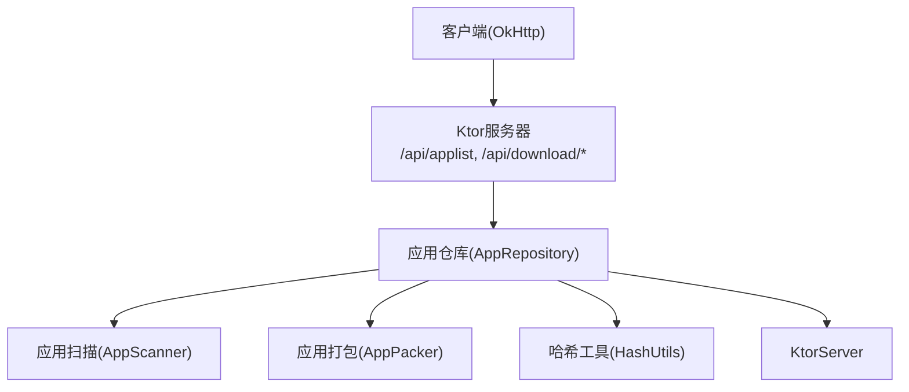
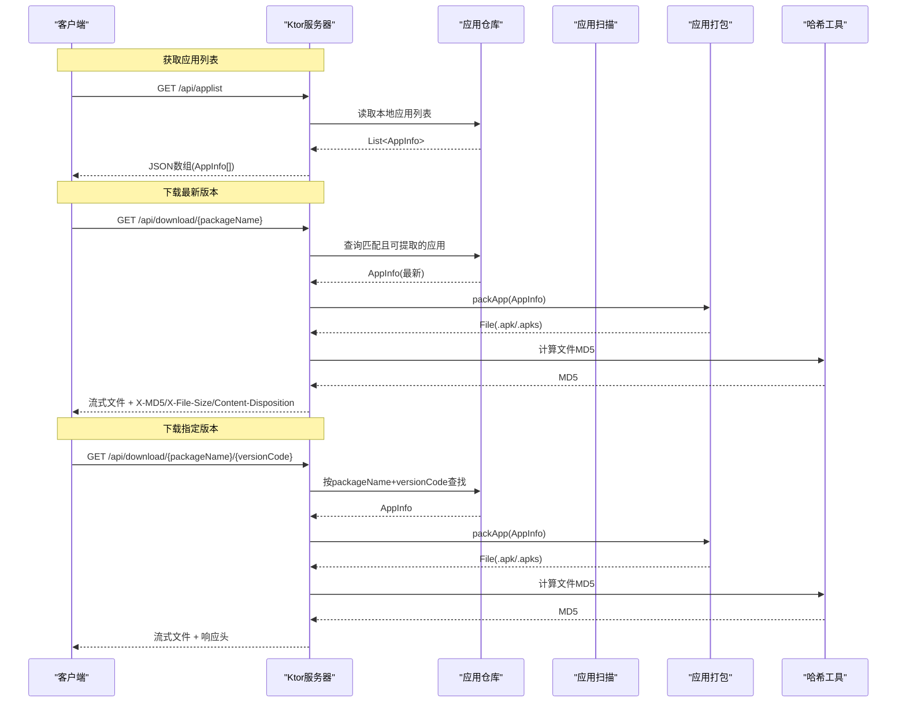
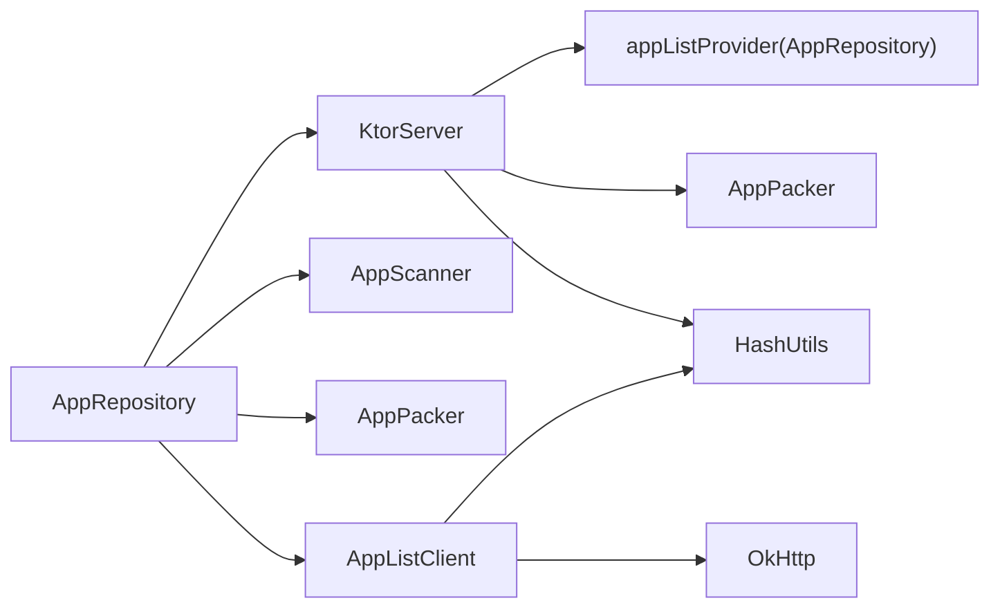

# 应用同步API

<cite>
**本文引用的文件**
- [KtorServer.kt](file://app/src/main/java/com/lansync/app/data/server/KtorServer.kt)
- [Models.kt](file://app/src/main/java/com/lansync/app/data/model/Models.kt)
- [AppRepository.kt](file://app/src/main/java/com/lansync/app/data/repository/AppRepository.kt)
- [AppScanner.kt](file://app/src/main/java/com/lansync/app/data/scanner/AppScanner.kt)
- [AppPacker.kt](file://app/src/main/java/com/lansync/app/data/packer/AppPacker.kt)
- [AppListClient.kt](file://app/src/main/java/com/lansync/app/data/client/AppListClient.kt)
- [HashUtils.kt](file://app/src/main/java/com/lansync/app/data/HashUtils.kt)
</cite>

## 目录
1. [简介](#简介)
2. [项目结构](#项目结构)
3. [核心组件](#核心组件)
4. [架构总览](#架构总览)
5. [详细组件分析](#详细组件分析)
6. [依赖关系分析](#依赖关系分析)
7. [性能考虑](#性能考虑)
8. [故障排查指南](#故障排查指南)
9. [结论](#结论)
10. [附录](#附录)

## 简介
本文件面向LanSync应用的“应用同步API”，聚焦以下能力：
- 获取设备已安装应用列表：GET /api/applist
- 下载指定包名的最新版本安装包：GET /api/download/{packageName}
- 下载指定包名与版本号的安装包：GET /api/download/{packageName}/{versionCode}

文档将详细说明：
- AppInfo数据模型结构与关键字段含义（package name、version code、isExtractable等）
- 应用列表响应格式与字段说明
- 文件下载的响应头与校验机制（X-MD5、Content-Disposition、X-File-Size）
- 应用提取限制与系统应用保护机制
- 大文件传输优化与断点续传实现建议

## 项目结构
LanSync通过Ktor在本地启动HTTP服务，暴露REST接口；通过扫描器收集本地应用信息；通过打包器生成可传输的APK/APKS文件；客户端通过OkHttp调用上述接口完成拉取与应用包下载。

图表来源
- [KtorServer.kt:68-285](file://app/src/main/java/com/lansync/app/data/server/KtorServer.kt#L68-L285)
- [AppRepository.kt:40-49](file://app/src/main/java/com/lansync/app/data/repository/AppRepository.kt#L40-L49)
- [AppScanner.kt:21-47](file://app/src/main/java/com/lansync/app/data/scanner/AppScanner.kt#L21-L47)
- [AppPacker.kt:20-56](file://app/src/main/java/com/lansync/app/data/packer/AppPacker.kt#L20-L56)
- [HashUtils.kt:8-24](file://app/src/main/java/com/lansync/app/data/HashUtils.kt#L8-L24)

章节来源
- [KtorServer.kt:68-285](file://app/src/main/java/com/lansync/app/data/server/KtorServer.kt#L68-L285)
- [AppRepository.kt:40-49](file://app/src/main/java/com/lansync/app/data/repository/AppRepository.kt#L40-L49)

## 核心组件
- KtorServer：提供HTTP路由与响应处理，负责应用列表返回与应用包流式下载。
- AppScanner：扫描已安装应用，构建AppInfo，标记是否可提取(isExtractable)、是否系统应用(isSystemApp)、是否为Split APK(isSplitApk)。
- AppPacker：将单APK或Split APK打包为.apk/.apks文件，写入缓存目录并返回路径。
- AppListClient：客户端侧网络封装，提供拉取应用列表、连接协商、下载APK/APKS及MD5校验。
- Models：定义AppInfo、设备信息、连接状态等数据结构。
- HashUtils：计算文件或路径集合的MD5，用于完整性校验。

章节来源
- [KtorServer.kt:68-285](file://app/src/main/java/com/lansync/app/data/server/KtorServer.kt#L68-L285)
- [AppScanner.kt:21-133](file://app/src/main/java/com/lansync/app/data/scanner/AppScanner.kt#L21-L133)
- [AppPacker.kt:20-114](file://app/src/main/java/com/lansync/app/data/packer/AppPacker.kt#L20-L114)
- [AppListClient.kt:30-571](file://app/src/main/java/com/lansync/app/data/client/AppListClient.kt#L30-L571)
- [Models.kt:5-17](file://app/src/main/java/com/lansync/app/data/model/Models.kt#L5-L17)
- [HashUtils.kt:8-24](file://app/src/main/java/com/lansync/app/data/HashUtils.kt#L8-L24)

## 架构总览
下图展示了从客户端发起请求到服务端响应的完整流程，包括应用列表获取与应用包下载。

图表来源
- [KtorServer.kt:82-250](file://app/src/main/java/com/lansync/app/data/server/KtorServer.kt#L82-L250)
- [AppListClient.kt:228-254](file://app/src/main/java/com/lansync/app/data/client/AppListClient.kt#L228-L254)
- [AppListClient.kt:358-462](file://app/src/main/java/com/lansync/app/data/client/AppListClient.kt#L358-L462)
- [AppPacker.kt:20-56](file://app/src/main/java/com/lansync/app/data/packer/AppPacker.kt#L20-L56)
- [HashUtils.kt:8-24](file://app/src/main/java/com/lansync/app/data/HashUtils.kt#L8-L24)

## 详细组件分析

### 应用列表接口 GET /api/applist
- 行为：返回当前设备已安装应用列表，类型为List<AppInfo>。
- 数据来源：由上层注入的appListProvider提供，通常来自AppRepository维护的本地应用列表。
- 错误处理：若未设置provider则返回空列表。
- 日志：记录返回数量便于诊断。

章节来源
- [KtorServer.kt:82-86](file://app/src/main/java/com/lansync/app/data/server/KtorServer.kt#L82-L86)
- [AppRepository.kt:630-637](file://app/src/main/java/com/lansync/app/data/repository/AppRepository.kt#L630-L637)

### 应用包下载接口 GET /api/download/{packageName}
- 行为：根据包名查找该包的最新版本（按versionCode最大），仅当应用可提取时返回。
- 安全限制：若存在同名但不可提取的应用（如系统/受保护应用），且无可提取版本，则拒绝访问。
- 打包与发送：调用packer生成.apk/.apks文件，计算MD5，设置响应头后流式输出。
- 错误处理：找不到应用或打包失败返回相应HTTP状态码。

章节来源
- [KtorServer.kt:177-212](file://app/src/main/java/com/lansync/app/data/server/KtorServer.kt#L177-L212)
- [AppPacker.kt:20-56](file://app/src/main/java/com/lansync/app/data/packer/AppPacker.kt#L20-L56)
- [KtorServer.kt:293-312](file://app/src/main/java/com/lansync/app/data/server/KtorServer.kt#L293-L312)

### 应用包下载接口 GET /api/download/{packageName}/{versionCode}
- 行为：精确匹配packageName与versionCode，检查isExtractable后打包并返回。
- 安全限制：不可提取的应用直接拒绝。
- 错误处理：未找到或打包异常返回对应状态码。

章节来源
- [KtorServer.kt:214-250](file://app/src/main/java/com/lansync/app/data/server/KtorServer.kt#L214-L250)
- [AppPacker.kt:20-56](file://app/src/main/java/com/lansync/app/data/packer/AppPacker.kt#L20-L56)
- [KtorServer.kt:293-312](file://app/src/main/java/com/lansync/app/data/server/KtorServer.kt#L293-L312)

### AppInfo数据模型
- packageName：应用包名，唯一标识。
- appName：应用显示名称。
- versionName：版本字符串。
- versionCode：版本号（Long），用于比较新旧。
- sourcePaths：源文件路径列表（单APK或Split APK的多路径）。
- md5：基于sourcePaths计算的MD5，用于完整性校验。
- isExtractable：是否可从系统安全边界内读取源文件进行打包传输。
- fileSize：所有源文件大小之和。
- isSystemApp：是否系统应用（用于策略判断）。
- isSplitApk：是否为Split APK（多文件组合）。

章节来源
- [Models.kt:5-17](file://app/src/main/java/com/lansync/app/data/model/Models.kt#L5-L17)
- [AppScanner.kt:76-87](file://app/src/main/java/com/lansync/app/data/scanner/AppScanner.kt#L76-L87)
- [AppScanner.kt:111-121](file://app/src/main/java/com/lansync/app/data/scanner/AppScanner.kt#L111-L121)

### 应用列表响应示例
以下为典型响应结构（JSON数组，元素为AppInfo对象）：
- 字段说明：
  - package_name: 包名
  - app_name: 应用名
  - version_name: 版本名
  - version_code: 版本号
  - source_paths: 源路径列表
  - md5: 文件MD5
  - is_extractable: 是否可提取
  - file_size: 文件大小
  - is_system_app: 是否系统应用
  - is_split_apk: 是否Split APK

示例（示意）：
[
  {
    "package_name": "com.example.app",
    "app_name": "示例应用",
    "version_name": "1.2.3",
    "version_code": 123,
    "source_paths": ["/data/app/base.apk"],
    "md5": "abc123...",
    "is_extractable": true,
    "file_size": 12345678,
    "is_system_app": false,
    "is_split_apk": false
  },
  {
    "package_name": "com.system.app",
    "app_name": "系统应用",
    "version_name": "2.0.0",
    "version_code": 200,
    "source_paths": [],
    "md5": "",
    "is_extractable": false,
    "file_size": 0,
    "is_system_app": true,
    "is_split_apk": false
  }
]

章节来源
- [Models.kt:5-17](file://app/src/main/java/com/lansync/app/data/model/Models.kt#L5-L17)
- [AppScanner.kt:76-87](file://app/src/main/java/com/lansync/app/data/scanner/AppScanner.kt#L76-L87)
- [AppScanner.kt:111-121](file://app/src/main/java/com/lansync/app/data/scanner/AppScanner.kt#L111-L121)

### 文件下载响应头说明
- X-MD5：服务端计算的文件MD5，用于客户端校验。
- X-File-Size：文件字节长度，便于进度估算。
- Content-Disposition：attachment; filename="文件名"，指示浏览器/下载器保存文件名。
- Content-Type：
  - 单APK：application/octet-stream
  - Split APK（.apks）：application/zip

章节来源
- [KtorServer.kt:293-312](file://app/src/main/java/com/lansync/app/data/server/KtorServer.kt#L293-L312)

### 应用提取限制与系统应用保护机制
- 提取标志：isExtractable由扫描阶段决定。若无法读取源路径或抛出安全异常，则标记为不可提取。
- 系统应用保护：系统应用或无权限读取的应用会被标记为不可提取，防止非法导出。
- 下载拦截：对不可提取的应用，下载接口直接返回禁止访问状态码。

章节来源
- [AppScanner.kt:54-93](file://app/src/main/java/com/lansync/app/data/scanner/AppScanner.kt#L54-L93)
- [AppScanner.kt:95-121](file://app/src/main/java/com/lansync/app/data/scanner/AppScanner.kt#L95-L121)
- [KtorServer.kt:182-189](file://app/src/main/java/com/lansync/app/data/server/KtorServer.kt#L182-L189)
- [KtorServer.kt:230-234](file://app/src/main/java/com/lansync/app/data/server/KtorServer.kt#L230-L234)

### 大文件传输优化
- 流式输出：服务端使用OutputStream分块写入，避免一次性加载到内存。
- 合理缓冲：使用较大缓冲区（例如64KB）提升吞吐。
- 独立下载客户端：客户端使用专用OkHttpClient配置更长的超时与连接池，降低大文件下载失败率。
- 进度反馈：客户端支持进度回调，便于UI展示。

章节来源
- [KtorServer.kt:302-311](file://app/src/main/java/com/lansync/app/data/server/KtorServer.kt#L302-L311)
- [AppListClient.kt:42-50](file://app/src/main/java/com/lansync/app/data/client/AppListClient.kt#L42-L50)
- [AppListClient.kt:464-481](file://app/src/main/java/com/lansync/app/data/client/AppListClient.kt#L464-L481)

### 断点续传实现建议
当前实现未包含Range请求支持。建议如下：
- 服务端：
  - 解析Range请求头，定位起始偏移，返回206 Partial Content。
  - 设置Accept-Ranges: bytes与Content-Range响应头。
  - 保持流式输出，避免全量读入内存。
- 客户端：
  - 记录已下载字节数，断线重连时携带Range继续下载。
  - 合并分段文件，完成后进行MD5校验。
- 一致性：
  - 使用X-MD5或ETag确保分段一致性。
  - 失败重试时清理不完整片段。

（本节为通用建议，不直接映射具体代码）

## 依赖关系分析
- KtorServer依赖：
  - appListProvider：提供应用列表（来自AppRepository）
  - packer：打包器（AppPacker）
  - HashUtils：计算MD5
- AppRepository依赖：
  - AppScanner：扫描应用
  - AppPacker：打包应用
  - KtorServer：启动服务
  - AppListClient：远程通信
- AppListClient依赖：
  - OkHttp：网络请求
  - HashUtils：校验下载文件

图表来源
- [KtorServer.kt:30-50](file://app/src/main/java/com/lansync/app/data/server/KtorServer.kt#L30-L50)
- [AppRepository.kt:40-49](file://app/src/main/java/com/lansync/app/data/repository/AppRepository.kt#L40-L49)
- [AppListClient.kt:30-50](file://app/src/main/java/com/lansync/app/data/client/AppListClient.kt#L30-L50)

章节来源
- [KtorServer.kt:30-50](file://app/src/main/java/com/lansync/app/data/server/KtorServer.kt#L30-L50)
- [AppRepository.kt:40-49](file://app/src/main/java/com/lansync/app/data/repository/AppRepository.kt#L40-L49)
- [AppListClient.kt:30-50](file://app/src/main/java/com/lansync/app/data/client/AppListClient.kt#L30-L50)

## 性能考虑
- 应用列表：
  - 扫描过程在IO线程执行，避免阻塞主线程。
  - 结果以StateFlow暴露，减少重复扫描。
- 打包过程：
  - Split APK压缩写入，控制内存占用。
  - 缓存目录集中管理临时文件，便于清理。
- 下载过程：
  - 流式读写，避免OOM。
  - 独立下载客户端提高稳定性与并发能力。
- 心跳与同步：
  - 定期心跳检测连接健康，自动重连与恢复。
  - 批量更新与去重，减少冗余计算。

章节来源
- [AppScanner.kt:21-47](file://app/src/main/java/com/lansync/app/data/scanner/AppScanner.kt#L21-L47)
- [AppPacker.kt:71-108](file://app/src/main/java/com/lansync/app/data/packer/AppPacker.kt#L71-L108)
- [AppListClient.kt:42-50](file://app/src/main/java/com/lansync/app/data/client/AppListClient.kt#L42-L50)
- [AppRepository.kt:134-172](file://app/src/main/java/com/lansync/app/data/repository/AppRepository.kt#L134-L172)

## 故障排查指南
- 应用列表为空：
  - 检查appListProvider是否正确注入。
  - 确认扫描是否成功，查看日志中的统计信息。
- 下载被拒绝：
  - 确认应用isExtractable为true。
  - 检查是否存在同名但不可提取的系统应用。
- 下载失败或MD5不一致：
  - 核对服务端X-MD5与客户端期望值。
  - 检查网络稳定性与客户端超时配置。
- 连接不稳定：
  - 观察心跳失败计数与重连逻辑。
  - 检查端口迁移与实例ID变化。

章节来源
- [KtorServer.kt:182-212](file://app/src/main/java/com/lansync/app/data/server/KtorServer.kt#L182-L212)
- [KtorServer.kt:214-250](file://app/src/main/java/com/lansync/app/data/server/KtorServer.kt#L214-L250)
- [AppListClient.kt:393-462](file://app/src/main/java/com/lansync/app/data/client/AppListClient.kt#L393-L462)
- [AppRepository.kt:179-249](file://app/src/main/java/com/lansync/app/data/repository/AppRepository.kt#L179-L249)

## 结论
LanSync的应用同步API通过清晰的职责划分与稳健的错误处理，实现了安全的本地应用列表获取与受控的应用包下载。通过isExtractable与系统应用保护机制，有效防止了敏感应用的非法导出。结合流式传输、MD5校验与进度反馈，为大文件传输提供了可靠基础。未来可通过支持Range请求实现断点续传，进一步提升用户体验。

## 附录
- 关键端点汇总：
  - GET /api/applist：返回应用列表
  - GET /api/download/{packageName}：下载最新版本
  - GET /api/download/{packageName}/{versionCode}：下载指定版本
- 关键响应头：
  - X-MD5：文件MD5
  - X-File-Size：文件大小
  - Content-Disposition：附件文件名
  - Content-Type：application/octet-stream或application/zip

章节来源
- [KtorServer.kt:82-250](file://app/src/main/java/com/lansync/app/data/server/KtorServer.kt#L82-L250)
- [KtorServer.kt:293-312](file://app/src/main/java/com/lansync/app/data/server/KtorServer.kt#L293-L312)