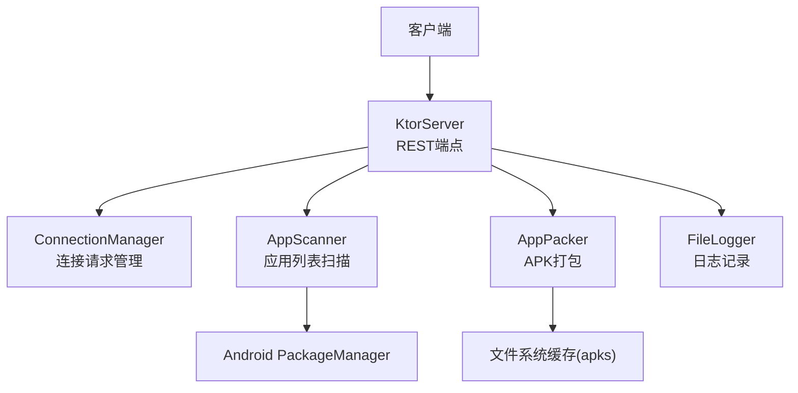
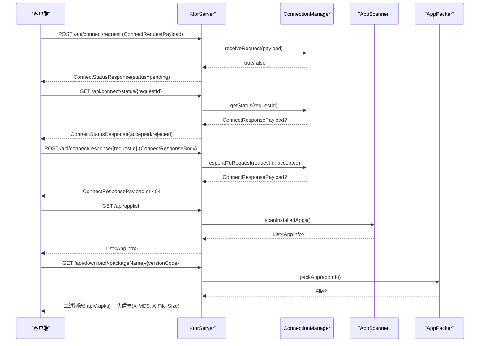
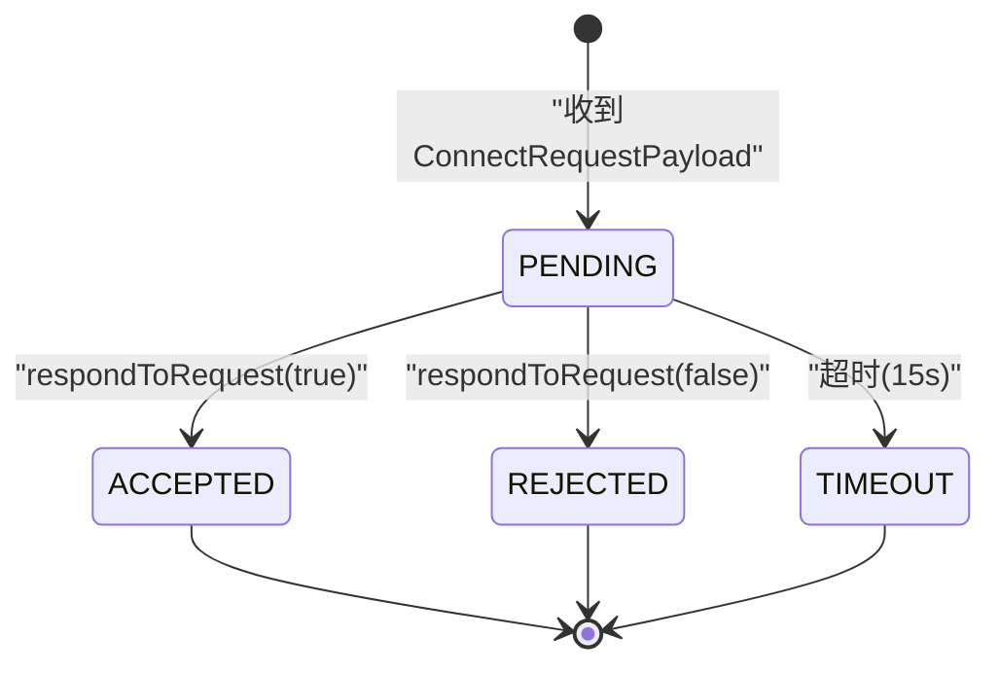
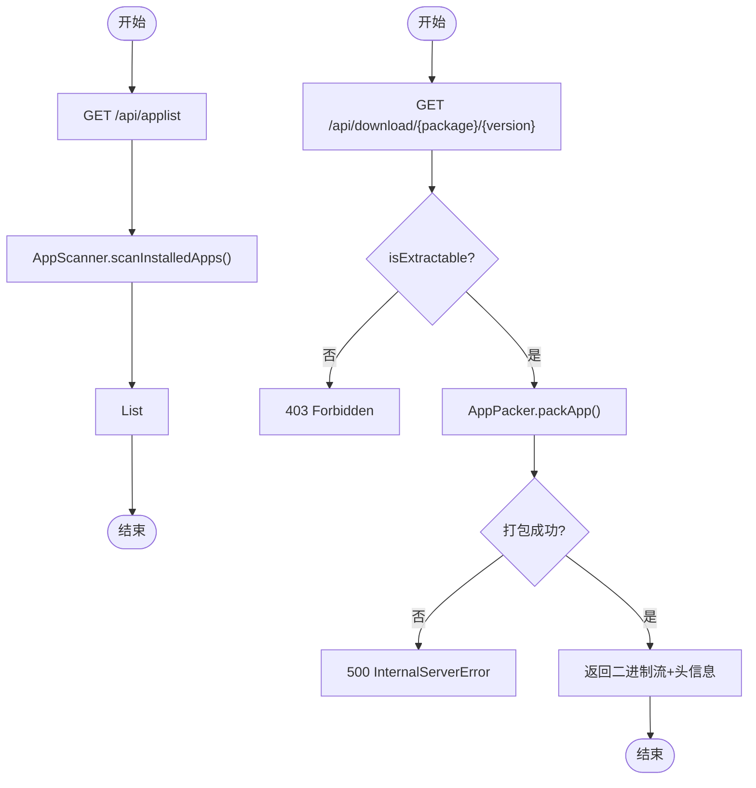
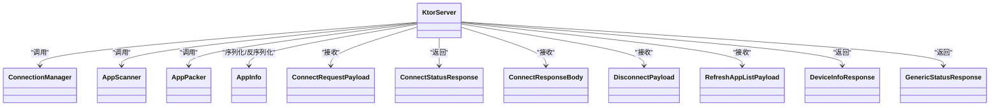

# 数据模型定义

<cite>
**本文引用的文件**
- [Models.kt](file://app/src/main/java/com/lansync/app/data/model/Models.kt)
- [KtorServer.kt](file://app/src/main/java/com/lansync/app/data/server/KtorServer.kt)
- [ConnectionManager.kt](file://app/src/main/java/com/lansync/app/data/connection/ConnectionManager.kt)
- [AppScanner.kt](file://app/src/main/java/com/lansync/app/data/scanner/AppScanner.kt)
- [AppPacker.kt](file://app/src/main/java/com/lansync/app/data/packer/AppPacker.kt)
- [proguard-rules.pro](file://app/proguard-rules.pro)
</cite>

## 目录
1. [简介](#简介)
2. [项目结构](#项目结构)
3. [核心组件](#核心组件)
4. [架构总览](#架构总览)
5. [详细组件分析](#详细组件分析)
6. [依赖关系分析](#依赖关系分析)
7. [性能考量](#性能考量)
8. [故障排查指南](#故障排查指南)
9. [结论](#结论)
10. [附录](#附录)

## 简介
本文件聚焦于LanSync的HTTP API数据模型与序列化格式，覆盖所有API端点使用的请求体与响应体数据结构，包括ConnectRequestPayload、ConnectResponseBody、ConnectStatusResponse、GenericStatusResponse、DisconnectPayload、RefreshAppListPayload、DeviceInfoResponse、AppInfo等。文档将详细说明每个字段的类型、约束条件与业务含义，提供JSON序列化示例（请求与响应），解释数据验证规则与错误处理机制，并给出向后兼容性与版本迁移策略，以及自定义序列化器的实现与使用建议。

## 项目结构
- 数据模型定义位于 data/model/Models.kt，统一使用kotlinx.serialization注解进行声明式序列化。
- HTTP服务由 data/server/KtorServer.kt 暴露REST端点，使用Ktor ContentNegotiation插件配置JSON解析器。
- 连接请求生命周期由 data/connection/ConnectionManager.kt 管理，负责接收、超时、状态查询与响应。
- 应用列表扫描与打包分别由 data/scanner/AppScanner.kt 与 data/packer/AppPacker.kt 实现，为 /api/applist 与 /api/download/* 端点提供数据源。
- ProGuard规则在 app/proguard-rules.pro 中保留kotlinx.serialization所需的元数据与生成类。

图表来源
- [KtorServer.kt:68-285](file://app/src/main/java/com/lansync/app/data/server/KtorServer.kt#L68-L285)
- [ConnectionManager.kt:29-112](file://app/src/main/java/com/lansync/app/data/connection/ConnectionManager.kt#L29-L112)
- [AppScanner.kt:21-47](file://app/src/main/java/com/lansync/app/data/scanner/AppScanner.kt#L21-L47)
- [AppPacker.kt:20-56](file://app/src/main/java/com/lansync/app/data/packer/AppPacker.kt#L20-L56)

章节来源
- [KtorServer.kt:68-285](file://app/src/main/java/com/lansync/app/data/server/KtorServer.kt#L68-L285)
- [Models.kt:5-138](file://app/src/main/java/com/lansync/app/data/model/Models.kt#L5-L138)

## 核心组件
- 数据模型：以data class + @Serializable声明，字段具备默认值或可空类型，便于扩展与兼容。
- 服务端：Ktor路由集中定义，统一使用ContentNegotiation JSON解析器，配置宽松模式与忽略未知键。
- 连接管理：维护待处理请求、超时任务与状态流，支持重复请求拒绝与自动超时拒绝。
- 应用信息：扫描系统已安装应用，计算MD5与文件大小，标记是否可提取、是否为系统应用、是否Split APK。
- 打包服务：将单APK或Split APK打包为.apk/.apks文件，供下载端点返回。

章节来源
- [Models.kt:5-138](file://app/src/main/java/com/lansync/app/data/model/Models.kt#L5-L138)
- [KtorServer.kt:68-285](file://app/src/main/java/com/lansync/app/data/server/KtorServer.kt#L68-L285)
- [ConnectionManager.kt:29-112](file://app/src/main/java/com/lansync/app/data/connection/ConnectionManager.kt#L29-L112)
- [AppScanner.kt:21-133](file://app/src/main/java/com/lansync/app/data/scanner/AppScanner.kt#L21-L133)
- [AppPacker.kt:20-114](file://app/src/main/java/com/lansync/app/data/packer/AppPacker.kt#L20-L114)

## 架构总览
下图展示了从客户端发起连接到获取应用列表与下载应用的完整流程，以及各数据模型在端点间的流转。

图表来源
- [KtorServer.kt:88-284](file://app/src/main/java/com/lansync/app/data/server/KtorServer.kt#L88-L284)
- [ConnectionManager.kt:29-112](file://app/src/main/java/com/lansync/app/data/connection/ConnectionManager.kt#L29-L112)
- [AppScanner.kt:21-47](file://app/src/main/java/com/lansync/app/data/scanner/AppScanner.kt#L21-L47)
- [AppPacker.kt:20-56](file://app/src/main/java/com/lansync/app/data/packer/AppPacker.kt#L20-L56)

## 详细组件分析

### 数据模型总览与字段说明
以下模型均位于 Models.kt，使用kotlinx.serialization进行JSON序列化。

- AppInfo
  - 字段与类型
    - packageName: String（必填）
    - appName: String（必填）
    - versionName: String（必填）
    - versionCode: Long（必填）
    - sourcePaths: List<String>（必填；可为空列表表示不可提取）
    - md5: String（必填；当sourcePaths为空时为空串）
    - isExtractable: Boolean（必填；true表示可打包传输）
    - fileSize: Long（必填；sourcePaths非空时计算总和）
    - isSystemApp: Boolean（可选，默认false）
    - isSplitApk: Boolean（可选，默认false；sourcePaths.size>1时为true）
  - 业务含义
    - 描述一个已安装应用的元数据，用于列表展示与下载选择。
    - isExtractable=false的应用禁止下载。
  - 约束与校验
    - 当isExtractable=true时，sourcePaths应非空且可读；否则无法打包。
    - md5基于sourcePaths计算，用于完整性校验。
  - JSON示例（片段）
    - 见“附录A：JSON序列化示例”中的AppInfo条目。

- DeviceInfo
  - 字段与类型
    - ipAddress: String（必填）
    - deviceName: String（必填）
    - port: Int（必填）
    - instanceId: String（可选，默认空串）
    - appList: List<AppInfo>（可选，默认空列表）
    - connectionState: ConnectionState（可选，默认DISCOVERED）
    - lastSeenTimeMs: Long（可选，默认当前时间）
    - connectionError: String?（可选）
  - 业务含义
    - 描述远端设备及其应用列表与连接状态，用于UI展示与同步决策。
  - 约束与校验
    - displayKey与identityKey为派生属性，不直接参与序列化。

- UpdateInfo / RemoteAppEntry / SyncDiff
  - 内部业务模型，不参与HTTP序列化，主要用于本地同步逻辑。

- ConnectionState
  - 枚举：DISCOVERED、CONNECTING、CONNECTED、ERROR、DISCONNECTED、RECONNECTING、CONNECTION_TIMEOUT
  - 用于表示设备连接生命周期状态。

- ConnectRequestPayload
  - 字段与类型
    - requestId: String（必填；唯一标识一次连接请求）
    - requesterName: String（必填；请求方设备名）
    - requesterIp: String（必填；请求方IP）
    - requesterPort: Int（必填；请求方端口）
    - requesterInstanceId: String（可选，默认空串）
    - timestamp: Long（必填；请求时间戳）
  - 业务含义
    - 发起连接请求，服务器侧会去重并设置超时。
  - 约束与校验
    - requestId需全局唯一；重复请求将被拒绝。
  - JSON示例（片段）
    - 见“附录A”。

- ConnectResponsePayload
  - 字段与类型
    - requestId: String（必填）
    - accepted: Boolean（必填）
    - responderName: String?（可选）
    - message: String?（可选）
  - 业务含义
    - 对连接请求的处理结果，包含接受/拒绝及消息。

- IncomingConnectRequest
  - 内部模型，封装请求与状态（PENDING/ACCEPTED/REJECTED/TIMEOUT），用于连接管理器内部状态机。

- DisconnectPayload
  - 字段与类型
    - displayKey: String（必填；用于识别目标设备）
    - identityKey: String（可选，默认空串；优先使用）
  - 业务含义
    - 主动断开某设备的连接。
  - JSON示例（片段）
    - 见“附录A”。

- ConnectStatusResponse
  - 字段与类型
    - status: String（必填；pending/accepted/rejected）
    - requestId: String?（可选）
    - accepted: Boolean（可选，默认false）
    - responderName: String?（可选）
    - message: String?（可选）
  - 业务含义
    - 查询连接请求的状态，用于轮询等待对方响应。
  - JSON示例（片段）
    - 见“附录A”。

- DeviceInfoResponse
  - 字段与类型
    - deviceName: String（必填）
    - version: String（可选，默认"1.0"）
  - 业务含义
    - 返回本机设备信息与协议版本，用于兼容性判断。
  - JSON示例（片段）
    - 见“附录A”。

- GenericStatusResponse
  - 字段与类型
    - status: String（可选，默认"ok"）
  - 业务含义
    - 通用成功响应，用于健康检查或简单操作确认。
  - JSON示例（片段）
    - 见“附录A”。

- ConnectResponseBody
  - 字段与类型
    - accepted: Boolean（必填）
  - 业务含义
    - 对连接请求的响应体，告知是否接受连接。
  - JSON示例（片段）
    - 见“附录A”。

- RefreshAppListPayload
  - 字段与类型
    - displayKey: String（必填；目标设备标识）
  - 业务含义
    - 触发刷新指定设备的远程应用列表。
  - JSON示例（片段）
    - 见“附录A”。

章节来源
- [Models.kt:5-138](file://app/src/main/java/com/lansync/app/data/model/Models.kt#L5-L138)

### API端点与数据模型映射
- GET /api/ping
  - 响应：GenericStatusResponse
  - 用途：健康检查
- GET /api/applist
  - 响应：List<AppInfo>
  - 数据来源：AppScanner.scanInstalledApps()
- POST /api/connect/request
  - 请求体：ConnectRequestPayload
  - 响应：ConnectStatusResponse(status=pending) 或 409 Conflict（重复请求）
- GET /api/connect/status/{requestId}
  - 响应：ConnectStatusResponse(accepted/rejected/pending)
- POST /api/connect/response/{requestId}
  - 请求体：ConnectResponseBody
  - 响应：ConnectResponsePayload 或 404（未找到）
- GET /api/download/{packageName} 或 /{packageName}/{versionCode}
  - 响应：二进制流（.apk或.apks），附带X-MD5、X-File-Size、Content-Disposition头
  - 限制：仅isExtractable=true的应用可下载
- POST /api/disconnect
  - 请求体：DisconnectPayload
  - 响应：GenericStatusResponse
- POST /api/refresh-applist
  - 请求体：RefreshAppListPayload
  - 响应：GenericStatusResponse
- GET /api/deviceinfo
  - 响应：DeviceInfoResponse

章节来源
- [KtorServer.kt:78-284](file://app/src/main/java/com/lansync/app/data/server/KtorServer.kt#L78-L284)

### 连接请求状态机与超时

图表来源
- [ConnectionManager.kt:29-112](file://app/src/main/java/com/lansync/app/data/connection/ConnectionManager.kt#L29-L112)
- [ConnectionManager.kt:132-140](file://app/src/main/java/com/lansync/app/data/connection/ConnectionManager.kt#L132-L140)

章节来源
- [ConnectionManager.kt:29-112](file://app/src/main/java/com/lansync/app/data/connection/ConnectionManager.kt#L29-L112)
- [ConnectionManager.kt:132-140](file://app/src/main/java/com/lansync/app/data/connection/ConnectionManager.kt#L132-L140)

### 应用列表与下载流程

图表来源
- [KtorServer.kt:177-250](file://app/src/main/java/com/lansync/app/data/server/KtorServer.kt#L177-L250)
- [AppScanner.kt:21-47](file://app/src/main/java/com/lansync/app/data/scanner/AppScanner.kt#L21-L47)
- [AppPacker.kt:20-56](file://app/src/main/java/com/lansync/app/data/packer/AppPacker.kt#L20-L56)

章节来源
- [KtorServer.kt:177-250](file://app/src/main/java/com/lansync/app/data/server/KtorServer.kt#L177-L250)
- [AppScanner.kt:21-133](file://app/src/main/java/com/lansync/app/data/scanner/AppScanner.kt#L21-L133)
- [AppPacker.kt:20-114](file://app/src/main/java/com/lansync/app/data/packer/AppPacker.kt#L20-L114)

## 依赖关系分析
- KtorServer依赖：
  - ConnectionManager：处理连接请求的生命周期
  - AppScanner：提供应用列表
  - AppPacker：提供下载包
  - FileLogger：记录请求与异常
- 数据模型依赖：
  - AppInfo被AppScanner构造，被KtorServer序列化为响应
  - 连接相关模型被ConnectionManager与KtorServer共同使用

图表来源
- [KtorServer.kt:68-285](file://app/src/main/java/com/lansync/app/data/server/KtorServer.kt#L68-L285)
- [Models.kt:5-138](file://app/src/main/java/com/lansync/app/data/model/Models.kt#L5-L138)

章节来源
- [KtorServer.kt:68-285](file://app/src/main/java/com/lansync/app/data/server/KtorServer.kt#L68-L285)
- [Models.kt:5-138](file://app/src/main/java/com/lansync/app/data/model/Models.kt#L5-L138)

## 性能考量
- JSON解析器配置
  - prettyPrint=true便于调试，生产环境可关闭以提升吞吐
  - isLenient=true与ignoreUnknownKeys=true提升兼容性，但可能掩盖字段缺失问题
- 大文件下载
  - 使用输出流分块写入，避免一次性加载到内存
  - 通过X-MD5与X-File-Size头辅助客户端断点续传与校验
- 应用扫描
  - 在IO线程执行，避免阻塞主线程
  - 过滤不可读路径，减少异常开销
- 连接管理
  - 超时任务使用协程调度，避免资源泄漏
  - 并发安全使用ConcurrentHashMap存储待处理请求

[本节为通用指导，不直接分析具体文件]

## 故障排查指南
- 常见错误码与原因
  - 400 Bad Request：请求体解析失败或参数无效
  - 403 Forbidden：尝试下载系统/受保护应用（isExtractable=false）
  - 404 Not Found：连接请求不存在或已处理
  - 409 Conflict：重复的连接请求ID
  - 500 InternalServerError：打包失败或内部异常
- 日志定位
  - 使用FileLogger记录关键步骤与异常堆栈
  - 关注“POST /api/connect/request error”、“GET /api/download ... exception”等日志
- 连接超时
  - 默认15秒超时，若长时间无响应，客户端应重试或提示用户
- 下载失败
  - 检查X-MD5与X-File-Size是否与预期一致
  - 确认应用isExtractable与sourcePaths可读

章节来源
- [KtorServer.kt:88-284](file://app/src/main/java/com/lansync/app/data/server/KtorServer.kt#L88-L284)
- [FileLogger.kt:94-119](file://app/src/main/java/com/lansync/app/data/FileLogger.kt#L94-L119)

## 结论
LanSync的HTTP API数据模型采用kotlinx.serialization声明式序列化，结合Ktor的ContentNegotiation插件，实现了简洁、可扩展的数据交换格式。连接请求通过ConnectionManager进行状态管理与超时控制，应用列表与下载功能由AppScanner与AppPacker提供支撑。整体设计注重兼容性与健壮性，适合局域网内应用分发与同步场景。

[本节为总结，不直接分析具体文件]

## 附录

### A. JSON序列化示例（请求与响应）
以下为标准JSON格式示例（字段顺序与命名遵循Models.kt定义）：

- ConnectRequestPayload
  - 请求体示例
    - {
        "requestId": "req_001",
        "requesterName": "Device-A",
        "requesterIp": "192.168.1.10",
        "requesterPort": 8080,
        "requesterInstanceId": "",
        "timestamp": 1710000000000
      }
- ConnectStatusResponse
  - 响应体示例（pending）
    - {
        "status": "pending",
        "requestId": "req_001"
      }
  - 响应体示例（accepted）
    - {
        "status": "accepted",
        "requestId": "req_001",
        "accepted": true,
        "responderName": "Device-B",
        "message": "Accepted"
      }
- ConnectResponseBody
  - 请求体示例
    - {
        "accepted": true
      }
- DisconnectPayload
  - 请求体示例
    - {
        "displayKey": "192.168.1.10:8080",
        "identityKey": ""
      }
- RefreshAppListPayload
  - 请求体示例
    - {
        "displayKey": "192.168.1.10:8080"
      }
- DeviceInfoResponse
  - 响应体示例
    - {
        "deviceName": "MyPhone",
        "version": "1.0"
      }
- GenericStatusResponse
  - 响应体示例
    - {
        "status": "ok"
      }
- AppInfo（列表项）
  - 示例项
    - {
        "packageName": "com.example.app",
        "appName": "Example App",
        "versionName": "2.0",
        "versionCode": 200,
        "sourcePaths": ["/data/app/base.apk"],
        "md5": "abc123def456...",
        "isExtractable": true,
        "fileSize": 1024000,
        "isSystemApp": false,
        "isSplitApk": false
      }

章节来源
- [Models.kt:5-138](file://app/src/main/java/com/lansync/app/data/model/Models.kt#L5-L138)

### B. 数据验证规则与错误处理
- 连接请求
  - 重复requestId：返回409 Conflict
  - 未就绪或服务异常：返回400或500
- 下载接口
  - 系统/受保护应用：返回403 Forbidden
  - 应用不存在：返回404 Not Found
  - 打包失败：返回500 InternalServerError
- 连接状态查询
  - 未找到或异常：返回pending状态或错误文本
- 断开与刷新
  - 无效请求：返回400 Bad Request

章节来源
- [KtorServer.kt:88-284](file://app/src/main/java/com/lansync/app/data/server/KtorServer.kt#L88-L284)

### C. 向后兼容性与版本迁移策略
- 宽松解析
  - ignoreUnknownKeys=true允许新增字段不被旧客户端拒绝
  - isLenient=true容忍部分格式差异
- 默认字段
  - 为新字段提供默认值，确保旧客户端仍可解析
- 版本协商
  - DeviceInfoResponse.version可用于协议版本协商，客户端据此调整行为
- 渐进升级
  - 先添加可选字段与分支逻辑，再逐步弃用旧字段
- ProGuard兼容
  - 保留kotlinx.serialization所需注解与生成类，避免混淆导致序列化失败

章节来源
- [KtorServer.kt:68-75](file://app/src/main/java/com/lansync/app/data/server/KtorServer.kt#L68-L75)
- [proguard-rules.pro:1-14](file://app/proguard-rules.pro#L1-L14)

### D. 自定义序列化器的实现与使用建议
- 何时需要自定义序列化器
  - 需要对字段进行转换（如日期格式、枚举映射）
  - 需要复杂校验或聚合计算
  - 需要兼容历史字段名或别名
- 实现方式
  - 使用kotlinx.serialization的Serializer接口或@ContextualSerializer
  - 在Ktor中注册自定义Json对象工厂或使用@Serializable(with=...)
- 使用建议
  - 保持向后兼容：新增字段默认值，废弃字段保留解析逻辑
  - 测试覆盖：编写单元测试验证序列化往返一致性
  - 日志记录：在解析失败时记录原始JSON以便排查

[本节为通用指导，不直接分析具体文件]