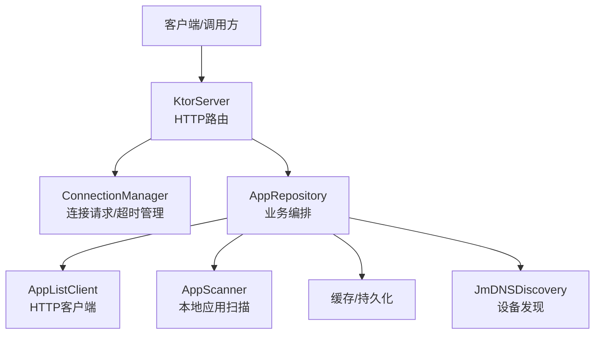
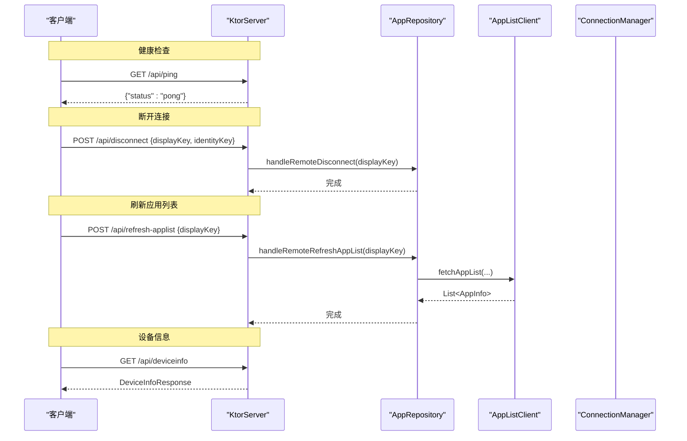
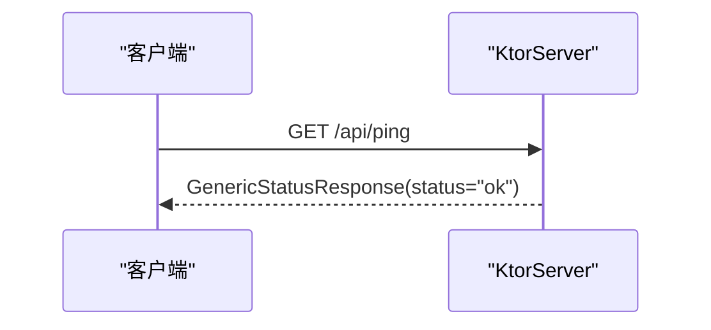
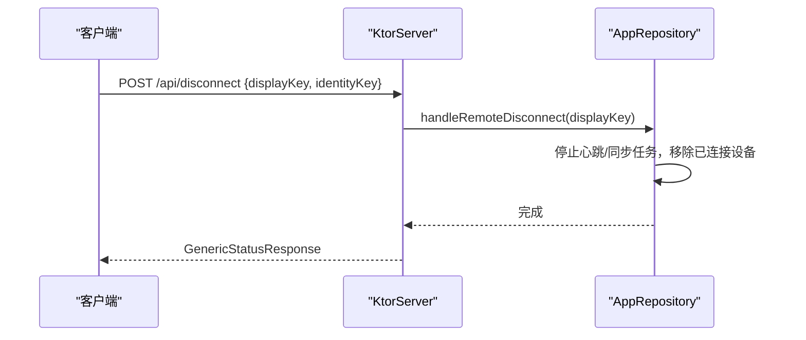
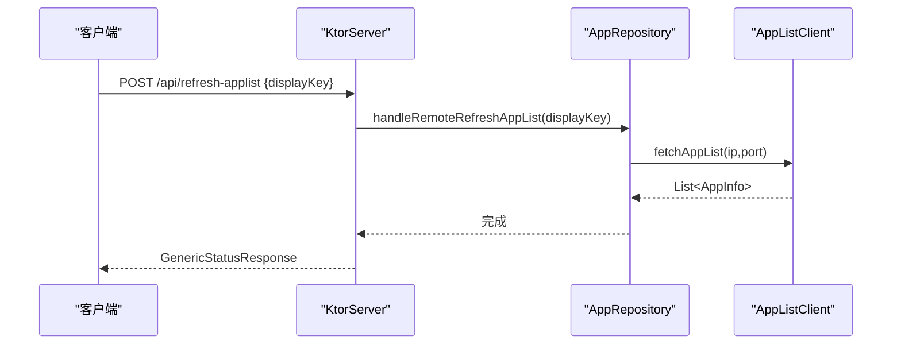
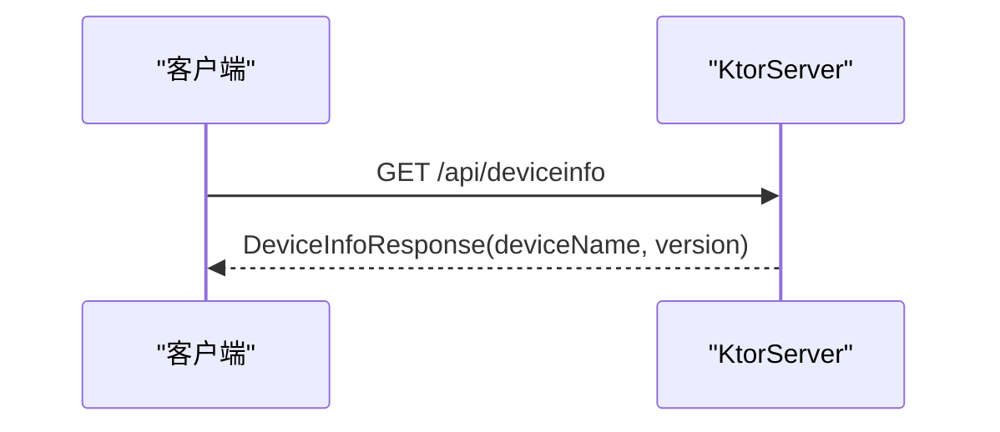
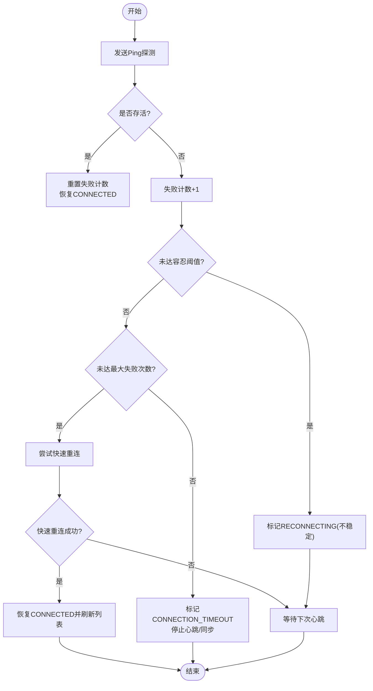
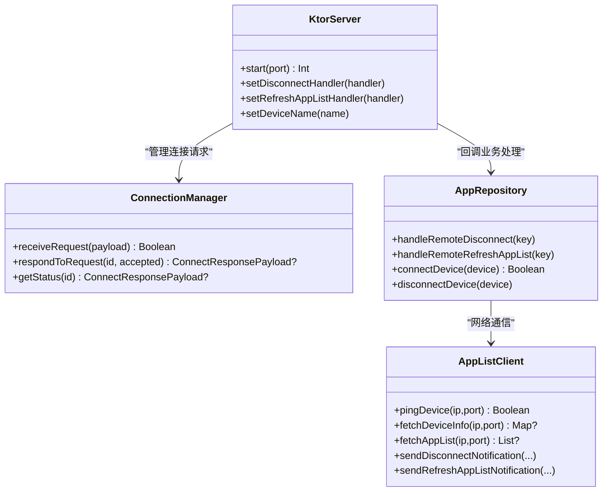

# 设备管理API

<cite>
**本文引用的文件**
- [KtorServer.kt](file://app/src/main/java/com/lansync/app/data/server/KtorServer.kt)
- [Models.kt](file://app/src/main/java/com/lansync/app/data/model/Models.kt)
- [ConnectionManager.kt](file://app/src/main/java/com/lansync/app/data/connection/ConnectionManager.kt)
- [AppRepository.kt](file://app/src/main/java/com/lansync/app/data/repository/AppRepository.kt)
- [AppListClient.kt](file://app/src/main/java/com/lansync/app/data/client/AppListClient.kt)
- [AppConfig.kt](file://app/src/main/java/com/lansync/app/data/AppConfig.kt)
</cite>

## 目录
1. [简介](#简介)
2. [项目结构](#项目结构)
3. [核心组件](#核心组件)
4. [架构总览](#架构总览)
5. [详细组件分析](#详细组件分析)
6. [依赖关系分析](#依赖关系分析)
7. [性能考虑](#性能考虑)
8. [故障排查指南](#故障排查指南)
9. [结论](#结论)
10. [附录：API与数据模型参考](#附录api与数据模型参考)

## 简介
本文件面向LanSync设备的局域网同步与管理场景，聚焦于设备管理API的完整流程与实现细节。重点覆盖以下端点与机制：
- GET /api/ping：服务健康检查
- POST /api/disconnect：连接断开处理
- POST /api/refresh-applist：应用列表刷新通知
- GET /api/deviceinfo：设备信息查询

同时说明关键数据模型（DisconnectPayload、RefreshAppListPayload、DeviceInfoResponse）的结构与用途，给出请求/响应示例，阐述设备标识符管理策略、连接池维护机制，以及设备离线检测与自动重连方案。

## 项目结构
LanSync采用分层组织：
- 服务端路由与HTTP接口：KtorServer
- 数据模型：Models
- 连接与会话管理：ConnectionManager
- 仓库层协调与业务编排：AppRepository
- 网络客户端封装：AppListClient
- 配置项：AppConfig

图表来源
- [KtorServer.kt:65-290](file://app/src/main/java/com/lansync/app/data/server/KtorServer.kt#L65-L290)
- [AppRepository.kt:40-80](file://app/src/main/java/com/lansync/app/data/repository/AppRepository.kt#L40-L80)
- [AppListClient.kt:30-50](file://app/src/main/java/com/lansync/app/data/client/AppListClient.kt#L30-L50)

章节来源
- [KtorServer.kt:65-290](file://app/src/main/java/com/lansync/app/data/server/KtorServer.kt#L65-L290)
- [AppRepository.kt:40-80](file://app/src/main/java/com/lansync/app/data/repository/AppRepository.kt#L40-L80)

## 核心组件
- KtorServer：提供HTTP路由，注册/api/ping、/api/disconnect、/api/refresh-applist、/api/deviceinfo等端点，并委派给业务处理器。
- ConnectionManager：管理入站连接请求、超时、状态查询与清理。
- AppRepository：协调设备发现、心跳、连接生命周期、应用列表拉取与刷新、更新计算等。
- AppListClient：封装对远端设备的HTTP调用（ping、设备信息、应用列表、下载、断开通知、刷新通知等）。
- Models：定义所有请求/响应/实体数据模型。
- AppConfig：可配置的超时、重试、轮询间隔等参数。

章节来源
- [KtorServer.kt:65-290](file://app/src/main/java/com/lansync/app/data/server/KtorServer.kt#L65-L290)
- [ConnectionManager.kt:19-155](file://app/src/main/java/com/lansync/app/data/connection/ConnectionManager.kt#L19-L155)
- [AppRepository.kt:40-80](file://app/src/main/java/com/lansync/app/data/repository/AppRepository.kt#L40-L80)
- [AppListClient.kt:30-50](file://app/src/main/java/com/lansync/app/data/client/AppListClient.kt#L30-L50)
- [Models.kt:5-138](file://app/src/main/java/com/lansync/app/data/model/Models.kt#L5-L138)
- [AppConfig.kt:1-18](file://app/src/main/java/com/lansync/app/data/AppConfig.kt#L1-L18)

## 架构总览
下图展示了设备管理API在请求链路中的角色分工：客户端通过HTTP访问KtorServer暴露的端点；KtorServer将请求解析为数据模型并调用相应的业务逻辑；连接管理与设备状态由ConnectionManager与AppRepository共同维护；网络通信由AppListClient完成。

图表来源
- [KtorServer.kt:77-284](file://app/src/main/java/com/lansync/app/data/server/KtorServer.kt#L77-L284)
- [AppRepository.kt:94-132](file://app/src/main/java/com/lansync/app/data/repository/AppRepository.kt#L94-L132)
- [AppRepository.kt:649-657](file://app/src/main/java/com/lansync/app/data/repository/AppRepository.kt#L649-L657)
- [AppListClient.kt:228-281](file://app/src/main/java/com/lansync/app/data/client/AppListClient.kt#L228-L281)

## 详细组件分析

### 健康检查：GET /api/ping
- 作用：快速判断服务是否存活。
- 行为：返回通用成功状态响应。
- 使用场景：心跳探测、负载均衡健康探针。

图表来源
- [KtorServer.kt:77-80](file://app/src/main/java/com/lansync/app/data/server/KtorServer.kt#L77-L80)
- [Models.kt:124-127](file://app/src/main/java/com/lansync/app/data/model/Models.kt#L124-L127)

章节来源
- [KtorServer.kt:77-80](file://app/src/main/java/com/lansync/app/data/server/KtorServer.kt#L77-L80)
- [Models.kt:124-127](file://app/src/main/java/com/lansync/app/data/model/Models.kt#L124-L127)

### 连接断开：POST /api/disconnect
- 作用：远端主动通知当前设备断开连接，触发本地清理。
- 请求体：DisconnectPayload（displayKey必填，identityKey可选）。
- 处理流程：
  - KtorServer接收请求，选择identityKey或displayKey作为键。
  - 调用AppRepository.handleRemoteDisconnect进行本地状态清理。
  - 返回通用成功响应。

图表来源
- [KtorServer.kt:252-265](file://app/src/main/java/com/lansync/app/data/server/KtorServer.kt#L252-L265)
- [AppRepository.kt:94-132](file://app/src/main/java/com/lansync/app/data/repository/AppRepository.kt#L94-L132)
- [Models.kt:103-107](file://app/src/main/java/com/lansync/app/data/model/Models.kt#L103-L107)

章节来源
- [KtorServer.kt:252-265](file://app/src/main/java/com/lansync/app/data/server/KtorServer.kt#L252-L265)
- [AppRepository.kt:94-132](file://app/src/main/java/com/lansync/app/data/repository/AppRepository.kt#L94-L132)
- [Models.kt:103-107](file://app/src/main/java/com/lansync/app/data/model/Models.kt#L103-L107)

### 应用列表刷新：POST /api/refresh-applist
- 作用：远端通知当前设备重新拉取对方应用列表。
- 请求体：RefreshAppListPayload（displayKey）。
- 处理流程：
  - KtorServer接收请求，调用AppRepository.handleRemoteRefreshAppList。
  - AppRepository根据displayKey定位已连接设备，异步拉取应用列表并更新状态。

图表来源
- [KtorServer.kt:267-280](file://app/src/main/java/com/lansync/app/data/server/KtorServer.kt#L267-L280)
- [AppRepository.kt:649-657](file://app/src/main/java/com/lansync/app/data/repository/AppRepository.kt#L649-L657)
- [AppListClient.kt:228-254](file://app/src/main/java/com/lansync/app/data/client/AppListClient.kt#L228-L254)
- [Models.kt:134-137](file://app/src/main/java/com/lansync/app/data/model/Models.kt#L134-L137)

章节来源
- [KtorServer.kt:267-280](file://app/src/main/java/com/lansync/app/data/server/KtorServer.kt#L267-L280)
- [AppRepository.kt:649-657](file://app/src/main/java/com/lansync/app/data/repository/AppRepository.kt#L649-L657)
- [AppListClient.kt:228-254](file://app/src/main/java/com/lansync/app/data/client/AppListClient.kt#L228-L254)
- [Models.kt:134-137](file://app/src/main/java/com/lansync/app/data/model/Models.kt#L134-L137)

### 设备信息查询：GET /api/deviceinfo
- 作用：返回当前设备名称与版本信息。
- 响应体：DeviceInfoResponse（deviceName、version）。
- 使用场景：握手阶段识别设备身份、UI展示。

图表来源
- [KtorServer.kt:282-284](file://app/src/main/java/com/lansync/app/data/server/KtorServer.kt#L282-L284)
- [Models.kt:118-122](file://app/src/main/java/com/lansync/app/data/model/Models.kt#L118-L122)

章节来源
- [KtorServer.kt:282-284](file://app/src/main/java/com/lansync/app/data/server/KtorServer.kt#L282-L284)
- [Models.kt:118-122](file://app/src/main/java/com/lansync/app/data/model/Models.kt#L118-L122)

### 数据模型详解
- DisconnectPayload
  - displayKey：显示键（IP:端口），用于匹配连接。
  - identityKey：实例级唯一标识（可选），优先于displayKey。
- RefreshAppListPayload
  - displayKey：发起刷新请求的设备显示键。
- DeviceInfoResponse
  - deviceName：设备名称。
  - version：协议/服务版本。

章节来源
- [Models.kt:103-107](file://app/src/main/java/com/lansync/app/data/model/Models.kt#L103-L107)
- [Models.kt:134-137](file://app/src/main/java/com/lansync/app/data/model/Models.kt#L134-L137)
- [Models.kt:118-122](file://app/src/main/java/com/lansync/app/data/model/Models.kt#L118-L122)

### 设备标识符管理策略
- displayKey：基于“IP:端口”的易读标识，适合UI展示与临时会话。
- identityKey：基于实例ID或“设备名@IP”的稳定标识，用于跨端口迁移、去重与关联历史连接。
- 优先级：当identityKey存在时优先使用；否则回退到displayKey。
- 端口迁移：当设备端口变化但identityKey不变时，系统会迁移连接状态与应用列表，保持连续性。

章节来源
- [Models.kt:29-45](file://app/src/main/java/com/lansync/app/data/model/Models.kt#L29-L45)
- [AppRepository.kt:289-375](file://app/src/main/java/com/lansync/app/data/repository/AppRepository.kt#L289-L375)
- [AppRepository.kt:566-584](file://app/src/main/java/com/lansync/app/data/repository/AppRepository.kt#L566-L584)

### 连接池与网络客户端
- AppListClient使用OkHttp连接池：
  - 常规请求：最大空闲连接数5，保活5分钟。
  - 下载专用客户端：长连接、大超时，支持进度回调与MD5校验。
- 超时与重试：
  - 连接/读取/写入/调用超时分别设置。
  - 应用列表拉取带重试与退避。

章节来源
- [AppListClient.kt:30-50](file://app/src/main/java/com/lansync/app/data/client/AppListClient.kt#L30-L50)
- [AppListClient.kt:358-462](file://app/src/main/java/com/lansync/app/data/client/AppListClient.kt#L358-L462)
- [AppRepository.kt:720-759](file://app/src/main/java/com/lansync/app/data/repository/AppRepository.kt#L720-L759)

### 设备离线检测与自动重连
- 心跳机制：
  - 周期性调用/api/ping探测设备存活。
  - 失败计数超过容忍阈值进入不稳定/重连状态。
  - 连续失败达到上限后标记为超时离线，停止心跳与同步任务。
- 快速重连：
  - 尝试通过/api/deviceinfo快速验证设备可达性，成功后恢复CONNECTED并刷新应用列表。
- 配置项：
  - 心跳间隔、容忍次数、最大失败次数、轮询间隔、Ping超时等均可配置。

图表来源
- [AppRepository.kt:134-249](file://app/src/main/java/com/lansync/app/data/repository/AppRepository.kt#L134-L249)
- [AppConfig.kt:1-18](file://app/src/main/java/com/lansync/app/data/AppConfig.kt#L1-L18)

章节来源
- [AppRepository.kt:134-249](file://app/src/main/java/com/lansync/app/data/repository/AppRepository.kt#L134-L249)
- [AppConfig.kt:1-18](file://app/src/main/java/com/lansync/app/data/AppConfig.kt#L1-L18)

## 依赖关系分析
- KtorServer依赖：
  - ConnectionManager：处理连接请求与状态。
  - FileLogger：日志记录。
  - 业务处理器：由AppRepository注入的disconnect与refresh回调。
- AppRepository依赖：
  - JmDNSDiscovery：设备发现。
  - AppListClient：网络通信。
  - AppPacker：打包应用。
  - UpdateManager：更新计算。
  - ApkInstaller：安装APK。
- 耦合与内聚：
  - 路由层仅负责协议解析与转发，业务逻辑集中在仓库层，便于测试与维护。
  - 连接管理与网络客户端职责清晰，降低耦合。

图表来源
- [KtorServer.kt:30-63](file://app/src/main/java/com/lansync/app/data/server/KtorServer.kt#L30-L63)
- [ConnectionManager.kt:19-155](file://app/src/main/java/com/lansync/app/data/connection/ConnectionManager.kt#L19-L155)
- [AppRepository.kt:40-80](file://app/src/main/java/com/lansync/app/data/repository/AppRepository.kt#L40-L80)
- [AppListClient.kt:228-356](file://app/src/main/java/com/lansync/app/data/client/AppListClient.kt#L228-L356)

章节来源
- [KtorServer.kt:30-63](file://app/src/main/java/com/lansync/app/data/server/KtorServer.kt#L30-L63)
- [ConnectionManager.kt:19-155](file://app/src/main/java/com/lansync/app/data/connection/ConnectionManager.kt#L19-L155)
- [AppRepository.kt:40-80](file://app/src/main/java/com/lansync/app/data/repository/AppRepository.kt#L40-L80)
- [AppListClient.kt:228-356](file://app/src/main/java/com/lansync/app/data/client/AppListClient.kt#L228-L356)

## 性能考虑
- 连接池优化：
  - 常规请求使用短连接池，减少资源占用。
  - 下载使用独立客户端，避免阻塞其他请求。
- 超时与重试：
  - 合理设置连接/读取/写入/调用超时，防止长时间挂起。
  - 应用列表拉取带重试与退避，提升鲁棒性。
- 心跳频率：
  - 可通过配置调整心跳间隔与容忍次数，平衡实时性与开销。
- I/O调度：
  - 使用协程与IO线程池执行网络与文件操作，避免阻塞主线程。

[本节为通用指导，不直接分析具体文件]

## 故障排查指南
- 常见问题定位：
  - 健康检查失败：检查/api/ping是否可达，确认端口与防火墙。
  - 断开通知无效：确认displayKey/identityKey是否正确，检查本地连接状态。
  - 刷新列表无响应：检查/api/applist是否可用，确认目标设备应用列表是否为空。
  - 设备信息为空：确认设备名称是否设置，服务是否启动。
- 日志关键字：
  - “Heartbeat timeout”、“Fast reconnect failed”、“fetchAppList FAILED after ... attempts”。
- 建议步骤：
  - 逐步缩小范围：先ping，再deviceinfo，最后applist。
  - 检查连接池与超时配置，必要时增大超时或重试次数。
  - 观察端口迁移与identityKey一致性，确保状态迁移正确。

章节来源
- [AppRepository.kt:179-249](file://app/src/main/java/com/lansync/app/data/repository/AppRepository.kt#L179-L249)
- [AppRepository.kt:720-759](file://app/src/main/java/com/lansync/app/data/repository/AppRepository.kt#L720-L759)

## 结论
LanSync的设备管理API以KtorServer为入口，结合ConnectionManager与AppRepository实现了健壮的连接生命周期管理、设备离线检测与自动重连、应用列表刷新与设备信息查询。通过清晰的模型定义与可配置的心跳/超时策略，系统在复杂网络环境下具备良好稳定性与可维护性。

[本节为总结，不直接分析具体文件]

## 附录：API与数据模型参考

### API端点
- GET /api/ping
  - 响应：GenericStatusResponse
- POST /api/disconnect
  - 请求：DisconnectPayload
  - 响应：GenericStatusResponse
- POST /api/refresh-applist
  - 请求：RefreshAppListPayload
  - 响应：GenericStatusResponse
- GET /api/deviceinfo
  - 响应：DeviceInfoResponse

章节来源
- [KtorServer.kt:77-284](file://app/src/main/java/com/lansync/app/data/server/KtorServer.kt#L77-L284)
- [Models.kt:103-137](file://app/src/main/java/com/lansync/app/data/model/Models.kt#L103-L137)

### 请求/响应示例（示意）
- 健康检查
  - 请求：GET /api/ping
  - 响应：{"status":"ok"}
- 断开连接
  - 请求：POST /api/disconnect
  - 请求体：{"displayKey":"192.168.1.10:8080","identityKey":""}
  - 响应：{"status":"ok"}
- 刷新应用列表
  - 请求：POST /api/refresh-applist
  - 请求体：{"displayKey":"192.168.1.10:8080"}
  - 响应：{"status":"ok"}
- 设备信息
  - 请求：GET /api/deviceinfo
  - 响应：{"deviceName":"Pixel 6","version":"1.0"}

[示例为概念性示意，实际字段以模型定义为准]

### 数据模型要点
- DisconnectPayload
  - displayKey：设备显示键（IP:端口）
  - identityKey：实例级唯一标识（可选）
- RefreshAppListPayload
  - displayKey：发起刷新请求的设备显示键
- DeviceInfoResponse
  - deviceName：设备名称
  - version：服务版本

章节来源
- [Models.kt:103-137](file://app/src/main/java/com/lansync/app/data/model/Models.kt#L103-L137)