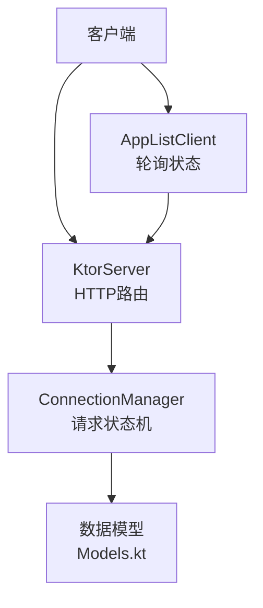
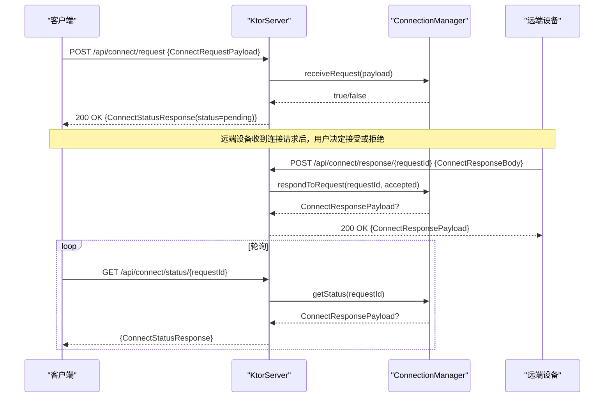
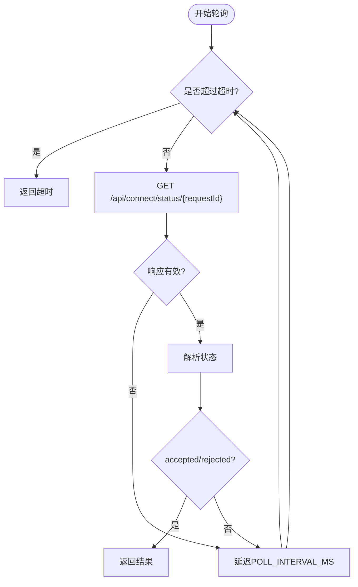
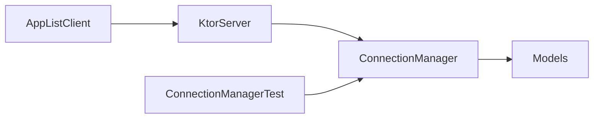

# 连接管理API

<cite>
**本文引用的文件**
- [KtorServer.kt](file://app/src/main/java/com/lansync/app/data/server/KtorServer.kt)
- [ConnectionManager.kt](file://app/src/main/java/com/lansync/app/data/connection/ConnectionManager.kt)
- [Models.kt](file://app/src/main/java/com/lansync/app/data/model/Models.kt)
- [AppListClient.kt](file://app/src/main/java/com/lansync/app/data/client/AppListClient.kt)
- [ConnectionManagerTest.kt](file://app/src/test/java/com/lansync/app/data/connection/ConnectionManagerTest.kt)
</cite>

## 目录
1. [简介](#简介)
2. [项目结构](#项目结构)
3. [核心组件](#核心组件)
4. [架构总览](#架构总览)
5. [详细组件分析](#详细组件分析)
6. [依赖关系分析](#依赖关系分析)
7. [性能与并发](#性能与并发)
8. [故障排查指南](#故障排查指南)
9. [结论](#结论)
10. [附录：请求响应示例](#附录请求响应示例)

## 简介
本文件为 LanSync 的连接管理 API 提供完整的技术文档，覆盖以下端点与流程：
- POST /api/connect/request：发起连接请求
- GET /api/connect/status/{requestId}：轮询连接状态
- POST /api/connect/response/{requestId}：对连接请求进行接受或拒绝的响应处理

同时说明数据模型 ConnectRequestPayload、ConnectStatusResponse、ConnectResponseBody 的结构与用途，并提供成功与失败场景的请求/响应示例。文档还包含错误处理机制、重试策略、超时处理以及并发连接控制的最佳实践。

## 项目结构
连接管理相关代码主要分布在以下模块：
- 服务端路由与HTTP处理：KtorServer.kt
- 连接生命周期与状态机：ConnectionManager.kt
- 数据模型定义：Models.kt
- 客户端轮询与超时控制：AppListClient.kt
- 单元测试验证行为：ConnectionManagerTest.kt



图表来源
- [KtorServer.kt:65-175](file://app/src/main/java/com/lansync/app/data/server/KtorServer.kt#L65-L175)
- [ConnectionManager.kt:19-155](file://app/src/main/java/com/lansync/app/data/connection/ConnectionManager.kt#L19-L155)
- [Models.kt:69-132](file://app/src/main/java/com/lansync/app/data/model/Models.kt#L69-L132)
- [AppListClient.kt:104-172](file://app/src/main/java/com/lansync/app/data/client/AppListClient.kt#L104-L172)

章节来源
- [KtorServer.kt:65-175](file://app/src/main/java/com/lansync/app/data/server/KtorServer.kt#L65-L175)
- [ConnectionManager.kt:19-155](file://app/src/main/java/com/lansync/app/data/connection/ConnectionManager.kt#L19-L155)
- [Models.kt:69-132](file://app/src/main/java/com/lansync/app/data/model/Models.kt#L69-L132)
- [AppListClient.kt:104-172](file://app/src/main/java/com/lansync/app/data/client/AppListClient.kt#L104-L172)

## 核心组件
- KtorServer：负责注册并处理连接相关的HTTP端点，将请求转发给 ConnectionManager，并将结果序列化为JSON返回。
- ConnectionManager：维护待处理的连接请求、超时任务、状态流转（PENDING/ACCEPTED/REJECTED/TIMEOUT），并通过 StateFlow 暴露当前待处理列表。
- 数据模型：
  - ConnectRequestPayload：连接请求体，包含请求ID、请求方设备名、IP、端口、实例ID和时间戳。
  - ConnectStatusResponse：状态查询响应，包含状态字符串、请求ID、是否接受、响应方名称和消息。
  - ConnectResponseBody：响应处理请求体，仅包含是否接受的布尔值。
- AppListClient：客户端侧实现连接请求发送与状态轮询，内置超时与重试逻辑。

章节来源
- [KtorServer.kt:88-175](file://app/src/main/java/com/lansync/app/data/server/KtorServer.kt#L88-L175)
- [ConnectionManager.kt:19-155](file://app/src/main/java/com/lansync/app/data/connection/ConnectionManager.kt#L19-L155)
- [Models.kt:69-132](file://app/src/main/java/com/lansync/app/data/model/Models.kt#L69-L132)
- [AppListClient.kt:104-172](file://app/src/main/java/com/lansync/app/data/client/AppListClient.kt#L104-L172)

## 架构总览
连接管理的整体交互如下：
- 客户端调用 POST /api/connect/request 提交连接请求，服务端将其登记到 ConnectionManager 并返回“pending”状态。
- 客户端通过 GET /api/connect/status/{requestId} 轮询状态，直到收到 accepted 或 rejected，或达到超时。
- 远端设备在收到连接请求后，通过 POST /api/connect/response/{requestId} 提交接受或拒绝，服务端更新状态并返回响应负载。



图表来源
- [KtorServer.kt:88-175](file://app/src/main/java/com/lansync/app/data/server/KtorServer.kt#L88-L175)
- [ConnectionManager.kt:29-112](file://app/src/main/java/com/lansync/app/data/connection/ConnectionManager.kt#L29-L112)
- [Models.kt:69-132](file://app/src/main/java/com/lansync/app/data/model/Models.kt#L69-L132)

## 详细组件分析

### 端点：POST /api/connect/request
- 功能：接收连接请求载荷，校验并登记到 ConnectionManager，启动超时任务。
- 输入：ConnectRequestPayload
- 输出：
  - 200 OK：ConnectStatusResponse{status="pending", requestId}
  - 409 Conflict：重复请求
  - 400 Bad Request：请求解析异常
- 关键行为：
  - 若 connectionManager 未就绪，返回 ServiceUnavailable。
  - 若请求已存在（相同 requestId），拒绝并返回冲突。
  - 成功后启动超时任务，超时后将状态置为 TIMEOUT。

章节来源
- [KtorServer.kt:88-116](file://app/src/main/java/com/lansync/app/data/server/KtorServer.kt#L88-L116)
- [ConnectionManager.kt:29-55](file://app/src/main/java/com/lansync/app/data/connection/ConnectionManager.kt#L29-L55)
- [ConnectionManager.kt:132-140](file://app/src/main/java/com/lansync/app/data/connection/ConnectionManager.kt#L132-L140)

### 端点：GET /api/connect/status/{requestId}
- 功能：根据 requestId 查询连接状态。
- 输入：路径参数 requestId
- 输出：
  - 200 OK：ConnectStatusResponse
    - status 可能为 "pending"、"accepted"、"rejected"
    - 当状态为 pending 且无记录时，仍返回 pending
- 关键行为：
  - 若 manager 为空或 requestId 为空，直接返回 pending。
  - 若管理器中无该请求，也返回 pending（便于客户端继续轮询）。

章节来源
- [KtorServer.kt:118-148](file://app/src/main/java/com/lansync/app/data/server/KtorServer.kt#L118-L148)
- [ConnectionManager.kt:89-112](file://app/src/main/java/com/lansync/app/data/connection/ConnectionManager.kt#L89-L112)

### 端点：POST /api/connect/response/{requestId}
- 功能：对指定请求进行接受或拒绝。
- 输入：ConnectResponseBody{accepted}
- 输出：
  - 200 OK：ConnectResponsePayload（包含 requestId、accepted、responderName、message）
  - 400 Bad Request：无效请求（manager为空或requestId为空）
  - 404 Not Found：请求不存在或已被处理
- 关键行为：
  - 取消对应超时任务。
  - 更新请求状态为 ACCEPTED 或 REJECTED。
  - 返回响应负载供远端确认。

章节来源
- [KtorServer.kt:150-175](file://app/src/main/java/com/lansync/app/data/server/KtorServer.kt#L150-L175)
- [ConnectionManager.kt:58-87](file://app/src/main/java/com/lansync/app/data/connection/ConnectionManager.kt#L58-L87)

### 数据模型
- ConnectRequestPayload
  - 字段：requestId、requesterName、requesterIp、requesterPort、requesterInstanceId、timestamp
  - 用途：描述发起连接的请求方信息与时序
- ConnectStatusResponse
  - 字段：status、requestId、accepted、responderName、message
  - 用途：向客户端反馈连接请求的处理状态
- ConnectResponseBody
  - 字段：accepted
  - 用途：远端设备对连接请求的接受/拒绝决策
- IncomingConnectRequest（内部）
  - 字段：requestId、requesterName、requesterIp、requesterPort、requesterInstanceId、timestamp、status
  - 用途：服务端内部维护的请求对象，支持 PENDING/ACCEPTED/REJECTED/TIMEOUT 状态

章节来源
- [Models.kt:69-132](file://app/src/main/java/com/lansync/app/data/model/Models.kt#L69-L132)

### 状态机与超时
- 状态流转：
  - PENDING：新请求进入等待响应
  - ACCEPTED：远端接受连接
  - REJECTED：远端拒绝连接
  - TIMEOUT：超过 REQUEST_TIMEOUT_MS 仍未得到响应，自动拒绝
- 超时机制：
  - 每个请求创建独立 Job，延迟 REQUEST_TIMEOUT_MS 后执行 handleTimeout，将状态置为 TIMEOUT。
  - 一旦 respondToRequest 被调用，立即取消对应 Job。

```mermaid
flowchart TD
Start(["开始"]) --> Pending["状态: PENDING"]
Pending --> |respondToRequest(accepted=true)| Accepted["状态: ACCEPTED"]
Pending --> |respondToRequest(accepted=false)| Rejected["状态: REJECTED"]
Pending --> |超时| Timeout["状态: TIMEOUT"]
Accepted --> End(["结束"])
Rejected --> End
Timeout --> End
```

图表来源
- [ConnectionManager.kt:29-87](file://app/src/main/java/com/lansync/app/data/connection/ConnectionManager.kt#L29-L87)
- [ConnectionManager.kt:132-140](file://app/src/main/java/com/lansync/app/data/connection/ConnectionManager.kt#L132-L140)

章节来源
- [ConnectionManager.kt:29-87](file://app/src/main/java/com/lansync/app/data/connection/ConnectionManager.kt#L29-L87)
- [ConnectionManager.kt:132-140](file://app/src/main/java/com/lansync/app/data/connection/ConnectionManager.kt#L132-L140)

### 客户端轮询与重试
- 轮询接口：GET /api/connect/status/{requestId}
- 重试策略：
  - 使用固定间隔 POLL_INTERVAL_MS 轮询，直到收到 accepted/rejected 或达到 CONNECT_TIMEOUT_MS。
  - 网络错误或空响应会延迟并重试。
- 超时处理：
  - 超过 CONNECT_TIMEOUT_MS 返回超时结果，提示用户在客户端层做相应处理。



图表来源
- [AppListClient.kt:104-172](file://app/src/main/java/com/lansync/app/data/client/AppListClient.kt#L104-L172)
- [ConnectionManager.kt:151-153](file://app/src/main/java/com/lansync/app/data/connection/ConnectionManager.kt#L151-L153)

章节来源
- [AppListClient.kt:104-172](file://app/src/main/java/com/lansync/app/data/client/AppListClient.kt#L104-L172)
- [ConnectionManager.kt:151-153](file://app/src/main/java/com/lansync/app/data/connection/ConnectionManager.kt#L151-L153)

## 依赖关系分析
- KtorServer 依赖 ConnectionManager 完成请求登记、状态查询与响应处理。
- ConnectionManager 依赖 Models 中的数据结构进行序列化与状态表示。
- AppListClient 依赖 ConnectionManager 定义的常量作为默认超时与轮询间隔。
- 测试用例验证了 ConnectionManager 的核心行为：去重、接受/拒绝、状态查询、清理等。



图表来源
- [KtorServer.kt:88-175](file://app/src/main/java/com/lansync/app/data/server/KtorServer.kt#L88-L175)
- [ConnectionManager.kt:19-155](file://app/src/main/java/com/lansync/app/data/connection/ConnectionManager.kt#L19-L155)
- [Models.kt:69-132](file://app/src/main/java/com/lansync/app/data/model/Models.kt#L69-L132)
- [AppListClient.kt:104-172](file://app/src/main/java/com/lansync/app/data/client/AppListClient.kt#L104-L172)
- [ConnectionManagerTest.kt:32-147](file://app/src/test/java/com/lansync/app/data/connection/ConnectionManagerTest.kt#L32-L147)

章节来源
- [KtorServer.kt:88-175](file://app/src/main/java/com/lansync/app/data/server/KtorServer.kt#L88-L175)
- [ConnectionManager.kt:19-155](file://app/src/main/java/com/lansync/app/data/connection/ConnectionManager.kt#L19-L155)
- [Models.kt:69-132](file://app/src/main/java/com/lansync/app/data/model/Models.kt#L69-L132)
- [AppListClient.kt:104-172](file://app/src/main/java/com/lansync/app/data/client/AppListClient.kt#L104-L172)
- [ConnectionManagerTest.kt:32-147](file://app/src/test/java/com/lansync/app/data/connection/ConnectionManagerTest.kt#L32-L147)

## 性能与并发
- 并发安全：
  - pendingRequests 使用 ConcurrentHashMap，保证多线程下的读写安全。
  - timeoutJobs 同样使用 ConcurrentHashMap，避免重复Job与资源泄漏。
- 协程与调度：
  - 使用 SupervisorJob + Dispatchers.IO 管理后台任务，避免阻塞主线程。
  - 每个请求独立的 Job 用于超时控制，响应后立即取消。
- 性能建议：
  - 合理设置 REQUEST_TIMEOUT_MS、CONNECT_TIMEOUT_MS、POLL_INTERVAL_MS，平衡用户体验与服务器负载。
  - 在高并发场景下，确保上层调用者具备幂等性（如基于 requestId 的去重）。
  - 定期清理已完成或超时的请求，避免内存增长。

章节来源
- [ConnectionManager.kt:21-25](file://app/src/main/java/com/lansync/app/data/connection/ConnectionManager.kt#L21-L25)
- [ConnectionManager.kt:118-130](file://app/src/main/java/com/lansync/app/data/connection/ConnectionManager.kt#L118-L130)
- [ConnectionManager.kt:151-153](file://app/src/main/java/com/lansync/app/data/connection/ConnectionManager.kt#L151-L153)

## 故障排查指南
- 常见问题与定位：
  - 重复请求：服务端检测到相同 requestId 会拒绝并返回冲突；检查客户端是否重复发送。
  - 服务未就绪：connectionManager 为空时返回 ServiceUnavailable；检查服务初始化顺序。
  - 请求不存在：response 端点返回 NotFound；确认 requestId 是否正确传递。
  - 轮询无响应：状态始终为 pending；检查远端是否及时调用 response 端点。
- 日志关键字：
  - REQUEST_RECEIVED、REQUEST_RESPONDED、Duplicate request、Invalid request、Poll exception、POLL TIMEOUT
- 调试建议：
  - 查看 KtorServer 与 ConnectionManager 的日志输出，确认请求进入与状态变更。
  - 使用单元测试验证核心行为，确保状态机符合预期。

章节来源
- [KtorServer.kt:88-175](file://app/src/main/java/com/lansync/app/data/server/KtorServer.kt#L88-L175)
- [ConnectionManager.kt:29-87](file://app/src/main/java/com/lansync/app/data/connection/ConnectionManager.kt#L29-L87)
- [ConnectionManagerTest.kt:32-147](file://app/src/test/java/com/lansync/app/data/connection/ConnectionManagerTest.kt#L32-L147)

## 结论
LanSync 的连接管理 API 通过清晰的端点设计与稳健的状态机实现了可靠的连接协商流程。服务端利用协程与并发容器保证了高并发下的稳定性，客户端通过轮询与超时控制提升了用户体验。遵循本文档的最佳实践可有效降低错误率并提升系统可维护性。

## 附录：请求响应示例
以下为典型场景的请求与响应示例（以文本形式描述，不包含具体代码内容）：

- 场景一：连接请求成功，远端接受
  - 客户端请求：POST /api/connect/request
    - 请求体：ConnectRequestPayload{requestId, requesterName, requesterIp, requesterPort, requesterInstanceId, timestamp}
    - 响应：200 OK
      - ConnectStatusResponse{status="pending", requestId}
  - 远端响应：POST /api/connect/response/{requestId}
    - 请求体：ConnectResponseBody{accepted=true}
    - 响应：200 OK
      - ConnectResponsePayload{requestId, accepted=true, responderName, message="Connection accepted"}
  - 客户端轮询：GET /api/connect/status/{requestId}
    - 响应：200 OK
      - ConnectStatusResponse{status="accepted", requestId, accepted=true, responderName, message="Accepted"}

- 场景二：连接请求成功，远端拒绝
  - 客户端请求：POST /api/connect/request
    - 请求体：ConnectRequestPayload{...}
    - 响应：200 OK
      - ConnectStatusResponse{status="pending", requestId}
  - 远端响应：POST /api/connect/response/{requestId}
    - 请求体：ConnectResponseBody{accepted=false}
    - 响应：200 OK
      - ConnectResponsePayload{requestId, accepted=false, responderName, message="Connection rejected"}
  - 客户端轮询：GET /api/connect/status/{requestId}
    - 响应：200 OK
      - ConnectStatusResponse{status="rejected", requestId, accepted=false, responderName, message="Rejected"}

- 场景三：连接请求超时
  - 客户端请求：POST /api/connect/request
    - 请求体：ConnectRequestPayload{...}
    - 响应：200 OK
      - ConnectStatusResponse{status="pending", requestId}
  - 客户端轮询：GET /api/connect/status/{requestId}
    - 响应：200 OK
      - ConnectStatusResponse{status="rejected", requestId, accepted=false, message="Timeout"}
    - 注：服务端在 REQUEST_TIMEOUT_MS 后自动将状态置为 TIMEOUT，并在状态查询中返回拒绝语义。

- 场景四：重复请求
  - 客户端请求：POST /api/connect/request
    - 请求体：ConnectRequestPayload{...}
    - 响应：409 Conflict
      - 文本："Duplicate request"

- 场景五：服务未就绪
  - 客户端请求：POST /api/connect/request
    - 响应：503 Service Unavailable
      - 文本："Server not ready"

- 场景六：无效请求
  - 客户端请求：POST /api/connect/response/{requestId}
    - 请求体：ConnectResponseBody{...}
    - 响应：400 Bad Request
      - 文本："Invalid request"

- 场景七：请求不存在或已被处理
  - 客户端请求：POST /api/connect/response/{requestId}
    - 响应：404 Not Found
      - 文本："Request not found or already handled"

章节来源
- [KtorServer.kt:88-175](file://app/src/main/java/com/lansync/app/data/server/KtorServer.kt#L88-L175)
- [ConnectionManager.kt:29-112](file://app/src/main/java/com/lansync/app/data/connection/ConnectionManager.kt#L29-L112)
- [Models.kt:69-132](file://app/src/main/java/com/lansync/app/data/model/Models.kt#L69-L132)
- [AppListClient.kt:104-172](file://app/src/main/java/com/lansync/app/data/client/AppListClient.kt#L104-L172)