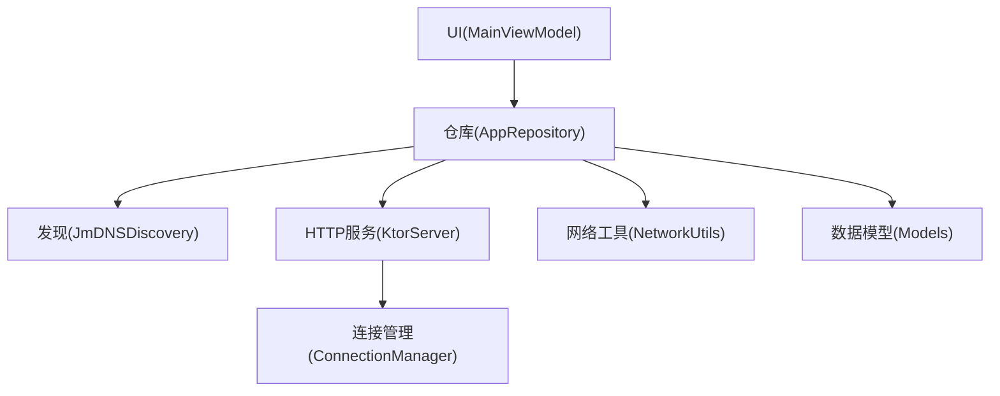
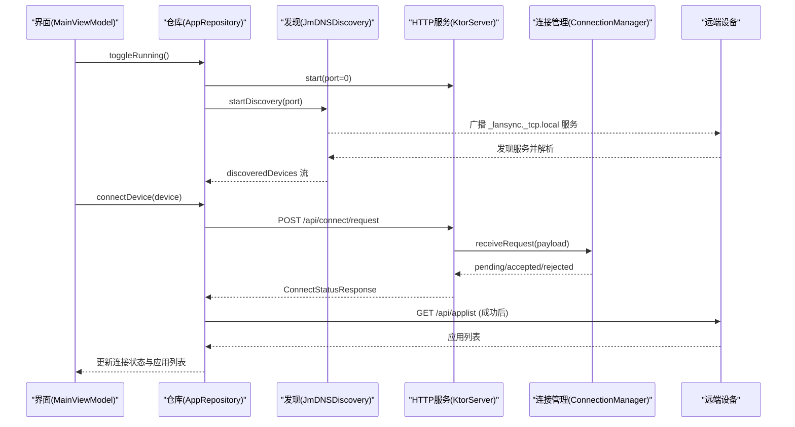
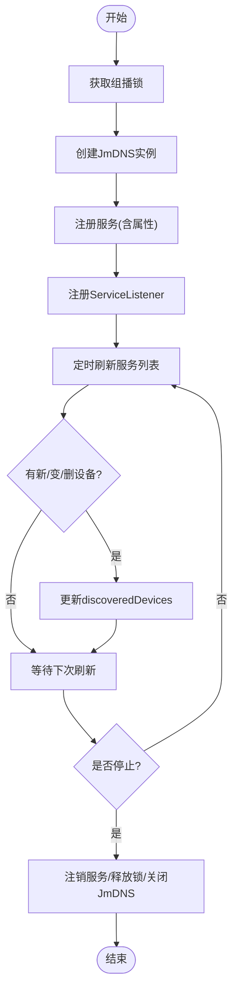
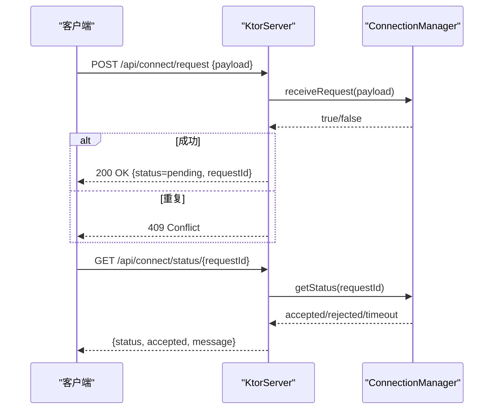
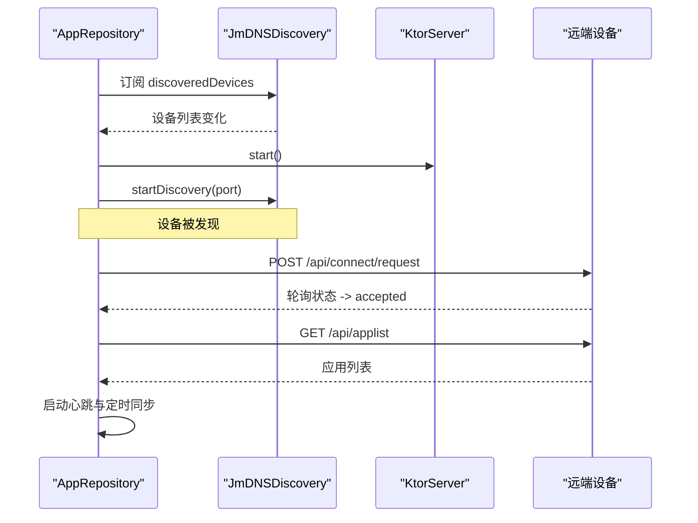
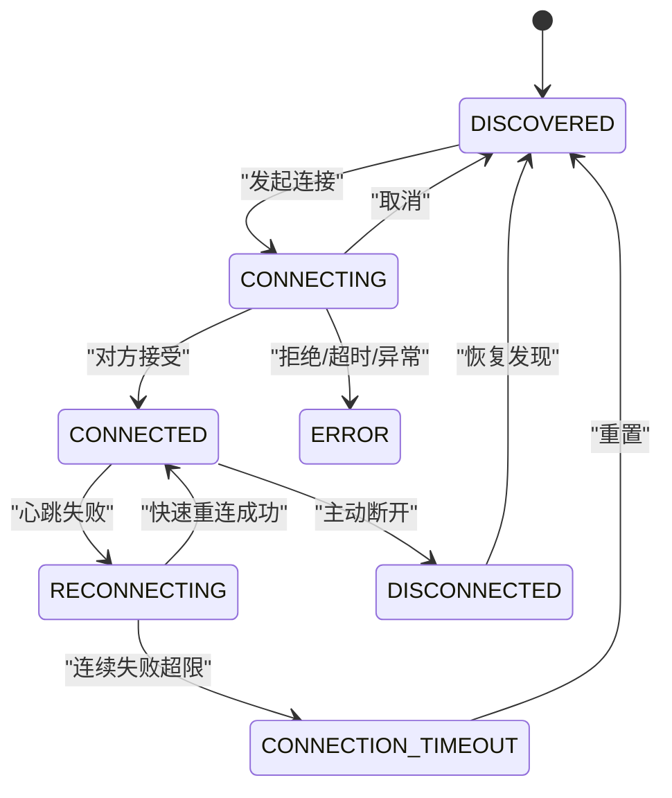
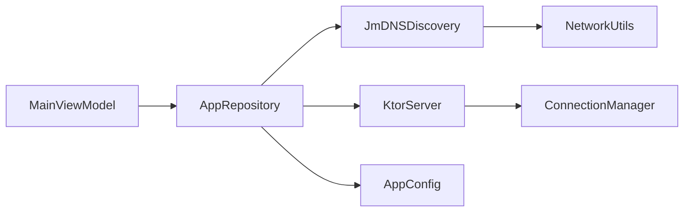

# mDNS设备发现协议

<cite>
**本文引用的文件**
- [JmDNSDiscovery.kt](file://app/src/main/java/com/lansync/app/data/discovery/JmDNSDiscovery.kt)
- [AppRepository.kt](file://app/src/main/java/com/lansync/app/data/repository/AppRepository.kt)
- [KtorServer.kt](file://app/src/main/java/com/lansync/app/data/server/KtorServer.kt)
- [ConnectionManager.kt](file://app/src/main/java/com/lansync/app/data/connection/ConnectionManager.kt)
- [Models.kt](file://app/src/main/java/com/lansync/app/data/model/Models.kt)
- [NetworkUtils.kt](file://app/src/main/java/com/lansync/app/data/NetworkUtils.kt)
- [AppConfig.kt](file://app/src/main/java/com/lansync/app/data/AppConfig.kt)
- [MainViewModel.kt](file://app/src/main/java/com/lansync/app/ui/viewmodel/MainViewModel.kt)
</cite>

## 目录
1. [简介](#简介)
2. [项目结构](#项目结构)
3. [核心组件](#核心组件)
4. [架构总览](#架构总览)
5. [详细组件分析](#详细组件分析)
6. [依赖关系分析](#依赖关系分析)
7. [性能考量与调优](#性能考量与调优)
8. [故障排除指南](#故障排除指南)
9. [结论](#结论)
10. [附录：配置项参考](#附录配置项参考)

## 简介
本技术文档围绕基于 JmDNS 的局域网设备发现机制，系统阐述服务广播、服务发现、设备列表管理与连接建立流程；说明 mDNS 服务的注册与注销、服务类型与域名格式、属性配置；描述设备发现的生命周期管理（扫描间隔、超时处理、重连策略）；解释多设备环境下的冲突解决与网络拓扑管理；并提供配置选项、性能调优建议以及网络诊断与排障指南。

## 项目结构
本项目将 mDNS 设备发现与 HTTP 服务集成在 Android 应用中，关键模块如下：
- 发现层：JmDNSDiscovery 负责通过 JmDNS 广播与发现本地服务，维护设备列表并暴露为 Flow。
- 服务层：KtorServer 提供 REST API（ping、applist、connect/request/status/response、download、disconnect、refresh-applist、deviceinfo）。
- 连接管理：ConnectionManager 管理入站连接请求、状态与超时。
- 协调层：AppRepository 组合发现与服务，编排心跳、同步、更新计算与连接迁移。
- 数据模型：Models.kt 定义设备信息、连接状态、请求/响应载荷等。
- 网络工具：NetworkUtils 获取本机 IP 地址。
- UI 视图模型：MainViewModel 聚合仓库状态并驱动界面交互。

图表来源
- [AppRepository.kt:40-80](file://app/src/main/java/com/lansync/app/data/repository/AppRepository.kt#L40-L80)
- [JmDNSDiscovery.kt:23-35](file://app/src/main/java/com/lansync/app/data/discovery/JmDNSDiscovery.kt#L23-L35)
- [KtorServer.kt:30-63](file://app/src/main/java/com/lansync/app/data/server/KtorServer.kt#L30-L63)
- [ConnectionManager.kt:19-28](file://app/src/main/java/com/lansync/app/data/connection/ConnectionManager.kt#L19-L28)
- [NetworkUtils.kt:9-56](file://app/src/main/java/com/lansync/app/data/NetworkUtils.kt#L9-L56)
- [Models.kt:19-45](file://app/src/main/java/com/lansync/app/data/model/Models.kt#L19-L45)

章节来源
- [AppRepository.kt:40-80](file://app/src/main/java/com/lansync/app/data/repository/AppRepository.kt#L40-L80)
- [MainViewModel.kt:47-82](file://app/src/main/java/com/lansync/app/ui/viewmodel/MainViewModel.kt#L47-L82)

## 核心组件
- JmDNSDiscovery：封装 JmDNS 实例生命周期，完成服务注册/注销、监听服务事件、周期性刷新与去重，输出 discoveredDevices 流。
- KtorServer：启动 Netty 服务器，暴露连接协商、应用列表查询、下载、断开通知等接口。
- ConnectionManager：维护待处理的连接请求、超时任务、状态流转与去重。
- AppRepository：协调发现与服务，实现心跳检测、自动重连、端口迁移、应用列表拉取与更新计算。
- Models：统一数据结构，如 DeviceInfo、ConnectionState、各类请求/响应体。
- NetworkUtils：获取本机 IPv4 地址，供 JmDNS 初始化使用。
- AppConfig：集中配置心跳、轮询、重试等参数。

章节来源
- [JmDNSDiscovery.kt:23-134](file://app/src/main/java/com/lansync/app/data/discovery/JmDNSDiscovery.kt#L23-L134)
- [KtorServer.kt:65-291](file://app/src/main/java/com/lansync/app/data/server/KtorServer.kt#L65-L291)
- [ConnectionManager.kt:19-155](file://app/src/main/java/com/lansync/app/data/connection/ConnectionManager.kt#L19-L155)
- [AppRepository.kt:134-249](file://app/src/main/java/com/lansync/app/data/repository/AppRepository.kt#L134-L249)
- [Models.kt:19-45](file://app/src/main/java/com/lansync/app/data/model/Models.kt#L19-L45)
- [NetworkUtils.kt:11-53](file://app/src/main/java/com/lansync/app/data/NetworkUtils.kt#L11-L53)
- [AppConfig.kt:3-17](file://app/src/main/java/com/lansync/app/data/AppConfig.kt#L3-L17)

## 架构总览
下图展示了从 UI 到发现、服务、连接的完整调用链，包括 mDNS 广播/发现与 HTTP 连接协商。

图表来源
- [MainViewModel.kt:126-156](file://app/src/main/java/com/lansync/app/ui/viewmodel/MainViewModel.kt#L126-L156)
- [AppRepository.kt:624-647](file://app/src/main/java/com/lansync/app/data/repository/AppRepository.kt#L624-L647)
- [JmDNSDiscovery.kt:60-86](file://app/src/main/java/com/lansync/app/data/discovery/JmDNSDiscovery.kt#L60-L86)
- [KtorServer.kt:88-148](file://app/src/main/java/com/lansync/app/data/server/KtorServer.kt#L88-L148)
- [ConnectionManager.kt:29-87](file://app/src/main/java/com/lansync/app/data/connection/ConnectionManager.kt#L29-L87)

## 详细组件分析

### JmDNSDiscovery：服务广播与发现
- 服务注册
  - 使用固定服务类型与名称前缀，结合主机名与持久化 instanceId 生成唯一服务名，并通过 ServiceInfo 携带 deviceName 与 instanceId 属性。
  - 通过 JmDNS.create 绑定本机 IPv4 地址与主机名，确保在多网卡环境下选择正确的接口。
- 服务发现
  - 注册 ServiceListener，处理 serviceAdded/serviceResolved/serviceRemoved 事件。
  - 过滤非 LanSync 服务（无 instanceId）与本地自身实例（instanceId 相同），避免自环与噪声。
  - 以 IP+端口 作为设备键，维护设备映射，并在变化时推送 discoveredDevices 流。
- 生命周期与刷新
  - 启动时申请 MulticastLock，停止时释放锁、注销服务、关闭 JmDNS。
  - 后台协程按固定间隔刷新服务列表，清理过期设备。
- 冲突与去重
  - 通过 instanceId 区分不同设备实例，避免同一设备多次出现。
  - 对设备名变更进行合并更新，保持 UI 一致性。

图表来源
- [JmDNSDiscovery.kt:60-117](file://app/src/main/java/com/lansync/app/data/discovery/JmDNSDiscovery.kt#L60-L117)
- [JmDNSDiscovery.kt:119-134](file://app/src/main/java/com/lansync/app/data/discovery/JmDNSDiscovery.kt#L119-L134)
- [JmDNSDiscovery.kt:200-262](file://app/src/main/java/com/lansync/app/data/discovery/JmDNSDiscovery.kt#L200-L262)

章节来源
- [JmDNSDiscovery.kt:23-275](file://app/src/main/java/com/lansync/app/data/discovery/JmDNSDiscovery.kt#L23-L275)

### KtorServer：HTTP 服务与连接协商
- 路由与职责
  - /api/ping：健康检查。
  - /api/applist：返回本地应用列表。
  - /api/connect/request：接收连接请求，交由 ConnectionManager 记录并返回 pending。
  - /api/connect/status/{requestId}：轮询连接结果。
  - /api/connect/response/{requestId}：远端接受/拒绝响应。
  - /api/download/{packageName}[/{versionCode}]：打包并下发应用包。
  - /api/disconnect：远端主动断开通知。
  - /api/refresh-applist：触发本地刷新应用列表。
  - /api/deviceinfo：返回设备基本信息。
- 错误与状态码
  - 重复请求返回冲突；未就绪返回不可用；非法请求返回错误；下载失败返回内部错误。
- 文件传输
  - 通过流式写入发送压缩包或 APK，附带 MD5 与文件大小头，便于校验与进度展示。

图表来源
- [KtorServer.kt:88-148](file://app/src/main/java/com/lansync/app/data/server/KtorServer.kt#L88-L148)
- [ConnectionManager.kt:29-112](file://app/src/main/java/com/lansync/app/data/connection/ConnectionManager.kt#L29-L112)

章节来源
- [KtorServer.kt:65-330](file://app/src/main/java/com/lansync/app/data/server/KtorServer.kt#L65-L330)
- [ConnectionManager.kt:19-155](file://app/src/main/java/com/lansync/app/data/connection/ConnectionManager.kt#L19-L155)

### AppRepository：协调器与生命周期管理
- 观察与融合
  - 收集 JmDNSDiscovery 的 discoveredDevices，合并历史连接状态与应用列表，输出 enrichedDevices。
  - 监听 KtorServer 的 incomingRequests，呈现待处理连接。
- 连接建立
  - 发起连接：发送连接请求，轮询状态，成功后进入 CONNECTED，启动心跳与定期同步。
  - 处理入站：根据已知设备自动接受或提示用户，成功后建立连接并拉取应用列表。
- 心跳与重连
  - 周期性 ping 已连接设备，失败计数达到阈值后进入 RECONNECTING，尝试快速重连；超过最大失败次数标记 CONNECTION_TIMEOUT。
  - 支持端口迁移：当设备 IP 不变但端口变化时，迁移连接并保持应用列表。
- 更新计算
  - 本地应用与远程应用对比，生成可用更新与差异列表，用于 UI 展示与批量操作。

图表来源
- [AppRepository.kt:284-375](file://app/src/main/java/com/lansync/app/data/repository/AppRepository.kt#L284-L375)
- [AppRepository.kt:386-484](file://app/src/main/java/com/lansync/app/data/repository/AppRepository.kt#L386-L484)
- [AppRepository.kt:134-249](file://app/src/main/java/com/lansync/app/data/repository/AppRepository.kt#L134-L249)

章节来源
- [AppRepository.kt:284-777](file://app/src/main/java/com/lansync/app/data/repository/AppRepository.kt#L284-L777)

### 数据模型与状态机
- DeviceInfo：包含 IP、端口、设备名、instanceId、应用列表、连接状态、最后可见时间、错误信息等。
- ConnectionState：DISCOVERED、CONNECTING、CONNECTED、ERROR、DISCONNECTED、RECONNECTING、CONNECTION_TIMEOUT。
- 连接请求/响应：ConnectRequestPayload、ConnectResponsePayload、IncomingConnectRequest、ConnectStatusResponse。
- 其他：DeviceInfoResponse、GenericStatusResponse、RefreshAppListPayload、DisconnectPayload 等。

图表来源
- [Models.kt:19-45](file://app/src/main/java/com/lansync/app/data/model/Models.kt#L19-L45)
- [AppRepository.kt:179-249](file://app/src/main/java/com/lansync/app/data/repository/AppRepository.kt#L179-L249)

章节来源
- [Models.kt:19-138](file://app/src/main/java/com/lansync/app/data/model/Models.kt#L19-L138)
- [AppRepository.kt:179-249](file://app/src/main/java/com/lansync/app/data/repository/AppRepository.kt#L179-L249)

## 依赖关系分析
- JmDNSDiscovery 依赖 NetworkUtils 获取本机 IPv4，依赖 FileLogger 记录日志。
- KtorServer 依赖 ConnectionManager 处理连接请求，依赖 Json 序列化。
- AppRepository 组合上述组件，依赖 AppConfig 控制行为参数。
- MainViewModel 仅依赖 AppRepository 暴露的状态流，解耦 UI 与业务。

图表来源
- [MainViewModel.kt:47-82](file://app/src/main/java/com/lansync/app/ui/viewmodel/MainViewModel.kt#L47-L82)
- [AppRepository.kt:40-80](file://app/src/main/java/com/lansync/app/data/repository/AppRepository.kt#L40-L80)
- [JmDNSDiscovery.kt:23-35](file://app/src/main/java/com/lansync/app/data/discovery/JmDNSDiscovery.kt#L23-L35)
- [KtorServer.kt:30-63](file://app/src/main/java/com/lansync/app/data/server/KtorServer.kt#L30-L63)
- [ConnectionManager.kt:19-28](file://app/src/main/java/com/lansync/app/data/connection/ConnectionManager.kt#L19-L28)
- [NetworkUtils.kt:9-56](file://app/src/main/java/com/lansync/app/data/NetworkUtils.kt#L9-L56)
- [AppConfig.kt:3-17](file://app/src/main/java/com/lansync/app/data/AppConfig.kt#L3-L17)

章节来源
- [AppRepository.kt:40-80](file://app/src/main/java/com/lansync/app/data/repository/AppRepository.kt#L40-L80)

## 性能考量与调优
- 发现刷新间隔
  - JmDNSDiscovery 默认每 60 秒刷新一次服务列表，适合稳定局域网；若需更快感知设备变化，可缩短间隔，但会增加网络负载。
- 心跳与同步
  - 心跳间隔与同步间隔由 AppConfig 控制，默认心跳约 20 秒、同步约 120 秒；可根据网络质量调整，减少不必要的请求。
- 超时与重试
  - 连接超时默认 30 秒，应用列表拉取最多重试 5 次，每次间隔 3 秒；在网络不稳定时可适当增加重试次数或延迟。
- 组播锁
  - 启动时申请组播锁，确保能收发 mDNS 报文；务必在停止时释放，避免资源泄漏。
- 端口迁移
  - 当设备端口变化时，AppRepository 会迁移连接并保留应用列表，提升用户体验。
- 内存与并发
  - 使用协程 SupervisorJob 隔离任务；连接管理使用并发容器存储请求与超时任务，注意及时清理。

[本节为通用指导，不直接分析具体代码行]

## 故障排除指南
- 无法发现设备
  - 检查是否成功获取组播锁；确认防火墙/路由器是否允许 UDP 5353 组播通信。
  - 查看日志中是否打印“Multicast lock acquired”与“Registered service”。
  - 确认服务类型与属性正确（_lansync._tcp.local，包含 instanceId）。
- 连接被拒绝或超时
  - 检查远端是否收到连接请求；查看 KtorServer 日志中的 /api/connect/request 与 /api/connect/status。
  - 确认 ConnectionManager 的 REQUEST_TIMEOUT_MS 与 CONNECT_TIMEOUT_MS 设置合理。
- 频繁断线
  - 调整心跳间隔与容忍度；检查网络质量；关注心跳失败计数与重连日志。
- 端口变化导致连接丢失
  - 确认 AppRepository 的端口迁移逻辑生效；检查设备 IP 与端口是否正确更新。
- 下载失败
  - 检查 /api/download 路由是否返回有效包；确认 X-MD5 与文件大小头；核对服务端打包逻辑。

章节来源
- [JmDNSDiscovery.kt:88-117](file://app/src/main/java/com/lansync/app/data/discovery/JmDNSDiscovery.kt#L88-L117)
- [KtorServer.kt:88-148](file://app/src/main/java/com/lansync/app/data/server/KtorServer.kt#L88-L148)
- [ConnectionManager.kt:149-155](file://app/src/main/java/com/lansync/app/data/connection/ConnectionManager.kt#L149-L155)
- [AppRepository.kt:179-249](file://app/src/main/java/com/lansync/app/data/repository/AppRepository.kt#L179-L249)

## 结论
本项目通过 JmDNS 实现稳定的局域网设备发现，结合 Ktor 提供的 HTTP 服务完成连接协商与数据传输。AppRepository 作为协调层，统一管理心跳、重连、端口迁移与更新计算，保证在多设备环境下的健壮性与一致性。通过合理的配置与调优，可在不同网络条件下获得良好的发现与连接体验。

[本节为总结性内容，不直接分析具体代码行]

## 附录：配置项参考
- AppConfig
  - heartbeatPingIntervalMs：心跳 Ping 间隔（毫秒）
  - heartbeatSyncIntervalMs：心跳同步应用列表间隔（毫秒）
  - heartbeatPingTolerance：心跳失败容忍次数
  - heartbeatPingMaxFailures：心跳失败最大次数，超过则标记超时
  - updateRecalculationThrottleMs：更新计算节流间隔（毫秒）
  - connectTimeoutMs：连接超时（毫秒）
  - pollIntervalMs：轮询间隔（毫秒）
  - fetchAppListMaxRetries：拉取应用列表最大重试次数
  - fetchAppListRetryDelayMs：拉取应用列表重试延迟（毫秒）
  - pingTimeoutMs：Ping 超时（毫秒）

章节来源
- [AppConfig.kt:3-17](file://app/src/main/java/com/lansync/app/data/AppConfig.kt#L3-L17)