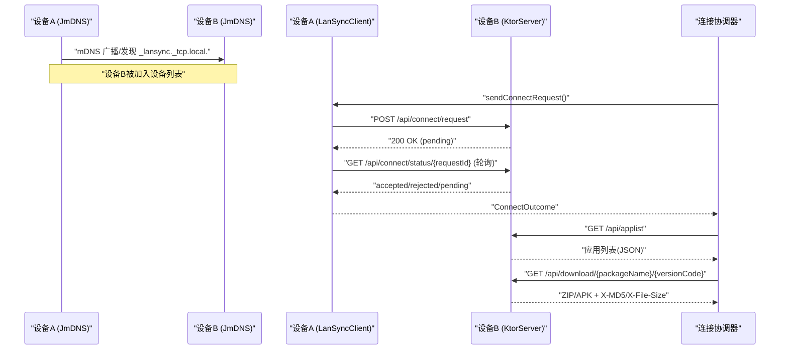
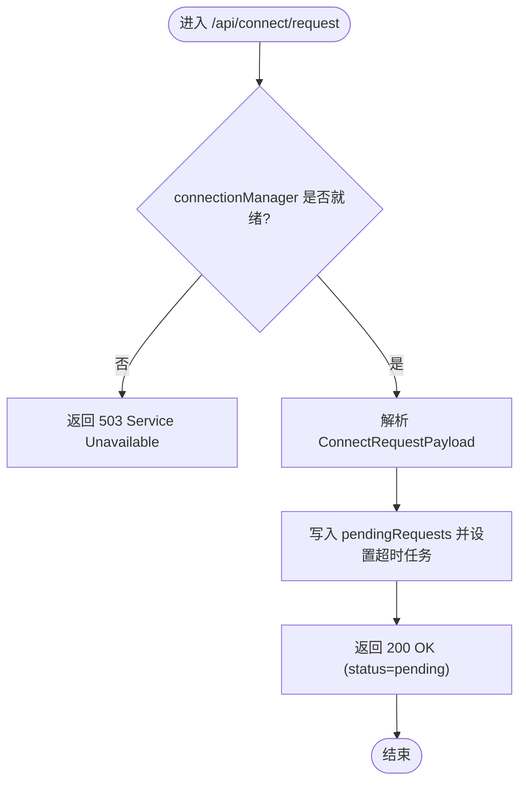
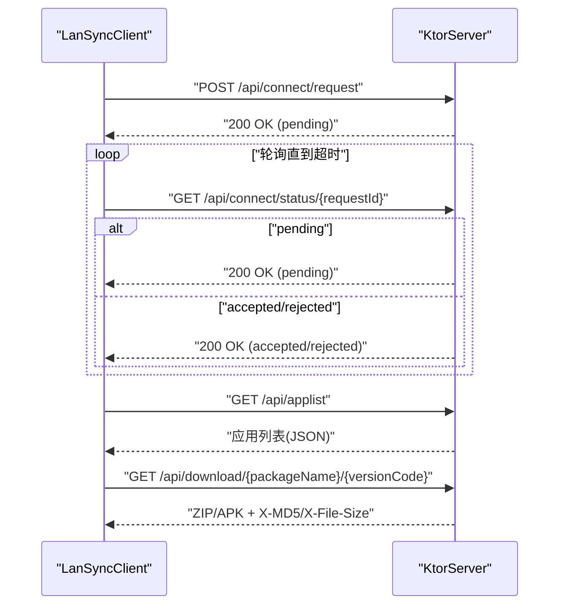
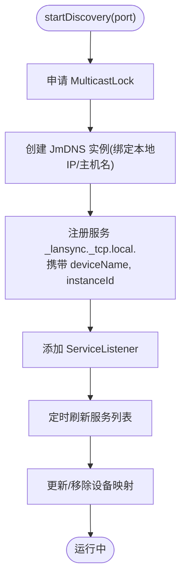
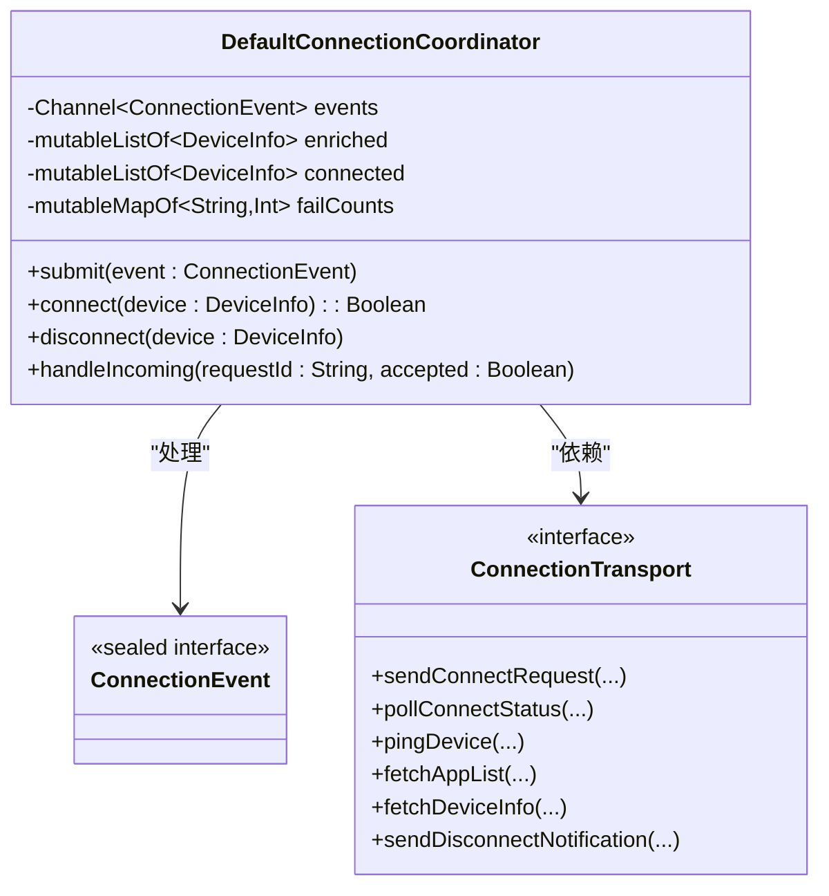
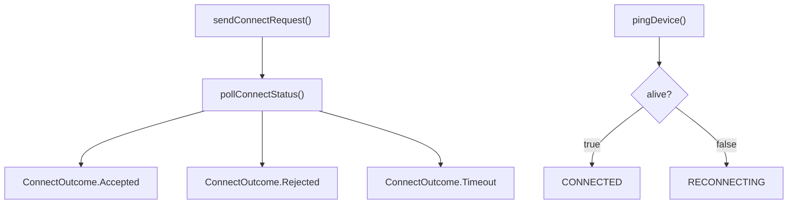
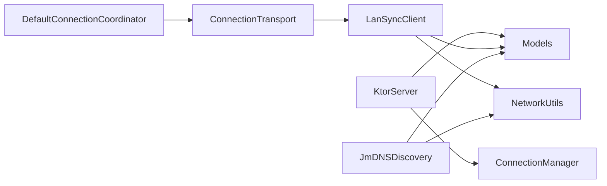

# 网络通信协议

<cite>
**本文引用的文件**
- [KtorServer.kt](file://app/src/main/java/com/lansync/app/data/server/KtorServer.kt)
- [LanSyncClient.kt](file://app/src/main/java/com/lansync/app/data/transfer/LanSyncClient.kt)
- [JmDNSDiscovery.kt](file://app/src/main/java/com/lansync/app/data/discovery/JmDNSDiscovery.kt)
- [ConnectionManager.kt](file://app/src/main/java/com/lansync/app/data/connection/ConnectionManager.kt)
- [DefaultConnectionCoordinator.kt](file://app/src/main/java/com/lansync/app/data/connection/DefaultConnectionCoordinator.kt)
- [ConnectionTransport.kt](file://app/src/main/java/com/lansync/app/data/connection/ConnectionTransport.kt)
- [ConnectionEvent.kt](file://app/src/main/java/com/lansync/app/data/connection/ConnectionEvent.kt)
- [PairingHistoryStore.kt](file://app/src/main/java/com/lansync/app/data/connection/PairingHistoryStore.kt)
- [Models.kt](file://app/src/main/java/com/lansync/app/data/model/Models.kt)
- [NetworkUtils.kt](file://app/src/main/java/com/lansync/app/data/NetworkUtils.kt)
- [AppConfig.kt](file://app/src/main/java/com/lansync/app/data/AppConfig.kt)
- [FileLogger.kt](file://app/src/main/java/com/lansync/app/data/FileLogger.kt)
- [network_security_config.xml](file://app/src/main/res/xml/network_security_config.xml)
- [DefaultConnectionCoordinatorTest.kt](file://app/src/test/java/com/lansync/app/data/connection/DefaultConnectionCoordinatorTest.kt)
</cite>

## 更新摘要
**变更内容**
- 新增 ConnectionTransport 抽象层，解耦连接协调器与具体传输实现
- 重构 LanSyncClient 作为 HTTP 客户端的新实现，支持新 MD5 校验语义
- 增强 DefaultConnectionCoordinator 的 Actor 模型架构，提供线程安全的状态管理
- 完善测试基础设施，包含 21 个测试用例覆盖连接状态转换和错误场景
- 新增配对历史存储机制，支持自动接受已配对设备

## 目录
1. [简介](#简介)
2. [项目结构](#项目结构)
3. [核心组件](#核心组件)
4. [架构总览](#架构总览)
5. [详细组件分析](#详细组件分析)
6. [依赖关系分析](#依赖关系分析)
7. [性能考量](#性能考量)
8. [故障排查指南](#故障排查指南)
9. [结论](#结论)
10. [附录：API 参考](#附录api-参考)

## 简介
本技术文档面向 LanSync 的本地局域网设备同步场景，系统性阐述其网络通信协议与实现。内容涵盖：
- HTTP RESTful API 设计：端点定义、请求/响应格式、错误处理与状态码
- mDNS 设备发现：服务广播、设备发现与连接建立流程
- 客户端-服务器通信模式：连接管理、心跳检测、重连机制与会话管理
- **新增**：ConnectionTransport 抽象层设计，支持可插拔传输实现
- **新增**：增强的连接协调器架构，采用 Actor 模型确保线程安全
- **新增**：完善的测试基础设施，覆盖连接状态转换和错误场景
- 完整 API 参考：URL 模式、参数说明、响应格式与状态码
- 网络请求示例、调试技巧与性能优化建议
- 网络安全措施与隐私保护机制

## 项目结构
LanSync 的网络通信由以下模块协作完成：
- **服务端（HTTP）**：基于 Ktor 的 Netty 引擎提供 REST API
- **客户端（HTTP）**：基于 OkHttp 的 HTTP 客户端，负责发起连接请求、轮询状态、下载应用包等
- **设备发现**：基于 JmDNS 的 mDNS 服务注册与监听，实现局域网内设备自动发现
- **连接管理**：维护待处理的连接请求、超时控制与状态流转
- **传输抽象层**：ConnectionTransport 接口，解耦连接协调器与具体传输实现
- **数据模型**：统一的 JSON 序列化数据结构
- **工具与安全**：网络工具、日志、安全配置

```mermaid
graph TB
subgraph "设备A"
A_Client["LanSyncClient<br/>HTTP 客户端"]
A_Discovery["JmDNSDiscovery<br/>mDNS 发现"]
A_Server["KtorServer<br/>HTTP 服务端"]
A_Coord["DefaultConnectionCoordinator<br/>连接协调器"]
A_Transport["ConnectionTransport<br/>传输抽象层"]
end
subgraph "设备B"
B_Client["LanSyncClient"]
B_Discovery["JmDNSDiscovery"]
B_Server["KtorServer"]
end
A_Client --> |HTTP /api/*| B_Server
B_Client --> |HTTP /api/*| A_Server
A_Discovery < --> |mDNS _lansync._tcp.local.| B_Discovery
A_Coord --> A_Transport
A_Transport --> A_Client
```

**图表来源**
- [KtorServer.kt:65-290](file://app/src/main/java/com/lansync/app/data/server/KtorServer.kt#L65-L290)
- [LanSyncClient.kt:66-448](file://app/src/main/java/com/lansync/app/data/transfer/LanSyncClient.kt#L66-L448)
- [JmDNSDiscovery.kt:23-86](file://app/src/main/java/com/lansync/app/data/discovery/JmDNSDiscovery.kt#L23-L86)
- [DefaultConnectionCoordinator.kt:30-500](file://app/src/main/java/com/lansync/app/data/connection/DefaultConnectionCoordinator.kt#L30-L500)
- [ConnectionTransport.kt:14-79](file://app/src/main/java/com/lansync/app/data/connection/ConnectionTransport.kt#L14-L79)

**章节来源**
- [KtorServer.kt:65-290](file://app/src/main/java/com/lansync/app/data/server/KtorServer.kt#L65-L290)
- [LanSyncClient.kt:66-448](file://app/src/main/java/com/lansync/app/data/transfer/LanSyncClient.kt#L66-L448)
- [JmDNSDiscovery.kt:23-86](file://app/src/main/java/com/lansync/app/data/discovery/JmDNSDiscovery.kt#L23-L86)
- [DefaultConnectionCoordinator.kt:30-500](file://app/src/main/java/com/lansync/app/data/connection/DefaultConnectionCoordinator.kt#L30-L500)
- [ConnectionTransport.kt:14-79](file://app/src/main/java/com/lansync/app/data/connection/ConnectionTransport.kt#L14-L79)

## 核心组件
- **KtorServer**：启动本地 HTTP 服务，暴露 /api/* 端点，处理连接请求、应用列表、文件下载、设备信息等
- **LanSyncClient**：封装所有对远端的 HTTP 调用，包括连接握手、状态轮询、应用列表获取、文件下载与校验
- **JmDNSDiscovery**：使用 JmDNS 在局域网广播与服务发现，维护设备清单与实例标识
- **DefaultConnectionCoordinator**：基于 Actor 模型的连接协调器，提供线程安全的状态管理和事件驱动架构
- **ConnectionTransport**：传输抽象接口，解耦连接协调器与具体传输实现，支持可插拔设计
- **ConnectionManager**：维护待处理连接请求的生命周期（接收、超时、响应），并暴露状态查询接口
- **Models**：统一的数据模型与序列化结构，贯穿客户端与服务端
- **NetworkUtils**：获取本机 IP 地址等网络基础能力
- **AppConfig**：心跳、超时、重试等网络行为参数
- **FileLogger**：异步落盘日志，便于问题定位与审计
- **PairingHistoryStore**：配对历史存储，支持自动接受已配对设备
- **network_security_config.xml**：允许明文 HTTP 流量（局域网环境）

**章节来源**
- [KtorServer.kt:65-290](file://app/src/main/java/com/lansync/app/data/server/KtorServer.kt#L65-L290)
- [LanSyncClient.kt:66-448](file://app/src/main/java/com/lansync/app/data/transfer/LanSyncClient.kt#L66-L448)
- [JmDNSDiscovery.kt:23-86](file://app/src/main/java/com/lansync/app/data/discovery/JmDNSDiscovery.kt#L23-L86)
- [DefaultConnectionCoordinator.kt:30-500](file://app/src/main/java/com/lansync/app/data/connection/DefaultConnectionCoordinator.kt#L30-L500)
- [ConnectionTransport.kt:14-79](file://app/src/main/java/com/lansync/app/data/connection/ConnectionTransport.kt#L14-L79)
- [ConnectionManager.kt:19-156](file://app/src/main/java/com/lansync/app/data/connection/ConnectionManager.kt#L19-L156)
- [Models.kt:5-138](file://app/src/main/java/com/lansync/app/data/model/Models.kt#L5-L138)
- [NetworkUtils.kt:9-56](file://app/src/main/java/com/lansync/app/data/NetworkUtils.kt#L9-L56)
- [AppConfig.kt:3-18](file://app/src/main/java/com/lansync/app/data/AppConfig.kt#L3-L18)
- [FileLogger.kt:19-167](file://app/src/main/java/com/lansync/app/data/FileLogger.kt#L19-L167)
- [PairingHistoryStore.kt:16-37](file://app/src/main/java/com/lansync/app/data/connection/PairingHistoryStore.kt#L16-L37)
- [network_security_config.xml:1-8](file://app/src/main/res/xml/network_security_config.xml#L1-L8)

## 架构总览
LanSync 采用"发现即服务"的架构：设备通过 mDNS 广播自身 HTTP 服务端口与实例 ID；其他设备发现后，通过 HTTP REST API 进行连接协商、应用列表同步与应用包传输。**新增的 ConnectionTransport 抽象层**使得连接协调器可以独立于具体传输实现进行测试和扩展。



**图表来源**
- [JmDNSDiscovery.kt:119-134](file://app/src/main/java/com/lansync/app/data/discovery/JmDNSDiscovery.kt#L119-L134)
- [LanSyncClient.kt:82-131](file://app/src/main/java/com/lansync/app/data/transfer/LanSyncClient.kt#L82-L131)
- [KtorServer.kt:88-148](file://app/src/main/java/com/lansync/app/data/server/KtorServer.kt#L88-L148)
- [KtorServer.kt:177-250](file://app/src/main/java/com/lansync/app/data/server/KtorServer.kt#L177-L250)
- [DefaultConnectionCoordinator.kt:175-213](file://app/src/main/java/com/lansync/app/data/connection/DefaultConnectionCoordinator.kt#L175-L213)

## 详细组件分析

### HTTP RESTful API（服务端）
- 框架：Ktor + Netty，启用 JSON 内容协商
- 路由：
  - GET /api/ping：健康检查
  - GET /api/applist：返回本地可提取的应用列表
  - POST /api/connect/request：发起连接请求（携带请求ID、设备名、IP、端口、实例ID、时间戳）
  - GET /api/connect/status/{requestId}：轮询连接结果（pending/accepted/rejected）
  - POST /api/connect/response/{requestId}：服务端侧响应连接请求（接受或拒绝）
  - GET /api/download/{packageName}：下载最新版本的打包应用（ZIP/APK）
  - GET /api/download/{packageName}/{versionCode}：按版本下载
  - POST /api/disconnect：断开通知
  - POST /api/refresh-applist：刷新应用列表通知
  - GET /api/deviceinfo：设备信息（名称、版本）
- 响应头（下载）：X-MD5、X-File-Size、Content-Disposition
- 错误处理：
  - 400 Bad Request：请求体无效或参数缺失
  - 404 Not Found：请求不存在或应用未找到
  - 409 Conflict：重复的连接请求
  - 403 Forbidden：系统/受保护应用不可提取
  - 500 Internal Server Error：打包失败或内部异常
  - 503 Service Unavailable：服务未就绪



**图表来源**
- [KtorServer.kt:88-116](file://app/src/main/java/com/lansync/app/data/server/KtorServer.kt#L88-L116)
- [ConnectionManager.kt:29-56](file://app/src/main/java/com/lansync/app/data/connection/ConnectionManager.kt#L29-L56)

**章节来源**
- [KtorServer.kt:65-290](file://app/src/main/java/com/lansync/app/data/server/KtorServer.kt#L65-L290)
- [Models.kt:69-138](file://app/src/main/java/com/lansync/app/data/model/Models.kt#L69-L138)

### HTTP 客户端（LanSyncClient）
**更新**：新的 LanSyncClient 实现替代了旧的 AppListClient，具有以下改进：
- **新 MD5 语义**：下载校验以响应头 X-MD5 为唯一权威，移除 expectedMd5 兜底参数
- **无 Android Context 依赖**：下载目录与 OkHttpClient 均构造注入，可在 JVM 单测
- **文件命名/包名解析**：统一走 DownloadedFileName（消除重复实现）
- **错误文案处理**：不回显 e.message，异常细节只进 FileLogger

- 连接发起：构造 ConnectRequestPayload，POST 到 /api/connect/request，返回 requestId
- 状态轮询：周期性 GET /api/connect/status/{requestId}，直到 accepted/rejected/timeout
- 应用列表：GET /api/applist，反序列化为 AppInfo 列表
- 设备信息：GET /api/deviceinfo
- 心跳探测：GET /api/ping，支持自定义超时
- 断开通知：POST /api/disconnect
- 刷新通知：POST /api/refresh-applist
- 文件下载：GET /api/download/{...}，流式写入缓存目录，读取 X-MD5/X-File-Size，计算本地 MD5 校验



**图表来源**
- [LanSyncClient.kt:82-131](file://app/src/main/java/com/lansync/app/data/transfer/LanSyncClient.kt#L82-L131)
- [LanSyncClient.kt:196-224](file://app/src/main/java/com/lansync/app/data/transfer/LanSyncClient.kt#L196-L224)
- [KtorServer.kt:88-148](file://app/src/main/java/com/lansync/app/data/server/KtorServer.kt#L88-L148)
- [KtorServer.kt:177-250](file://app/src/main/java/com/lansync/app/data/server/KtorServer.kt#L177-L250)

**章节来源**
- [LanSyncClient.kt:66-448](file://app/src/main/java/com/lansync/app/data/transfer/LanSyncClient.kt#L66-L448)

### mDNS 设备发现（JmDNSDiscovery）
- 服务广播：以 _lansync._tcp.local. 为服务类型，注册包含 deviceName 与 instanceId 的服务条目
- 设备发现：监听 serviceAdded/serviceResolved/serviceRemoved，过滤非 LanSync 设备与本地实例，维护设备映射表
- 定期刷新：定时扫描当前服务列表，清理过期设备
- 多播锁：申请 WifiManager.MulticastLock 保证组播数据包可达
- 实例唯一性：持久化 instanceId，避免重复发现同一设备



**图表来源**
- [JmDNSDiscovery.kt:60-86](file://app/src/main/java/com/lansync/app/data/discovery/JmDNSDiscovery.kt#L60-L86)
- [JmDNSDiscovery.kt:119-134](file://app/src/main/java/com/lansync/app/data/discovery/JmDNSDiscovery.kt#L119-L134)
- [JmDNSDiscovery.kt:200-261](file://app/src/main/java/com/lansync/app/data/discovery/JmDNSDiscovery.kt#L200-L261)

**章节来源**
- [JmDNSDiscovery.kt:23-275](file://app/src/main/java/com/lansync/app/data/discovery/JmDNSDiscovery.kt#L23-L275)

### 连接管理（DefaultConnectionCoordinator）
**更新**：新的 DefaultConnectionCoordinator 采用 Actor 模型架构，提供线程安全的状态管理：
- **Actor 模型**：所有可变状态仅在单一 Actor 协程内读写，杜绝竞态条件
- **事件驱动**：通过 Channel 接收和处理 ConnectionEvent，网络 I/O 在子协程执行
- **状态机管理**：严格遵循 SPEC §7.4 的设备连接状态机
- **端口迁移**：支持同 instanceId 但不同 displayKey 的设备迁移
- **陈旧清理**：SPEC §7.6 规定的设备清理策略
- **配对历史**：SPEC §7.7 的自动接受策略

- 接收请求：将 ConnectRequestPayload 转为 IncomingConnectRequest，记录到 pendingRequests，启动超时任务
- 响应请求：根据接受/拒绝更新状态，取消超时任务，返回 ConnectResponsePayload
- 状态查询：根据 requestId 返回 pending/accepted/rejected/timeout
- 超时处理：超过 REQUEST_TIMEOUT_MS 自动标记为 timeout
- 列表推送：通过 StateFlow 暴露待处理请求列表（仅 PENDING）



**图表来源**
- [DefaultConnectionCoordinator.kt:30-500](file://app/src/main/java/com/lansync/app/data/connection/DefaultConnectionCoordinator.kt#L30-L500)
- [ConnectionEvent.kt:15-69](file://app/src/main/java/com/lansync/app/data/connection/ConnectionEvent.kt#L15-L69)
- [ConnectionTransport.kt:14-79](file://app/src/main/java/com/lansync/app/data/connection/ConnectionTransport.kt#L14-L79)

**章节来源**
- [DefaultConnectionCoordinator.kt:30-500](file://app/src/main/java/com/lansync/app/data/connection/DefaultConnectionCoordinator.kt#L30-L500)
- [ConnectionEvent.kt:15-69](file://app/src/main/java/com/lansync/app/data/connection/ConnectionEvent.kt#L15-L69)

### 传输抽象层（ConnectionTransport）
**新增**：ConnectionTransport 接口提供了连接层的传输抽象：
- **解耦设计**：DefaultConnectionCoordinator 依赖接口而非具体实现，支持可插拔设计
- **方法签名对齐**：与 LanSyncClient 的方法签名保持一致，便于后续适配
- **虚拟时间测试**：支持手写 Fake 实现进行虚拟时间测试，不引入 MockK
- **规范依据**：契约依据 SPEC.md 的配对请求、轮询/心跳超时、查询、断开通知等规范

- sendConnectRequest：发起配对请求，成功返回 requestId，失败返回 null
- pollConnectStatus：轮询配对状态，返回 ConnectOutcome（Accepted/Rejected/Timeout）
- pingDevice：心跳探活，成功 true，超时/异常 false
- fetchAppList：拉取对端应用列表，失败/空返回 null
- fetchDeviceInfo：设备信息查询，不可达返回 null
- sendDisconnectNotification：主动断开通知



**图表来源**
- [ConnectionTransport.kt:14-79](file://app/src/main/java/com/lansync/app/data/connection/ConnectionTransport.kt#L14-L79)
- [DefaultConnectionCoordinator.kt:175-213](file://app/src/main/java/com/lansync/app/data/connection/DefaultConnectionCoordinator.kt#L175-L213)

**章节来源**
- [ConnectionTransport.kt:14-79](file://app/src/main/java/com/lansync/app/data/connection/ConnectionTransport.kt#L14-L79)

### 配对历史存储（PairingHistoryStore）
**新增**：配对历史存储机制，支持自动接受已配对设备：
- **历史记录**：记录历史配对成功的 instanceId 集合
- **自动接受**：命中配对历史的设备自动接受连接请求
- **内存实现**：InMemoryPairingHistoryStore 用于测试和非持久化场景
- **Phase 4 扩展**：未来可替换为 SharedPreferences 持久化实现

- isPaired：检查 instanceId 是否曾配对成功
- recordPaired：记录一次成功配对

**章节来源**
- [PairingHistoryStore.kt:16-37](file://app/src/main/java/com/lansync/app/data/connection/PairingHistoryStore.kt#L16-L37)

### 数据模型（Models）
- AppInfo：应用元数据（包名、名称、版本、MD5、是否可提取、大小等）
- DeviceInfo：设备信息（IP、名称、端口、实例ID、连接状态、最后可见时间、错误信息）
- ConnectRequestPayload/ConnectResponsePayload：连接请求与响应载荷
- DisconnectPayload/RefreshAppListPayload：断开与刷新通知载荷
- GenericStatusResponse/DeviceInfoResponse：通用状态与设备信息响应

**章节来源**
- [Models.kt:5-138](file://app/src/main/java/com/lansync/app/data/model/Models.kt#L5-L138)

### 网络工具与安全
- NetworkUtils：获取本机 IPv4 地址（优先 WiFi，回退到网络接口枚举）
- AppConfig：心跳间隔、重试次数、超时等参数
- network_security_config.xml：允许明文 HTTP（局域网场景）

**章节来源**
- [NetworkUtils.kt:9-56](file://app/src/main/java/com/lansync/app/data/NetworkUtils.kt#L9-L56)
- [AppConfig.kt:3-18](file://app/src/main/java/com/lansync/app/data/AppConfig.kt#L3-L18)
- [network_security_config.xml:1-8](file://app/src/main/res/xml/network_security_config.xml#L1-L8)

## 依赖关系分析
**更新**：新的架构引入了 ConnectionTransport 抽象层，改变了依赖关系：
- DefaultConnectionCoordinator 依赖 ConnectionTransport 接口而非具体实现
- LanSyncClient 实现了具体的 HTTP 传输逻辑
- 测试通过 FakeTransport 实现进行单元测试
- 所有组件共享 Models 中的数据结构，确保两端一致



**图表来源**
- [DefaultConnectionCoordinator.kt:30-500](file://app/src/main/java/com/lansync/app/data/connection/DefaultConnectionCoordinator.kt#L30-L500)
- [ConnectionTransport.kt:14-79](file://app/src/main/java/com/lansync/app/data/connection/ConnectionTransport.kt#L14-L79)
- [LanSyncClient.kt:66-448](file://app/src/main/java/com/lansync/app/data/transfer/LanSyncClient.kt#L66-L448)
- [KtorServer.kt:30-63](file://app/src/main/java/com/lansync/app/data/server/KtorServer.kt#L30-L63)
- [JmDNSDiscovery.kt:23-43](file://app/src/main/java/com/lansync/app/data/discovery/JmDNSDiscovery.kt#L23-L43)

**章节来源**
- [DefaultConnectionCoordinator.kt:30-500](file://app/src/main/java/com/lansync/app/data/connection/DefaultConnectionCoordinator.kt#L30-L500)
- [ConnectionTransport.kt:14-79](file://app/src/main/java/com/lansync/app/data/connection/ConnectionTransport.kt#L14-L79)
- [LanSyncClient.kt:66-448](file://app/src/main/java/com/lansync/app/data/transfer/LanSyncClient.kt#L66-L448)
- [KtorServer.kt:30-63](file://app/src/main/java/com/lansync/app/data/server/KtorServer.kt#L30-L63)
- [JmDNSDiscovery.kt:23-43](file://app/src/main/java/com/lansync/app/data/discovery/JmDNSDiscovery.kt#L23-L43)

## 性能考量
- **HTTP 连接池**：客户端使用 OkHttp 连接池，减少握手开销
- **大文件下载**：服务端流式输出，客户端分块写入，降低内存占用
- **校验与完整性**：服务端返回 X-MD5 与文件大小，客户端计算本地 MD5 校验，避免损坏传输
- **轮询策略**：连接状态轮询间隔与超时可通过 ConnectionManager 常量与客户端方法参数调整
- **日志与监控**：FileLogger 异步落盘，便于定位瓶颈与异常
- **多播锁**：JmDNSDiscovery 持有 MulticastLock，确保组播可达，避免丢包影响发现
- **Actor 模型**：DefaultConnectionCoordinator 使用 Actor 模型确保线程安全，避免竞态条件
- **事件驱动**：通过 Channel 和 StateFlow 实现高效的事件处理和状态同步

## 故障排查指南
- **常见问题**
  - 无法发现设备：检查多播锁是否成功申请、防火墙是否放行 UDP 5353、设备是否在同一局域网段
  - 连接请求重复：服务端会返回 409 Conflict，确保请求 ID 唯一
  - 下载失败：检查 X-MD5 与本地计算值是否一致，确认 Content-Length 与 X-File-Size 匹配
  - 系统/受保护应用不可提取：服务端返回 403 Forbidden
- **调试技巧**
  - 查看 FileLogger 输出的日志文件，关注连接握手、轮询与下载过程
  - 使用抓包工具验证 mDNS 广播与 HTTP 报文
  - 通过 /api/ping 快速判断目标设备是否在线
  - 利用 DefaultConnectionCoordinatorTest 的测试用例验证连接状态转换
- **关键日志位置**
  - 连接请求与响应：KtorServer 与 ConnectionManager 日志
  - 轮询与错误：LanSyncClient 轮询日志
  - 设备发现：JmDNSDiscovery 服务添加/移除日志
  - 连接协调：DefaultConnectionCoordinator 的 Actor 事件处理日志

**章节来源**
- [FileLogger.kt:19-167](file://app/src/main/java/com/lansync/app/data/FileLogger.kt#L19-L167)
- [KtorServer.kt:88-175](file://app/src/main/java/com/lansync/app/data/server/KtorServer.kt#L88-L175)
- [LanSyncClient.kt:118-172](file://app/src/main/java/com/lansync/app/data/transfer/LanSyncClient.kt#L118-L172)
- [JmDNSDiscovery.kt:200-261](file://app/src/main/java/com/lansync/app/data/discovery/JmDNSDiscovery.kt#L200-L261)
- [DefaultConnectionCoordinatorTest.kt:60-340](file://app/src/test/java/com/lansync/app/data/connection/DefaultConnectionCoordinatorTest.kt#L60-L340)

## 结论
LanSync 通过 mDNS 实现无感设备发现，结合简洁的 HTTP RESTful API 完成连接协商、应用列表同步与应用包传输。**新增的 ConnectionTransport 抽象层**和 **DefaultConnectionCoordinator 的 Actor 模型架构**显著提升了系统的可测试性和线程安全性。**完善的测试基础设施**包含 21 个测试用例，覆盖了连接状态转换和各种错误场景。整体设计清晰、职责分离，具备完善的错误处理与完整性校验。建议在生产环境中根据实际网络条件调优心跳、超时与轮询参数，并结合日志与抓包手段持续优化稳定性与性能。

## 附录：API 参考

### 端点总览
- GET /api/ping
  - 用途：健康检查
  - 响应：GenericStatusResponse
  - 状态码：200 OK
- GET /api/applist
  - 用途：获取本地可提取应用列表
  - 响应：List<AppInfo>
  - 状态码：200 OK
- POST /api/connect/request
  - 用途：发起连接请求
  - 请求体：ConnectRequestPayload
  - 响应：ConnectStatusResponse(status=pending)
  - 状态码：200 OK / 400 Bad Request / 503 Service Unavailable
- GET /api/connect/status/{requestId}
  - 用途：轮询连接结果
  - 路径参数：requestId
  - 响应：ConnectStatusResponse(status=pending|accepted|rejected)
  - 状态码：200 OK
- POST /api/connect/response/{requestId}
  - 用途：服务端响应连接请求
  - 路径参数：requestId
  - 请求体：ConnectResponseBody
  - 响应：ConnectResponsePayload
  - 状态码：200 OK / 400 Bad Request / 404 Not Found / 500 Internal Server Error
- GET /api/download/{packageName}
  - 用途：下载最新版本应用包
  - 路径参数：packageName
  - 响应头：X-MD5, X-File-Size, Content-Disposition
  - 状态码：200 OK / 403 Forbidden / 404 Not Found / 500 Internal Server Error
- GET /api/download/{packageName}/{versionCode}
  - 用途：按版本下载应用包
  - 路径参数：packageName, versionCode
  - 响应头：X-MD5, X-File-Size, Content-Disposition
  - 状态码：200 OK / 403 Forbidden / 404 Not Found / 500 Internal Server Error
- POST /api/disconnect
  - 用途：断开通知
  - 请求体：DisconnectPayload
  - 响应：GenericStatusResponse
  - 状态码：200 OK / 400 Bad Request
- POST /api/refresh-applist
  - 用途：刷新应用列表通知
  - 请求体：RefreshAppListPayload
  - 响应：GenericStatusResponse
  - 状态码：200 OK / 400 Bad Request
- GET /api/deviceinfo
  - 用途：设备信息
  - 响应：DeviceInfoResponse
  - 状态码：200 OK

**章节来源**
- [KtorServer.kt:77-285](file://app/src/main/java/com/lansync/app/data/server/KtorServer.kt#L77-L285)
- [Models.kt:69-138](file://app/src/main/java/com/lansync/app/data/model/Models.kt#L69-L138)

### 请求/响应示例（描述性）
- 连接请求
  - 方法：POST
  - URL：http://{targetIp}:{targetPort}/api/connect/request
  - 请求体：{ requestId, requesterName, requesterIp, requesterPort, requesterInstanceId, timestamp }
  - 响应：{ status: "pending", requestId }
- 状态轮询
  - 方法：GET
  - URL：http://{targetIp}:{targetPort}/api/connect/status/{requestId}
  - 响应：{ status: "pending"|"accepted"|"rejected", requestId?, accepted?, responderName?, message? }
- 下载应用包
  - 方法：GET
  - URL：http://{targetIp}:{targetPort}/api/download/{packageName}/{versionCode}
  - 响应头：X-MD5, X-File-Size, Content-Disposition
  - 响应体：ZIP/APK 二进制流

**章节来源**
- [LanSyncClient.kt:82-131](file://app/src/main/java/com/lansync/app/data/transfer/LanSyncClient.kt#L82-L131)
- [LanSyncClient.kt:196-224](file://app/src/main/java/com/lansync/app/data/transfer/LanSyncClient.kt#L196-L224)
- [KtorServer.kt:177-250](file://app/src/main/java/com/lansync/app/data/server/KtorServer.kt#L177-L250)

### 认证机制与访问控制
- 当前实现未内置身份认证与会话令牌
- 访问控制通过业务层限制（如系统/受保护应用禁止提取）
- 建议：在可信局域网环境下使用；如需跨网段或公网暴露，应增加鉴权与加密通道

**章节来源**
- [KtorServer.kt:182-234](file://app/src/main/java/com/lansync/app/data/server/KtorServer.kt#L182-L234)
- [network_security_config.xml:1-8](file://app/src/main/res/xml/network_security_config.xml#L1-L8)

### 错误处理与状态码
- 400 Bad Request：请求体无效或缺少必要字段
- 403 Forbidden：应用为系统/受保护应用，不可提取
- 404 Not Found：请求不存在或应用未找到
- 409 Conflict：重复的连接请求
- 500 Internal Server Error：打包失败或内部异常
- 503 Service Unavailable：服务未就绪（connectionManager 为空）

**章节来源**
- [KtorServer.kt:88-175](file://app/src/main/java/com/lansync/app/data/server/KtorServer.kt#L88-L175)
- [KtorServer.kt:177-250](file://app/src/main/java/com/lansync/app/data/server/KtorServer.kt#L177-L250)

### 心跳检测、重连与会话管理
**更新**：新的 DefaultConnectionCoordinator 实现了更健壮的心跳检测和重连机制：
- **三档阈值**：failCount ≤ tolerance(1) / < max(4) / ≥ max(4)
- **快速重连**：在 RECONNECTING 状态下尝试 fetchDeviceInfo 进行快速恢复
- **会话管理**：连接请求通过 requestId 关联，服务端维护 pending 状态直至超时或被响应
- **配对历史**：支持自动接受已配对设备的连接请求

- 心跳检测：通过 GET /api/ping 快速探测设备可达性
- 重连机制：客户端在轮询超时或错误时可按策略重试（超时与间隔可调）
- 会话管理：连接请求通过 requestId 关联，服务端维护 pending 状态直至超时或被响应

**章节来源**
- [LanSyncClient.kt:226-238](file://app/src/main/java/com/lansync/app/data/transfer/LanSyncClient.kt#L226-L238)
- [DefaultConnectionCoordinator.kt:254-313](file://app/src/main/java/com/lansync/app/data/connection/DefaultConnectionCoordinator.kt#L254-L313)
- [ConnectionManager.kt:132-140](file://app/src/main/java/com/lansync/app/data/connection/ConnectionManager.kt#L132-L140)
- [AppConfig.kt:3-18](file://app/src/main/java/com/lansync/app/data/AppConfig.kt#L3-L18)

### 网络安全与隐私保护
- 明文 HTTP：当前允许明文流量（局域网场景），请确保仅在可信网络中使用
- 多播锁：JmDNSDiscovery 申请 MulticastLock，防止组播被系统拦截
- 实例隔离：通过 instanceId 区分不同设备实例，避免误识别
- 数据最小化：仅传输必要的设备信息与包元数据，避免敏感信息泄露
- **新增**：配对历史存储仅保存在本地，不上线传输

**章节来源**
- [network_security_config.xml:1-8](file://app/src/main/res/xml/network_security_config.xml#L1-L8)
- [JmDNSDiscovery.kt:88-95](file://app/src/main/java/com/lansync/app/data/discovery/JmDNSDiscovery.kt#L88-L95)
- [JmDNSDiscovery.kt:136-181](file://app/src/main/java/com/lansync/app/data/discovery/JmDNSDiscovery.kt#L136-L181)
- [PairingHistoryStore.kt:6-15](file://app/src/main/java/com/lansync/app/data/connection/PairingHistoryStore.kt#L6-L15)

### 测试基础设施
**新增**：完善的测试基础设施，包含 21 个测试用例：
- **连接状态转换测试**：CS-1 到 CS-17d，覆盖所有连接状态转换场景
- **错误场景测试**：发送失败、被拒绝、轮询超时等错误处理
- **心跳恢复测试**：心跳成功重置失败计数，支持快速重连
- **端口迁移测试**：同 instanceId 但不同端口的设备迁移
- **陈旧清理测试**：DISCOVERED 设备被清理，CONNECTED 设备保留
- **配对历史测试**：已配对设备自动接受，陌生设备保持 PENDING
- **虚拟时间测试**：使用 advanceTimeBy 验证周期心跳触发

**章节来源**
- [DefaultConnectionCoordinatorTest.kt:60-340](file://app/src/test/java/com/lansync/app/data/connection/DefaultConnectionCoordinatorTest.kt#L60-L340)
- [DefaultConnectionCoordinatorTest.kt:359-390](file://app/src/test/java/com/lansync/app/data/connection/DefaultConnectionCoordinatorTest.kt#L359-L390)