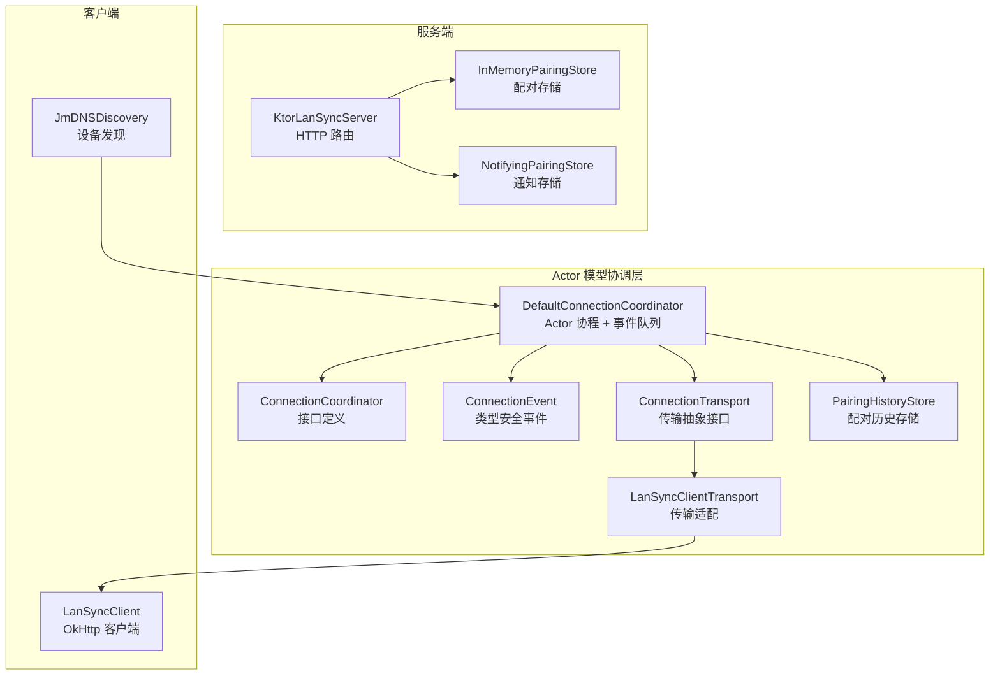
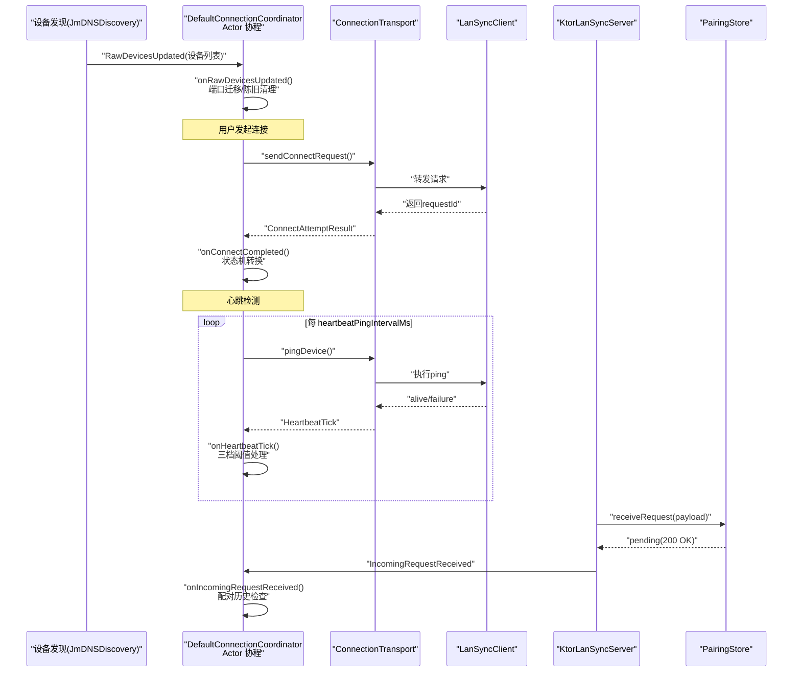
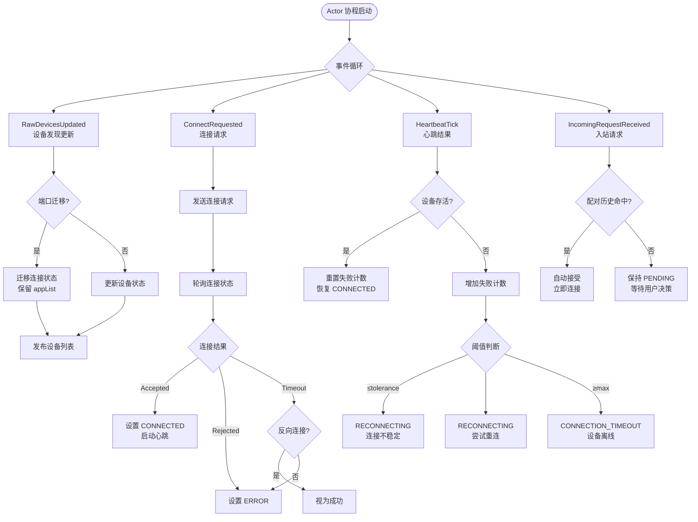
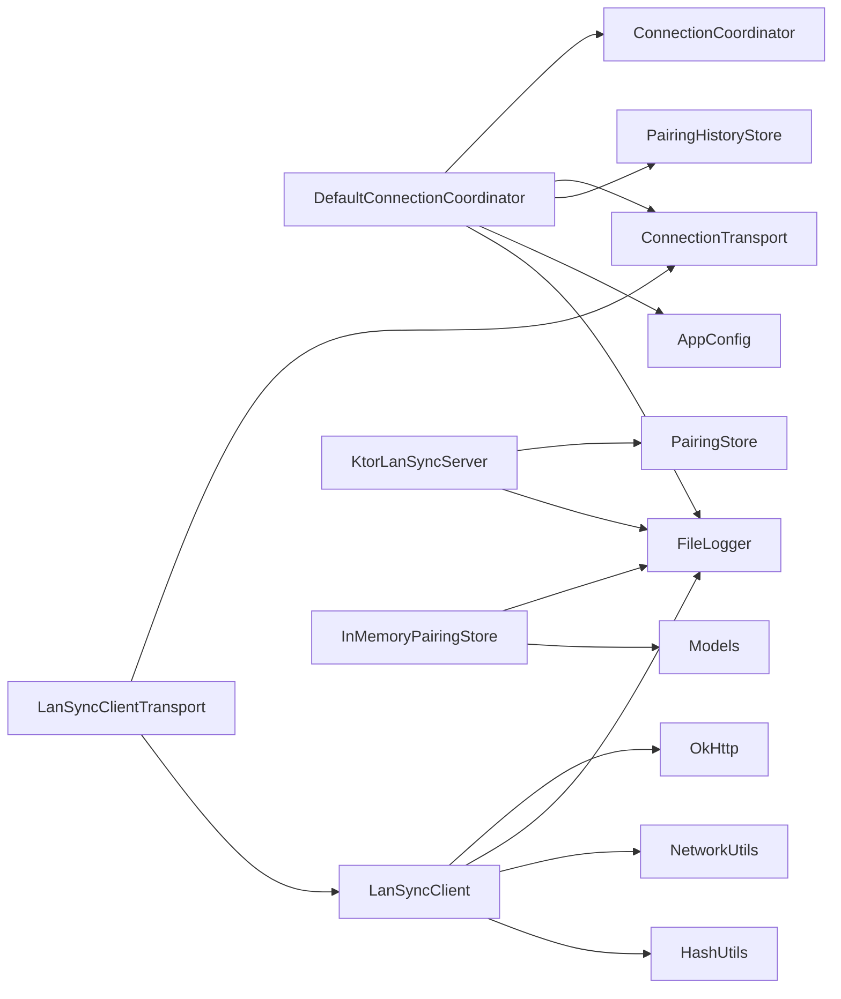

# 连接管理

<cite>
**本文引用的文件**
- [DefaultConnectionCoordinator.kt](file://app/src/main/java/com/lansync/app/data/connection/DefaultConnectionCoordinator.kt)
- [ConnectionCoordinator.kt](file://app/src/main/java/com/lansync/app/data/connection/ConnectionCoordinator.kt)
- [ConnectionEvent.kt](file://app/src/main/java/com/lansync/app/data/connection/ConnectionEvent.kt)
- [ConnectionTransport.kt](file://app/src/main/java/com/lansync/app/data/connection/ConnectionTransport.kt)
- [LanSyncClientTransport.kt](file://app/src/main/java/com/lansync/app/data/connection/LanSyncClientTransport.kt)
- [PairingHistoryStore.kt](file://app/src/main/java/com/lansync/app/data/connection/PairingHistoryStore.kt)
- [InMemoryPairingStore.kt](file://app/src/main/java/com/lansync/app/data/server/InMemoryPairingStore.kt)
- [NotifyingPairingStore.kt](file://app/src/main/java/com/lansync/app/data/server/NotifyingPairingStore.kt)
- [KtorLanSyncServer.kt](file://app/src/main/java/com/lansync/app/data/server/KtorLanSyncServer.kt)
- [LanSyncRouting.kt](file://app/src/main/java/com/lansync/app/data/server/LanSyncRouting.kt)
- [LanSyncClient.kt](file://app/src/main/java/com/lansync/app/data/transfer/LanSyncClient.kt)
- [Models.kt](file://app/src/main/java/com/lansync/app/data/model/Models.kt)
- [AppConfig.kt](file://app/src/main/java/com/lansync/app/data/AppConfig.kt)
- [FileLogger.kt](file://app/src/main/java/com/lansync/app/data/FileLogger.kt)
- [NetworkUtils.kt](file://app/src/main/java/com/lansync/app/data/NetworkUtils.kt)
</cite>

## 更新摘要
**所做更改**
- 完全重构连接管理架构，从传统 ConnectionManager 迁移到基于 Actor 模型的 DefaultConnectionCoordinator
- 移除了155行的旧实现代码，提供更清晰的连接生命周期管理
- 新增类型安全的事件驱动架构，通过 ConnectionEvent 定义所有连接相关事件
- 实现三档心跳机制和自动重连逻辑，提升连接稳定性
- 增强端口迁移和陈旧清理功能，支持设备实例ID变化时的状态保持
- 新增配对历史存储机制，实现安全的自动接受策略
- 重构架构图以反映新的 Actor 模型设计和传输层抽象

## 目录
1. [简介](#简介)
2. [项目结构](#项目结构)
3. [核心组件](#核心组件)
4. [架构总览](#架构总览)
5. [详细组件分析](#详细组件分析)
6. [依赖关系分析](#依赖关系分析)
7. [性能考虑](#性能考虑)
8. [故障排除指南](#故障排除指南)
9. [结论](#结论)
10. [附录：API 与配置参考](#附录api-与配置参考)

## 简介
本技术文档围绕 LanSync 的"连接管理系统"展开，聚焦客户端-服务器连接的生命周期管理（建立、维护、断开、重连）、连接池与并发控制、资源优化策略、心跳检测机制、连接状态同步与会话管理、身份验证流程、监控与调试工具使用，以及性能优化建议与故障排除。文档基于代码仓库中的实际实现进行说明，确保内容可追溯、可操作。

**重大更新**：系统已采用全新的 Actor 模型连接管理架构，通过 DefaultConnectionCoordinator 实现类型安全的事件驱动连接生命周期管理，彻底消除了传统并发竞态问题，提供更可靠的连接状态管理和自动重连机制。

## 项目结构
LanSync 的连接相关能力分布在以下模块：
- **Actor 模型协调器**：DefaultConnectionCoordinator 基于 Actor 模式实现连接状态机，通过单一协程串行处理所有连接事件，消除并发竞态
- **接口定义**：ConnectionCoordinator 定义连接协调器的标准接口，规范了连接管理的职责边界
- **事件系统**：ConnectionEvent 定义类型安全的连接事件，包括设备发现、连接请求、心跳、断开等
- **传输抽象**：ConnectionTransport 接口抽象网络传输层，支持测试替换和协议解耦
- **传输适配**：LanSyncClientTransport 将现有的 LanSyncClient 适配为新的传输接口
- **服务端存储**：InMemoryPairingStore 和 NotifyingPairingStore 提供配对请求的状态管理
- **设备发现**：JmDNSDiscovery 通过 mDNS 广播与服务注册，维护本地设备表并周期性刷新
- **数据模型**：Models.kt 定义连接生命周期状态、设备信息、请求/响应载荷等
- **配置**：AppConfig.kt 集中定义心跳、超时、重试等参数
- **日志与网络工具**：FileLogger 提供异步落盘日志；NetworkUtils 提供本机 IP 获取

**图表来源**
- [DefaultConnectionCoordinator.kt:30-37](file://app/src/main/java/com/lansync/app/data/connection/DefaultConnectionCoordinator.kt#L30-L37)
- [ConnectionCoordinator.kt:19-50](file://app/src/main/java/com/lansync/app/data/connection/ConnectionCoordinator.kt#L19-L50)
- [ConnectionEvent.kt:15-59](file://app/src/main/java/com/lansync/app/data/connection/ConnectionEvent.kt#L15-L59)
- [ConnectionTransport.kt:14-54](file://app/src/main/java/com/lansync/app/data/connection/ConnectionTransport.kt#L14-L54)

**章节来源**
- [DefaultConnectionCoordinator.kt:21-507](file://app/src/main/java/com/lansync/app/data/connection/DefaultConnectionCoordinator.kt#L21-L507)
- [ConnectionCoordinator.kt:7-50](file://app/src/main/java/com/lansync/app/data/connection/ConnectionCoordinator.kt#L7-L50)
- [ConnectionEvent.kt:8-72](file://app/src/main/java/com/lansync/app/data/connection/ConnectionEvent.kt#L8-L72)
- [ConnectionTransport.kt:5-79](file://app/src/main/java/com/lansync/app/data/connection/ConnectionTransport.kt#L5-L79)

## 核心组件
- **DefaultConnectionCoordinator**：基于 Actor 模型的连接协调器，通过单一协程串行处理所有连接事件，实现线程安全的状态管理
- **ConnectionCoordinator**：连接协调器接口，定义了连接管理的标准行为，包括设备列表维护、连接编排、心跳循环等职责
- **ConnectionEvent**：类型安全的事件系统，定义设备发现、连接请求、心跳、断开等所有连接相关事件
- **ConnectionTransport**：传输层抽象接口，封装网络连接能力，支持测试替换和协议解耦
- **LanSyncClientTransport**：将现有的 LanSyncClient 适配为新的传输接口，复用已有的网络通信能力
- **PairingHistoryStore**：配对历史存储，记录成功配对的设备实例ID，实现安全的自动接受策略
- **InMemoryPairingStore**：内存实现的配对存储，用于测试和临时场景
- **NotifyingPairingStore**：包装装饰器，在配对请求时发送通知
- **KtorLanSyncServer**：启动 Netty 服务，注册路由；将连接请求转发给配对存储
- **LanSyncClient**：封装 OkHttp 客户端，提供连接请求发送、状态轮询、响应发送等功能
- **JmDNSDiscovery**：基于 JmDNS 的设备发现，注册本地服务、监听远端设备、周期性刷新并维护设备表

**章节来源**
- [DefaultConnectionCoordinator.kt:30-37](file://app/src/main/java/com/lansync/app/data/connection/DefaultConnectionCoordinator.kt#L30-L37)
- [ConnectionCoordinator.kt:19-50](file://app/src/main/java/com/lansync/app/data/connection/ConnectionCoordinator.kt#L19-L50)
- [ConnectionEvent.kt:15-59](file://app/src/main/java/com/lansync/app/data/connection/ConnectionEvent.kt#L15-L59)
- [ConnectionTransport.kt:14-54](file://app/src/main/java/com/lansync/app/data/connection/ConnectionTransport.kt#L14-L54)
- [LanSyncClientTransport.kt:11-36](file://app/src/main/java/com/lansync/app/data/connection/LanSyncClientTransport.kt#L11-L36)
- [PairingHistoryStore.kt:16-22](file://app/src/main/java/com/lansync/app/data/connection/PairingHistoryStore.kt#L16-L22)

## 架构总览
连接管理的整体流程由"设备发现 -> 连接请求 -> Actor 协调器 -> 传输层 -> 结果反馈 -> 会话/资源管理"构成，采用 Actor 模型确保状态一致性。

**图表来源**
- [DefaultConnectionCoordinator.kt:114-176](file://app/src/main/java/com/lansync/app/data/connection/DefaultConnectionCoordinator.kt#L114-L176)
- [DefaultConnectionCoordinator.kt:178-255](file://app/src/main/java/com/lansync/app/data/connection/DefaultConnectionCoordinator.kt#L178-L255)
- [DefaultConnectionCoordinator.kt:257-304](file://app/src/main/java/com/lansync/app/data/connection/DefaultConnectionCoordinator.kt#L257-L304)
- [LanSyncClientTransport.kt:13-24](file://app/src/main/java/com/lansync/app/data/connection/LanSyncClientTransport.kt#L13-L24)

## 详细组件分析

### Actor 模型连接协调器（DefaultConnectionCoordinator）
**重大更新**：全新的 Actor 模型实现，彻底解决了传统并发竞态问题

- **职责**：基于 Actor 模式的连接协调器，通过单一协程串行处理所有连接事件，实现线程安全的状态管理
- **关键特性**：
  - **单点收敛**：所有可变状态仅在单一 Actor 协程内读写，消除 ConcurrentHashMap 与 StateFlow 交错的竞态窗口
  - **事件驱动**：通过 Channel<ConnectionEvent> 接收和处理所有连接事件
  - **类型安全**：使用 sealed interface 定义所有事件类型，编译期保证完整性
  - **配置驱动**：所有超时和阈值参数来自 AppConfig，无硬编码常量

- **核心数据结构**：
  - `enriched`：全部发现设备列表（包含连接状态和应用列表）
  - `connected`：已连接设备列表
  - `pendingIncoming`：待处理的入站连接请求
  - `failCounts`：设备失败计数映射
  - `connectingKeys`：正在连接的设备键集合（去重锁）
  - `heartbeatJobs/syncJobs`：每设备的心跳和同步任务

- **关键流程**：
  - `onRawDevicesUpdated`：处理设备发现更新，支持端口迁移和陈旧清理
  - `onConnectRequested`：处理连接请求，发送配对请求并轮询状态
  - `onHeartbeatTick`：实现三档心跳机制（不稳定→重连→超时）
  - `onIncomingRequestReceived`：处理入站连接请求，支持配对历史自动接受

**图表来源**
- [DefaultConnectionCoordinator.kt:114-176](file://app/src/main/java/com/lansync/app/data/connection/DefaultConnectionCoordinator.kt#L114-L176)
- [DefaultConnectionCoordinator.kt:178-255](file://app/src/main/java/com/lansync/app/data/connection/DefaultConnectionCoordinator.kt#L178-L255)
- [DefaultConnectionCoordinator.kt:257-304](file://app/src/main/java/com/lansync/app/data/connection/DefaultConnectionCoordinator.kt#L257-L304)

**章节来源**
- [DefaultConnectionCoordinator.kt:21-507](file://app/src/main/java/com/lansync/app/data/connection/DefaultConnectionCoordinator.kt#L21-L507)

### 连接协调器接口（ConnectionCoordinator）
**新增**：标准化的连接管理接口定义

- **职责**：定义连接协调器的标准行为，规范连接管理的职责边界
- **核心方法**：
  - `enrichedDevices`：全部发现态设备流（含 DISCOVERED/CONNECTING/CONNECTED/RECONNECTING）
  - `connectedDevices`：仅已连接设备流（CONNECTED/RECONNECTING）
  - `incomingRequests`：待用户确认的 PENDING 配对请求流
  - `start/stop`：Actor 协程的生命周期管理
  - `submit`：非阻塞投递事件的唯一状态写入路径
  - `connect/disconnect`：连接和断开的编排操作
  - `handleIncoming/dismissIncoming`：对端配对请求的处理

- **设计优势**：
  - 明确的职责分离，便于单元测试
  - 统一的接口规范，支持多种实现
  - 清晰的状态管理边界，避免状态混乱

**章节来源**
- [ConnectionCoordinator.kt:7-50](file://app/src/main/java/com/lansync/app/data/connection/ConnectionCoordinator.kt#L7-L50)

### 事件系统（ConnectionEvent）
**新增**：类型安全的事件驱动架构

- **职责**：定义所有连接相关事件的类型安全接口，作为 Actor 协程的唯一输入
- **事件类型**：
  - `RawDevicesUpdated`：设备发现列表更新
  - `ConnectRequested`：用户发起连接请求
  - `ConnectCompleted`：连接网络流程完成
  - `HeartbeatTick`：心跳 ping 结果
  - `FastReconnectResult`：快速重连探测结果
  - `AppListFetched`：应用列表拉取结果
  - `IncomingRequestReceived`：收到对端配对请求
  - `IncomingDecision`：对端配对请求的裁决
  - `DismissIncoming`：忽略配对请求
  - `RemoteDisconnect`：远端主动断开
  - `LocalDisconnect`：本地主动断开

- **设计优势**：
  - 编译期保证事件完整性
  - 类型安全的状态转换
  - 易于测试和模拟
  - 清晰的职责分离

**章节来源**
- [ConnectionEvent.kt:8-72](file://app/src/main/java/com/lansync/app/data/connection/ConnectionEvent.kt#L8-L72)

### 传输抽象（ConnectionTransport）
**新增**：解耦的网络传输层抽象

- **职责**：抽象网络连接能力，使连接协调器不直接依赖具体传输实现
- **核心方法**：
  - `sendConnectRequest`：发起配对请求
  - `pollConnectStatus`：轮询配对状态
  - `pingDevice`：心跳探活
  - `fetchAppList`：拉取对端应用列表
  - `fetchDeviceInfo`：设备信息查询
  - `sendDisconnectNotification`：主动断开通知

- **设计优势**：
  - 支持测试替换（FakeTransport）
  - 协议解耦，便于未来扩展
  - 统一的错误处理
  - 可插拔的传输实现

**章节来源**
- [ConnectionTransport.kt:5-79](file://app/src/main/java/com/lansync/app/data/connection/ConnectionTransport.kt#L5-L79)

### 传输适配（LanSyncClientTransport）
**新增**：现有客户端的适配器实现

- **职责**：将现有的 LanSyncClient 适配为新的 ConnectionTransport 接口
- **核心功能**：
  - 将 LanSyncClient.ConnectResult 映射为 ConnectOutcome
  - 直接转发其他网络操作方法
  - 保持与现有代码的兼容性

- **设计优势**：
  - 复用已有的网络通信能力
  - 无需修改现有的 LanSyncClient 实现
  - 平滑的架构演进路径

**章节来源**
- [LanSyncClientTransport.kt:5-36](file://app/src/main/java/com/lansync/app/data/connection/LanSyncClientTransport.kt#L5-L36)

### 配对历史存储（PairingHistoryStore）
**新增**：安全的自动接受策略

- **职责**：记录成功配对的设备实例ID，实现安全的自动接受策略
- **核心功能**：
  - `isPaired`：检查设备是否曾配对成功
  - `recordPaired`：记录一次成功配对
  - 内存实现 `InMemoryPairingHistoryStore`：进程级存储，支持测试

- **安全策略**：
  - 仅「配对历史命中」的设备自动接受
  - 陌生设备一律保持 PENDING → 弹窗，绝不自动放行
  - 用户显式拒绝 → 即时 REJECTED（不再 30s 超时）
  - 用户显式接受 → 写入配对历史

**章节来源**
- [PairingHistoryStore.kt:6-37](file://app/src/main/java/com/lansync/app/data/connection/PairingHistoryStore.kt#L6-L37)

### 配对存储实现（InMemoryPairingStore & NotifyingPairingStore）
**更新**：增强的配对请求管理机制

- **职责**：维护入站连接请求的待处理集合、超时任务、状态流
- **关键流程**：
  - `receiveRequest`：接收连接请求，去重检查，创建超时任务
  - `getStatus`：查询连接请求状态
  - `respondToRequest`：处理用户响应，更新请求状态
  - `handleTimeout`：超时自动拒绝

- **增强功能**：
  - NotifyingPairingStore 提供通知包装器
  - 改进的超时处理和状态管理
  - 更好的并发安全性

**章节来源**
- [InMemoryPairingStore.kt:27-60](file://app/src/main/java/com/lansync/app/data/server/InMemoryPairingStore.kt#L27-L60)
- [NotifyingPairingStore.kt:28-41](file://app/src/main/java/com/lansync/app/data/server/NotifyingPairingStore.kt#L28-L41)

### 服务端（KtorLanSyncServer）
**更新**：集成新的连接协调器

- **职责**：启动 Netty 服务，注册路由；将连接请求转发给配对存储
- **关键路由**：
  - GET /api/ping：健康检查
  - POST /api/connect/request：接收连接请求
  - GET /api/connect/status/{requestId}：查询连接状态
  - POST /api/connect/response/{requestId}：提交用户响应
  - GET /api/download/*：下载 APK/APKS
  - POST /api/disconnect：断开通知
  - POST /api/refresh-applist：刷新应用列表通知

**章节来源**
- [KtorLanSyncServer.kt](file://app/src/main/java/com/lansync/app/data/server/KtorLanSyncServer.kt)
- [LanSyncRouting.kt](file://app/src/main/java/com/lansync/app/data/server/LanSyncRouting.kt)

### 客户端（LanSyncClient）
**更新**：适配新的传输抽象

- **职责**：封装 OkHttp 客户端，提供连接请求发送、状态轮询、响应发送等功能
- **连接池与并发**：
  - 默认 client：连接池 maxIdleConnections=5，keepAliveDuration=5 分钟
  - 下载专用 downloadClient：长读超时、无 call 超时限制
- **错误处理**：HTTP 错误、解析异常、IO 异常均记录日志并返回失败结果

**章节来源**
- [LanSyncClient.kt:28-447](file://app/src/main/java/com/lansync/app/data/transfer/LanSyncClient.kt#L28-L447)

## 依赖关系分析
**更新**：新的 Actor 模型架构改变了依赖关系

- **DefaultConnectionCoordinator** 依赖 ConnectionCoordinator、ConnectionTransport、PairingHistoryStore、AppConfig
- **LanSyncClientTransport** 依赖 ConnectionTransport 和 LanSyncClient
- **KtorLanSyncServer** 依赖 PairingStore 和 FileLogger
- **LanSyncClient** 依赖 OkHttp、FileLogger、NetworkUtils、HashUtils
- **InMemoryPairingStore** 依赖 FileLogger 和 Models

**图表来源**
- [DefaultConnectionCoordinator.kt:30-37](file://app/src/main/java/com/lansync/app/data/connection/DefaultConnectionCoordinator.kt#L30-L37)
- [LanSyncClientTransport.kt:11-11](file://app/src/main/java/com/lansync/app/data/connection/LanSyncClientTransport.kt#L11-L11)
- [InMemoryPairingStore.kt:27-27](file://app/src/main/java/com/lansync/app/data/server/InMemoryPairingStore.kt#L27-L27)

**章节来源**
- [DefaultConnectionCoordinator.kt:30-37](file://app/src/main/java/com/lansync/app/data/connection/DefaultConnectionCoordinator.kt#L30-L37)
- [LanSyncClientTransport.kt:11-11](file://app/src/main/java/com/lansync/app/data/connection/LanSyncClientTransport.kt#L11-L11)
- [InMemoryPairingStore.kt:27-27](file://app/src/main/java/com/lansync/app/data/server/InMemoryPairingStore.kt#L27-L27)

## 性能考虑
**更新**：Actor 模型带来的性能改进

- **并发性能**：
  - Actor 模型消除并发竞态，避免锁竞争开销
  - 单一协程串行处理事件，减少上下文切换
  - Channel.UNLIMITED 缓冲，非阻塞事件投递

- **连接池与超时**：
  - 默认客户端连接池 maxIdleConnections=5，keepAliveDuration=5 分钟
  - 下载客户端使用更长的读超时与独立的连接池
  - 合理设置 connect/read/write/call 超时，避免长时间挂起

- **心跳与存活检测**：
  - 三档心跳机制：tolerance(1) 次失败进入不稳定状态，max(4) 次失败标记超时
  - 快速重连探测：在 RECONNECTING 状态下主动探测设备可达性
  - 可通过 AppConfig 配置 heartbeatPingIntervalMs、heartbeatSyncIntervalMs 等参数

- **资源清理**：
  - 每设备独立的心跳和同步 Job，连接断开时及时清理
  - 端口迁移时自动停止旧 Job 并启动新 Job
  - 下载完成后校验 MD5，失败删除临时文件

- **内存优化**：
  - 使用 LinkedHashMap 维护 pendingIncoming，按时间倒序排列
  - 及时清理过期的连接状态和任务
  - 使用 StateFlow 替代手动状态管理，减少内存泄漏风险

## 故障排除指南
**更新**：新的 Actor 模型提供了更好的故障诊断能力

- **常见问题与定位**：
  - **连接重复**：DefaultConnectionCoordinator 使用 connectingKeys 去重锁，防止重复连接
  - **连接超时**：三档心跳机制提供详细的失败状态，便于定位网络问题
  - **设备不可达**：pingDevice 返回 false，检查防火墙、端口开放与 mDNS 广播
  - **端口迁移**：自动检测 instanceId 变化，迁移连接状态和应用列表

- **日志查看**：
  - 使用 FileLogger 输出的日志文件路径，查看请求、响应、异常堆栈
  - 关注 "ConnectionCoordinator" TAG 下的 Actor 事件处理日志
  - 关注 "REQUEST_RECEIVED"、"REQUEST_RESPONDED"、"POLL START/TIMEOUT" 等关键日志

- **恢复策略**：
  - **自动重连**：心跳失败后自动进入 RECONNECTING 状态，尝试快速重连
  - **配对历史**：成功配对的设备下次自动接受，无需用户干预
  - **端口迁移**：检测到端口变化时自动迁移连接状态，保持连接连续性

- **调试技巧**：
  - 使用测试中的 FakeTransport 模拟各种网络场景
  - 通过 advanceTimeBy 控制虚拟时间，加速心跳测试
  - 观察 enrichedDevices 和 connectedDevices 的状态变化

**章节来源**
- [DefaultConnectionCoordinator.kt:257-304](file://app/src/main/java/com/lansync/app/data/connection/DefaultConnectionCoordinator.kt#L257-L304)

## 结论
LanSync 的连接管理系统已通过全新的 Actor 模型架构实现了革命性的改进。DefaultConnectionCoordinator 通过单一协程串行处理所有连接事件，彻底消除了传统并发竞态问题，提供了更加可靠和可预测的连接状态管理。

**主要优势**：
- **线程安全**：Actor 模型确保状态一致性，无需复杂的锁机制
- **类型安全**：ConnectionEvent 提供编译期保证的事件完整性
- **可测试性**：事件驱动架构便于单元测试和模拟
- **可扩展性**：ConnectionTransport 接口支持灵活的传输实现替换
- **健壮性**：三档心跳机制和自动重连逻辑提升了连接稳定性

**后续改进方向**：
- 集成 Hilt DI 框架，实现更好的依赖注入管理
- 实现 ForegroundSyncService，提升后台运行稳定性
- 扩展更多传输协议支持（WebSocket、gRPC 等）
- 增强监控和遥测功能，提供更好的运维支持

## 附录：API 与配置参考

### 关键 API
**服务端 API**：
- 健康检查：GET /api/ping
- 应用列表：GET /api/applist
- 连接请求：POST /api/connect/request
- 连接状态：GET /api/connect/status/{requestId}
- 连接响应：POST /api/connect/response/{requestId}
- 设备信息：GET /api/deviceinfo
- 应用下载：GET /api/download/{packageName}/{versionCode?}
- 断开通知：POST /api/disconnect
- 刷新应用列表：POST /api/refresh-applist

**章节来源**
- [KtorLanSyncServer.kt](file://app/src/main/java/com/lansync/app/data/server/KtorLanSyncServer.kt)
- [LanSyncRouting.kt](file://app/src/main/java/com/lansync/app/data/server/LanSyncRouting.kt)

### 配置项（AppConfig）
**心跳配置**：
- heartbeatPingIntervalMs：心跳 Ping 间隔（毫秒）
- heartbeatSyncIntervalMs：心跳同步间隔（毫秒）
- heartbeatPingTolerance：心跳容忍失败次数
- heartbeatPingMaxFailures：心跳最大失败次数

**连接配置**：
- connectTimeoutMs：连接超时（毫秒）
- pollIntervalMs：轮询间隔（毫秒）
- pingTimeoutMs：Ping 超时（毫秒）

**重试配置**：
- fetchAppListMaxRetries：应用列表获取最大重试次数
- fetchAppListRetryDelayMs：应用列表获取重试延迟（毫秒）

**章节来源**
- [AppConfig.kt](file://app/src/main/java/com/lansync/app/data/AppConfig.kt)

### Actor 模型事件
**连接生命周期事件**：
- RawDevicesUpdated：设备发现列表更新
- ConnectRequested：用户发起连接请求
- ConnectCompleted：连接网络流程完成
- HeartbeatTick：心跳 ping 结果
- FastReconnectResult：快速重连探测结果
- AppListFetched：应用列表拉取结果
- IncomingRequestReceived：收到对端配对请求
- IncomingDecision：对端配对请求的裁决
- DismissIncoming：忽略配对请求
- RemoteDisconnect：远端主动断开
- LocalDisconnect：本地主动断开

**章节来源**
- [ConnectionEvent.kt:15-59](file://app/src/main/java/com/lansync/app/data/connection/ConnectionEvent.kt#L15-L59)