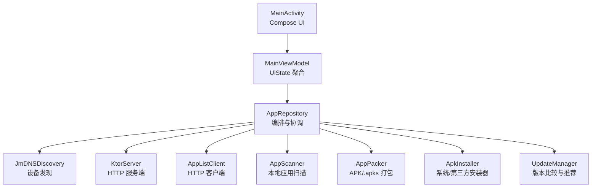
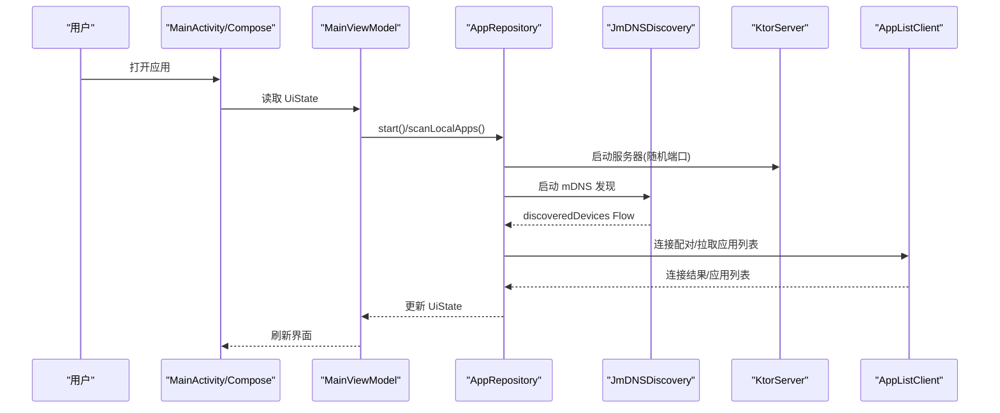
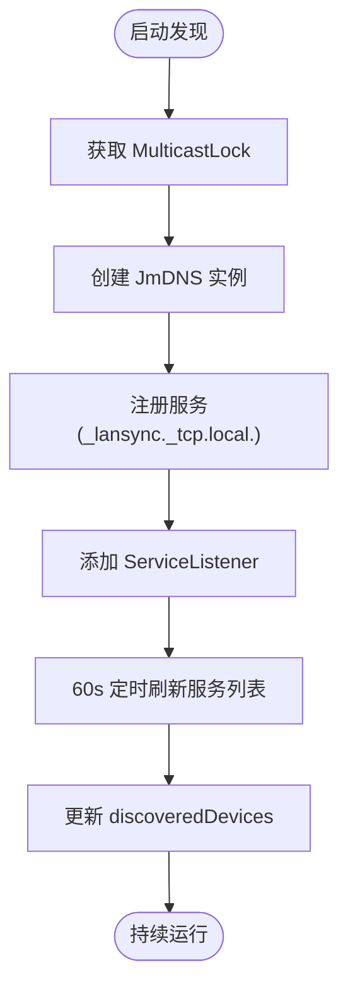
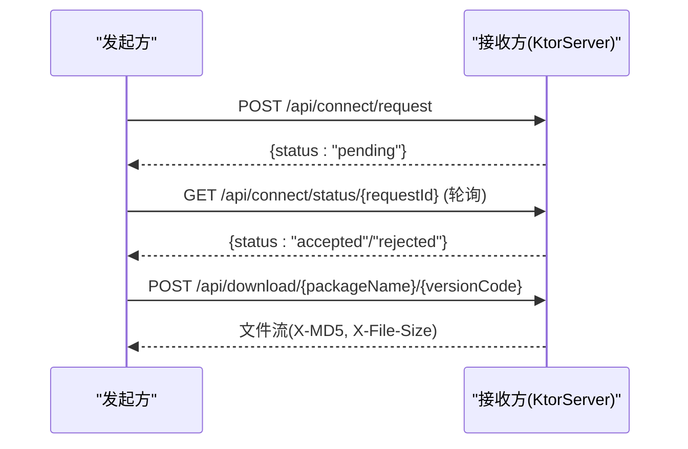
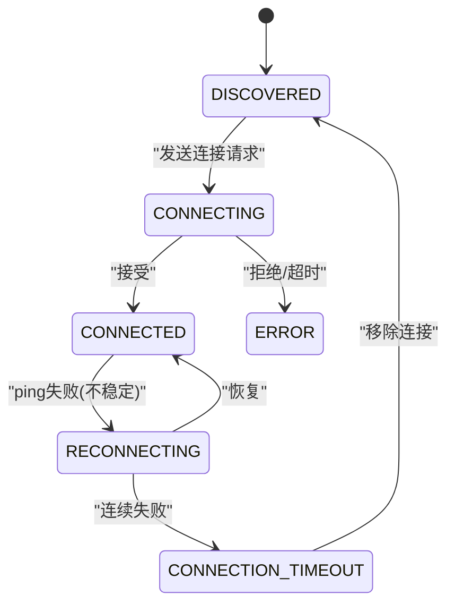
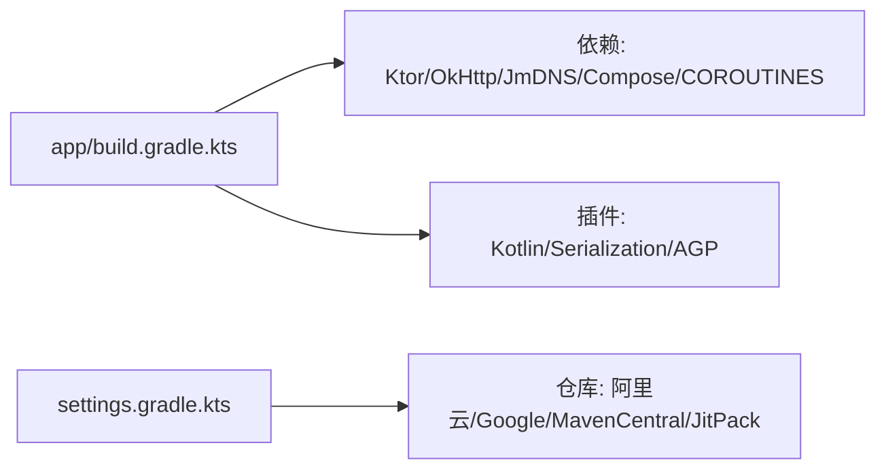

# 项目概述

<cite>
**本文引用的文件**
- [LanSyncApplication.kt](file://app/src/main/java/com/lansync/app/LanSyncApplication.kt)
- [MainActivity.kt](file://app/src/main/java/com/lansync/app/MainActivity.kt)
- [MainViewModel.kt](file://app/src/main/java/com/lansync/app/ui/viewmodel/MainViewModel.kt)
- [AppRepository.kt](file://app/src/main/java/com/lansync/app/data/repository/AppRepository.kt)
- [JmDNSDiscovery.kt](file://app/src/main/java/com/lansync/app/data/discovery/JmDNSDiscovery.kt)
- [KtorServer.kt](file://app/src/main/java/com/lansync/app/data/server/KtorServer.kt)
- [Models.kt](file://app/src/main/java/com/lansync/app/data/model/Models.kt)
- [AppConfig.kt](file://app/src/main/java/com/lansync/app/data/AppConfig.kt)
- [AndroidManifest.xml](file://app/src/main/AndroidManifest.xml)
- [build.gradle.kts](file://app/build.gradle.kts)
- [settings.gradle.kts](file://settings.gradle.kts)
- [REPORT.md](file://REPORT.md)
</cite>

## 目录
1. [简介](#简介)
2. [项目结构](#项目结构)
3. [核心组件](#核心组件)
4. [架构总览](#架构总览)
5. [详细组件分析](#详细组件分析)
6. [依赖关系分析](#依赖关系分析)
7. [性能与稳定性](#性能与稳定性)
8. [快速开始指南](#快速开始指南)
9. [故障排查](#故障排查)
10. [结论](#结论)

## 简介
LanSync 是一款面向 Android 设备的局域网应用同步工具，旨在解决同一局域网内设备间的应用管理与同步问题。其核心价值在于：
- 自动发现：通过 mDNS（JmDNS）在局域网中自动发现运行 LanSync 的其他设备
- 应用同步：扫描本地已安装应用，与远程设备对比版本，智能推荐最佳来源并支持一键更新
- 文件传输：支持单 APK 与 Split APK（.apks）打包传输，下载后可直接安装或保存到外部存储
- 无公网依赖：全程基于局域网 HTTP，无需互联网连接

技术选型亮点：
- UI：Jetpack Compose + Material3，提供现代化、响应式界面
- 服务端：Ktor Server（Netty 引擎），轻量且高性能
- 设备发现：JmDNS 多播服务注册与监听
- 网络客户端：OkHttp，支持大文件流式下载与进度回调
- 异步与状态：kotlinx-coroutines + StateFlow，保证线程安全与响应式数据流

## 项目结构
项目为单模块 Android 应用，采用分层组织方式：
- UI 层：Compose 页面与主题，包含设备列表、本地/远程应用、同步、文件管理等 Tab
- ViewModel 层：聚合 Repository 的多个 StateFlow，组合为 UiState 供 UI 消费
- 数据层：负责设备发现、HTTP 服务端/客户端、应用扫描、打包、安装、更新比较等
- 配置与清单：权限声明、网络配置、构建脚本等

图表来源
- [MainActivity.kt:26-106](file://app/src/main/java/com/lansync/app/MainActivity.kt#L26-L106)
- [MainViewModel.kt:47-124](file://app/src/main/java/com/lansync/app/ui/viewmodel/MainViewModel.kt#L47-L124)
- [AppRepository.kt:40-87](file://app/src/main/java/com/lansync/app/data/repository/AppRepository.kt#L40-L87)
- [JmDNSDiscovery.kt:23-43](file://app/src/main/java/com/lansync/app/data/discovery/JmDNSDiscovery.kt#L23-L43)
- [KtorServer.kt:30-65](file://app/src/main/java/com/lansync/app/data/server/KtorServer.kt#L30-L65)

章节来源
- [MainActivity.kt:26-106](file://app/src/main/java/com/lansync/app/MainActivity.kt#L26-L106)
- [MainViewModel.kt:47-124](file://app/src/main/java/com/lansync/app/ui/viewmodel/MainViewModel.kt#L47-L124)
- [AppRepository.kt:40-87](file://app/src/main/java/com/lansync/app/data/repository/AppRepository.kt#L40-L87)
- [settings.gradle.kts:1-27](file://settings.gradle.kts#L1-L27)
- [build.gradle.kts:1-115](file://app/build.gradle.kts#L1-L115)

## 核心组件
- 应用入口与初始化：LanSyncApplication 启动时初始化日志；MainActivity 使用 Compose 渲染主界面；MainViewModel 组合 Repository 状态并驱动 UI
- 设备发现：JmDNSDiscovery 通过 mDNS 注册与监听 _lansync._tcp.local. 服务，维护 discoveredDevices 流
- HTTP 服务端：KtorServer 暴露 /api/ping、/api/applist、/api/connect/*、/api/download/*、/api/deviceinfo 等接口，动态端口，回调注入业务逻辑
- HTTP 客户端：AppListClient 封装连接请求、轮询、拉取应用列表、下载文件与 MD5 校验
- 应用扫描与打包：AppScanner 枚举本地应用并计算指纹；AppPacker 生成 .apk 或 .apks
- 安装与保存：ApkInstaller 调用系统/第三方安装器；SAF 支持将安装包保存到外部存储
- 更新比较：UpdateManager 并发拉取远程应用列表，去重后推荐最佳来源

章节来源
- [LanSyncApplication.kt:6-11](file://app/src/main/java/com/lansync/app/LanSyncApplication.kt#L6-L11)
- [MainActivity.kt:26-106](file://app/src/main/java/com/lansync/app/MainActivity.kt#L26-L106)
- [MainViewModel.kt:47-124](file://app/src/main/java/com/lansync/app/ui/viewmodel/MainViewModel.kt#L47-L124)
- [JmDNSDiscovery.kt:60-134](file://app/src/main/java/com/lansync/app/data/discovery/JmDNSDiscovery.kt#L60-L134)
- [KtorServer.kt:65-291](file://app/src/main/java/com/lansync/app/data/server/KtorServer.kt#L65-L291)
- [Models.kt:5-138](file://app/src/main/java/com/lansync/app/data/model/Models.kt#L5-L138)

## 架构总览
整体采用“UI → ViewModel → Repository → 子模块”的分层架构，数据通过 StateFlow 单向流动，确保可预测的状态管理。

图表来源
- [MainActivity.kt:26-106](file://app/src/main/java/com/lansync/app/MainActivity.kt#L26-L106)
- [MainViewModel.kt:60-82](file://app/src/main/java/com/lansync/app/ui/viewmodel/MainViewModel.kt#L60-L82)
- [AppRepository.kt:284-384](file://app/src/main/java/com/lansync/app/data/repository/AppRepository.kt#L284-L384)
- [JmDNSDiscovery.kt:60-134](file://app/src/main/java/com/lansync/app/data/discovery/JmDNSDiscovery.kt#L60-L134)
- [KtorServer.kt:65-291](file://app/src/main/java/com/lansync/app/data/server/KtorServer.kt#L65-L291)

## 详细组件分析

### 设备发现（JmDNSDiscovery）
- 功能：获取 WiFi IP 与设备名，创建 JmDNS 实例，注册 _lansync._tcp.local. 服务，TXT 记录携带 deviceName 与 instanceId
- 机制：ServiceListener 监听 added/resolved/removed；60s 定时全量 list() 保活与陈旧清理；需 MulticastLock
- 输出：discoveredDevices Flow<List<DeviceInfo>>，按 ip:port 去重

图表来源
- [JmDNSDiscovery.kt:60-134](file://app/src/main/java/com/lansync/app/data/discovery/JmDNSDiscovery.kt#L60-L134)
- [JmDNSDiscovery.kt:200-262](file://app/src/main/java/com/lansync/app/data/discovery/JmDNSDiscovery.kt#L200-L262)

章节来源
- [JmDNSDiscovery.kt:60-134](file://app/src/main/java/com/lansync/app/data/discovery/JmDNSDiscovery.kt#L60-L134)
- [JmDNSDiscovery.kt:200-262](file://app/src/main/java/com/lansync/app/data/discovery/JmDNSDiscovery.kt#L200-L262)

### HTTP 服务端（KtorServer）
- 路由：/api/ping、/api/applist、/api/connect/request/status/response、/api/download/{pkg}/{vc}、/api/deviceinfo、/api/disconnect、/api/refresh-applist
- 特性：ContentNegotiation(JSON)，回调注入业务逻辑（应用列表提供者、打包器、断开处理、刷新应用列表处理器）
- 文件传输：sendZipFile 设置 X-MD5、X-File-Size、Content-Disposition，按扩展名设置 Content-Type

图表来源
- [KtorServer.kt:65-291](file://app/src/main/java/com/lansync/app/data/server/KtorServer.kt#L65-L291)

章节来源
- [KtorServer.kt:65-291](file://app/src/main/java/com/lansync/app/data/server/KtorServer.kt#L65-L291)

### 连接配对与心跳（AppRepository）
- 配对模式：请求-轮询（非长连接），支持已知设备免确认
- 心跳：20s ping，失败计数推进状态（不稳定→尝试重连→超时），恢复后回 CONNECTED
- 周期同步：120s 重新拉取对方 appList
- 双列表：_enrichedDevices（全部发现状态）、_connectedDevices（仅已连接）

图表来源
- [AppRepository.kt:134-249](file://app/src/main/java/com/lansync/app/data/repository/AppRepository.kt#L134-L249)
- [Models.kt:19-27](file://app/src/main/java/com/lansync/app/data/model/Models.kt#L19-L27)

章节来源
- [AppRepository.kt:134-249](file://app/src/main/java/com/lansync/app/data/repository/AppRepository.kt#L134-L249)
- [Models.kt:19-27](file://app/src/main/java/com/lansync/app/data/model/Models.kt#L19-L27)

### 应用扫描与打包（AppScanner & AppPacker）
- 扫描：枚举已安装应用，计算 sourcePaths 与 MD5 指纹，判定系统应用与 Split APK
- 打包：单 APK 直接复制；Split APK 压缩为 .apks（zip），同步计算 MD5 供响应头使用

章节来源
- [REPORT.md:81-88](file://REPORT.md#L81-L88)
- [REPORT.md:127-132](file://REPORT.md#L127-L132)

### 更新比较与推荐（UpdateManager）
- 规则：跳过系统应用，仅 remoteApp.versionCode > localApp.versionCode 才算可更新
- 去重：按包名去重，取最高 versionCode；平级取 deviceName 字母序更小者（推荐最佳来源）
- 触发：combine(localApps, connectedDevices) 自动监听 + 5s 节流

章节来源
- [REPORT.md:133-139](file://REPORT.md#L133-L139)

### UI 与状态管理（MainActivity & MainViewModel）
- 底部 5 Tab：设备、本地应用、远程应用、同步、文件
- 覆盖层：下载进度、安装状态 Snackbar、保存状态、传入连接请求弹窗、首次扫描遮罩
- 状态聚合：MainViewModel 组合 Repository 的多个 StateFlow 为 UiState，驱动 UI 更新

章节来源
- [MainActivity.kt:148-329](file://app/src/main/java/com/lansync/app/MainActivity.kt#L148-L329)
- [MainViewModel.kt:22-45](file://app/src/main/java/com/lansync/app/ui/viewmodel/MainViewModel.kt#L22-L45)
- [MainViewModel.kt:84-124](file://app/src/main/java/com/lansync/app/ui/viewmodel/MainViewModel.kt#L84-L124)

## 依赖关系分析
- 构建与依赖：Gradle 8.13 + AGP 8.13.2，Kotlin 1.9.20，Compose BOM 2023.10.01，Ktor 2.3.5，OkHttp 4.12.0，JmDNS 3.5.8
- 仓库源：阿里云镜像加速，启用 Google/MavenCentral/JitPack
- 关键依赖：androidx.lifecycle、compose-bom、kotlinx-coroutines、kotlinx-serialization-json、jmdns、ktor-server-*、okhttp、documentfile

图表来源
- [build.gradle.kts:78-115](file://app/build.gradle.kts#L78-L115)
- [settings.gradle.kts:13-23](file://settings.gradle.kts#L13-L23)

章节来源
- [build.gradle.kts:1-115](file://app/build.gradle.kts#L1-L115)
- [settings.gradle.kts:1-27](file://settings.gradle.kts#L1-L27)

## 性能与稳定性
- 心跳与同步：20s ping + 120s 周期同步，避免频繁网络请求
- 下载优化：OkHttp 专用下载客户端（长超时），流式传输 + MD5 校验，防止损坏
- 缓存策略：本地应用缓存（local_apps_cache.json）、图标三级缓存（内存/磁盘/绘制）
- 资源清理：启动清空 apks 缓存，日志 5MB 轮转 + 3 份备份
- 潜在风险：AppRepository 为“上帝类”，建议按领域拆分；无前台服务，退后台即失效；明文 HTTP + 无鉴权

[本节为通用指导，不直接分析具体文件]

## 快速开始指南
环境要求：
- Android 10+（minSdk 29），targetSdk 34
- Java/Kotlin/JVM target 17
- Gradle 8.13 + AGP 8.13.2

安装步骤：
1. 克隆仓库到本地
2. 使用 Android Studio 打开项目，等待依赖同步完成
3. 在设备上授予必要权限（INTERNET、WiFi 状态、定位、多播锁、QUERY_ALL_PACKAGES）
4. 构建并安装 APK

基本使用方法：
- 启动应用后，点击“设备”页开启服务，自动发现局域网内其他 LanSync 设备
- 选择目标设备，点击“连接”，双方确认后建立连接
- 在“远程应用”页查看可拉取的应用，支持多选批量拉取
- 在“同步”页查看可更新应用，支持一键批量更新
- 在“文件”页管理已下载的安装包，支持安装或保存到外部存储

章节来源
- [AndroidManifest.xml:4-12](file://app/src/main/AndroidManifest.xml#L4-L12)
- [build.gradle.kts:7-16](file://app/build.gradle.kts#L7-L16)
- [MainActivity.kt:148-329](file://app/src/main/java/com/lansync/app/MainActivity.kt#L148-L329)

## 故障排查
常见问题与解决方案：
- 无法发现设备：检查是否在同一局域网、是否授予多播锁权限、防火墙是否放行 UDP 多播
- 连接失败：确认双方服务已启动、端口未被占用、instanceId 未冲突
- 下载失败：检查网络连通性、MD5 校验是否一致、存储空间是否充足
- 安装失败：确认系统允许安装未知来源应用、文件路径有效、MIME 类型正确

调试建议：
- 查看文件日志：getExternalFilesDir/lansync_debug.log
- 检查 Ktor 路由日志：/api/* 请求与响应
- 验证心跳：/api/ping 是否返回 pong

章节来源
- [REPORT.md:163-166](file://REPORT.md#L163-L166)
- [KtorServer.kt:77-291](file://app/src/main/java/com/lansync/app/data/server/KtorServer.kt#L77-L291)

## 结论
LanSync 通过 mDNS 设备发现、Ktor 局域网 HTTP 通信、Compose 现代化 UI，实现了高效、易用的 Android 应用同步方案。其优势包括：
- 无公网依赖，适合企业内网或家庭局域网场景
- 智能版本比较与推荐，简化跨设备应用管理
- 支持 Split APK 与 SAF 保存，兼容性强
- 清晰的架构分层与状态管理，便于维护与扩展

未来改进方向：
- 引入前台服务提升后台稳定性
- 增加鉴权与加密（HTTPS/Token）增强安全性
- 重构 AppRepository 降低耦合度
- 完善测试覆盖，特别是网络与状态机场景

[本节为总结性内容，不直接分析具体文件]